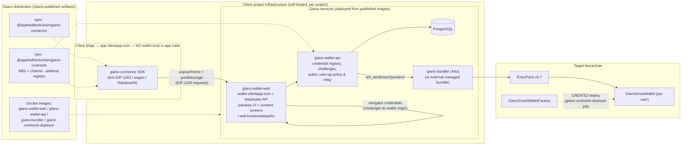

# Giano — Packaging & Independence Investigation Report

**Date:** 2026-07-21
**Scope:** Assess why Giano cannot currently be consumed as an independent, well-packaged component; identify gaps and derive requirements for distributing Giano as (a) installable SDK packages and (b) independently deployable services (Docker containers for backend, frontend, bundler).

---

## 1. Executive Summary

Giano is an ERC-4337 smart wallet (fork of Coinbase Smart Wallet) that uses WebAuthn passkeys as the user-operation signing key. Today it exists **only as a pnpm monorepo consumed from source**:

- The two libraries (`@appliedblockchain/giano-connector`, `@appliedblockchain/giano-contracts`) are **not publishable to npm** in their current state — they depend on `workspace:` protocol resolution, gitignored generated artifacts, and root-level build tooling.
- There is **no backend component at all**. The only server-side code is a set of demo API routes inside the Next.js example app, using in-memory `Map` storage, with no database and no authentication.
- There is **zero deployment infrastructure**: no Dockerfiles, no docker-compose, no CI (`.github/` does not exist), no k8s/IaC manifests.
- In production, user-op submission has **only ever worked through the Coinbase Developer Platform managed bundler**; the self-hosted Alto setup is dev-only and unproven on public networks, and the cause of the incompatibility is undocumented — a hidden third-party dependency that contradicts the self-hosted distribution model (GAP-9).
- Most fundamentally, the current integration model makes the **client application the wallet**: the dApp's own origin is the WebAuthn Relying Party, and the dApp must implement credential storage, challenge generation, and user-op submission via the `GianoProviderInjection` interface. Any application integrating Giano therefore inherits the full trust and security requirements of a wallet — exactly the property that must be eliminated.

The target state is Giano as a **self-contained, distributable wallet component**. Giano is *not* a centrally hosted service: every client project integrates it independently, running Giano's containers as services inside its own infrastructure, alongside the npm-installed SDK. The distribution therefore consists of (a) versioned npm packages for the thin client SDK and (b) versioned, published Docker images (wallet backend, wallet frontend/origin, bundler, contracts deployer) that a client project drops into its own compose/k8s stack. The independence requirement is met at the *code and trust-boundary* level: the client application never implements or embeds wallet logic — it talks to the Giano services it deploys through a narrow, standards-based interface (EIP-1193 / wagmi connector) — even though the client project operates those services.

---

## 2. Current Architecture

### 2.1 Repository layout

| Path | Package | Role |
|---|---|---|
| `packages/contracts` | `@appliedblockchain/giano-contracts` v2.1.0 | Solidity (Hardhat + Foundry): `GianoSmartWallet`, `GianoSmartWalletFactory`, `MultiOwnable`, `ERC1271`, testing contracts (`PrivateERC20`, `PermissivePaymaster`) |
| `packages/connector` | `@appliedblockchain/giano-connector` v0.1.0 | TypeScript SDK: EIP-1193 provider, viem `SmartAccount` implementation, wagmi connector, RainbowKit wallet |
| `services/custom-example` | `@appliedblockchain/giano-example` (private) | Next.js 15 demo app — also hosts the *only* server-side code (demo API routes) |
| `services/web-outdated` | — | **Dead code** (see §3.7) |
| `vendor/account-abstraction` | git submodule | eth-infinitism EntryPoint reference implementation, used only for local EntryPoint deployment |
| `alto-local.json` | — | Local Pimlico Alto bundler config (dev-only, contains well-known Anvil dev private key) |

### 2.2 Runtime flow today

1. The **dApp** creates a `GianoProvider` via `createGianoProvider({ injection, bundler, chains, transports, gianoSmartWalletFactoryAddress, ... })` (`packages/connector/src/provider.ts`).
2. The dApp must supply an **injection** implementing `GianoProviderInjection` (`packages/connector/src/provider-injection/injection.ts`): credential naming, credential-info/challenge retrieval, user-ID encoding, public-key storage/lookup, sign-in validation, and optionally `submitUserOperation`.
3. Passkey creation/assertion happens **on the dApp's own origin** (`navigator.credentials.create/get` invoked by the provider running in the dApp page). The WebAuthn RP ID is therefore the dApp's domain.
4. User ops are signed with the passkey and sent either directly to a bundler RPC URL configured by the dApp, or through the dApp's own backend (`submitUserOperation` hook → e.g. the demo's `/api/submit-userop`).
5. Contract addresses (factory, paymaster, demo ERC-20) are threaded in via `NEXT_PUBLIC_*` env vars per network, with hardcoded fallbacks in the demo's `config.ts`.

### 2.3 What already exists and is reusable

- A clean, well-factored **provider/injection abstraction** (`GianoProviderInjection`, documented in `README-GIANO-INJECTION.md`) that already decouples storage/submission from the provider core. This is the natural seam on which to build a real backend.
- **Deterministic CREATE2 deployments** via Hardhat Ignition with committed deployment artifacts for Base mainnet (8453), Base Sepolia (84532), and SDR testnet (381185) under `packages/contracts/ignition/deployments/`.
- A demonstrated **backend-submission flow** (`enableBackendSubmission` → `POST /api/submit-userop` → bundler) with hash-only response and frontend-side receipt waiting.
- A **Related Origin Requests (ROR)** demo (`README-ROR.md`, `/.well-known/webauthn` endpoint) — directly relevant to making passkeys work across a Giano-owned wallet origin and client-app origins.
- Solid **Foundry test suite** for the contracts (wallet, factory, MultiOwnable, ERC-1271).

---

## 3. Gap Analysis

### GAP-1 — The client application *is* the wallet (trust-boundary violation) — **Critical**

This is the core architectural gap behind the requirement "a client application must not acquire wallet trust requirements by integrating Giano."

- **WebAuthn RP binding:** passkeys are created and asserted on the dApp's own origin, by code running in the dApp's own pages. So (a) the dApp's frontend code is in the signing path and can manipulate what the user signs, and (b) a compromise of the dApp is a compromise of the wallet. (Wallets being scoped per project is acceptable under the intended deployment model — see §4.1 — but the RP must be a dedicated wallet origin served by Giano-shipped code, not the application itself.)
- **Injection burden:** the dApp must implement ~8 non-trivial security-sensitive methods (challenge generation, credential validation, public-key custody, user-ID encoding). The docs explicitly state: *"Storage implementations are application-specific and must be created by developers… Giano does not include any built-in storage implementations"* (`README-GIANO-INJECTION.md`). Every integrator re-implements wallet security from scratch.
- **No wallet UI/consent layer owned by Giano:** transaction display, approval prompts, and credential lifecycle are entirely up to the host app.
- **Consequence:** any integrating application must be audited and operated to wallet-grade standards. Giano is currently a *library for building a wallet into your app*, not an *independent wallet component*.

### GAP-2 — No backend component exists — **Critical**

- The only server-side code lives inside the demo app (`services/custom-example/src/pages/api/`):
  - `submit-userop.ts` — validates and forwards signed user ops to the bundler (hardcoded `callGasLimit` cap of 1,000,000).
  - `storage/[...path].ts` — passkey/public-key REST storage backed by a **`Map` on `globalThis`** ("In production, you'd use a proper database" comment in source). Data is lost on restart, single-proces s only.
  - `well-known/webauthn.ts` — ROR origin list, also in-memory.
  - `proxy/bundler.ts`, `proxy/hardhat.ts` — dev reverse proxies.
- **No database. No authentication.** `ServerStorage` sends an optional `Bearer` token that the server **never checks**; `userId` is taken from the URL path unverified. No challenge/session tracking, no rate limiting, no signature verification of WebAuthn assertions server-side.
- The previous architecture (`services/web-outdated`) *did* have a real backend (Koa + SQLite + `@simplewebauthn/server`), but its `src/server` directory has been **deleted**; only a dead client remains.

### GAP-3 — No deployment infrastructure — **Critical**

Exhaustive search confirms:

- **Zero** Dockerfiles, docker-compose files, or `.dockerignore` anywhere in the repo.
- **No CI/CD**: `.github/` does not exist; no workflows, no publish pipeline, no test automation.
- **No IaC**: no Terraform, k8s manifests, Procfile, fly/render/vercel configs (only leftover create-rainbowkit boilerplate text mentioning Vercel).
- Everything runs via root npm scripts assuming a developer laptop: `hh:node` (Anvil), `hh:initlocal`, `bundler:dev` (Alto + a CORS proxy), `demo:dev`.
- The bundler config `alto-local.json` embeds the **well-known Anvil dev private key** (`0xac0974be…ff80`) as executor/utility key and `safe-mode: false` — dev-only, not parameterizable for deployment.

### GAP-4 — npm packaging of the connector is broken — **High**

`packages/connector/package.json`:

- `"@appliedblockchain/giano-contracts": "workspace:^"` — unresolvable outside the monorepo unless contracts is published in lockstep.
- `viem 2.31.6` and `wagmi 2.15.6` **pinned exactly and declared as `dependencies`, not `peerDependencies`** — guarantees duplicate/mismatched viem instances in consumer apps (the classic wagmi failure mode).
- No `files` allowlist, no `publishConfig`, no `prepublishOnly`, empty `author`, no `repository`; `main: "dist/index"` lacks a file extension; `exports` subpaths (`.`, `./web`, `./node`) have no `types` condition.
- No per-package build tooling: `tsup` and its config live only at the **repo root** (`tsup.config.ts`, root `tsconfig.json` — which even contains path aliases for services that no longer exist). The package cannot be built standalone.
- `dist/` is gitignored and never committed; nothing guarantees it is built before publish.
- No tests whatsoever in the package.

### GAP-5 — Contracts package cannot deliver ABIs or addresses to consumers — **High**

`packages/contracts`:

- The public API (`index.ts`) re-exports `./generated` (wagmi CLI output) and `./typechain-types` — **both gitignored build artifacts**. The connector cannot even type-check until contracts has been compiled + generated locally. This is the hidden ordered-build dependency behind the README's "remember to run build every time…" warning.
- The `files` allowlist is broken: `["contracts/**/*.sol", "dist/**/*"]` — but sources live in `src/`, so **no Solidity would ship**, and `dist/` is never committed.
- **Deployed addresses are not exported at all.** `ignition/deployments/chain-*/deployed_addresses.json` is not in `files` and no code reads it. Every consumer re-declares addresses by hand (env vars / hardcoded fallbacks).
- Evidence of drift caused by manual copying: the demo's hardcoded fallbacks (`config.ts`: factory `0x5A1dd8C5…`, ERC-20 `0x768F9250…`) match **none** of the three committed chain deployments (Base factory is `0x26dCd293…`).
- **Toolchain divergence threatens CREATE2 determinism:** Hardhat compiles with solc 0.8.28 / optimizer runs 200, while the Foundry `deploy` profile pins 0.8.23 / runs 999999 (both viaIR). Different bytecode ⇒ different CREATE2 addresses depending on which toolchain deploys. There is no documented canonical build.
- Local bootstrap requires uninitialized **git submodules** (all six show `-` in `git submodule status`) and deploying the EntryPoint via a **nested yarn@1/corepack project** (`vendor/account-abstraction`) — a fragile, monorepo-only flow.

### GAP-6 — Documentation drift and misleading scripts — **Medium**

- Connector `README.md` documents a **`GianoNodeConnector` class that does not exist** in the source; it also instructs `npm install @appliedblockchain/giano-connector` although the package is unpublished.
- Root README §67 says to "update the constants in the connector code" after redeploying contracts — **stale**: the factory address is now a runtime parameter, and no Giano addresses are hardcoded in the connector.
- Root README references a `.env.base-sepolia` file that does not exist (env files use a dash convention, `.env-base-sepolia`, and live in the demo app). `.env-base-mainnet` sets `NEXT_PUBLIC_CONFIG_KEY=baseSepolia` (apparent bug). `.env-sdr-testnet` commits a bundler at a raw IP (`http://51.38.208.86:14337/rpc`) and a placeholder `SDR_EOA_PRIVATE_KEY`.
- `hh:node` actually runs **Anvil**, not Hardhat; `hh:test` runs `hardhat test` but there are **no Hardhat test files** (all tests are Foundry `.t.sol`) — the script is dead.

### GAP-7 — Production-readiness hygiene — **Medium**

- Numerous `console.log/warn/error` debug statements left in `provider.ts`.
- Coinbase Developer Platform bundler URLs (with API-key-bearing paths) committed in `.env-base-sepolia` / `.env-base-mainnet`.
- Hardcoded gas defaults in the provider (`maxFeePerGas` 200 gwei, `maxPriorityFeePerGas` 400 gwei — note priority > max, itself suspicious) and an 800k `verificationGasLimit` floor.
- No versioning/release process, no CHANGELOG, no LICENSE files in packages, `ChainType` enum is a placeholder (`HARDHAT = 0` only).
- Build requires up to 16 GB heap per the README's own troubleshooting section — a symptom of the tangled root build.

### GAP-8 — Dead code and repo hygiene — **Low**

- `services/web-outdated`: deactivated manifest (`_package.json`), depends on deleted packages (`giano-client`, `giano-common`), start scripts point to a deleted `src/server`. Should be removed (after harvesting its ideas: it was the last version with a real DB-backed WebAuthn backend).
- Root `tsconfig.json` carries path aliases to nonexistent services (`webapp`, `api`, `bcm`).

### GAP-9 — Production bundler works only with Coinbase's managed service (vendor lock-in, unvalidated self-hosting) — **High**

Operational experience: in production, **only the Coinbase Developer Platform bundler has ever worked**. The repo corroborates that no alternative path has been validated:

- The only bundler endpoints configured for real networks are Coinbase CDP URLs (`.env-base-sepolia`, `.env-base-mainnet`); the root README explicitly directs real-network usage to the Coinbase bundler ("no need to run the local bundler…", §63–68).
- The self-hosted Alto setup (`alto-local.json`) is **dev-only by construction**: Anvil dev private key as executor/utility key, `localhost:8545` RPC, `safe-mode: false`, plus a CORS proxy. It has never been parameterized for, or exercised against, a public network from this repo.
- The one non-Coinbase remote bundler on record (`.env-sdr-testnet`, `http://51.38.208.86:14337/rpc`) is a raw-IP testnet endpoint, not a production data point.
- **The root cause of non-Coinbase bundler failures is not recorded anywhere in the repo** — no issue log, comment, or doc explains what broke (candidates worth investigating: gas-estimation/fee-field expectations — note the provider's hardcoded 200-gwei `maxFeePerGas` / 400-gwei priority-fee defaults and 800k `verificationGasLimit` floor, GAP-7 — EntryPoint v0.7 support level, validation strictness that `safe-mode: false` masks locally, paymaster handling, or executor funding/operations).
- **Consequence for the target model:** the self-hosted distribution (§4.4) currently rests on an unproven assumption. R11.3 ships a `giano-bundler` (Alto) image, but if Giano user ops only clear through Coinbase's bundler, every client deployment silently inherits a hard dependency on a third-party managed service — unavailable on chains Coinbase doesn't support (e.g. the SDR chain) and contrary to the "no Giano-hosted or third-party runtime dependency" independence goal.

---

## 4. Requirements

### 4.1 Independence / trust isolation (addresses GAP-1)

> **Deployment model constraint:** Giano will **not** run as a standalone, centrally hosted service. Every client project integrates Giano independently and runs Giano's containers as services in its own infrastructure. Trust isolation must therefore be achieved *within each client deployment*: the client's application code must acquire no wallet trust, even though the client project operates the wallet services.

- **R1. Dedicated wallet origin per deployment.** Passkey ceremonies (create/get) must run on a dedicated origin served by the Giano wallet-frontend container — in this model typically a subdomain of the client project's domain (e.g. `wallet.clientapp.com`), which becomes the WebAuthn RP ID for that deployment. The client dApp interacts with it through a cross-origin channel (popup/iframe + `postMessage`), the same mechanism as Coinbase Smart Wallet's `keys.coinbase.com` — but instantiated per project. Result: the dApp's own pages are never in the signing path, the consent UI cannot be manipulated by application code, and wallet code is Giano-shipped, versioned, and auditable independently of the application. **Accepted trade-off:** because each deployment is its own RP, wallets are scoped to that project — there is no cross-project wallet sharing (that would require a common origin, which this model explicitly rejects). Setting the RP ID to the registrable domain (`clientapp.com`) keeps the door open for the app and wallet subdomains to share credentials where desired.
- **R2. Thin client SDK.** What dApps install shrinks to a lightweight EIP-1193 provider + wagmi connector + RainbowKit wallet that opens the deployment's wallet origin (a configured URL) and relays requests. No injection implementation, no credential storage, no key custody in the dApp code.
- **R3. Related Origin Requests as an enhancement, not the foundation.** The existing ROR work (`/.well-known/webauthn`) lets the wallet origin's credentials be asserted from the project's other approved origins (extra domains, white-label brands, mobile apps), but browser support is partial (no Firefox); the popup/iframe model must work everywhere.
- **R4. Consent UI owned by Giano's shipped frontend.** Transaction review, credential creation, and account management screens are rendered by the Giano wallet-frontend container, not the host app — the client project configures branding/theming via env/config, never by forking wallet code.

### 4.2 Backend service (addresses GAP-2)

- **R5. Standalone Giano Wallet Service** (Node/TS), implementing what the demo API routes sketch, production-grade:
  - Passkey credential registry: credential ID ↔ public key ↔ user ↔ smart-account address, in a real database (PostgreSQL) with migrations.
  - Server-side WebAuthn ceremony support: challenge issuance with expiry/one-time use, attestation & assertion verification (e.g. `@simplewebauthn/server` — as the deleted old backend already did), origin/RP-ID validation.
  - Authenticated API: sessions or tokens derived from a passkey assertion; no unverified `userId`-in-path access.
  - User-op relay endpoint (`submit-userop`): validation policy (gas caps, target allowlists, paymaster policy), forwarding to the bundler, idempotency, and audit logging.
  - ROR origin management (`/.well-known/webauthn`) backed by the DB with an admin API.
  - Health/readiness endpoints, structured logging, metrics.
- **R6. The existing `GianoProviderInjection` seam becomes an internal contract:** Giano ships the *reference production injection* that talks to the deployed Wallet Service, so integrators no longer write one (custom injections remain possible for advanced cases).
- **R6a. Self-hosting-friendly by construction.** Since every client project runs this service itself, it must be operable without any Giano-hosted dependency: single container + PostgreSQL, all behaviour driven by env/config (chain, factory address, bundler URL, RP ID, allowed origins, user-op policy), DB migrations bundled and run on startup or via a migration command, and a documented integration contract (OpenAPI spec) so client teams can wire it into their existing auth/user model where needed (e.g. mapping their user IDs to Giano credentials).

### 4.3 Packaging & distribution (addresses GAP-4, GAP-5)

- **R7. Publish `@appliedblockchain/giano-connector` to a registry** with: `peerDependencies` on `viem`/`wagmi`/`@rainbow-me/rainbowkit` (semver ranges, not exact pins), a `files` allowlist, `exports` map with `types` conditions, per-package `tsup`/`tsconfig`, `prepublishOnly` build, repository/license metadata, and a changelog-driven release flow (e.g. Changesets).
- **R8. Publish `@appliedblockchain/giano-contracts`** shipping: compiled ABIs (committed or generated at pack time via `prepack`), TypeScript typings, Solidity sources (fix the `files` glob: `src/**/*.sol`), **and a machine-readable address registry** — `{ chainId → { factory, implementation, entryPoint, paymaster? } }` generated from `ignition/deployments/*/deployed_addresses.json`. Both the connector and any app then import addresses instead of copying them.
- **R9. One canonical deployment toolchain.** Pick either Hardhat Ignition or Foundry for production deploys, pin the compiler settings, and document/CI-verify the deterministic CREATE2 addresses per bytecode version.
- **R10. Decouple the connector build from contracts' gitignored artifacts** — either commit `generated.ts`/ABIs or make the contracts package build-and-publish first-class so the connector consumes a released artifact.

### 4.4 Deployable components & distribution (addresses GAP-3, GAP-9)

Because Giano's containers become **services inside each client project's own stack**, the deliverable is not a hosted platform but a **distribution**: published, versioned images plus the deployment collateral client teams need to embed them.

- **R11. Published Docker images** (e.g. GHCR), each independently configurable via environment variables (12-factor), no secrets baked in:
  1. **`giano-wallet-api`** — the Wallet Service (R5).
  2. **`giano-wallet-web`** — the wallet frontend/origin (R1), serving the passkey UI and `/.well-known/webauthn`; brandable via config.
  3. **`giano-bundler`** — Alto with a templated config (RPC URL, entrypoint, executor keys from the client's secrets manager — replacing the committed dev key in `alto-local.json`). Optional: projects may point `giano-wallet-api` at a managed bundler (Coinbase/Pimlico) instead of running this container. **Precondition (GAP-9):** this image is only credible after R18 proves Giano user ops clear a self-hosted bundler on a public network — today only the Coinbase managed bundler is known to work in production.
  4. **`giano-contracts-deployer`** — one-shot job image that deploys/verifies the contract suite to the project's target chain and emits the address registry artifact. Essential in this model, since each client project may deploy to its own chain/network; CREATE2 determinism (R9) keeps addresses consistent across projects that share a chain.
  5. *(dev only)* **`giano-devnet`** — Anvil + EntryPoint + contracts pre-deployed, replacing the current 5-step manual local bootstrap.
- **R12. Embedding collateral**, not just a demo stack:
  - A **reference `docker-compose.yml`** (and Helm chart / k8s manifests) that client projects copy into their own infrastructure: devnet, bundler, wallet-api, wallet-web, Postgres. For local dev, `docker compose up` replaces `hh:node` + `hh:initlocal` + `bundler:dev` + `demo:dev`.
  - An **integration guide** covering: reverse-proxy/TLS setup for the wallet subdomain, required env matrix per container, secrets handling, DB provisioning/backup expectations, and health-check endpoints for the client's orchestrator.
  - **Version alignment contract:** container image tags and npm SDK versions released in lockstep (single semver line), with a compatibility table and documented upgrade path (SDK ↔ API ↔ DB migrations), since Giano cannot roll out upgrades centrally — every client project upgrades on its own schedule.
- **R13. CI/CD** (GitHub Actions): contract tests (forge), package build + typecheck + unit tests, image builds + registry push on tag, npm publish on tag, and a deterministic-address verification job.
- **R18. Bundler independence & compatibility matrix (addresses GAP-9).**
  - **Diagnose first:** reproduce and root-cause why non-Coinbase bundlers fail with Giano user ops (fee-field expectations vs. the provider's hardcoded gas defaults, EntryPoint v0.7 conformance, validation rules masked locally by `safe-mode: false`, WebAuthn-signature verification-gas behaviour, paymaster interaction). The fix may land in the connector/wallet-api (R17's gas-default rework) rather than the bundler.
  - **Validate self-hosting:** run production-configured Alto (real executor keys, `safe-mode: true`, public RPC) against a public testnet and confirm the full create-wallet → sign → submit flow; automate this as a CI/E2E job (extends R13/R16) so bundler compatibility cannot silently regress.
  - **Publish a compatibility matrix** (Alto self-hosted, Coinbase CDP, Pimlico, others as tested) with required configuration per bundler, as part of the integration guide (R12). Until a second bundler is proven, the docs must state the Coinbase-only limitation explicitly instead of implying bundler choice is free.
  - **Keep managed-bundler support first-class:** the wallet-api's relay must treat the bundler URL as a pluggable endpoint with per-bundler quirks isolated in one place (fee estimation strategy, error mapping), so client projects can choose managed vs. self-hosted per chain.

### 4.5 Hardening (addresses GAP-6, GAP-7, GAP-8)

- **R14.** Fix or remove stale docs (`GianoNodeConnector`, "update the constants", `.env.base-sepolia`), the `.env-base-mainnet` config-key bug, and misleading `hh:*` scripts; rotate/remove committed bundler API keys.
- **R15.** Remove `services/web-outdated` and dead root tsconfig aliases.
- **R16.** Replace `console.*` with a leveled logger; add connector unit tests and at least one Playwright E2E (virtual authenticator) covering create-wallet → sign → submit.
- **R17.** Make `ChainType` and user-ID encoding real (multi-chain aware), and revisit hardcoded gas defaults.

---

## 5. Target Architecture (proposed)

Giano ships as **versioned artifacts** (npm packages + Docker images); each client project instantiates the whole thing inside its own infrastructure. Nothing is Giano-hosted at runtime.

Integration cost for a client project becomes: `npm install @appliedblockchain/giano-connector`, add the connector to the wagmi/RainbowKit config, and add the Giano services to its compose/k8s stack from the reference manifests (plus a one-shot contracts-deployer run against its target chain). The separation the requirement demands holds *inside* each deployment: all wallet trust (passkeys, keys, consent UI, credential storage, submission policy) lives in Giano-shipped containers on a dedicated wallet origin — the client's application code never implements, forks, or touches wallet logic, even though the client project operates the containers.

---

## 6. Suggested Roadmap

| Phase | Goal | Key items |
|---|---|---|
| **1. Make packages real** | Installable SDK without the monorepo | R7–R10, R14–R15. Fix connector/contracts packaging, peer deps, address registry, publish pipeline (R13 subset). |
| **2. Extract the backend** | A real, self-hostable wallet service | R5–R6a. Stand up `giano-wallet-api` + Postgres, port/replace the demo API routes, ship the reference injection. Containerize (R11.1) + reference compose (R12), fully env-driven so any client project can run it. |
| **3. Independent wallet origin** | Remove wallet trust from client app code | R1–R4. Build `giano-wallet-web` as the per-deployment RP origin (wallet subdomain) with popup/postMessage transport; slim the SDK to a configured-URL relay; ROR for the project's approved origins. This is the largest work item and the one that satisfies the independence requirement. |
| **4. Full distribution ops** | Any client project can deploy and upgrade Giano | R11.3–R11.5, R12 (Helm/integration guide/version-alignment contract), R13, R9 (canonical deploys), R18 (bundler root-cause + self-hosted validation + compatibility matrix — start the diagnosis earlier, in phase 2, since it may reshape the wallet-api relay), secrets guidance, monitoring hooks, hardening (R16–R17). |

---/c

## 7. Evidence Index (key files)

| Topic | Files |
|---|---|
| Connector packaging | `packages/connector/package.json`, root `tsup.config.ts`, root `tsconfig.json` |
| Connector API surface | `packages/connector/src/provider.ts`, `src/connector.ts`, `src/gianoWallet.ts`, `src/account/toGianoSmartAccount.ts`, `src/provider-injection/injection.ts`, `src/giano-entry-point.ts` |
| Contracts packaging & deploys | `packages/contracts/package.json`, `hardhat.config.ts`, `foundry.toml`, `wagmi.config.ts`, `ignition/modules/*`, `ignition/deployments/chain-{8453,84532,381185}/deployed_addresses.json` |
| Demo "backend" | `services/custom-example/src/pages/api/{submit-userop.ts,storage/[...path].ts,well-known/webauthn.ts,proxy/*}`, `src/config.ts`, `src/storage-implementations.ts`, `src/demo-server-injection.ts` |
| Bundler | root `alto-local.json`, root `package.json` scripts `bundler:*`; Coinbase-only production endpoints in `services/custom-example/.env-base-{sepolia,mainnet}`, README §63–68 |
| Env / addresses drift | `services/custom-example/.env-{local,base-sepolia,base-mainnet,sdr-testnet}` |
| Docs (incl. drifted) | `README.md` (§57, §66–67), `README-GIANO-INJECTION.md`, `README-ROR.md`, `packages/connector/README.md` (`GianoNodeConnector` does not exist) |
| Dead code | `services/web-outdated/` (`_package.json`, deleted `src/server`) |
| Submodules | `.gitmodules` (six submodules, all uninitialized on this checkout), `vendor/account-abstraction` (empty) |
