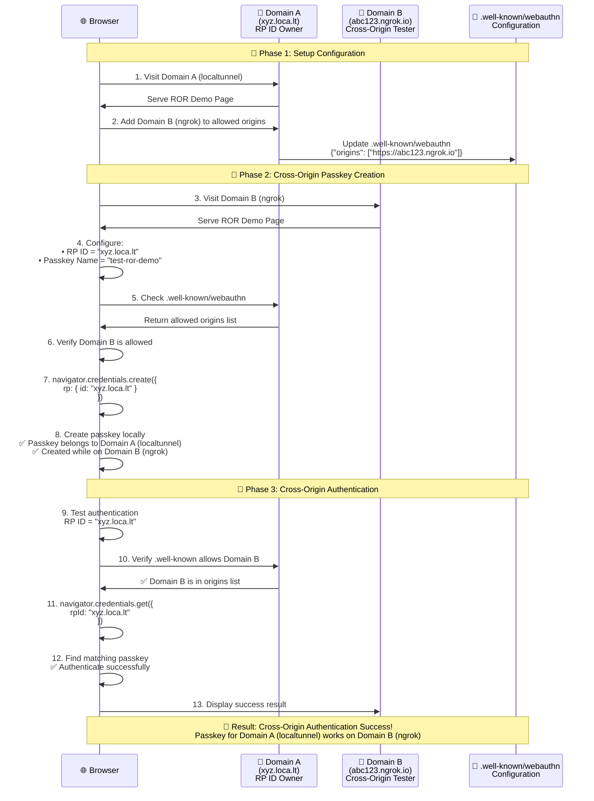

# Related Origin Requests (ROR) Demo

A comprehensive demonstration of WebAuthn's Related Origin Requests feature, allowing passkeys to be shared across multiple domains owned by the same entity.

## 🌐 What is Related Origin Requests?

Related Origin Requests (ROR) is a WebAuthn feature that allows passkeys to be reused across multiple domains that belong to the same organization. Normally, passkeys are tied to a specific Relying Party ID (RP ID) and can only be used on the exact domain where they were created.

### Problems ROR Solves

- **Multi-domain sites**: Users can't use the same passkey across `example.com` and `example.co.uk`
- **Branded domains**: Can't share passkeys between `acme.com` and `acmerewards.com`
- **Mobile apps**: Apps often don't have their own domain, making credential management challenging

### How ROR Works

1. **Configuration**: The "parent" domain serves a special JSON file at `https://{RP_ID}/.well-known/webauthn`
2. **Cross-origin requests**: When a site uses a different RP ID than its origin, the browser checks the `.well-known` file
3. **Validation**: If the requesting origin is listed in the allowed origins, authentication proceeds
4. **Seamless experience**: Users can authenticate with the same passkey across all configured domains

## 🔄 ROR Flow Diagram

The following diagram illustrates the complete Related Origin Requests flow using our demo setup with two different domains (ngrok and localtunnel):



### Key Flow Points

1. **Configuration Setup**: Domain A (localtunnel - RP ID owner) adds Domain B (ngrok) to its `.well-known/webauthn` file
2. **Cross-Origin Creation**: User creates a passkey FOR Domain A (localtunnel) WHILE ON Domain B (ngrok)
3. **Browser Validation**: Browser checks Domain A's `.well-known` file and finds Domain B is allowed
4. **Success**: Passkey creation and authentication work seamlessly across domains

> **💡 Why localtunnel as RP ID owner?** We use localtunnel as the RP ID owner because ngrok can have issues serving `.well-known/webauthn` to external domains. Localtunnel doesn't have this limitation, making it more reliable for cross-origin testing.

## 🖥️ Browser Support

According to [web.dev](https://web.dev/articles/webauthn-related-origin-requests#browser_support):

| Browser | Support Status |
|---------|----------------|
| **Chrome** | ✅ Supported from Chrome 128+ |
| **Safari** | ✅ Supported from macOS 15 beta 3, iOS 18 beta 3+ |
| **Firefox** | ❌ Not supported (awaiting position) |

### ⚠️ Important Limitations

- **Firefox users**: Will receive `SecurityError` when attempting ROR
- **Detection**: [`PublicKeyCredential.getClientCapabilities()`](https://developer.mozilla.org/en-US/docs/Web/API/PublicKeyCredential/getClientCapabilities_static) isn't widely available yet for feature detection
- **Maximum labels**: Chrome supports maximum 5 eTLD+1 labels in the origins list
- **Content-type**: Must serve `.well-known/webauthn` with `application/json` content-type

## 🚀 Demo Features

Our ROR demo provides:

1. **Browser Support Detection** - Automatically detects ROR compatibility
2. **Dynamic .well-known Management** - Add/remove origins via UI
3. **Cross-origin Passkey Creation** - Create passkeys for different RP IDs
4. **Authentication Testing** - Test cross-origin passkey authentication
5. **Real-time Feedback** - See exactly what's happening at each step

## 🛠️ Setup & Testing

### Prerequisites

- **Supported browser**: Chrome 128+ or Safari on macOS 15+/iOS 18+
- **HTTPS**: ROR requires secure origins
- **Two domains**: You need at least two different domains/origins to test

### Running the Demo

1. **Start the development server**:
   ```bash
   cd services/custom-example
   npm run dev
   ```

2. **Set up tunnels for testing**:

   **Start HTTPS proxies for 2 different domains**:
   ```bash
   # Terminal 1: ngrok (will be the cross-origin testing domain)
   ngrok http 4000

   # Terminal 2: localtunnel (will be the RP ID domain)
   lt -p 4000
   ```

3. **Access the demo**:
   - Navigate to `/related-origin-requests` on both tunnel URLs
   - You now have the same app on two different domains, perfect for testing ROR
   - **Setup**: localtunnel domain = RP ID owner, ngrok domain = cross-origin tester

### Step-by-Step Testing Guide

#### Phase 1: Setup Configuration

1. **Allow Cross-Origin Access**:
   - Open Domain A - localtunnel (e.g., `https://xyz.loca.lt/related-origin-requests`)
   - Go to **Step 2** and click "Add Current Origin"
   - This adds the ngrok domain to the allowed list for ROR

#### Phase 2: Cross-Origin Passkey Creation

2. **Create Passkey for localtunnel domain**:
   - On Domain B - ngrok (e.g., `https://abc123.ngrok.io/related-origin-requests`)
   - Go to **Step 4**
   - Set **Passkey Name**: `test-ror-demo`
   - Set **RP ID**: Domain A's hostname (e.g., `xyz.loca.lt`)
   - Click "Create Cross-Origin Passkey"
   - ✅ Success: You've created a passkey FOR localtunnel domain WHILE ON ngrok

#### Phase 3: Authentication Testing

3. **Test Cross-Origin Authentication**:
   - Still on Domain B - ngrok
   - In **Step 5**, click "Test Cross-Origin Authentication"
   - ✅ Success: Passkey works cross-origin thanks to ROR!

4. **Optional: Test on localtunnel domain**:
   - Go to Domain A - localtunnel (e.g., `https://xyz.loca.lt/related-origin-requests`)
   - In **Step 4**, set **RP ID** to the localtunnel hostname (same as above)
   - In **Step 5**, click "Test Cross-Origin Authentication"
   - ✅ Success: Same passkey also works on its "home" domain

### Expected Results

When ROR is working correctly:

- ✅ **Cross-origin creation**: Passkey creation succeeds on ngrok with localtunnel RP ID
- ✅ **Cross-origin auth**: Authentication works on ngrok with localtunnel passkey
- ✅ **Home domain auth**: Same passkey also works on localtunnel domain
- ✅ **Browser behavior**: No security errors, smooth authentication flow

**Note**: We use localtunnel as the RP ID owner because ngrok can have issues serving `.well-known/webauthn` to external domains, while localtunnel doesn't have this limitation.

## 🔧 Technical Implementation

### .well-known/webauthn Structure

```json
{
  "origins": [
    "https://example.co.uk",
    "https://example.de",
    "https://example-rewards.com"
  ]
}
```

### API Endpoints

Our demo includes these API endpoints:

- `GET /api/well-known/webauthn` - Retrieve current configuration
- `POST /api/well-known/webauthn` - Add origin to allowed list
- `DELETE /api/well-known/webauthn` - Remove origin from allowed list

### WebAuthn Integration

```javascript
// Create passkey with cross-origin RP ID
const credential = await navigator.credentials.create({
  publicKey: {
    rp: {
      name: 'My App',
      id: 'other-domain.com', // Different from current origin
    },
    // ... other options
  },
});

// Authenticate with cross-origin RP ID
const assertion = await navigator.credentials.get({
  publicKey: {
    challenge: challenge,
    rpId: 'other-domain.com', // Same RP ID as creation
    // ... other options
  },
});
```

## 🐛 Troubleshooting

### Common Issues

1. **SecurityError during creation/authentication**:
   - Check browser support (Chrome 128+, Safari macOS 15+/iOS 18+)
   - Verify `.well-known/webauthn` file is accessible
   - Ensure current origin is listed in the origins array
   - Confirm file serves with `application/json` content-type

2. **ngrok .well-known access issues**:
   - ngrok may block external domains from accessing `.well-known/webauthn`
   - Solution: Visit the ngrok URL in browser first to bypass warning
   - Alternative: Test primarily on localtunnel (recommended approach in our guide)

3. **File not found at .well-known URL**:
   - Check Next.js rewrites configuration in `next.config.js`
   - Verify API route exists at `/api/well-known/webauthn.ts`
   - Ensure proper CORS headers are set

4. **Passkey not found during authentication**:
   - Verify same RP ID is used for both creation and authentication
   - Check that passkey was actually created (not cancelled by user)
   - Ensure platform authenticator is available

### Debug Tools

- **Chrome DevTools**: Check Network tab for `.well-known` requests
- **Console logs**: Demo logs all ROR operations to browser console
- **Demo feedback**: Each step shows detailed success/error messages

---

**Note**: This is a demonstration implementation. For production use, implement proper security measures, error handling, and user experience considerations.
## Wallet-origin deployment (Phase 3+)

With the dedicated wallet origin, the ROR document is served by the wallet stack itself:

- `giano-wallet-web`'s nginx proxies `GET /.well-known/webauthn` to the wallet-api, which
  serves it from the `ror_origins` table.
- Manage entries with the admin API (bearer key from `ADMIN_API_KEYS`):

```bash
curl -X POST https://wallet.clientapp.com/api/v1/admin/ror-origins \
  -H "authorization: Bearer $ADMIN_KEY" -H 'content-type: application/json' \
  -d '{"origin": "https://app.clientapp.com"}'

curl https://wallet.clientapp.com/.well-known/webauthn
# {"origins":["https://app.clientapp.com"]}
```

Use this when a client application must exercise wallet-origin passkeys from additional
registered origins (e.g. a legacy embedded-mode origin during migration). Browser support
is Chromium-first — the E2E suite includes a Chromium-only check; treat other engines as
progressive enhancement.
