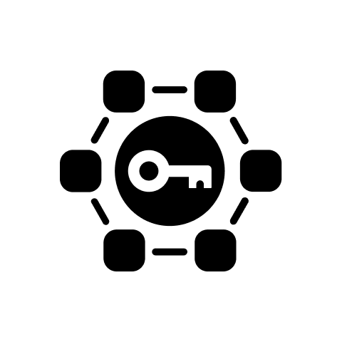

<p align="center">
 
 <h1 align="center">Giano</h1>
</p>

This repository is a Proof of Concept showcasing how to use Passkey technology to authenticate users on a smart contract.

This repository is a demo showing how the user can authenticate on a smart contract using a Passkey.  

Key parts:
- [Login.tsx](./services/web/src/client/components/Login.tsx): authentication component to request account creation and session setting.
- [Wallet.tsx](./services/web/src/client/components/Wallet.tsx): main wallet component containing logic to mint and transfer ERC20/ERC721 tokens.
- [Account.sol](./packages/contracts/contracts/Account.sol): smart contract that implements a limited account abstraction mechanism
- [AccountFactory.sol](./packages/contracts/contracts/AccountFactory.sol): smart contract that deploys `Account` contracts on runtime and maps passkey IDs to `Account` contract addresses

## Development

1. Install deps:
```sh
yarn install
```

2. Start Hardhat node and deploy contracts:

```sh
yarn hh:node
yarn hh:deploy --network localhost
```
**Important**: The contract addresses are hard coded, so if you need to make any changes to the contracts, you must restart Hardhat before redeploying them.

3. Start application:
```sh
yarn web:build:dev
```

Application available at <http://localhost:3000>.

### Test contracts:
```sh
yarn hh:test
```

## Setting up Blockscout (block explorer)
If you want, you can use `docker compose` to start up a local Blockscout instance to explore the transactions and 
contracts deployed on the local network. Start the Hardhat node at the default port and then run these commands to clone the 
Blockscout repo and start up a local instance:

```sh
# run these commands OUTSIDE of the project's structure
git clone https://github.com/blockscout/blockscout/ && \
cd blockscout/docker-compose && \
docker compose -f hardhat-network.yml up -d 
```

You can then access the Blockscout instance at `http://127.0.0.1/`

