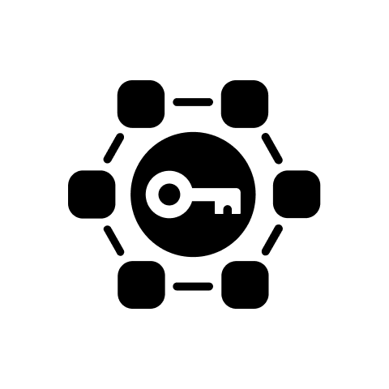

<p align="center">
 
 <h1 align="center">Giano</h1>
</p>

**Giano** is an ERC-4337-compliant smart wallet based on the [Coinbase Smart Wallet](https://github.com/coinbase/smart-wallet).

## Development

### Setup

1. Install [Foundry](https://getfoundry.sh/):

```sh
curl -L https://foundry.paradigm.xyz | bash
```

2. Initialize Git submodules:

```sh
pnpm git:init
```

3. Install deps:

```sh
pnpm install
```

4. Start Anvil node:

```sh
pnpm hh:node
```

5. Deploy all the contracts:

```sh
pnpm hh:initlocal
```

6. Start the Alto bundler with CORS proxy:

```sh
pnpm bundler:dev
```
7. Build the connector package:
```sh
pnpm build:connector
```
8. Start the demo app:
```sh
pnpm demo:dev
```

## Security note: committed bundler API keys

The demo `.env-*` files in `services/custom-example` contain Coinbase Developer Platform bundler
RPC URLs whose path segment is an API key. **These keys are in git history and must be rotated**
(ops task) — treat them as public. New keys must be supplied via untracked `.env` files, never
committed.

# Using the Coinbase bundler on Base Sepolia
To use the Coinbase bundler, you need to copy the .env-base-sepolia file to .env and set the `NEXT_PUBLIC_BUNDLER_RPC_URL` to the Coinbase bundler URL.

There is no need to deploy the smart contracts again, as the addresses are already set in the `.env` file.
There is also no need to run the local bundler, as the Coinbase bundler is already running on the Base Sepolia network.
Moreover, you don't need to run the local blockchain node, as the Coinbase bundler will use the Base Sepolia network.


### Important tips

- Remember to run `build` every time you make changes to the contracts or connector packages, so that changes are picked up by packages that import them
- Contracts are supposed to be deployed with Hardhat Ignition using a `CREATE2` strategy, that means the contracts' addresses will be the same on any chain and deployment order **as long as the generated bytecode remains the same**. That means, remember to restart Anvil and run `hh:initlocal` again every time you change the contracts. Deployed addresses are read from the committed registry in `@appliedblockchain/giano-contracts` (`addresses.ts`, regenerated via `pnpm gen:addresses`).


Application available at <http://localhost:4000>.

## Troubleshooting

### Heap Out of Memory Error

If you encounter a "heap out of memory" error when running the build command, this is typically due to Node.js running out of memory during the build process. This can happen when building large projects or when the default memory allocation is insufficient.

**Solution:**

Run the build command with increased memory allocation:

```sh
NODE_OPTIONS='--max-old-space-size=16384' pnpm build
```

This increases the maximum heap size to 16GB. You can adjust the value (in MB) based on your system's available memory:
- `8192` for 8GB
- `16384` for 16GB  
- `32768` for 32GB

**Alternative solutions:**
- Close other memory-intensive applications before building
- Clear Node.js cache: `pnpm store prune`
- Restart your development environment

### Test contracts

#### Contract tests (Foundry)
```sh
forge test
```

## Components

- `GianoSmartWallet`: the smart wallet itself, which validates the signatures and executes the calls.
- `GianoSmartWalletFactory`: the contract responsible for deploying the smart wallet contracts
- `toGianoSmartAccount.ts`: module that instantiates a Viem client for the Giano Smart Wallet
- `provider.ts`: `EIP-1193`-compatible provider that intercepts EVM RPC requests and repackages transactions as user ops to be passed to the bundler
- `connector.ts`: WAGMI connector
- `gianoWallet.ts`: RainbowKit integration code

## Setting up Blockscout (block explorer)

If you want, you can use `docker compose` to start up a local Blockscout instance to explore the transactions and
contracts deployed on the local network. Start the Hardhat node at the default port and then run these commands to clone the
Blockscout repo and start up a local instance:

```sh
# run these commands OUTSIDE of the project's structure
git clone https://github.com/blockscout/blockscout/ && \
cd blockscout/docker-compose && \
docker compose -f hardhat-network.yml up -d
```

You can then access the Blockscout instance at `http://127.0.0.1/`
