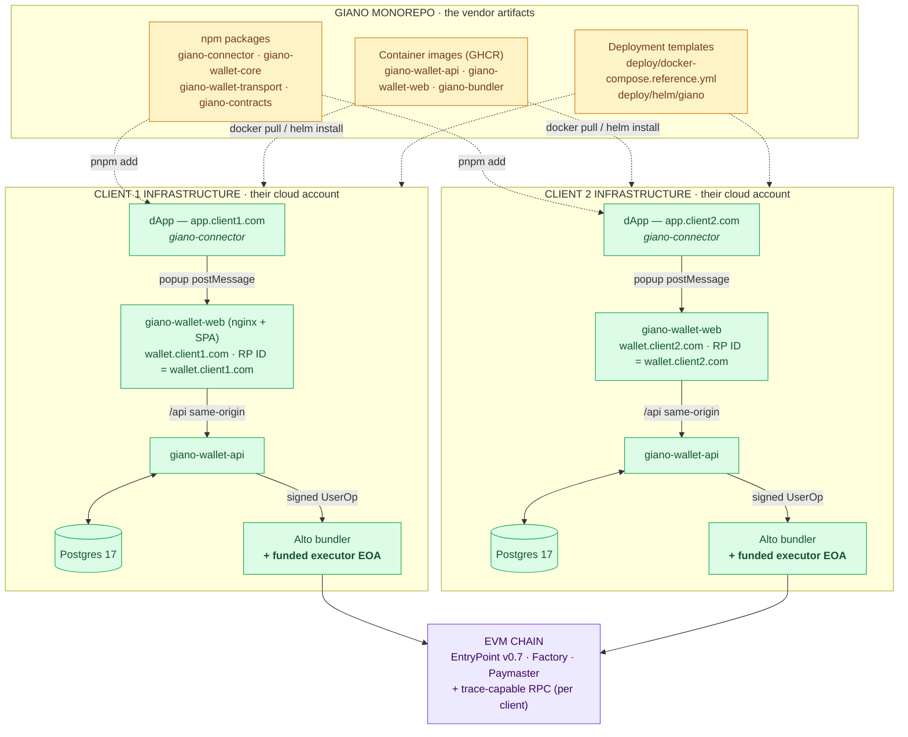
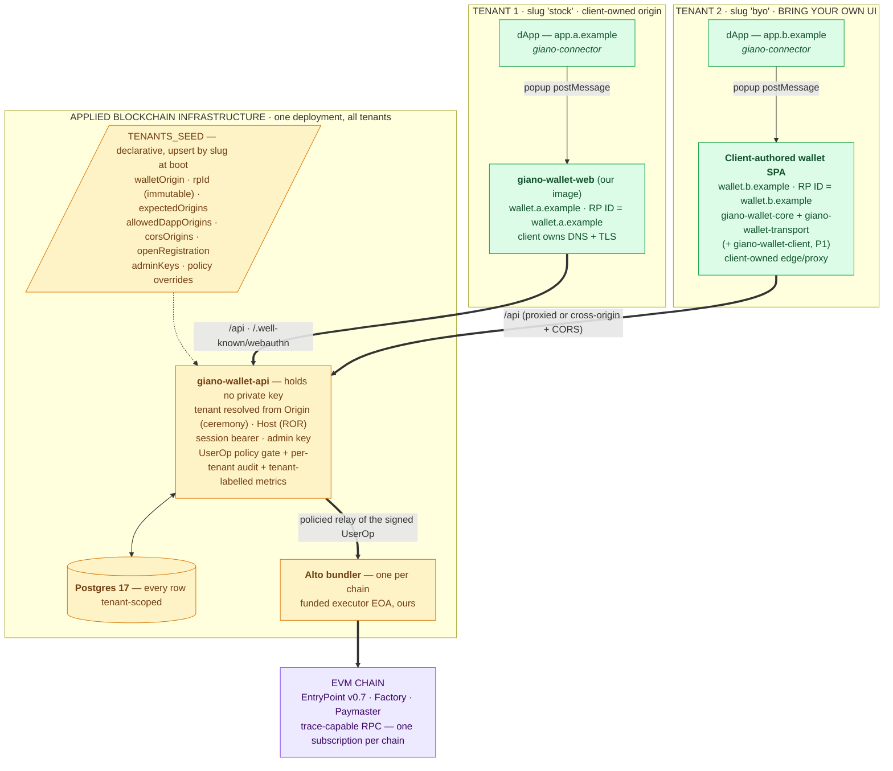

# Self-hosted vs. standalone — two distribution architectures for Giano

Status: draft · Last updated 2026-07-28 · Owner: Giano team
Companion documents: [`ARCHITECTURE.md`](./ARCHITECTURE.md) · [`PRODUCT-STRATEGY.md`](./PRODUCT-STRATEGY.md) · [`COST-MODEL.md`](./COST-MODEL.md)

---

Giano ships the **same components** in both architectures. What differs is **who deploys and
operates them**, and therefore where the trust boundary, the cost curve and the upgrade obligation
land.

| | **A — Self-hosted** | **B — Standalone** |
|---|---|---|
| One-line definition | Every client project deploys its own full Giano stack into its own infrastructure | Applied Blockchain operates one Giano deployment; every client project integrates against it |
| Who runs the backend | The client | **Us** |
| Who runs the wallet origin | The client (our image) | The client (our image **or their own SPA**) |
| Tenancy | One deployment = one tenant, in practice | **One deployment = many tenants**, tenant ≡ wallet origin ≡ RP ID |
| Reference in this repo | `deploy/docker-compose.reference.yml`, `deploy/helm/giano` | [`docs/ARCHITECTURE.md`](./ARCHITECTURE.md), `deploy/docker-compose.e2e.yml` |
| Strategy tier | Tier C | Tier A (our UI) and Tier B (their UI) |

Both are supported. Architecture B is the direction of travel; A does not go away
([`PRODUCT-STRATEGY.md`](./PRODUCT-STRATEGY.md) §1).

---

## Contents

- [1. The component inventory — identical in both](#1-the-component-inventory--identical-in-both)
- [2. Architecture A — self-hosted](#2-architecture-a--self-hosted)
- [3. Architecture B — standalone](#3-architecture-b--standalone)
- [4. Bring-your-own UI](#4-bring-your-own-ui)
- [5. Side-by-side comparison](#5-side-by-side-comparison)
- [6. Cost](#6-cost)
- [7. Security and trust boundary](#7-security-and-trust-boundary)
- [8. Operational obligations](#8-operational-obligations)
- [9. Migration between the two](#9-migration-between-the-two)
- [10. When to choose which](#10-when-to-choose-which)
- [11. Open gaps](#11-open-gaps)

---

## 1. The component inventory — identical in both

Every component below is built from this monorepo. The architectures differ only in the
**deployment column**.

### Services (deployable artifacts)

| Component | Source | Artifact | Self-hosted | Standalone |
|---|---|---|---|---|
| **`wallet-api`** — Fastify backend: WebAuthn ceremonies, sessions, policied UserOp relay, audit log, admin API. Holds no private key | `services/wallet-api` (`private: true`) | `ghcr.io/appliedblockchain/giano-wallet-api` | Client deploys | **We deploy** |
| **`wallet-web`** — nginx + static Vite SPA: the wallet origin. Serves the SPA, proxies `/api` and `/.well-known/webauthn` same-origin, sets `X-Frame-Options` / CSP | `services/wallet-web` (`private: true`) | `ghcr.io/appliedblockchain/giano-wallet-web` | Client deploys | Client's origin, our image — **or replaced entirely** (see §4) |
| **Database** — Postgres 17: users, credentials, challenges, sessions, UserOp log, ROR origins | `services/wallet-api/src/db/schema.ts` + migrations | `postgres:17-alpine`; `RUN_MIGRATIONS=true` or a one-shot `dist/migrate.js` job | Client deploys | **We deploy** (managed RDS) |
| **Bundler** — ERC-4337, pinned `@pimlico/alto@0.0.18`, funded executor EOA, refuses to boot on a missing/Anvil key unless `GIANO_DEV_MODE=true` | `services/bundler/Dockerfile` | `ghcr.io/appliedblockchain/giano-bundler` | Client deploys **and funds** | **We deploy**, one per chain |

### Packages (npm, `@appliedblockchain` scope → GitHub Packages)

| Package | Version | Consumed by | Role |
|---|---|---|---|
| `giano-connector` | `0.1.0` | dApp | Thin EIP-1193 provider + wagmi connector + RainbowKit wallet. No WebAuthn, no keys, no bundler URL reachable from this surface |
| `giano-wallet-core` | `0.1.0` | wallet origin | WebAuthn credential creation/assertion, `toGianoSmartAccount`, UserOp assembly |
| `giano-wallet-transport` | `0.1.0` | both sides | The popup `postMessage` JSON-RPC protocol — `TransportHost` (wallet) / client (dApp) |
| `giano-contracts` | `2.1.0` | everything | `GianoSmartWallet`, `GianoSmartWalletFactory` (CREATE2), paymasters, and the deployed-address registry |
| `giano-wallet-client` | **not yet extracted** | wallet origin | The wallet runtime currently trapped inside `services/wallet-web/src/{config,wallet,host,requests}.ts`. **P1 — blocks BYO-UI** |

The packages are **the same artifacts in both architectures**. This is the point: the SDK surface a
client codes against does not change when the deployment model changes.

### On-chain (shared by both)

`EntryPoint v0.7` (`0x0000000071727De22E5E9d8BAf0edAc6f37da032`) · `GianoSmartWalletFactory`
(CREATE2 — same account address on every chain) · `GianoSmartWallet` implementation (MultiOwnable +
WebAuthn) · P-256 verification via the RIP-7212 precompile at `0x100`, falling back to
FreshCryptoLib · a paymaster (`VerifyingPaymaster` in production, `PermissivePaymaster` for testing
only).

---

## 2. Architecture A — self-hosted

> *Every client project deploys itself as services in its own stack. Giano is never centrally
> hosted.* — the assumption the current codebase was built for.



**What the client gets.** Two container images, a Postgres image, a bundler image, four npm
packages, and a compose file or Helm chart to wire them together. Everything runs in their account,
under their network policy, against their own database.

**What the client takes on.** The whole operational surface: deployment, TLS, migrations on upgrade,
Postgres backups, secret management, the funded bundler executor EOA and keeping it topped up, a
trace-capable RPC subscription (Alto's `--safe-mode true` needs `debug_traceCall`, which the public
keyless endpoints do not serve), monitoring, and applying every Giano security release themselves.

**Configuration shape.** `TENANTS_SEED` is a JSON array upserted by slug at boot — a self-hosted
deployment normally carries exactly one entry. `rpId` is derived from `walletOrigin` and is
**irreversible** once a passkey exists.

**Note on `openRegistration`.** `deploy/docker-compose.reference.yml` documents
`openRegistration: false`, which routes registration server-to-server through the tenant's
`adminKeys`. The shipped `wallet-web` does not yet pass `getRegistrationGrant`, so open registration
is required for the stock UI today — see [§11](#11-open-gaps).

---

## 3. Architecture B — standalone

> One `giano-wallet-api` (+ one Postgres, one bundler, one chain) serves many tenants.
> **Tenant ≡ wallet origin ≡ WebAuthn RP ID**, one to one.

This is the architecture built on this branch and specified in full, with the touch-point table and
the isolation matrix, in [`ARCHITECTURE.md`](./ARCHITECTURE.md).



**What the client gets.** An endpoint, a tenant slug, admin keys, and the npm packages. Nothing to
deploy except the wallet origin itself.

**What the client takes on.** A DNS record and a TLS certificate for `wallet.<their-domain>` pointing
at our edge — plus, under BYO-UI, the SPA and its conformance obligations.

**The isolation model.** Isolated per tenant: wallet origin and TLS host, RP ID and therefore all
passkeys, wallet UI and branding, users, credentials, challenges, sessions, dApp allow-lists, admin
keys, policy overrides, quotas, and every metric label. Shared: the `wallet-api` process, the
Postgres instance, the bundler and its executor EOA, the chain, EntryPoint, factory, implementation
and paymaster.

**Why every tenant owns its own origin.** A shared wallet origin would mean a shared RP ID, and
WebAuthn scopes credential discovery by RP ID — the browser picker would offer any tenant's passkey
to any tenant's ceremony. With distinct RP IDs the browser refuses, and
`verifyAuthenticationResponse` refuses again on `rpIdHash`. Isolation is cryptographic rather than a
permanent obligation on our server code. Cross-tenant attempts are rejected and alerted via
`giano_cross_tenant_rejections_total`.

**A deliberate consequence:** because the *client* owns the origin, swapping what is served there —
our UI today, their SPA later — does not change the RP ID. Every passkey keeps working.

---

## 4. Bring-your-own UI

Only Architecture B offers this as a product tier. There are **two** UIs in the system and they have
completely different answers.

| | **dApp UI** | **Wallet UI (the wallet origin)** |
|---|---|---|
| Example host | `app.keo.com` | `wallet.keo.com` |
| What it is | The client's application | The passkey + consent surface |
| Holds credentials | No — zero WebAuthn code | **Yes — this is the trust boundary** |
| Passkey binds to it | No | **Yes — the RP ID is this host** |
| SDK | `giano-connector` | `giano-wallet-core` + `giano-wallet-transport` (+ `giano-wallet-client`) |
| BYO today | **Yes, fully supported** — in both architectures | Architecture B only; **blocked on P1** |

**The dApp UI is already solved, in both architectures.** `createGianoWalletProvider({ walletUrl,
chain })` returns a standard EIP-1193 provider. Proof in the repo: `e2e/dapp/main.ts` is plain
TypeScript with no framework, `services/custom-example` is React + Chakra UI v3 — two totally
different UIs, one unchanged SDK.

**The wallet UI is the actual request.** The client replaces exactly one component,
`services/wallet-web` — the SPA *and* its nginx responsibilities. Everything below stays ours.
Reference implementation: `e2e/wallet-byo/`, exercised by `e2e/tests/byo-wallet.spec.ts`.

### What BYO-UI can never mean

`navigator.credentials.create()` / `.get()` are browser APIs bound to an origin
(`packages/wallet-core/src/account/get-credential.ts`, `src/provider.ts`). **A truly headless Giano
is impossible.** There must always be a real browser origin, served by someone, running our SDK.
BYO-UI changes *who serves it*; it does not remove it.

### The conformance contract

Owning the wallet origin means owning part of the trust boundary. These are the controls we can no
longer enforce for the client:

| Responsibility | Provided by `wallet-web` | BYO client must |
|---|---|---|
| Stable TLS host, never changed | nginx | Serve it — the host is permanent (see §7) |
| Reach `wallet-api` | same-origin `/api` proxy | Proxy it, or call cross-origin (works — sessions are opaque bearer tokens, no cookies) |
| `X-Frame-Options: DENY` + `frame-ancestors 'none'` | `docker/nginx.conf.template` | Reproduce both. **We cannot enforce this** |
| CSP `connect-src` restricted to RPC + bundler | Same template | Reproduce |
| Popup only, in a user gesture | `wallet-web` + transport | Preserve |
| Pin the calling dApp origin, fail closed | `TransportHost({ allowedOrigins })` | Configure |
| Show the dApp origin on every consent screen | `views/*` | Reproduce — this is the anti-phishing control |
| Render call data and sign payloads truthfully | `describeCallData()`, `renderPayload()` | Use our exported helpers |
| Real `estimateFeesPerGas` | `src/wallet.ts` | Preserve — the 200-gwei fallback inflates the paymaster prefund ~180× and trips `AA31` on low-fee chains |
| `/.well-known/webauthn` if using ROR | nginx proxy | Proxy or serve it |

Because this is a trust boundary, Tier B needs a **conformance gate, not documentation**: the
Playwright suite parameterised by wallet origin, plus header/CSP checks, run as an acceptance test.

---

## 5. Side-by-side comparison

### Deployment and operations

| Dimension | Self-hosted | Standalone |
|---|---|---|
| Who deploys `wallet-api` | Client | Us |
| Who deploys Postgres | Client | Us |
| Who deploys the bundler | Client | Us, one per chain |
| Who funds the executor EOA | Client | Us (pass-through billing) |
| Who holds the RPC subscription | Client, per stack | Us, one per chain |
| Who deploys the wallet origin | Client (our image) | Client (our image or their SPA) |
| Who deploys the dApp | Client | Client |
| Database migrations | Client, on every upgrade | Us |
| Backups, monitoring, alerting | Client | Us |
| Secret management | Client | Us + per-tenant `adminKeys` handed to the client |
| Onboarding a new project | A full deployment | A `TENANTS_SEED` entry + DNS/TLS |
| Time to first transaction | Days–weeks | Hours |

### Isolation

| Isolated by | Self-hosted | Standalone |
|---|---|---|
| Process | ✅ separate `wallet-api` per client | ❌ shared process |
| Database | ✅ separate instance | ⚠️ shared instance, **every row tenant-scoped** |
| Network | ✅ client's own VPC | ❌ shared |
| RP ID / passkeys | ✅ | ✅ **cryptographic — the strongest boundary in either model** |
| Users, credentials, sessions | ✅ | ✅ tenant-scoped |
| dApp allow-list, CORS, policy caps, quotas | ✅ | ✅ per tenant |
| Admin keys | ✅ | ✅ per tenant |
| Metrics | ✅ | ✅ tenant-labelled |
| Bundler / executor EOA | ✅ | ❌ shared — noisy-neighbour and shared gas budget |
| Chain, EntryPoint, factory, paymaster | ❌ shared in both | ❌ shared in both |

The honest summary: standalone trades **process, network and bundler isolation** for operational
leverage, and keeps the isolation that actually protects user funds — the RP-ID binding — intact and
enforced by the browser.

### Upgrades and security

| | Self-hosted | Standalone |
|---|---|---|
| Backend security fix | Client must pull, migrate, redeploy | We redeploy — every tenant gets it |
| Wallet UI security fix (our UI) | Client must redeploy | We redeploy |
| Wallet UI security fix (BYO) | n/a | **Client must upgrade the SDK** — the drift risk |
| Breaking change coordination | `COMPATIBILITY.md` lockstep: `wallet-api` (+ migrations) → wallet origin → dApp SDK | Same order, but we no longer control when a BYO origin upgrades — the handshake version check and a stated support window become contractual |
| Blast radius of a backend bug | One client | **All tenants** |
| Blast radius of a wallet-origin bug | One client | One tenant (origins are separate) |

---

## 6. Cost

Figures from [`COST-MODEL.md`](./COST-MODEL.md) §4, `eu-west-1` on-demand. **Lean** = pilot-grade;
**Reliable** = multi-AZ database, redundant tasks, WAF, real log retention.

**Self-hosted:** the client pays a full stack. Naively that is the *entire* Pool A + Pool B bill per
client — one ALB, one RDS, one bundler, one RPC subscription, one observability setup — on the order
of **$138–370/month for a single client**, borne by them, and it does not amortise across projects.

**Standalone:** one shared substrate carries every tenant.

| Clients | Lean | Reliable |
|---|---|---|
| 1 | $138 | $370 |
| 2 | $154 | $399 |
| 3 | **$170** | **$428** |
| 5 | $202 | $486 |
| 10 | $282 | $631 |

Ten clients cost **~70% more than one**, not 10×. The fixed substrate is ~92% of the bill at one
client and ~54% at ten.

**Marginal cost per additional client (Pool B):** $16 lean / $29 reliable with our wallet UI;
**$14 / $26 under BYO-UI**, because the `wallet-web` hosting line disappears. The ~$3 saving is
trivial in absolute terms; the direction is the point — BYO-UI shifts hosting *and* frontend
maintenance to the client. It also shifts **security responsibility**, which is why conformance
testing is a gate rather than a document, and that testing is an ops cost of roughly half a day per
client per release.

**The largest and least obvious line, in both architectures:** a trace-capable RPC provider,
$50–250/month. Alto under `--safe-mode true` needs `debug_traceCall`; the keyless public endpoints
used throughout this repo do not serve it. This single line can exceed all compute combined —
and self-hosting pays it once per client, standalone once per chain.

**Gas (Pool C) is orthogonal** and applies identically to both: sponsored transactions cost real
money, and on Ethereum Mainnet the P-256 path alone is ~5k gas with the RIP-7212 precompile versus
~330k without. Whether Mainnet exposes the precompile must be checked live
(`pnpm run doctor chain`), not assumed.

---

## 7. Security and trust boundary

```
SELF-HOSTED                              STANDALONE
────────────────────────────────────     ────────────────────────────────────
  dApp UI            client               dApp UI            client
  ────────────────────────────            ────────────────────────────
  Wallet origin      client (our image)   Wallet origin      client
                                                             (our image, Tier A)
                                                             (their SPA, Tier B)
  ══════ trust boundary ══════             ══════ trust boundary ══════
  wallet-api         client                wallet-api        US
  Postgres           client                Postgres          US
  bundler + EOA      client                bundler + EOA     US
  ────────────────────────────            ────────────────────────────
  contracts          shared, audited       contracts         shared, audited
```

**Invariant in both:** `wallet-api` holds **no private key**. Passkeys are non-extractable and bound
to the wallet origin. The EntryPoint address is server-configured and never taken from a request.
Every relayed UserOp passes the policy gate (`USEROP_MAX_*`, allowed targets and paymasters, rate
limit) and lands in the audit log.

**What changes under standalone:**

- **We become the custodian of every tenant's data.** One backend bug is a multi-tenant incident.
  Mitigated by tenant-scoped rows, tenant resolution from `Origin`/`Host`/session/admin-key rather
  than from anything client-supplied, and cross-tenant rejection metrics.
- **Cross-tenant credential confusion is the named risk**, and it is structurally prevented rather
  than policed: distinct RP IDs mean the browser will not even offer the wrong passkey, and the
  server rejects on `rpIdHash` if one is presented.
- **Under Tier B the trust boundary is shared.** A client that omits `X-Frame-Options` or does not
  show the dApp origin on consent creates a phishing or clickjacking path against wallets on *our*
  backend. Hence the conformance gate, and hence Tier B belongs in the scope of the contract security
  audit.

**Irreversible in both, and needing written sign-off before the first deploy:** the wallet host is
permanent. `wallet.keo.com` cannot later become `wallet.keo.io` without every user re-registering.
And `RP_ID`/`rpId` must equal the wallet host — a registrable-parent value boots fine and then fails
every ceremony with `400 verification-failed`, until the `rpId` plumbing fix lands.

---

## 8. Operational obligations

| Obligation | Self-hosted | Standalone |
|---|---|---|
| Postgres backup + restore drill | Client | Us |
| Migration on upgrade | Client | Us |
| Executor EOA balance monitoring | Client | Us |
| Paymaster deposit top-up | Client | Us, with per-tenant caps and pass-through billing |
| Trace-capable RPC contract + fallback provider | Client | Us |
| `/healthz` `/readyz` `/metrics` scraping and alerting | Client | Us (tenant-labelled) |
| Incident response and status comms | Client | Us — a shared backend needs a status page and an SLA |
| Applying Giano security releases | Client | Us — except a BYO client's own SDK version |
| Acceptance gate | `pnpm run doctor chain` | `pnpm run doctor chain` + the Playwright suite pointed at the client's wallet origin |

---

## 9. Migration between the two

**Standalone → self-hosted** is straightforward in principle and needs a data export. The wallet
origin, and therefore the RP ID, is client-owned in both models, so **passkeys survive** provided the
host does not change. What moves is the tenant's rows out of the shared Postgres into a dedicated
one, plus a bundler and RPC subscription the client now owns. There is no export tool today — see
[§11](#11-open-gaps).

**Self-hosted → standalone** is the same problem in reverse, plus a `TENANTS_SEED` entry and
repointing DNS at our edge.

**Tier A → Tier B within standalone** — our UI to their SPA at the same origin — is the migration
the architecture was shaped to make free: **zero user re-registration**, because the RP ID is the
host and the host does not change. This is why "every tenant owns its wallet origin" is an
architectural rule rather than a preference: it removes the one-way door.

---

## 10. When to choose which

**Self-hosted when:**

- the client's compliance or procurement position requires custody of the database and full network
  control;
- the deployment must run air-gapped, on-premise, or in a specific jurisdiction we do not operate in;
- the client already runs comparable infrastructure and the operational load is marginal for them;
- they need a chain or a topology our standalone deployment does not serve.

**Standalone when:**

- the client wants to ship, not to operate — time to first transaction in hours rather than weeks;
- we want the economics to amortise: the marginal client is ~$29/month, not a fresh stack;
- the client wants their own wallet UI (Tier B) — only standalone offers it as a product;
- we want every client to inherit security fixes when we redeploy.

**Default recommendation:** standalone, Tier A (our UI on their origin) for clients without a strong
reason to write their own wallet UI — cheapest for them, cheapest for us to support, and they can
move to Tier B later without their users re-registering. Self-hosted stays supported and unchanged
for the clients who need it.

---

## 11. Open gaps

Both architectures share the mainnet gate; standalone adds a packaging gate.

| Gap | Affects | Status |
|---|---|---|
| **`giano-wallet-client` not extracted** — the wallet runtime lives in a `private: true` app, so no client can install it | Standalone Tier B | **P1, critical path.** `services/wallet-web` must be refactored onto it, or the SDK rots |
| **Packages unpublished** — the `@appliedblockchain` scope routing to GitHub Packages collides with pulling public packages under that scope | Both | **P0** |
| **`getRegistrationGrant` never wired** in `wallet-web`, so the documented `openRegistration: false` configuration cannot register a user with the shipped UI | Both | **P0** |
| **`rpId` plumbing** — the server returns `rpId`, nothing reads it; the browser defaults to the current hostname. Blocks registrable-parent RP IDs and leaves Related Origin Requests implemented but unreachable | Both | **P1** |
| **No production `VerifyingPaymaster`** — only `PermissivePaymaster`, which sponsors anything from anyone and would be drained on a live network | Both | **P3** |
| **No independent contract security audit** of Giano's additions to the Coinbase fork | Both | **P3** — longest lead time, start procurement early |
| **Alto never validated under `--safe-mode true` on a public network** | Both | **P3** |
| **No account recovery** — the contracts support multiple owners; nothing productises adding a second device or recovering a lost passkey | Both | **P3** |
| **No tenant data export/import tool** | Migration between architectures | Unscheduled |
| **BYO client upgrade drift** — a stale wallet origin runs known-vulnerable SDK code against our backend | Standalone Tier B | Handshake `sdkVersion` check + minimum-supported-version enforcement + a stated support window |
| **Shared bundler is a shared gas budget** | Standalone | Per-tenant policy caps exist; per-tenant accounting and prepaid deposits are the commercial answer |
