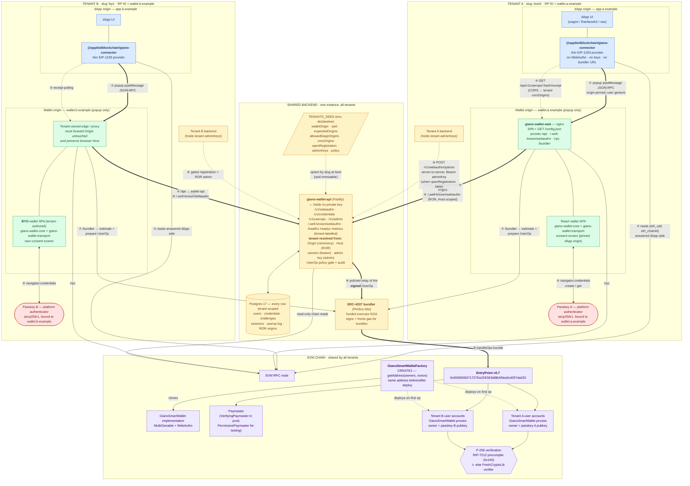

# Giano architecture — two tenants on one backend

One `giano-wallet-api` (+ one Postgres, one bundler, one chain) serves many tenants.
**Tenant ≡ wallet origin ≡ WebAuthn RP ID**, one to one. Tenant A runs Giano's stock
`wallet-web` UI; tenant B brings its own wallet SPA (reference: `e2e/wallet-byo/`). The
deployment shape is identical — only the SPA's authorship differs.

Numbered edges are the **client integration touch points**, tabulated below the diagram.

## Client integration touch points

| # | Touch point | Who implements it | Notes |
| --- | --- | --- | --- |
| ① | Popup postMessage transport (dApp ⇄ wallet origin) | `giano-connector` (dApp) ⇄ `giano-wallet-transport` (wallet) | Must be called from a user gesture. dApp must **not** send `COOP: same-origin`; wallet allow-lists dApp origins (`GIANO_ALLOWED_DAPP_ORIGINS` / tenant `allowedDappOrigins`), fail-closed on empty. |
| ② | Read path, dApp-side | dApp `transport` option (viem) | `eth_call`/`eth_chainId`/… never open the popup. |
| ③ | `GET /api/v1/userops/:hash/receipt` | `waitForUserOperationReceipt` in the SDK | Public endpoint, CORS-gated by the tenant's `corsOrigins`. **The dApp never needs a bundler URL.** |
| ④ | WebAuthn ceremony | wallet SPA only | Passkey is non-extractable and bound to the wallet host = tenant RP ID. |
| ⑤ | Same-origin `/api` proxy → wallet-api | wallet-web's nginx, or the BYO tenant's edge | `Origin` must be forwarded untouched — ceremony tenant resolution depends on it. |
| ⑥ | `GET /.well-known/webauthn` (Related Origin Requests) | same proxy | Resolved by **`Host`** — the browser's Host must be preserved. |
| ⑦ | `/bundler` (estimate + prepare UserOp) | wallet SPA via same-origin proxy | Wallet-side only. Keep a **real `estimateFeesPerGas`** — the 200-gwei fallback trips `AA31` on low-fee chains. |
| ⑧ | `POST /v1/webauthn/options` server-to-server | the tenant's own backend | Required when the tenant sets `openRegistration: false`; authenticates with that tenant's `adminKeys`. |
| ⑨ | Signed-UserOp relay | wallet-api | Policy gate (`USEROP_MAX_*`, allowed targets/paymasters, rate limit) + audit log; EntryPoint address is server-configured, never taken from the request. |
| ⑩ | `handleOps` | bundler executor EOA | Funded; reimbursed by the paymaster deposit. |

## Isolation vs. sharing

**Isolated per tenant:** wallet origin + TLS host, RP ID and therefore all passkeys
(cross-tenant credential use is structurally impossible in the browser, and rejected +
alerted server-side via `giano_cross_tenant_rejections_total`), wallet UI and branding,
users, credentials, challenges, sessions, dApp allow-lists, admin keys, UserOp policy
overrides, quotas, and every metric label.

**Shared:** the wallet-api process, Postgres instance, bundler + executor EOA, chain,
EntryPoint, factory, implementation and paymaster — so all tenants' smart accounts are
plain `GianoSmartWallet` clones from the one factory.

## The same diagram in the E2E stack

`deploy/docker-compose.e2e.yml` boots exactly this topology with two seeded tenants:

| Diagram element | E2E stack |
| --- | --- |
| Tenant A wallet origin (stock UI) | `wallet-web` container → http://wallet.localhost:8081 |
| Tenant A dApp | `pnpm --filter @appliedblockchain/giano-e2e dapp` → http://app.localhost:4400 |
| Tenant B wallet origin (BYO UI) | `e2e/wallet-byo/serve.mjs` (host-side proxy + SPA) → http://wallet-byo.localhost:8082 |
| Tenant B dApp | `DAPP_PORT=4401 WALLET_URL=http://wallet-byo.localhost:8082 … dapp` → http://app-byo.localhost:4401 |
| Shared wallet-api + Postgres | `wallet-api` + `postgres` containers, `TENANTS_SEED` = `[stock, byo]` |
| Bundler | `alto` container → http://localhost:4337 |
| Chain + contracts | `anvil` with pre-baked state → http://localhost:8545 (chain 31337); addresses in `e2e/devnet/addresses.json` |

Coverage: `e2e/tests/wallet-flow.spec.ts` (tenant A), `byo-wallet.spec.ts` (tenant B),
`tenant-isolation.spec.ts` (cross-tenant rejection).
