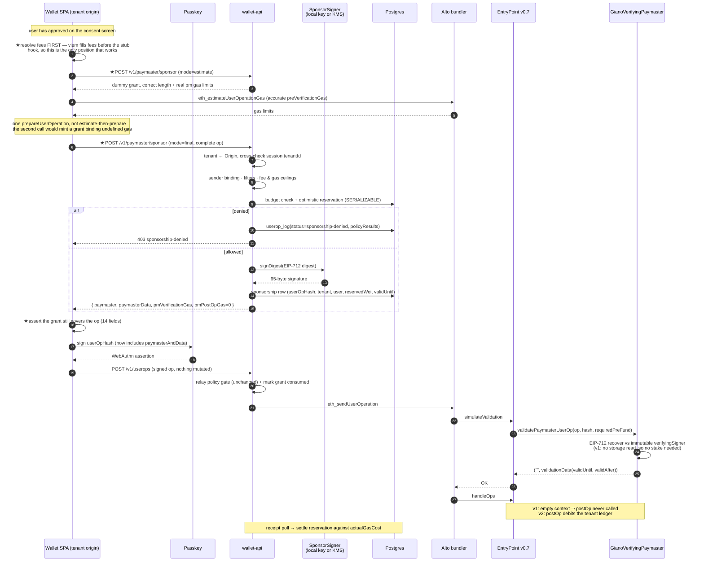

# Giano paymaster design — signed sponsorship with off-chain policy

**How Giano decides which transactions it pays for, and where that decision is enforced.**

Status: reviewed · Last updated 2026-07-28 · Owner: Giano team
**Implementation contract: [`PAYMASTER-SPEC.md`](./PAYMASTER-SPEC.md)** — this document is the *why*
(options, trade-offs, challenges); the spec is the *what* and *how*. Where they disagree, the spec wins.
Companion documents: [`COST-MODEL.md`](./COST-MODEL.md) §5 · [`PRODUCT-STRATEGY.md`](./PRODUCT-STRATEGY.md) §S4/P3 ·
[`MULTI-TENANCY-GAPS.md`](./MULTI-TENANCY-GAPS.md) D3.3 · [`TRANSACTION-SUBMISSION-FLOW.md`](./TRANSACTION-SUBMISSION-FLOW.md)

> **Revised after codebase verification.** Sections 4.1–4.5, 5, 6.1, 6.3, 7, 8 and 11 were corrected
> once the design met the actual viem, EntryPoint and ERC-7562 constraints. Corrections are itemised in
> [`PAYMASTER-SPEC.md`](./PAYMASTER-SPEC.md) §10; the substantive one is that the tenant ledger moved to
> **v2**, because reading it during validation would require an EntryPoint stake.

---

## Contents

- [1. Recommendation](#1-recommendation)
- [2. Why today's setup is structurally open, not just permissive](#2-why-todays-setup-is-structurally-open-not-just-permissive)
- [3. The option space](#3-the-option-space)
- [4. The design](#4-the-design)
  - [4.1 Contract](#41-contract-a-stateless-verifying-paymaster-now-a-tenant-ledger-later)
  - [4.2 What the signature covers](#42-what-the-signature-covers)
  - [4.3 The sponsor endpoint](#43-the-sponsor-endpoint)
  - [4.4 The filter configuration](#44-the-filter-configuration)
  - [4.5 The signing key](#45-the-signing-key)
- [5. The sponsored flow end to end](#5-the-sponsored-flow-end-to-end)
- [6. Six things that must change before this can work](#6-six-things-that-must-change-before-this-can-work)
- [7. Failure modes and blast radius](#7-failure-modes-and-blast-radius)
- [8. Budget accounting and reconciliation](#8-budget-accounting-and-reconciliation)
- [9. Observability and ops](#9-observability-and-ops)
- [10. Test plan](#10-test-plan)
- [11. Decisions needed](#11-decisions-needed)

---

## 1. Recommendation

**The proposed approach is correct.** An on-chain paymaster that verifies a signature from our
backend, where the backend signs only after evaluating a per-tenant filter configuration, is what
every production sponsorship provider does (Pimlico, Alchemy, Biconomy, Candide all ship a variant
of it). It is the only design that gives arbitrary policy expressiveness at zero on-chain cost:
policy lives in a database row, and the contract stays small enough to audit.

Four refinements to what was described, in order of importance:

1. **The signature must bind every gas field, not just "the transaction data."** If it binds only
   sender/callData, a user can inflate `maxFeePerGas` and gas limits after we sign and we pay the
   difference. Sign the full `PackedUserOperation` minus the signature itself
   ([§4.2](#42-what-the-signature-covers)).
2. **A signature is qualitative; you also need a quantitative control.** "This op matches the
   filters" does not bound spend — a user can request 500 matching grants. Budgets live off-chain,
   next to the signer, and they are the *only* spend control in v1
   ([§8](#8-budget-accounting-and-reconciliation)). v2 adds a per-tenant on-chain daily cap as a
   circuit breaker that survives a signer compromise
   ([§4.1](#41-contract-a-stateless-verifying-paymaster-now-a-tenant-ledger-later)).
3. **One paymaster contract, not one per tenant** — but stateless first.
   `MULTI-TENANCY-GAPS.md` D3.3 says per-tenant contract. That buys hard EVM-level fund
   isolation at the cost of per-tenant deploy, stake, deposit, monitoring and address bookkeeping —
   the opposite of low maintenance. The catch is that an *internal ledger* is not free either: reading
   it during validation requires an EntryPoint stake under ERC-7562. So v1 ships stateless (no ledger,
   no stake, one pooled deposit, attribution off-chain) and v2 adds the ledger behind an unchanged wire
   format. Keep the per-tenant option available for a whale client; `allowedPaymasters` is already
   per-tenant so it composes for free
   ([§4.1](#41-contract-a-stateless-verifying-paymaster-now-a-tenant-ledger-later)).
4. **Default-deny.** Today `allowedTargets: []` means *no restriction*
   (`userop-policy.ts:98`). For gas caps that convention is defensible; for spending money it is a
   footgun. The sponsorship config must use the opposite convention: an empty rule set sponsors
   nothing.

And one thing to settle before building any of it: [`COST-MODEL.md`](./COST-MODEL.md) §8 still lists
*"Is sponsorship a requirement at all, or can users pay their own gas?"* as an open question. This
whole document is downstream of that answer. If KEO's users can hold ETH, Pool C and this design both
disappear.

---

## 2. Why today's setup is structurally open, not just permissive

`PermissivePaymaster` (`packages/contracts/src/testing/PermissivePaymaster.sol`) returns
`validationData = 0` for every op from every sender. The existing docs describe deploying it to a
live chain as "an open invitation to drain the fee budget," which is right, but it is worth being
precise about *why*, because the reason invalidates a tempting shortcut.

The tempting shortcut is: *"our relay already applies a policy gate
(`allowedTargets`, gas caps, rate limit) — isn't that the control?"* No.

```
                    ┌─ wallet-api relay ──► Alto ──► EntryPoint.handleOps ──► Paymaster
   our happy path ──┤   (policy gate)
                    │
   anyone, ever ────┴────────────────────► any public bundler ──► EntryPoint.handleOps ──► Paymaster
```

`EntryPoint.handleOps` is a public function. Any address can construct a UserOperation naming our
paymaster, hand it to any bundler on the network, and be sponsored. The relay policy in
`services/wallet-api/src/routes/userops.ts` gates *our submission path*; it does not and cannot gate
the paymaster. **The paymaster's own `validatePaymasterUserOp` is the only place a sponsorship
decision is actually enforced.** Everything else is a convenience filter.

That single fact is the entire justification for this work, and it is why the answer cannot be "just
tighten `USEROP_ALLOWED_TARGETS`."

---

## 3. The option space

| Option | Mechanism | Flexibility | Maintenance | Verdict |
|---|---|---|---|---|
| **A. Permissive + relay policy** | today | n/a | n/a | **Unsafe on any funded chain** — see [§2](#2-why-todays-setup-is-structurally-open-not-just-permissive). Devnet only. |
| **B. On-chain rules paymaster** | target/selector allowlists in contract storage | Poor. Budgets, user-level rules and argument constraints are expensive or impossible; storage reads in validation constrain you to ERC-7562's rules | Bad. Every policy change is a transaction, per tenant, on every chain | Reject |
| **C. Verifying paymaster + off-chain policy signer** | backend signs matching ops; contract verifies | **Total** — policy is a DB row | Low: one contract, one key, config changes are `UPDATE`s | **Recommended** |
| **D. Third-party sponsorship API** | Pimlico / Alchemy paymaster + their policy engine | Limited to their model; per-API-key policies map awkwardly onto tenant≡origin | **Lowest** — someone else's on-call | **Genuinely evaluate this first.** See below |
| **E. No sponsorship / ERC-20 paymaster** | user pays, in ETH or in a token | n/a | n/a | Resolve the COST-MODEL open question before dismissing |

**On option D.** At the 3-client scale in `COST-MODEL.md` §6, "we built our own paymaster stack" is
not a differentiator, and a provider's paymaster costs a percentage of gas rather than an engineer.
The reasons to build (C) anyway are real but should be stated rather than assumed:

- Per-tenant policy in *our* tenancy model (tenant ≡ wallet origin ≡ RP ID) with our own audit trail
  in `userop_log`, alongside the existing relay decisions.
- No third party sees every tenant's transaction graph.
- No dependency on a vendor's uptime for the *signing* step, which is on the critical path of every
  transaction ([§7](#7-failure-modes-and-blast-radius)).
- The contract is ~150 lines and the policy engine reuses `userop-policy.ts`. It is not a large build.

A defensible middle path: **build C, but deploy behind the same interface a provider would expose**
(`POST /v1/paymaster/sponsor` returning `{paymaster, paymasterData, ...}` — this is deliberately the
shape of the ERC-7677 `pm_getPaymasterData` response). Then swapping to a vendor, or offering a
tenant its own vendor, is a config change rather than a rewrite.

---

## 4. The design

### 4.1 Contract: a stateless verifying paymaster now, a tenant ledger later

Start from `@account-abstraction/contracts/samples/VerifyingPaymaster.sol` (the **npm** package —
`vendor/account-abstraction` is not in the contracts compile path). Its hash construction is sound and,
notably, its `paymasterAndData[20:52]` slice already covers **both** paymaster gas limits.

**The decision that shapes everything else: ERC-7562 requires an EntryPoint stake for any entity that
reads its own storage during validation**, and Alto in `--safe-mode true` (which `PRODUCT-STRATEGY` P3
requires) enforces it. A balance ledger, a signer set and a `paused` flag are all `SLOAD`s in the
validation path — so they come as a package with the stake, or not at all.

We ship without them first. **v1 reads zero paymaster storage during validation**: `immutable
verifyingSigner`, EIP-712 domain recomputed from literals, empty `postOp` context, no ledger, no cap, no
`pause()`. It needs no stake, it is ~150 lines, and it is cheap to audit.

| Change from the sample | v1 | v2 |
|---|---|---|
| **EIP-712 typed hash** instead of raw `abi.encode` + `toEthSignedMessageHash` | ✅ | ✅ |
| **`tenantId` bound in the grant** | ✅ bound, unused | keys the ledger |
| **Packed `paymasterData`** — 81 bytes against the sample's 129 | ✅ | ✅ |
| **Per-tenant balance ledger** (`mapping(uint32 => uint256)`) checked in validation, debited in `_postOp` | ❌ off-chain only | ✅ |
| **Per-tenant daily cap** — the circuit breaker that survives a compromised signer | ❌ | ✅ |
| **Signer set** instead of `immutable verifyingSigner` | ❌ | ✅ |
| **`pause()` and per-tenant `enabled`** | ❌ | ✅ |
| EntryPoint stake | not required | **required** |

Because `tenantId` is bound in v1, the v2 upgrade is a contract deploy plus an address change — the wire
format, the EIP-712 struct, the endpoint and the client are all unchanged. That is what the 4 bytes buy.

**What replaces the missing v1 controls.** Not nothing, but not equivalent either:

- *Stop sponsoring now* — stop signing. The backend is already the gate, so this is instant and needs no
  transaction. It is the fastest kill switch in the system.
- *Stop sponsoring on-chain* — owner-only `withdrawTo` of the deposit → `AA31`. No validation storage.
- *Rotate the key* — deploy a new instance and have the endpoint return the new address (it is
  authoritative, §4.3), then drain the old one. Grants live ≤5 minutes, so it is a cutover runbook
  rather than the outage the immutable signer originally implied.
- *Per-tenant fund isolation* — **absent in v1.** A tenant that needs it gets its own instance;
  `allowedPaymasters` is already per-tenant, so that composes with no new code.

**The honest v1 risk:** the off-chain budget is the only spend control. A bug in it, or a compromised
signer, drains the pooled deposit and every tenant stops being sponsored. Compensating controls in
`PAYMASTER-SPEC.md` §1.3 are mandatory, not advisory — chiefly a deposit funded to days rather than
months, and a staging run with safe mode on before any funded chain.

Sketch of the **v2** validation path, kept here because it is what the v1 wire format is designed to
accommodate:

```solidity
function _validatePaymasterUserOp(
    PackedUserOperation calldata userOp,
    bytes32 /*userOpHash*/,
    uint256 requiredPreFund
) internal view override returns (bytes memory context, uint256 validationData) {
    (uint32 tenantId, uint48 validUntil, uint48 validAfter, bytes calldata sig)
        = _parse(userOp.paymasterAndData);

    if (paused || !enabled[tenantId]) revert SponsorshipDisabled();

    // requiredPreFund is a pure function of the gas fields we sign over, so binding
    // those fields is what bounds the spend — no separate maxCost needs signing.
    if (balanceOf[tenantId] < requiredPreFund) revert TenantBalanceTooLow();
    Cap memory c = caps[tenantId];
    if (_today() == c.day && c.spentToday + requiredPreFund > c.dailyLimitWei) revert TenantDailyCapReached();

    bytes32 digest = _hashTypedDataV4(_sponsorshipStructHash(userOp, tenantId, validUntil, validAfter));
    if (!signers[ECDSA.recover(digest, sig)]) {
        return ("", _packValidationData(true, validUntil, validAfter)); // SIG_VALIDATION_FAILED, never revert
    }
    return (abi.encode(tenantId), _packValidationData(false, validUntil, validAfter));
}

function _postOp(PostOpMode, bytes calldata context, uint256 actualGasCost, uint256) internal override {
    uint32 tenantId = abi.decode(context, (uint32));
    // MUST NOT revert: a postOp revert reverts the user's call while the paymaster is
    // still charged. Saturating arithmetic only.
    unchecked {
        uint256 b = balanceOf[tenantId];
        balanceOf[tenantId] = actualGasCost >= b ? 0 : b - actualGasCost;
    }
    _accrueDaily(tenantId, actualGasCost);
}
```

Four notes on this:

- **`requiredPreFund` replaces a signed `maxCost`.** The EntryPoint hands the paymaster
  `(verificationGasLimit + callGasLimit + paymasterVerificationGasLimit + paymasterPostOpGasLimit +
  preVerificationGas) × maxFeePerGas`. Because the signature binds all of those fields, that number
  is already fixed by the grant. Signing an explicit cap on top would be redundant calldata.
- **v1 returns an empty context and sets `paymasterPostOpGasLimit = 0`.** EntryPoint v0.7 enters
  `postOp` only when `context.length > 0` (`EntryPoint.sol:702`, verified), so an empty context means
  `postOp` is never called — and a zero post-op limit lowers `requiredPreFund` on every operation. v2's
  ledger is what makes `postOp` necessary.
- **`postOp` is not free.** `COST-MODEL.md` §5.2 budgets ~40k for paymaster validation + postOp; v1 comes
  in under that (no postOp at all), and v2's ledger and cap add roughly 10k on top of the sample.
- **The v1 EIP-712 domain is recomputed from string literals**, following the in-repo precedent
  `packages/contracts/src/ERC1271.sol:101-113`, rather than inheriting OpenZeppelin `EIP712`. OZ caches
  the separator in immutables but falls back to storage-held name/version strings when `block.chainid`
  changes — a conditional `SLOAD` in validation. Recomputation is ~100 gas of keccak over constants,
  cheaper than a cold `SLOAD` and unconditionally storage-free.

**Honest trade-off vs per-tenant contracts.** In v1 there is no on-chain per-tenant isolation at all: one
pooled deposit, attribution purely off-chain. In v2 a shared contract still means a contract bug affects
all tenants and internal accounting errors become cross-tenant subsidy, where per-tenant contracts get
isolation from the EVM itself. The judgement is that a ~50-line ledger is cheap to get right and cheap to
audit, and the ops saving (one deposit, one stake, one address, one alarm) is what "low maintenance"
actually means at 3–10 clients. Revisit if a single tenant's monthly gas exceeds all others combined.

### 4.2 What the signature covers

This is the part where getting it wrong is expensive, so it is worth being exhaustive. The signed
struct binds:

| Field | Source | Why it must be bound |
|---|---|---|
| `sender` | `userOp.getSender()` | Otherwise the grant is bearer-usable by any account |
| `nonce` | `userOp.nonce` | Single-use: the EntryPoint's own nonce is what makes each grant one-shot |
| `keccak256(initCode)` | see the note below | Deployment is ~200k of gas we may or may not want to sponsor |
| `keccak256(callData)` | | The actual transaction — what the filters matched on |
| `accountGasLimits` | packed `verificationGasLimit ‖ callGasLimit` | **Unbound = free gas inflation** |
| `paymasterAndData[20:52]` | packed pm verification ‖ postOp gas limits | Same, for the paymaster's own limits |
| `preVerificationGas` | | Same |
| `gasFees` | packed `maxPriorityFeePerGas ‖ maxFeePerGas` | **Unbound = we pay any price the user names** |
| `block.chainid`, `address(this)` | EIP-712 domain | Cross-chain / cross-deployment replay |
| `tenantId` | our grant | Which ledger to debit; the signer is the sole authority on attribution |
| `validAfter`, `validUntil` | our grant | Bounds how long an unspent grant lingers |

Everything except the signature is bound. That is the whole rule, and the sample already gets it
right — the failure mode to guard against is someone "simplifying" the hash later.

**`initCode` has no client-side counterpart, and this bites exactly once per user.** The contract hashes
`userOp.initCode`, a single `bytes` field; viem's v0.7 operation carries `factory` and `factoryData`
separately and has no `initCode` at all. The client must send both fields and the backend must
reconstruct `initCode = factory ? concat(factory, factoryData) : 0x`. Get it wrong and only the *first*
operation of every new user fails — the one carrying deployment — so it survives every happy-path test
and breaks every real signup.

**`paymasterAndData` layout** (EntryPoint v0.7 fixes the first 52 bytes):

```
[0  :20 ]  paymaster address
[20 :36 ]  paymasterVerificationGasLimit  (uint128)
[36 :52 ]  paymasterPostOpGasLimit        (uint128)
[52 :56 ]  tenantId                       (uint32)   ┐
[56 :62 ]  validUntil                     (uint48)   ├ our paymasterData
[62 :68 ]  validAfter                     (uint48)   │
[68 :133]  signature                      (65 bytes) ┘
```

81 bytes of `paymasterData`, against the sample's 129 (it `abi.encode`s two `uint48`s into 64 bytes).
Calldata is ~16 gas per non-zero byte on L1 and dominates `preVerificationGas` on L2 rollups, so the
packing is worth doing.

**No `sponsorshipId` in the signed data.** Off-chain reconciliation keys on `userOpHash`, which is
already unique and already the primary key of `userop_log`. Don't pay calldata for a second identifier.

**Validity window: 120–300 seconds.** Too short and clock skew plus a slow passkey ceremony plus
bundler mempool latency will produce spurious failures; the EntryPoint checks `validUntil` at
*execution* time, not submission. Too long and unspent grants accumulate against optimistic budget
reservations. Note the consequence of binding `maxFeePerGas`: if the base fee spikes above the signed
value the op simply is not included, and the user retries. That is correct behaviour, not a bug, but
the wallet UI needs to say so.

### 4.3 The sponsor endpoint

`POST /v1/paymaster/sponsor` on `wallet-api`, session-authenticated, tenant resolved from `Origin`
and cross-checked against `session.tenantId` — identical preHandler chain to `POST /v1/userops`, so
the existing `giano_cross_tenant_rejections_total` alerting covers it for free.

```
Request   { userOperation: <unsigned op, signature omitted or 0x>, mode: "estimate" | "final" }
Response  { paymaster, paymasterData, paymasterVerificationGasLimit, paymasterPostOpGasLimit }
   or     403 { error: "sponsorship-denied", reason, policy: PolicyRuleResult[] }
```

Deliberately shaped like ERC-7677 `pm_getPaymasterStubData` / `pm_getPaymasterData`, so that pointing a
tenant at a third-party sponsorship provider later is a config change rather than a rewrite.

> **Correction.** An earlier draft of this section said the wallet wiring in
> `services/wallet-web/src/wallet.ts:53-62` "becomes a call to it and nothing else changes." That is
> wrong on three counts, and following it would produce a client that mints four grants per transaction
> and signs none of them correctly. The endpoint is session-authenticated and the token is private to
> `create-wallet-api-injection.ts`; a bundler-client-level `paymaster` cannot pre-resolve fees, dedupe
> the mint, or assert the invariant, because all three live *around* `prepareUserOperation` in
> wallet-core; and that block is a verbatim clone in `e2e/wallet-byo/src/runtime.ts:46-58`. The fetch
> belongs on the injection — `PAYMASTER-SPEC.md` §5.3 has the exact seam, and §5.1 has the arithmetic.

Five requirements on this endpoint:

- **`mode: "estimate"` must return data of exactly the same length as `"final"`**, with a throwaway
  65-byte signature. Its only job is to make `preVerificationGas` estimation accurate. It must not
  debit a budget, and it must not need the key.
- **Both modes must return the same paymaster gas limits, and `final`'s are the signed ones.** viem
  makes `paymasterPostOpGasLimit` a required field of the stub response, and the values the stub returns
  are what `eth_estimateUserOperationGas` runs with — so the client merges `final`'s verbatim and never
  re-estimates them.
- **Sender binding.** Reject unless `userOperation.sender == session.walletAddress` — the same check
  as `userop-policy.ts:67`. Without it, a user of tenant A obtains sponsorship for an arbitrary
  account.
- **The endpoint returns the paymaster address.** The backend is the authority on which paymaster it
  can sign for; today the SPA carries `paymasterAddress` in `config.json`
  (`services/wallet-web/src/config.ts:11`). That field stays for devnet and embedded use, but it is no
  longer consulted on the sponsored path — which also makes signer rotation a backend-only change
  (§4.5). See §6.3 for the transition rule.
- **`paymasterVerificationGasLimit` must cover ECDSA recover + the domain keccak** — budget ~50k
  and measure. Under-setting it produces an `AA33` that looks like a policy bug.

**A `quote` mode called before the consent screen — deferred to v1.1.** Per
`TRANSACTION-SUBMISSION-FLOW.md` the user approves at step 3 and the op is built at step 4, so a
sponsorship denial surfaces *after* approval. A dry-run at review time would let the wallet show "gas
paid by Acme" before the user commits. The reason it is not in v1: a truthful quote needs the gas fields,
so it needs a full preparation at the most latency-sensitive moment in the flow, and a cheap quote from
`calls` alone creates a third policy mode that can legitimately disagree with `final` — "gas paid by
Acme" followed by a denial is strictly worse than an honest error. Ship the distinct error code first
(§6 and `PAYMASTER-SPEC.md` §5.6), then decide from the denial-rate metric.

### 4.4 The filter configuration

Declarative, versioned JSON in the existing `tenants.policy` jsonb, validated by an extension of
`tenantPolicySchema` (`services/wallet-api/src/services/tenants.ts:33`). **Not a DSL, not code, not
per-tenant plugins** — a data-driven matcher is auditable, diffable, testable and safe to expose in
an admin API later.

```jsonc
{
  "sponsorship": {
    "enabled": true,
    "tenantId": 7,                       // the uint32 in the grant; immutable once funded
    "validitySeconds": 180,
    "maxFeePerGas": "30000000000",       // sign-time fee ceiling, tighter than the relay cap
    "maxCallGas": "300000",
    "budgets": {
      "perOpWei":          "5000000000000000",
      "perUserPerDayWei":  "20000000000000000",
      "perUserPerMonthWei":"200000000000000000",
      "perTenantPerDayWei":"5000000000000000000"
    },
    "sponsorDeployment": true,           // the +200k first-op initCode, separately switchable
    "maxCallsPerBatch": 4,
    "default": "deny",                   // ← the important line
    "rules": [
      {
        "id": "usdc-transfer",
        "effect": "allow",
        "targets":   ["0xa0b8...eb48"],
        "selectors": ["0xa9059cbb"],
        "argConstraints": [{ "index": 1, "type": "uint256", "op": "lte", "value": "1000000000" }],
        "budgets": { "perUserPerDayWei": "5000000000000000" }
      },
      {
        "id": "nft-mint-launch-week",
        "effect": "allow",
        "targets":   ["0x1234...cdef"],
        "selectors": ["0x1249c58b"],
        "notAfter":  "2026-08-15T00:00:00Z"
      }
    ]
  }
}
```

Semantics, chosen so that mistakes fail closed:

1. `enabled: false` or a missing `sponsorship` block → sponsor nothing. Absence is denial.
2. Every call in the op must match at least one `allow` rule and no `deny` rule. `executeBatch` with
   one unmatched call is denied wholesale. Reuse `decodeCallTargets`
   (`userop-policy.ts:46`) — it already handles `execute` and `executeBatch`, and its "unknown
   selector → null" behaviour must map to *deny* here, where in the relay it maps to *fail the
   allowlist rule*. Same intent, and worth a shared helper rather than two copies.
3. Rules are evaluated in order; the first matching rule's own budgets apply on top of the
   tenant-level budgets.
4. Every evaluation emits `PolicyRuleResult[]` — reuse the existing type so the sponsor decision
   lands in `userop_log` next to the relay decision and the audit story stays single.

**The limit of target/selector filtering, stated plainly.** A whitelisted target that can make
arbitrary sub-calls — a router, a multicall, Permit2, an upgradeable proxy under someone else's
control — voids the filter. `(target, selector)` says "the user called `transfer` on this contract";
it does not say what that contract then did with our gas. Whitelisting a router is equivalent to
whitelisting everything it can reach. This is not fixable by a better matcher and should be a
documented review question at tenant onboarding: *for each allowed target, who controls it and what
can it call?* Argument constraints help for known ABIs and are the right tool for value ceilings,
but they don't close this.

**Where this leaves the relay policy.** Keep both gates, with different jobs:

| | Sponsor gate (before signing) | Relay gate (after signing) |
|---|---|---|
| Question | "will we pay for this?" | "will we forward this?" |
| Convention | **default deny** | default allow, with caps |
| Rules | targets, selectors, arg constraints, budgets, fee/gas ceilings, sender binding | existing seven rules |
| Enforced by | the paymaster contract, globally | our submission path only |

They are not redundant: the relay gate still governs self-paid ops and ops whose grants were minted
earlier. The engineering requirement is that they share one rule library — two divergent policy
engines in one service is the maintenance failure this design is supposed to avoid.

### 4.5 The signing key

**This design breaks a stated invariant.** `ARCHITECTURE.md` describes `wallet-api` as *"holds no
private key."* That property is load-bearing in how the system has been explained and reviewed, and
it is about to change. Make it a conscious, documented change rather than a side effect.

**A `SponsorSigner` interface with two implementations, not one hardcoded scheme.**
`{ address, signDigest(digest) }`, selected by `SPONSOR_SIGNER=local|kms`:

- **`kms` in production.** An AWS KMS asymmetric `ECC_SECG_P256K1` key with `SIGN_VERIFY`: the private
  key never exists in the process, every signature is a CloudTrail entry, and IAM — not a deployment —
  decides who can sign. Cost is ~$1/key/month plus $0.03/10k requests, noise against the
  `COST-MODEL.md` §4 substrate.
- **`local` in dev, e2e and CI.** `privateKeyToAccount` over an anvil key. The point is that the devnet
  and the test suite need no AWS account, which is what keeps the sponsored path the *default* path
  under test rather than something only production exercises.

Two wrinkles worth pre-empting: KMS returns DER-encoded signatures with a non-canonical `s` half the
time, so normalise `s` to the lower half of the curve order and recover the `v` by trying both — a
20-line utility, but a surprising afternoon if unexpected, and worth a parity test against the `local`
signer for the same digest. And KMS is now on the critical path of every transaction, so its latency
(~10–30 ms) and availability matter ([§7](#7-failure-modes-and-blast-radius)).

**One signer key for one paymaster instance**, with `tenantId` inside the grant, rather than a key per
tenant. Per-tenant keys sound like better isolation but don't deliver it: with a shared contract, a
compromised signer of *any* tenant could sign grants naming *any* `tenantId` unless the contract also
maps signer → permitted tenants, at which point you have per-tenant contracts with extra steps. The
honest position is that **a compromised signer can drain the whole deposit.** In v2 the on-chain daily
cap bounds that loss; **in v1 nothing on-chain does** — which is why the deposit should hold days, not
months, of expected spend (§4.1).

**Rotation in v1 is a redeploy, but a cheap one.** With `immutable verifyingSigner` there is no
`addSigner`. The runbook is: deploy a new instance, point `SPONSOR_PAYMASTER_ADDRESS` at it, let the old
instance's outstanding grants expire (≤`validitySeconds`, so ≤5 minutes), then `withdrawTo` the old
deposit and top up the new one. Because the endpoint returns the paymaster address, no tenant
configuration changes and no client ships — which is materially better than this section originally
claimed. Update each tenant's `allowedPaymasters` to include both addresses for the duration of the
cutover.

---

## 5. The sponsored flow end to end

Changes to `TRANSACTION-SUBMISSION-FLOW.md` step 4 are marked ★.



The three structural changes: **fee resolution comes first** (viem fills fees inside
`prepareUserOperation` *before* the stub hook, so no later position is available), **sponsorship is
fetched before the passkey signs** (the grant is inside the hash the passkey signs), and **there is
exactly one preparation** — the estimate-then-prepare shape in `provider.ts` today mints grants against
an operation with undefined gas. See §6.1.

---

## 6. Six things that must change before this can work

### 6.1 The client mints four grants per transaction and signs over none of them correctly

Two independent defects in `packages/wallet-core/src/provider.ts`, both hard blockers. An earlier draft
of this section named only the second.

**6.1a — the redundant estimate mints grants against an empty operation.** `provider.ts:208` calls
`bundler.estimateUserOperationGas`, which internally runs its *own* `prepareUserOperation` with
`parameters: ['authorization','factory','nonce','paymaster','signature']` — note the absence of `'gas'`
and `'fees'`. So both paymaster hooks fire against an operation whose gas and fee fields are
`undefined`, minting a grant that binds nothing and reserving budget for it. Then `provider.ts:213`
prepares properly and fires both again: **four hook invocations, two of them meaningless.**

Deleting the redundant estimate removes exactly the two pathological fires. viem's *internal* estimate
inside `prepareUserOperation` does not re-fire the hooks, because `request.paymaster` is by then an
address string and both hook guards test `!paymasterAddress`.

**6.1b — fees are overwritten after the last hook.** `provider.ts:218-221`:

```ts
const prepared = await bundler.prepareUserOperation({ ...userOpRequest, ...estimate });
const preparedWithGas = {
  ...prepared,
  ...resolveUserOpFees(userOpRequest, prepared, await estimateFeesPerGas()), // ← after prepare
};
const signature = await userOpRequest.account.signUserOperation(preparedWithGas);
```

viem calls `getPaymasterData` *inside* `prepareUserOperation`. So the paymaster signs over
`prepared.maxFeePerGas`, and then `resolveUserOpFees` overwrites it. With `PermissivePaymaster` nothing
notices. With any signature that binds `gasFees` — i.e. this entire design — every transaction fails
validation, and it will look like a key or hashing bug rather than an ordering bug.

**6.1c — `eth_sendSignedUserOperation` re-prepares and re-signs.** `provider.ts:556-566` feeds an
already-signed operation back through the prepare-and-sign path. That is a second passkey prompt today,
and a second minted grant after this work.

Fix all three together: resolve fees **before** a single preparation, pass them in explicitly, treat the
prepared operation as immutable, and submit already-signed operations without re-preparing. The
fee-overwrite pattern also appears at `provider.ts:583-592` for `eth_prepareUserOperation`. Add an
invariant assertion comparing the operation handed to `signUserOperation` against the one the grant
covered, because this class of bug is silent until a chain rejects it.

**This fix is behaviour-preserving today, which is why it can ship on its own.** `resolveUserOpFees`
prefers `prepared.maxFeePerGas`, which viem fills with a deliberate 2× buffer — but only if it can
estimate fees, and it estimates against the bundler client when `createBundlerClient` is given no
`client`, as at `services/wallet-web/src/wallet.ts:50`. Probed against the running e2e stack, Alto
rejects `eth_feeHistory`, `eth_maxPriorityFeePerGas` and `eth_gasPrice` outright — it accepts only the
ERC-4337 method set plus `eth_chainId`. So viem's fee fill always throws, the `prepared` tier is already
unreachable, and wallet-web's own unbuffered estimator is already authoritative. Pre-resolving fees
yields the identical number. **Do not "restore" viem's 2× buffer as part of this change** — that would
be a live behaviour change disguised as a refactor.

### 6.2 Budget state cannot live in process memory

The relay rate limiter is explicitly an in-memory single-process fixed window
(`routes/userops.ts:87`, "acceptable for this iteration"). For a rate limit on a shared bundler, fine.
For money, no: `COST-MODEL.md` §4 Pool B runs 2 `wallet-api` tasks on the Reliable tier, so an
in-memory budget is trivially doubled, and it resets on deploy. Budgets go in Postgres, in the same
transaction as the sponsorship row.

### 6.3 `wallet-api` becomes a hard dependency for signing, not just for submitting

Today `estimate` and `prepare` go through the tenant edge straight to the bundler, and only
submission needs `wallet-api` (`TRANSACTION-SUBMISSION-FLOW.md` step 4 note). After this change, a
`wallet-api` or KMS outage means **no user can produce a signable transaction at all** — there is no
graceful degradation, because unsponsored fallback requires the account to hold ETH, and the premise
of sponsorship is that it doesn't. This raises the availability requirement of one endpoint to that
of the whole product. It is acceptable (it is the same service and the same task set as the relay),
but it should be an explicit decision and it belongs in the SLO.

**Transition rule for `config.json`.** `services/wallet-web/src/config.ts:11,40` keeps
`paymasterAddress`, falling back to `gianoAddresses[chainId].paymaster` — the devnet
`PermissivePaymaster`. It stays, for devnet and embedded use. But wallet-core's per-call paymaster wins
over a bundler-client-level one, so a tenant configured with both has a dead-but-plausible-looking config
value pointing at a paymaster that is never consulted. Emit a warning at provider construction when both
are present, rather than leaving it to be discovered.

### 6.4 Default-deny must be introduced without breaking the relay convention

`allowedTargets: []` = unrestricted is baked into `userop-policy.ts` and every tenant seed. Do not
change that meaning — change the *namespace*: sponsorship rules live under `policy.sponsorship` with
their own explicit `default: "deny"`, and the two conventions never share a field. A seed-time
validation that rejects `sponsorship.enabled: true` with an empty `rules` array closes the obvious
mistake.

### 6.5 `tenantId` needs to be a real, immutable identifier

The grant carries a `uint32`, and in v2 the ledger is keyed by it. Once grants have been issued under
id 7, id 7 is as immutable as `rp_id` already is (`tenants.ts:158`) — reassigning it would hand one
tenant's money to another. Allocate it at tenant creation, store it on the row, enforce uniqueness the
way `walletOrigin` and `rpId` already are (`tenantsSeedSchema`, `tenants.ts:115-119`), and make
`seedTenants` refuse to change it with the same error style as the `rp_id` guard. Do this in v1 even
though nothing on-chain reads it yet — retrofitting immutability after grants exist is not possible.

### 6.6 The docs that currently say per-tenant paymaster need updating

`MULTI-TENANCY-GAPS.md` D3.3 and `COST-MODEL.md` §5.4 both specify a per-tenant `VerifyingPaymaster`,
each funding its own EntryPoint deposit. With [§4.1](#41-contract-a-stateless-verifying-paymaster-now-a-tenant-ledger-later):

- **v1** — one shared paymaster, one pooled deposit, **no on-chain per-tenant isolation**; attribution
  and budgets are off-chain in the `sponsorship` table. D3.3's "a shared paymaster means one tenant
  drains another's gas" is *correct as stated* and is a risk v1 accepts deliberately, mitigated by
  off-chain budgets and a deliberately shallow deposit.
- **v2** — one paymaster, per-tenant internal ledger; the COST-MODEL line about per-client deposits
  becomes per-tenant ledger balances.

In both versions the tenant still funds its own gas and `allowedPaymasters` stays per-tenant, so the
economics and the escape hatch are unchanged. But these are the two documents people quote, and right
now they describe neither v1 nor v2.

`PRODUCT-STRATEGY.md` §S4/P3 and `ARCHITECTURE.md` also need edits — the latter because it asserts
`wallet-api` "holds no private key", which §4.5 changes.

---

## 7. Failure modes and blast radius

| Failure | Effect | Bound in v1 by | Improved in v2 by |
|---|---|---|---|
| Signer key compromised | Attacker sponsors arbitrary ops for any tenant | **The total deposit, and nothing else.** This is v1's worst case — hence a deposit holding days rather than months, and the deposit-drain kill switch | Per-tenant on-chain daily cap |
| Sponsor endpoint bug allows a bad filter match | Sponsored ops we didn't intend | Off-chain per-op / per-user / per-tenant budgets; `sponsorship-denied` metrics on the wrong side | Daily cap as a second line |
| Off-chain budget logic fails open | Pooled deposit drained; **every** tenant stops | Nothing on-chain. This is the single biggest v1 risk and the reason §8's accounting gets the most rigour | Ledger + cap bound it per tenant |
| Whitelisted target is a router/proxy | Filters are void for anything it can reach | Nothing technical — onboarding review ([§4.4](#44-the-filter-configuration)) | unchanged |
| One tenant's users spend heavily | **All tenants** stop when the pooled deposit empties | Off-chain per-tenant daily budget | Ledger isolation: other tenants unaffected |
| Contract bug in the paymaster | All tenants | Audit; drain the deposit; the per-tenant instance as an escape hatch | also `pause()` |
| `postOp` reverts | n/a in v1 — `postOp` is never called (empty context) | — | Saturating arithmetic, no external calls, no allocation |
| Signer or `wallet-api` down | **No transactions at all**, any tenant | [§6.3](#63-wallet-api-becomes-a-hard-dependency-for-signing-not-just-for-submitting) — must be in the SLO | unchanged |
| Grant issued, never submitted | Optimistic reservation held until `validUntil` | Short validity window + reservation expiry sweep | unchanged |
| Base fee spikes above the signed `maxFeePerGas` | Op not included, expires, user retries | Correct behaviour; needs wallet UI copy | unchanged |
| Deposit runs dry | `AA31`, all tenants stop | Balance alarms on the deposit *and* the Alto executor EOA (`doctor chain --paymaster <addr> --executor <addr>`, already exists per `COST-MODEL.md` §5.4) | unchanged |

---

## 8. Budget accounting and reconciliation

**In v1 this is the only spend control there is**, so it carries weight the on-chain ledger would
otherwise share.

Sponsorship spends real money asynchronously: we authorise a maximum, and learn the actual cost one
to several blocks later. Four states, and all four must be represented:

```
reserve  →  at sign time, debit maxCost = requiredPreFund from the off-chain budget
consume  →  at relay time, mark the sponsorship row consumed (bind it to the userOpHash)
settle   →  on receipt, replace the reservation with actualGasCost from UserOperationEvent
expire   →  a sweep releases reservations past validUntil that were never consumed
```

Without the settle step, budgets drift pessimistically by the ratio of `maxFeePerGas` to the realised
gas price — which, given WebAuthn's `verificationGasLimit ≥ 800k` against ~205k actual
(`COST-MODEL.md` §5.2), is roughly a 4× over-reservation. Users would hit their daily budget at a
quarter of the intended spend. v2's on-chain ledger has the same asymmetry deliberately — it *checks*
`requiredPreFund` but *debits* `actualGasCost` — which is the correct pairing and the one to mirror
off-chain.

**`consume` is not always reachable, so settlement must be receipt-driven.** On the embedded / BYO path
`injection.submitUserOperation` is undefined and the operation never passes through `POST /v1/userops`
(see the two submission paths in `TRANSACTION-SUBMISSION-FLOW.md`). So settle opportunistically inside
`GET /v1/userops/:hash/receipt` — which every dApp already polls, making it nearly free — plus a sweeper
for expiry and for operations nobody polled. Do not build settlement as a relay-side side effect.

Schema addition, alongside the existing `userop_log`:

```
sponsorship
  userop_hash      text primary key         -- the same key as userop_log; joins for free
  tenant_id        uuid not null
  user_id          uuid not null
  sender           text not null
  reserved_wei     numeric not null
  actual_wei       numeric                  -- null until settled
  status           text not null            -- issued | consumed | settled | expired | denied
  valid_until      timestamptz not null
  rule_id          text                     -- which allow rule matched, for attribution
  created_at       timestamptz not null
```

Budget queries are then sums over this table with a partial index on `(tenant_id, user_id, created_at)
where status <> 'expired'`. Do the check and the insert in one `SERIALIZABLE` transaction, or two
concurrent requests both pass a check that neither should.

Two useful by-products of having this table: per-tenant gas billing becomes a `GROUP BY` rather than a
chain-log reconstruction, and `rule_id` tells a tenant *which* of its sponsorship rules is consuming
its budget — which is exactly the question they will ask.

---

## 9. Observability and ops

New metrics, following the existing tenant-labelled convention:

- `giano_sponsorship_issued_total{tenant, rule}` / `giano_sponsorship_denied_total{tenant, reason}`
- `giano_sponsorship_reserved_wei{tenant}` and `giano_sponsorship_settled_wei{tenant}` — the gap
  between them is the reconciliation lag, and a persistent gap means the settle path is broken
- `giano_paymaster_tenant_balance_wei{tenant}` and `giano_paymaster_daily_spend_ratio{tenant}` —
  scraped from chain
- `giano_sponsor_sign_seconds` — KMS latency on the critical path
- `giano_paymaster_signer_key_age_days` — rotation nag

Alarms that matter: tenant balance below N days of trailing spend; daily cap above 80%; deposit or
executor EOA low (wire the existing `doctor chain` check into a scheduled job, as `COST-MODEL.md`
§5.4 already prescribes); denied-rate spike (either an attack or a tenant misconfiguration, and both
want a human); reservation-vs-settlement gap growing.

Runbooks worth writing before launch, not after: rotate the signer; pause a tenant; pause everything;
top up a tenant ledger; refund a tenant's remaining balance on offboarding.

---

## 10. Test plan

The full three-tier matrix is in [`PAYMASTER-SPEC.md`](./PAYMASTER-SPEC.md) §8. These are the cases that
catch the mistakes *this design* is specifically prone to:

| Case | Expectation |
|---|---|
| Tamper with `callData` after sponsorship | `SIG_VALIDATION_FAILED` → `AA34`, op rejected — never a revert |
| Raise `maxFeePerGas` after sponsorship | Same. **This is the test that would have caught [§6.1](#61-the-client-mints-four-grants-per-transaction-and-signs-over-none-of-them-correctly)** — and it belongs in `packages/wallet-core` vitest, not only in a fork test, so it runs on every PR |
| Raise any gas limit after sponsorship | Same |
| Count the paymaster hook invocations | Exactly one `estimate` and one `final` per transaction ([§6.1a](#61-the-client-mints-four-grants-per-transaction-and-signs-over-none-of-them-correctly)) |
| Grant minted while any bound field is `undefined` | Refused client-side with a message naming the field |
| Replay a consumed grant | EntryPoint nonce rejects it |
| Submit an expired grant | `validUntil` in the past → rejected before execution |
| Grant from another chain id or another paymaster instance | `SIG_VALIDATION_FAILED` — proves the EIP-712 domain binding |
| First operation of a new user (carries `initCode`) | Sponsored — the [§4.2](#42-what-the-signature-covers) `factory`/`factoryData` reconstruction is right |
| Grant for tenant A's `tenantId`, op from tenant B's user | Denied at the sponsor endpoint (sender binding). On-chain attribution is signer-asserted, which v1 does not and cannot check |
| Target not in any allow rule | 403 `sponsorship-denied` with `policyResults`, surfacing at the dApp as a distinct RPC code |
| `executeBatch` where one of four calls is unmatched | Denied wholesale |
| Per-user daily budget exhausted | 403; other users of the same tenant unaffected |
| Pooled deposit below `requiredPreFund` | `AA31`. In v1 this affects **all** tenants — assert it, so the shared-fate property is documented by a test rather than by surprise |
| `postOp` | Never called (v1 returns an empty context) |
| Empty `rules` with `enabled: true` | Rejected at seed-time validation |
| Sponsor endpoint returns 500 | Wallet surfaces a retryable error; **no passkey prompt**, no partial op signed |
| Two concurrent sponsor requests at the budget boundary | Exactly one succeeds |

`e2e/tests/` already has the three-spec structure (`wallet-flow`, `byo-wallet`, `tenant-isolation`)
to hang the tenant-scoped cases on, and `tenant-isolation.spec.ts` V12's comments already promise a
sponsored transaction on both tenants.

---

## 11. Decisions needed

| # | Decision | Status |
|---|---|---|
| 1 | **Is sponsorship a product requirement at all?** (`COST-MODEL.md` §8) | **Open.** Settle first — everything here is downstream. If users can hold ETH, Pool C and this design both disappear |
| 2 | Build (C) or buy (D)? | **Open**, leaning build. Build behind an ERC-7677-shaped interface so buying stays cheap ([§4.3](#43-the-sponsor-endpoint)), but price D honestly first |
| 3 | Shared paymaster with a ledger, or per-tenant contracts? | **Resolved: shared, and stateless in v1** ([§4.1](#41-contract-a-stateless-verifying-paymaster-now-a-tenant-ledger-later)). Reverses `MULTI-TENANCY-GAPS.md` D3.3; the ledger arrives in v2 behind an unchanged wire format |
| 4 | KMS or in-process key? | **Resolved: a `SponsorSigner` interface with both** ([§4.5](#45-the-signing-key)) — KMS in production, a local key for dev/e2e so the sponsored path is the default path under test |
| 5 | Does Alto safe mode permit paymaster self-storage reads with stake? | **Moot for v1 by construction** — v1 reads no paymaster storage during validation, so no stake is needed. Becomes load-bearing again for v2, and must be verified before that ledger is built |
| 6 | Stake amount and `unstakeDelaySec` | **Deferred to v2** with the ledger. No locked capital in v1 |
| 7 | Sponsor everything matching, or sponsor first-N-ops-per-user? | **Open**, and the most commercially consequential one left. Onboarding sponsorship (first tx, deployment) is where sponsorship earns its keep; steady-state sponsorship is an open cheque. Recommended default tenant template: `sponsorDeployment: true` plus a small per-user lifetime budget |
| 8 | Fail closed or fall back to unsponsored when the signer is unavailable? | **Resolved: closed**, with a distinct retryable error code. A silent fallback to "user pays" on an account holding no ETH is worse than a clear failure |
| 9 | Who funds the deposit, and through what interface? | **Open.** Out of scope here, but the first thing a client will ask. An admin endpoint plus a documented direct-transfer path. Note that in v1 the deposit is pooled, so "which tenant funded what" is an off-chain bookkeeping question ([§8](#8-budget-accounting-and-reconciliation)) |
