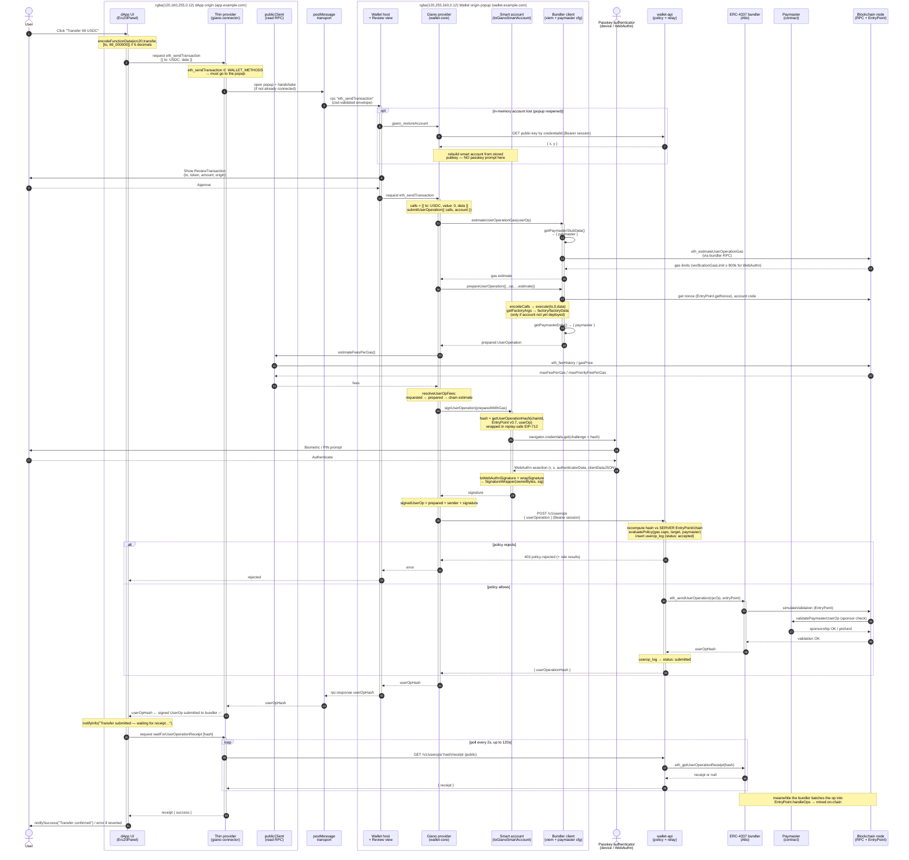

# Transaction submission flow — "Transfer 69 USDC"

This diagram traces a single ERC-20 transfer through the Giano two-origin, ERC-4337
stack: from the button click in the sample dApp (`services/custom-example`) to the
moment the signed UserOperation is accepted by the bundler, and on to the receipt.

Key properties visible in the flow:

- **Origin isolation.** The dApp bundle ships no WebAuthn, credential, bundler or
  paymaster code. Everything trust-related runs on the **wallet origin** popup and is
  reached only over zod-validated JSON-RPC-over-`postMessage`.
- **Tx → UserOp.** `eth_sendTransaction` is repackaged into an EntryPoint v0.7
  UserOperation inside the wallet (`wallet-core` provider), gas-estimated and prepared
  against the bundler/paymaster, signed by the passkey, then relayed.
- **Policied relay.** The signed op is not sent straight to the bundler by the browser;
  it goes through **wallet-api**, which recomputes the hash against its *own* EntryPoint,
  runs policy, logs, and only then forwards to the bundler.
- **Sponsorship.** The paymaster (here the permissive testing paymaster, keyed by
  `config.paymasterAddress`) is attached during gas estimation / preparation so the op
  is gas-sponsored.

Code anchors: `Erc20Panel.tsx` · `create-giano-wallet-provider.ts` (thin SDK) ·
`wallet-transport` client/host · `wallet-web/src/host.ts` + `wallet.ts` ·
`wallet-core/src/provider.ts` · `account/toGianoSmartAccount.ts` ·
`create-wallet-api-injection.ts` · `wallet-api/src/routes/userops.ts` + `services/bundler.ts`.

## Notes on the two submission paths

`wallet-core`'s `submitUserOperation` has **two** branches (`provider.ts`):

- **With the wallet-api injection hook (shown above, the default for `wallet-web`)** —
  the provider estimates + prepares + signs locally, then hands the *signed* op to
  `injection.submitUserOperation`, which `POST`s to `wallet-api`. The bundler is only
  ever reached by the backend, after policy. The dApp never holds a bundler URL.
- **Without the hook** — the provider calls `bundler.sendUserOperation(userOpRequest)`
  directly (viem's account-abstraction client builds, signs and submits in one call).
  This is the embedded/no-backend path.

The paymaster is attached purely by the bundler client's `getPaymasterStubData` /
`getPaymasterData` (configured in `wallet.ts` from `config.paymasterAddress`). The
on-chain sponsorship decision (`validatePaymasterUserOp`) happens at bundler
validation / EntryPoint execution time, not in the browser.
