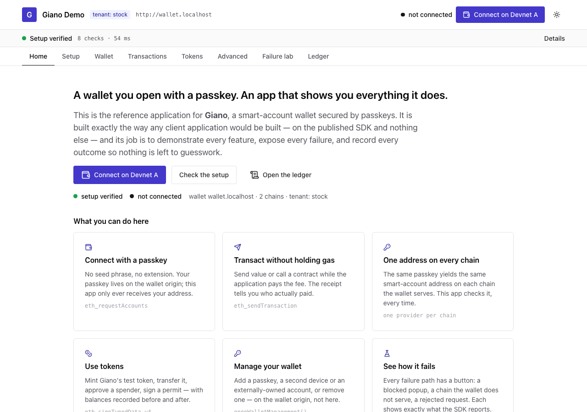
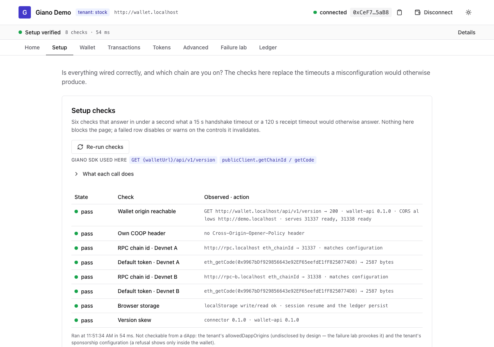
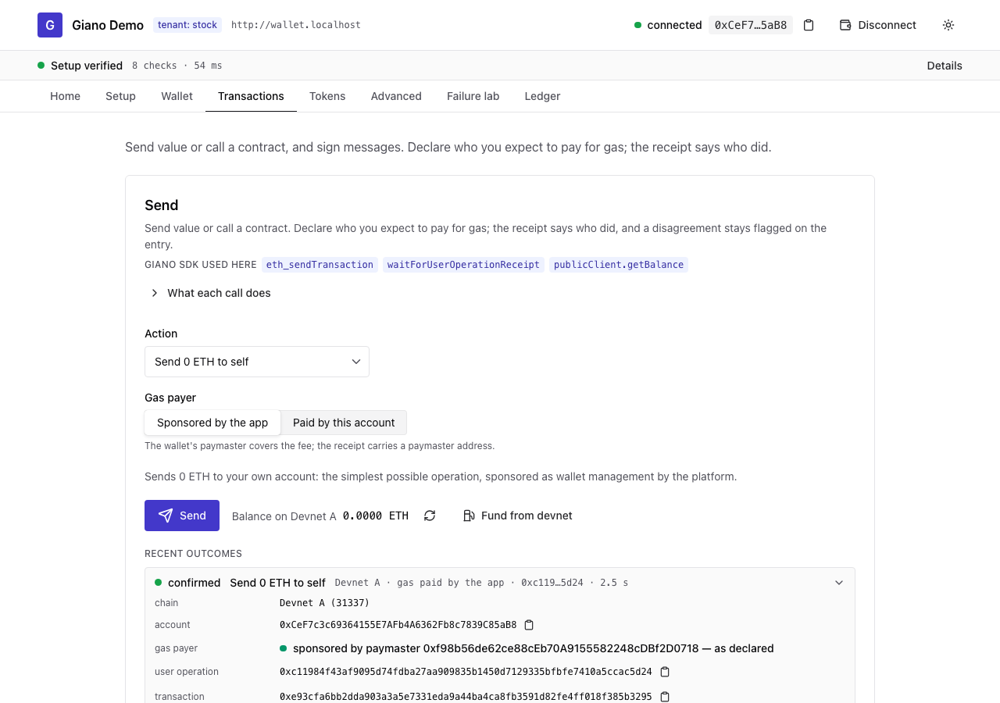
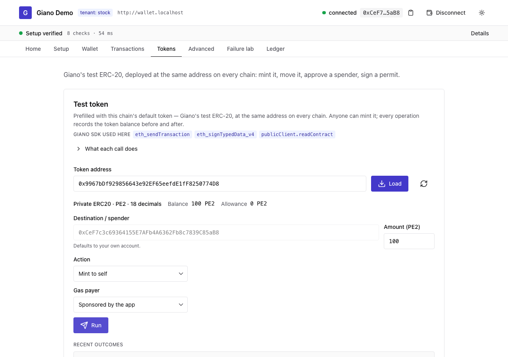
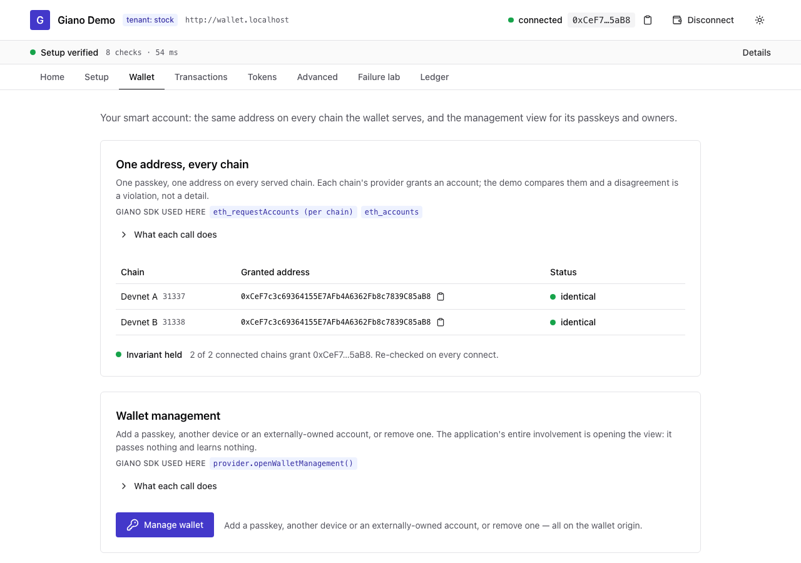
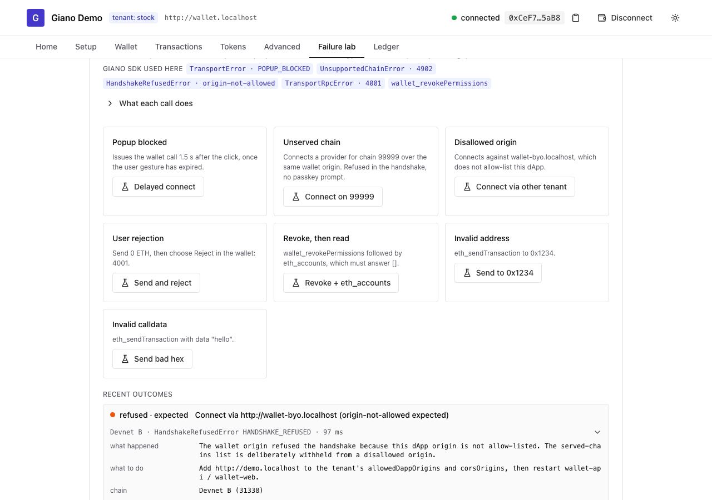
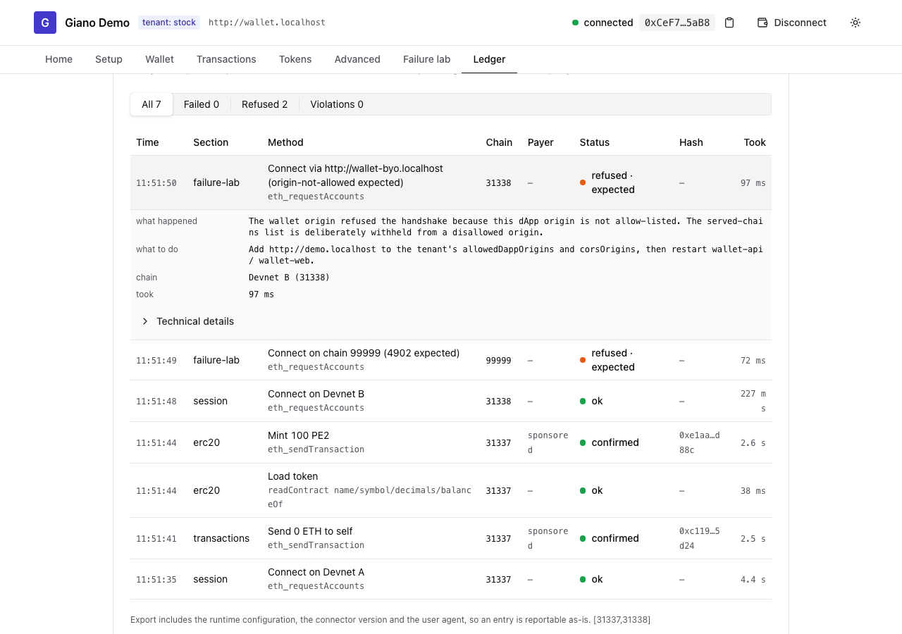

# Giano reference dApp

The reference integration of the **thin two-origin Giano SDK**, built with Vite + React + Chakra UI.
Its job is to behave like any client application — published packages only, no privileges — and to
**challenge Giano**: every SDK method is reachable, every failure path is a control, and every outcome
is recorded with its on-chain evidence so an issue is reportable from what is on screen.

The code here is what [`specs/DEVELOPER-GUIDE.md`](../../specs/DEVELOPER-GUIDE.md) §4 and
[`specs/INTEGRATION.md`](../../specs/INTEGRATION.md) §9 describe. A divergence between the two is a
defect in one of them. Requirements and decisions: [`specs/DEMO-REQUIREMENTS.md`](../../specs/DEMO-REQUIREMENTS.md),
[`specs/DEMO-SPECS.md`](../../specs/DEMO-SPECS.md).

## What is on the page

| Card | Exercises | How to make it fail on purpose |
| --- | --- | --- |
| **Preflight** | Load-time checks (one per concern, plus one per chain and default token): wallet origin reachable + CORS, this page's COOP header, RPC `eth_chainId` per chain, default token code, browser storage, connector vs wallet-api version | Point a chain's `rpcUrl` at the other chain's node; serve the page with `Cross-Origin-Opener-Policy: same-origin`; leave the dApp origin out of the tenant's `corsOrigins` |
| **Chain** | Chain selection = provider selection (`createGianoWalletProvider` per chain), `supportedChainIds`, `chainId`, `eth_chainId`, `wallet_switchEthereumChain` / `wallet_addEthereumChain` (4200 expected), provider options `walletApiPath` / `storage` / `sdkVersion` | Add a chain the wallet does not serve (4902); set a served chain whose node is down (4901); set `walletApiPath` to something wrong |
| **Identity** | One passkey, one address on every served chain, asserted from what each provider grants | Connect on two chains served by deployments with different factory addresses — the banner and a `violation` ledger row appear |
| **Transactions** | `eth_sendTransaction` → `waitForUserOperationReceipt`; declared vs actual gas payer from the receipt's `paymaster`; native balance deltas; "keep waiting" on receipt timeout | Declare *paid by this account* with no balance (AA21); call the unlisted contract (refused in the wallet, arrives as 4001 — see G5); declare self-paid on a sponsored chain (payer mismatch flag) |
| **Signing** | `personal_sign`, `eth_sign`, `eth_signTypedData_v4` with editable typed data | Invalid typed-data JSON; reject in the wallet |
| **Raw user operation** | `eth_prepareUserOperation` → `eth_signUserOperation` → `eth_sendSignedUserOperation`, each payload inspectable; `signed_eth_call` | Call `signed_eth_call` without `to`/`data` |
| **ERC-20** | Default token per chain (Giano's test ERC-20, same CREATE2 address everywhere), `mint`, `transfer`, `approve`, EIP-2612 permit signature, token balance deltas | Load a token without `nonces()` and ask for a permit (no popup, clean entry); a chain without a default token |
| **Wallet management** | `openWalletManagement()` — the app passes nothing and learns nothing | Any returned data is a violation |
| **Adapters** | wagmi `createGianoConnector` (connect, `switchChain` → `UnsupportedChainSwitchError`, send + `waitForUserOperationReceipt`) and RainbowKit `giano()` | `switchChain` succeeding would be the finding |
| **Failure lab** | Popup blocked (call after the gesture expired), unserved chain, disallowed origin (`origin-not-allowed` against the other tenant), user rejection, revoke then `eth_accounts`, invalid address, invalid calldata | These are the failures |
| **Ledger** | Every action with method, params, chain, wallet origin, hashes, receipt, balances, typed error, duration. Persists across reloads (per wallet origin). Capped at 500 entries: past the cap the oldest are evicted and the eviction count is shown. Export JSON copies everything a bug report needs | `Clear` is the only other way out |
| **Events** | `connect`, `accountsChanged`, `chainChanged`, `disconnect` as the provider emitted them | |

Under the header: the **preflight verdict** in one line, and a **jump bar** to every card. A 4900
`disconnect` raises a reconnect prompt in the header.

## Screenshots

| Home | Setup checks and chain | Transactions |
| --- | --- | --- |
|  |  |  |

| Tokens | One address on every chain | Failure lab | Ledger |
| --- | --- | --- | --- |
|  |  |  |  |

## Run it

The wallet stack must be running. Bring up the E2E stack (two tenants, two chains, wallet origins,
wallet-api, bundlers, devnets), register the names, then start the dApp on its **own** names:

```sh
# from the repo root — see specs/DEVELOPER-GUIDE.md §3
docker compose --profile portless -f deploy/docker-compose.e2e.yml up --build
pnpm -F @appliedblockchain/giano-e2e portless:up

pnpm demo:stock   # http://demo.localhost      wallet http://wallet.localhost
pnpm demo:byo     # http://demo-byo.localhost  wallet http://wallet-byo.localhost (needs `pnpm -F @appliedblockchain/giano-e2e wallet-byo`)
```

`demo.localhost` / `demo-byo.localhost` are distinct from the Playwright fixture's `app.localhost` /
`app-byo.localhost` on purpose: the two used to share ports and the suite would silently adopt this
app instead of the fixture. Both sets of origins are allow-listed by the E2E stack.

`.env.development` holds the defaults for the local stack; override in `.env.local` (git-ignored). Both use the **same `GIANO_*` names as the container**.

## Configuration (the container contract)

One image serves every deployment and both tenant shapes. `docker/entrypoint.sh` renders
`/config.js` at container start from the environment — nothing is baked in at build time, and the
post-build scan fails the build if a `VITE_*` value, `navigator.credentials` or hand-written CSS
reaches `dist/`.

| Variable | Required | Meaning |
| --- | --- | --- |
| `GIANO_WALLET_URL` | yes | The **tenant's** wallet origin. Each dApp is pinned to exactly one. |
| `GIANO_CHAINS` | yes | JSON array of `{ chainId, name, rpcUrl, explorerUrl?, defaultToken? }`. `rpcUrl` is browser-facing: a public endpoint, or `/rpc/<chainId>` (below). |
| `GIANO_RPC_UPSTREAM_<chainId>` | no | Keyed provider URL for that chain, proxied same-origin at `/rpc/<chainId>`; the key never reaches the browser or the CSP header. |
| `GIANO_OTHER_WALLET_URL` | no | A wallet origin that does **not** allow-list this dApp — enables the failure lab's disallowed-origin control. |
| `GIANO_APP_LABEL` | no | Free-text tag beside the title, to tell two instances apart. |
| `GIANO_CSP_CONNECT_SRC` | no | Override of the CSP `connect-src` list the entrypoint composes (every RPC origin + the wallet origins). |

**Deprecated for one release**, converted to `GIANO_CHAINS` with a log line and refused alongside
it: `GIANO_CHAIN_ID`, `GIANO_CHAIN_NAME`, `GIANO_RPC_URL`, `GIANO_CHAIN_B_ID`, `GIANO_CHAIN_B_NAME`,
`GIANO_RPC_B_URL`, `GIANO_TEST_ERC20`, `GIANO_RPC_UPSTREAM`.

The browser validates the rendered configuration (`src/config.ts`) and renders a configuration-error
screen naming the invalid fields instead of constructing any provider.

Three things the wallet stack must know about this origin, or the demo will tell you it does not:
the dApp origin in the tenant's `allowedDappOrigins` (else `origin-not-allowed`), in its `corsOrigins`
(else receipts cannot be read — the preflight's first row), and **no** `Cross-Origin-Opener-Policy:
same-origin` on this page (else the popup handshake times out — the preflight's second row).

## Rules this code lives by

- **Published surface only.** Imports of `@appliedblockchain/*` other than the connector, and any
  relative import leaving `src/`, fail lint (`eslint.config.js`). The connector is `workspace:^`
  until it is published to GitHub Packages; the import path does not change.
- **No custom CSS.** No stylesheets, no `css` prop, no `style` attribute — Chakra components and the
  tokens in `src/theme.ts` (the only place brand appears). Lint-enforced; RainbowKit's own stylesheet
  is the one allowed import.
- **Every action goes through `runAction`** (`src/lib/run.ts`): the ledger is the record; there are
  no toasts.

## Reading and exporting the ledger

Click a row to expand it. **Export JSON** copies the whole ledger plus the runtime configuration,
the connector version and the user agent — attach that to a bug report. Entries survive reloads
(browser storage, keyed by wallet origin); entries still pending when the page unloads are marked
`timed out`.

## Known Giano gaps this demo can only surface, not fix

- A sponsorship refusal in the wallet reaches the dApp as a bare `4001`, indistinguishable from a
  user rejection; the demo annotates the entry and points at the wallet console (G5).
- There is no dApp-side way to request an unsponsored operation on a chain the wallet sponsors; the
  demo declares the expected payer and attributes the actual one from the receipt (G1).
- The tenant's dApp allow-list is not discoverable before connecting; the failure lab provokes the
  refusal instead (G6).
- wagmi's default mount-time reconnect makes the Giano connector issue a second `eth_requestAccounts`,
  which blocks every other request; the Adapters card sets `reconnectOnMount={false}` (G7).
