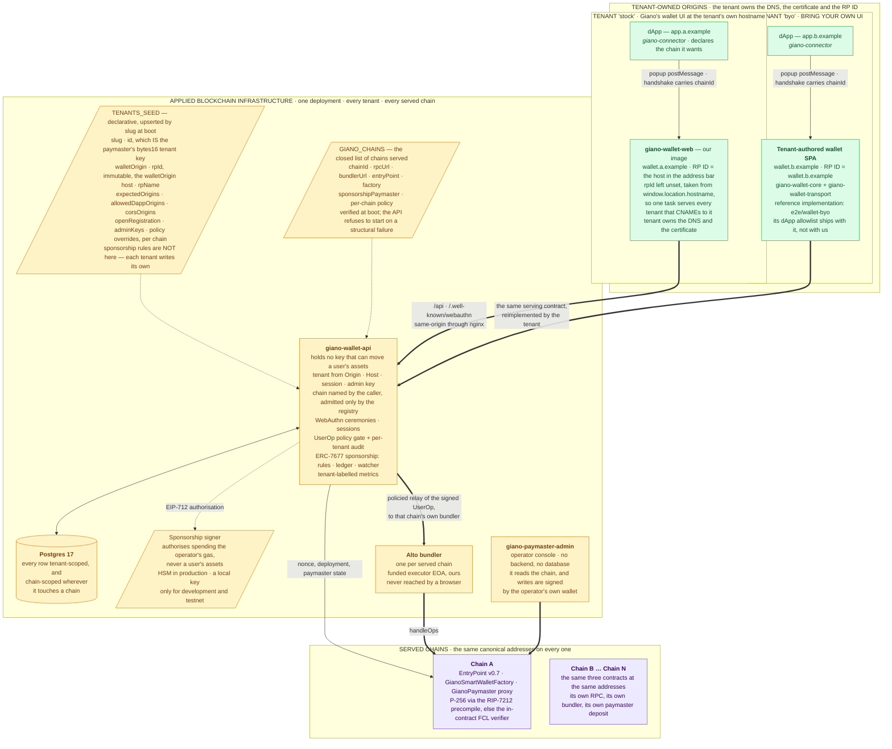

# Giano — system architecture

This document is the **map**: the whole system on one page, at the altitude where the parts and the
boundaries between them are visible and nothing else is. It exists so that a reader who has to touch
one part can see what the others assume of it.

It is deliberately minimal. The **why** lives in
[`BUSINESS-REQUIREMENTS.md`](./BUSINESS-REQUIREMENTS.md); the **how**, in full, lives in the
work-stream specifications — [`MULTICHAIN_SPECS.md`](./MULTICHAIN_SPECS.md),
[`PAYMASTER-SPECS.md`](./PAYMASTER-SPECS.md), [`DEV-INFRASTRUCTURE.md`](./DEV-INFRASTRUCTURE.md) —
and the day-to-day in [`DEVELOPER-GUIDE.md`](./DEVELOPER-GUIDE.md). Where this document and one of
those disagree, the specification is right and this one is stale.

Status: **draft.** It describes the system as built, not as planned; [§8](#8-what-is-not-built-yet)
lists what is missing.

---

## Contents

1. [The shape of the system](#1-the-shape-of-the-system)
2. [The deployment](#2-the-deployment)
3. [The parts](#3-the-parts)
4. [What is decided from what](#4-what-is-decided-from-what)
5. [The path a transaction takes](#5-the-path-a-transaction-takes)
6. [Isolation](#6-isolation)
7. [Deployment profiles](#7-deployment-profiles)
8. [What is not built yet](#8-what-is-not-built-yet)

---

## 1. The shape of the system

Giano is a self-custodial smart-contract wallet that a user opens with a passkey, embedded in
someone else's application. Three properties determine every structural decision in it, and each one
costs something visible in the diagram below.

**The credential is isolated on its own origin.** Passkey ceremonies, signing and consent happen on a
*wallet origin* that is not the application's, and the application reaches it only through an
origin-pinned `postMessage` channel to a popup. This is what makes a compromised dApp unable to
obtain a signature the user did not approve — and it is why there are two browser contexts in every
integration rather than one library.

**Nothing on a server can sign.** The backend runs ceremonies, keeps records, decides policy and
relays; the authority to move assets exists only in the device credential. The one key the
deployment does hold — the sponsorship signer — can authorise *spending the operator's own gas
budget*, never a user's assets, and belongs in an HSM for exactly that reason.

**A deployment is configured, never forked.** Which chains are served, who the tenants are, what
each may sponsor: all of it is declarative configuration read at boot or rows written through an
admin key. A client who has to fork cannot take upgrades.

---

## 2. The deployment

Two tenants are drawn because there are two ways to be one: `stock` takes Giano's wallet UI at its
own hostname, `byo` writes its own against the same packages and the same backend. The backend
cannot tell them apart, and that is the point.

Three things in that picture are load-bearing and easy to lose.

**The RP ID is the tenant's hostname, never ours.** A passkey binds to the host in the address bar,
so the tenant's wallet hostname is the relying party even when the container answering it is one we
run and share. `rpId` is therefore immutable per tenant: changing it orphans every passkey created
against it, and nothing in the system can undo that.

**Tenant and chain are resolved per request, never per container.** One `wallet-api` process, one
`wallet-web` task, N relying parties and N chains. Nothing tenant-specific or chain-specific is held
in process state, which is why onboarding a tenant costs a DNS record, a certificate and a row —
and adding a chain costs a redeploy, but not a second deployment.

**The bundler is ours and is not a market.** No third party ever sees these operations; the
`wallet-api` policy gate is the only thing standing between a signed UserOperation and submission.
Removing the bundler in favour of direct `EntryPoint` submission has been analysed
([`BUNDLERLESS-SUBMISSION-REPORT.md`](../BUNDLERLESS-SUBMISSION-REPORT.md)) and not done.

---

## 3. The parts

**Published packages** — what an integrator installs.

| Package | Responsibility |
|---|---|
| `giano-connector` | The thin dApp SDK. An EIP-1193 provider plus wagmi and RainbowKit adapters; answers reads locally and sends everything requiring authority to the popup. Declares the chain and refuses a session granted on another. Contains no WebAuthn, credential or bundler code. |
| `giano-wallet-transport` | The popup protocol: a versioned, zod-validated JSON-RPC-over-`postMessage` envelope, origin-pinned on both ends, with chain negotiation in the handshake and a first-class refusal. |
| `giano-wallet-core` | The wallet-origin engine: the passkey smart account, per-chain provider, ERC-7677 paymaster client, and the injection seam through which it reaches `wallet-api`. |
| `giano-contracts` | Solidity sources, generated ABIs, the chain-descriptor type, and the address registry — including the frozen `CANONICAL_FACTORY` and `CANONICAL_IMPLEMENTATION`. |
| `giano-paymaster-sdk` | Reads the paymaster's entire state and administers it on-chain; the caller supplies the signer, and every write is simulated first. Ships the `giano-paymaster` CLI. |

**Services** — what a deployment runs.

| Service | Responsibility |
|---|---|
| `giano-wallet-api` | The only stateful service. WebAuthn ceremonies, sessions, the credential and wallet registry, the UserOp policy gate and its audit log, the ERC-7677 sponsorship service with its rules engine, ledger, signer and chain watcher, and the per-tenant admin API. Serves `/.well-known/webauthn` for related-origin passkey sharing. |
| `giano-wallet-web` | The stock wallet origin: passkey ceremonies, the consent screens, the sponsorship refusal UI, and a same-origin nginx proxy to `/api`, `/rpc` and `/bundler`. Its RP ID comes from the browser's own hostname. |
| `giano-paymaster-admin` | The operator console. It reads the paymaster contract and nothing else — no backend, no database, no cache that could be wrong about solvency. |
| `giano-bundler` | Pinned Alto, one instance per served chain, with its own funded executor account. |
| `giano-devnet`, `giano-contracts-deployer` | An instant-boot anvil with the contracts pre-baked, and the deployer that puts them on a real chain. |

**On-chain** — the same three at the same addresses on every served chain.

`GianoSmartWallet` is an ERC-4337 account whose owners are P-256 passkey public keys or plain ECDSA
addresses, behind a UUPS proxy so it upgrades without changing address.
`GianoSmartWalletFactory` derives that address by CREATE2 from the owner set alone, so it is known
before the first transaction and identical on every chain. `GianoPaymaster` holds a per-tenant
balance and a treasury behind a UUPS proxy, verifies an EIP-712 authorisation from the sponsorship
signer, and debits gas plus fee plus overhead from the sponsoring tenant and nobody else.

---

## 4. What is decided from what

Every question the system has to answer on a request is answered from exactly one source, and the
sources do not overlap. This table is the shortest complete statement of the trust model.

| Question | Decided from | Enforced by |
|---|---|---|
| Which tenant? | `Origin` for ceremonies; `Host` for `/.well-known/webauthn`; the session for bearer routes; the admin key for admin routes | Fail-closed: no tenant is `403`, an unknown host is `404`. A session whose tenant contradicts the `Origin` is rejected and counted. |
| Which chain? | The caller names it — request body, ERC-7677 params, or query — and may omit it only when exactly one chain is configured | The chain registry, built and structurally verified at boot. Unknown is `400`, unreachable is `503`. |
| Which wallet? | The passkey. Its public key is the owner; the address is CREATE2-derived from the owner set | The chain: the account verifies the signature against its own owner list. |
| May this operation be relayed? | The tenant's policy, merged from deployment defaults, chain descriptor, tenant base and tenant per-chain overrides | The policy gate, before the bundler ever sees the operation; every decision is written to the audit log. |
| Should this be sponsored, and from whose money? | The tenant's sponsorship rules — deny by default, an explicit contract and function allowlist, a per-transaction cap — against `balance − reserved` | The rules engine off-chain, and the paymaster contract on-chain as a backstop that can only ever debit the tenant named in the authorisation. |
| Does the user agree? | The user, on the wallet origin, having been shown what the operation does, who asked and on which chain | The consent gate: no signature leaves without it, and a refusal is a typed outcome the dApp can handle, not a failure. |

The asymmetry is deliberate. A caller may *name* a tenant, a chain or a budget at any point; only
configuration ever *admits* one, and everything the chain will later verify is computed from the
admitted value rather than the named one.

---

## 5. The path a transaction takes

1. The dApp calls `eth_sendTransaction` on the connector's provider. The connector opens the popup
   and hands the request to the wallet origin over the pinned transport; the session already names
   the chain, granted at handshake.
2. The wallet origin's runtime for that chain asks the sponsorship service for stub paymaster data.
   The rules engine evaluates the candidate operation against the tenant's configuration and its
   available balance, and answers with a stub or a typed refusal. **A refusal is shown before the
   approve button exists** — the user is never asked to approve something that cannot be paid for.
3. The consent screen renders what the operation does, which application asked, and on which chain.
   The user approves.
4. The runtime builds the operation — nonce and gas estimates from that chain's bundler, factory
   data if the account is not yet deployed — and takes real paymaster data: the service re-evaluates
   authoritatively, reserves the maximum charge against the tenant's balance, and signs an EIP-712
   authorisation bound to the chain, the paymaster, the sender and the nonce.
5. The passkey signs the whole operation. This is the only signature that can move anything, and it
   is produced on the user's device, on the wallet origin, after consent.
6. `wallet-api` receives the signed operation, resolves the chain from the registry, hashes it
   against the *resolved* chain rather than the request body, runs the policy gate, records the
   decision, and relays to that chain's bundler.
7. The bundler submits `handleOps`. The EntryPoint validates the account's signature and the
   paymaster's authorisation, executes, and calls back into the paymaster, which debits gas plus fee
   plus overhead from the tenant and credits the fee to the treasury.
8. The watcher ingests the paymaster's events, settles the reservation against what was actually
   spent, reconciles the ledger against the on-chain deposit, and exports the solvency invariant as
   a metric. A breach is an insolvency, not a warning.

---

## 6. Isolation

Some of it the browser gives for free, and some of it the backend has to enforce. Both halves are
required; neither is sufficient.

**By the browser, structurally.** Distinct RP IDs mean a passkey created for one tenant cannot be
asserted for another — not "is refused", but cannot be offered. Cookies, `localStorage` and session
storage are per origin, so two tenants sharing one `wallet-web` container share nothing. The dApp
cannot script the wallet origin, and the transport pins both ends to expected origins.

**By the backend, deliberately.** Users, credentials, challenges, sessions, ROR origins, relay audit
rows, sponsorship rules, balances, reservations and settlements are all keyed on tenant, with the
uniqueness constraints scoped per tenant rather than globally. A session presented against another
tenant's origin, and a challenge redeemed under another tenant, are both rejected with a generic
error — no enumeration oracle — and counted on a per-tenant metric so the attempt is visible.
Sponsorship balances never pool: per tenant, and per chain within that tenant.

**What is not isolated, by design.** Every tenant sees every configured chain, and shares the
EntryPoint, the factory, the bundlers and the paymaster contract. Session and challenge TTLs and the
ceremony rate limit are deployment-wide. The relay rate limit is per tenant but shared across that
tenant's chains.

---

## 7. Deployment profiles

The same artifacts serve both, and single-chain single-tenant is the degenerate case of the general
shape rather than a separate build.

| | On-premise, the primary model | Standalone service |
|---|---|---|
| Who runs it | The client, in their own estate | Applied Blockchain, or a client for several of their own applications |
| Tenants | One | Several unrelated ones, isolated per [§6](#6-isolation) |
| Chains | Typically one: `CHAIN_ID`, `RPC_URL`, `BUNDLER_URL` and nothing else. No chain picker, no `chainId` on any request | A `GIANO_CHAINS` list; the dApp names its chain at handshake |
| Contracts | Canonical, or the client's own instances — a choice that is not reversible in practice, because the two are different wallet universes | Canonical |
| Sponsorship signer | HSM in production | HSM in production |
| Data | Entirely in the client's infrastructure, in a jurisdiction of their choosing | The operator's |

Adding a chain is a deployment action, never an admin API call, and it is gated by the
[chain-adoption checklist](./CHAIN-ADOPTION.md) — the canonical EntryPoint, the canonical factory
and implementation, a funded executor, a staked and funded paymaster. Steps skipped there fail
silently: contracts that work perfectly, at addresses the user's passkey does not control.

---

## 8. What is not built yet

Named here rather than left to be discovered. The requirement numbers are
[`BUSINESS-REQUIREMENTS.md`](./BUSINESS-REQUIREMENTS.md)'s.

- **Recovery (BR-33).** A user who loses the device holding their passkey loses the wallet. This is
  the largest gap in the product, and the mechanism is still an open question.
- **Credential management (BR-32).** A wallet is created with one credential; the user can neither
  see the owner set nor add a second device.
- **Balances and history in the wallet UI (BR-34).** The wallet appears to ask for approval and is
  not yet somewhere a user can go and look.
- **A tenant-onboarding interface (BR-35).** Tenants are provisioned only through `TENANTS_SEED`;
  there is no tenant CRUD API and no operator UI for it. The paymaster console covers gas, not
  onboarding.
- **Multi-party approval (BR-36).** The account admits several owners; there is no threshold rule.
- **Branding (BR-18, partial).** A tenant's `branding` is accepted, validated and stored, and no
  code reads it. The stock wallet UI is Giano-branded for every tenant it serves.
- **Host-resolved tenant config.** The stock `wallet-web` takes its dApp allowlist and brand from a
  per-*container* `config.json`, so two tenants sharing one container would enforce the union of
  their allowlists on both hostnames — and `wallet-api` stores `allowed_dapp_origins` per tenant but
  reads it nowhere, so there is no server-side backstop. Until a `Host`-resolved config endpoint
  lands beside `/.well-known/webauthn`, a shared `wallet-web` safely serves one tenant, and a second
  tenant must bring its own UI. See [`DEV-INFRASTRUCTURE.md` §15.4](./DEV-INFRASTRUCTURE.md).
- **Owner-set convergence across chains.** An owner change applies to the chain it was made on. The
  account already supports chain-independent replay of owner operations; the job that uses it, and
  the paymaster domain change it depends on, are not built.
