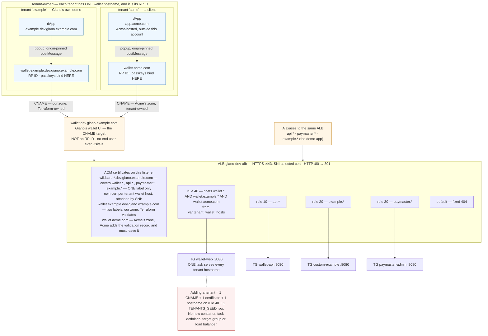
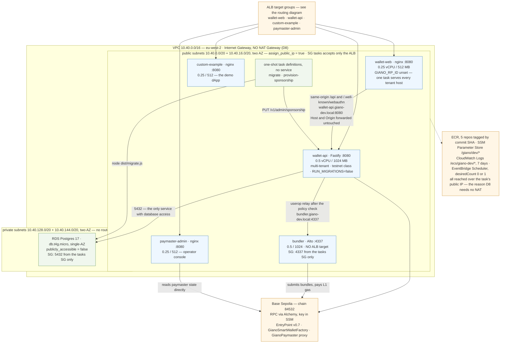
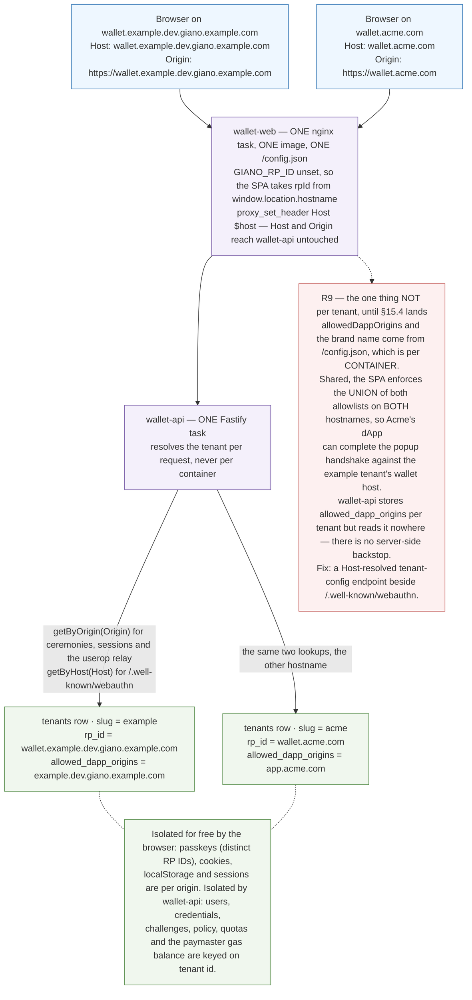

# Giano dev environment — infrastructure specification

This document specifies the AWS infrastructure for a **shared development deployment** of Giano,
and the Terraform that provisions it. It is the **what and how** for the
[`infra/terraform`](../infra/terraform/) tree, whose operator-facing short form is
[`infra/terraform/README.md`](../infra/terraform/README.md).

The target is a permanently-available, internet-reachable Giano stack on **Base Sepolia**, with
real hostnames, real passkeys and real gas sponsorship — the thing a developer, a designer or a
prospective integrator can be pointed at without running `docker compose` first.

Status: **draft for review.** Every decision taken is recorded in [§1.3](#13-decisions) with its
alternative. [§15](#15-repository-changes-this-requires) lists the four code changes the
deployment needs that are not infrastructure at all, and [§17](#17-risks-and-open-items) the
questions that remain.

---

## Contents

1. [Scope and decisions](#1-scope-and-decisions)
2. [Architecture](#2-architecture)
3. [Naming and conventions](#3-naming-and-conventions)
4. [Network](#4-network)
5. [DNS, TLS and ingress](#5-dns-tls-and-ingress)
6. [Chain prerequisites](#6-chain-prerequisites)
7. [The services](#7-the-services)
8. [Data](#8-data)
9. [Secrets and identity](#9-secrets-and-identity)
10. [Images and delivery](#10-images-and-delivery)
11. [Terraform](#11-terraform)
12. [Cost](#12-cost)
13. [Scheduling](#13-scheduling)
14. [Observability](#14-observability)
15. [Repository changes this requires](#15-repository-changes-this-requires)
16. [Bring-up runbook](#16-bring-up-runbook)
17. [Risks and open items](#17-risks-and-open-items)
18. [Non-goals and the path to staging](#18-non-goals-and-the-path-to-staging)

---

## 1. Scope and decisions

### 1.1 What is being built

One AWS account region hosting one Giano deployment, serving **five public hostnames** from **one
load balancer**, backed by **five Fargate services** and **one RDS instance**, provisioned entirely
by Terraform from a root module in this repository.

The hostnames divide by **owner**, and that division is the architecture:

```
# Giano's own infrastructure — shared by every tenant, and never a relying party
wallet.dev.giano.<domain>          the shared wallet UI. The CNAME target. NOT an RP ID.
api.dev.giano.<domain>             wallet-api (also proxied same-origin under each
                                   wallet host's /api)
paymaster.dev.giano.<domain>       the paymaster operator console

# Tenant "example" — our own demo, and a first-class tenant in every other respect
example.dev.giano.<domain>         the app itself — services/custom-example
wallet.example.dev.giano.<domain>  its wallet origin — passkeys live here (RP ID)
                                   CNAME → wallet.dev.giano.<domain>
```

**Giano serves one wallet UI; each tenant points its own hostname at it with a `CNAME`.** That
tenant hostname — not Giano's — is the tenant's WebAuthn RP ID, because the browser binds passkeys
to the host in the address bar. `wallet.dev.giano.<domain>` is therefore infrastructure that no end
user ever visits: it terminates the shared UI and never becomes a relying party.

The example tenant is shaped as **its own domain with a wallet subdomain underneath it**, because
that is what a real client looks like — `example.dev.giano.<domain>` and
`wallet.example.dev.giano.<domain>` stand in for `acme.com` and `wallet.acme.com`. Naming it flat as
`wallet-example.dev.giano.<domain>` would have let it ride the existing wildcard certificate, and
dev would then never exercise the one onboarding step that costs a client anything
([§5.2](#52-certificate)). Two labels deep is deliberate.

One wallet-web task serves every tenant, so adding a tenant costs a DNS record, a certificate and a
database row — not another container. What makes that safe rather than merely functional is
[§15.4](#154-a-host-resolved-tenant-config-endpoint), which is a prerequisite.

### 1.2 What this is not

Not staging, not production. Single-AZ, single-replica, no WAF, no multi-region, no disaster
recovery, no HSM. It is sized and priced as a development environment and its Terraform modules are
written so a staging root module can reuse them later ([§18](#18-non-goals-and-the-path-to-staging)),
but nothing here should be mistaken for a production posture.

### 1.3 Decisions

| # | Decision | Chosen | Alternative rejected | Why |
|---|---|---|---|---|
| D1 | Compute | **ECS Fargate** | EC2 + compose; EKS; App Runner | No control-plane fee, no hosts to patch, task definitions map ~1:1 onto the existing compose services. EKS costs $73/mo before a pod runs. |
| D2 | Chain | **Base Sepolia (84532)** | Self-hosted anvil devnet | Persistent state and a realistic chain. The canonical factory and implementation are already registered and deployed there ([§6](#6-chain-prerequisites)). |
| D3 | Bundler | **Self-hosted Alto on Fargate** | Pimlico hosted | `services/bundler` already exists, pinned and env-driven. No third-party account, no shared API key. Costs a funded executor key. |
| D4 | Database | **RDS Postgres 17, `db.t4g.micro`, single-AZ** | Aurora Serverless v2 min-0; Postgres container on EFS | Managed backups for ~$16/mo. Aurora's scale-to-zero is attractive but adds cold-start latency to a stack that is already asleep out of hours (D9). |
| D5 | Region | **`eu-west-2` (London)** | `eu-west-1`; `us-east-1` | Team latency and UK residency, at ~5–10% over Ireland. |
| D6 | DNS/TLS | **Route 53 delegated subdomain + ACM wildcard + one ALB** | CloudFront; one ALB per service | WebAuthn needs a real HTTPS origin and the RP ID is irreversible per tenant. Host-based routing on one ALB saves ~$54/mo over four. |
| D7 | Registry & CI | **ECR + GitHub Actions OIDC** | GHCR with a pull secret | Same-region pulls, no egress, no long-lived AWS credentials and no PAT to rotate. |
| D8 | Egress | **No NAT Gateway** — tasks in public subnets with public IPs | NAT Gateway; VPC interface endpoints | NAT is ~$35/mo plus data processing; three ECR/logs interface endpoints are ~$24/mo. Public IPs cost ~$3.65/mo per running task and are cheapest at this size. RDS stays private. |
| D9 | Cost control | **Scheduled scale-to-zero out of hours** | Always-on; Fargate Spot | Roughly halves compute. Spot was declined — restarts during a working day are more annoying than the saving is worth. |
| D10 | Demo dApp | **`services/custom-example`** | `e2e/dapp` thin fixture; both | The richer demo (multi-owner, ROR, cross-chain, paymaster) is what a deployed environment is *for*. Needs a Dockerfile and runtime config ([§15](#15-repository-changes-this-requires)). |
| D11 | Terraform | **`infra/terraform` in this repo, S3 backend with native locking** | Separate repo; flat root module | Infra versioned with the code it deploys; `use_lockfile = true` removes the DynamoDB table entirely (Terraform ≥ 1.10). |
| D12 | Observability | **CloudWatch Logs, 7-day retention** | Container Insights + Prometheus | `/metrics` is exposed but nothing scrapes it in dev. ~$2/mo. |
| D13 | Sponsorship signer | **`local` key in SSM, `GIANO_DEPLOYMENT_CLASS=testnet`** | `hsm` | The `hsm` path requires an `HsmSignerAdapter` passed to `buildApp`, which the published image does not wire ([§9.3](#93-the-sponsorship-signer-constraint)). `testnet` is the honest deployment class and it is what makes `local` legal. |
| D14 | Tenant wallet hostnames | **One shared wallet-web; tenants `CNAME` to it, one SNI certificate per tenant host** | One wallet-web container per tenant (`DEVELOPER-GUIDE.md` §5.5) | Onboarding a tenant should cost a DNS record and a certificate, not a container, a task definition, a target group and a listener rule. wallet-web already derives its RP ID from `window.location.hostname` when `GIANO_RP_ID` is unset, and wallet-api resolves tenants per request from `Origin`/`Host` — so the shared path needs no new tenancy concept. It does need [§15.4](#154-a-host-resolved-tenant-config-endpoint) before it is safe: today the dApp allowlist is per *container*, which across tenants would become a union ([R9](#17-risks-and-open-items)). |

---

## 2. Architecture

Three views: the hostname-to-container path, the inside of the VPC, and the tenancy mechanism that
D14 rests on. They use `giano.example.com` as a concrete parent domain in place of the `<domain>`
placeholder used elsewhere in this document.

**Two tenants are drawn, and only one of them exists in dev.** `example` is Giano's own demo tenant,
whose hostnames sit inside our Route 53 zone; `acme` stands for a client whose hostnames sit in
theirs. Both get their own wallet certificate and both reach the same wallet-web task through the
same `CNAME`; the *only* difference between them is who creates the DNS records — Terraform for
`example`, Acme for `acme`. Drawing both is what makes that the only difference visible. Dev
provisions `example` alone and must stay single-tenant until
[§15.4](#154-a-host-resolved-tenant-config-endpoint) lands ([R9](#17-risks-and-open-items)); `acme`
is the shape onboarding takes, not a service that is running.

### 2.1 Hostnames, TLS and routing



### 2.2 Inside the VPC



### 2.3 How one wallet UI serves many tenants

The mechanism behind D14. One image, one task, one `/config.json` — and N relying parties, because
every tenant-specific decision is made from a request header rather than from container state.



### 2.4 What is load-bearing

**The RP ID is the tenant's hostname, never Giano's.** `wallet.dev.giano.<domain>` serves the
wallet UI but is not a relying party: no passkey is ever created against it. `GIANO_RP_ID` is
deliberately left **unset** so wallet-web derives its RP ID from the host the browser used —
`services/wallet-web/src/config.ts` resolves `rpId: raw.rpId || window.location.hostname`, which is
the mechanism the whole CNAME model rests on. Passkeys bind to
`wallet.example.dev.giano.<domain>`, the tenant's own hostname. Per-tenant `rpId` is irreversible —
changing it later orphans every passkey created against it. This is the single choice in the whole
document that cannot be undone by `terraform apply`.

**Tenant resolution is per request, not per container.** wallet-api resolves the tenant of a
ceremony from the `Origin` header and of `/.well-known/webauthn` from the `Host` header, and
wallet-web's nginx forwards both untouched (`proxy_set_header Host $host`). One wallet-web task
answering on N tenant hostnames therefore resolves N distinct tenants with no shared state — the
browser's own origin isolation keeps sessions and storage separate for free.

**The bundler has no public listener.** It is reachable only from `wallet-api`'s security group.
The wallet origin never talks to it directly; `wallet-api` relays user operations to it after the
policy check.

**RDS is not reachable from the internet.** Private subnets, no public IP, ingress restricted to
the `wallet-api` security group on 5432. Developer access is via `aws ecs execute-command` into a
running task, not a bastion.

---

## 3. Naming and conventions

Every resource is named `giano-dev-<component>` and carries these tags, applied through the
provider's `default_tags` so no resource can be created without them:

```hcl
default_tags {
  tags = {
    Project     = "giano"
    Environment = "dev"
    ManagedBy   = "terraform"
    Repository  = "appliedblockchain/giano"
  }
}
```

`Environment` is the discriminator a later staging root module varies; nothing else in a module
should hardcode `dev`.

---

## 4. Network

| Resource | Value |
|---|---|
| VPC CIDR | `10.40.0.0/16` |
| Public subnets | `10.40.0.0/20`, `10.40.16.0/20` in two AZs |
| Private subnets | `10.40.128.0/20`, `10.40.144.0/20` in the same two AZs |
| Internet Gateway | yes |
| NAT Gateway | **no** (D8) |
| VPC endpoints | S3 gateway endpoint only (free; makes ECR layer pulls cheaper) |

Two AZs, because RDS requires a subnet group spanning two and an ALB requires two subnets. Only one
AZ carries running tasks in practice.

### 4.1 Security groups

| SG | Ingress | Egress |
|---|---|---|
| `alb` | 443 and 80 from `0.0.0.0/0` | to `tasks` on 8080 |
| `tasks` | 8080 from `alb` | `0.0.0.0/0` (ECR, RPC, SSM, logs) |
| `bundler` | 4337 from `tasks` | `0.0.0.0/0` (Base Sepolia RPC) |
| `rds` | 5432 from `tasks` | none |

Tasks sit in public subnets with `assign_public_ip = true` — the consequence of D8. They are not
*exposed*: the `tasks` security group accepts nothing but the ALB. The public IP exists so the task
can reach ECR, SSM and the Base Sepolia RPC without a NAT Gateway.

---

## 5. DNS, TLS and ingress

### 5.1 Zone

A Route 53 public hosted zone for `dev.giano.<domain>`, delegated from wherever the parent domain
lives with an `NS` record. Terraform owns the child zone and outputs its name servers; the
delegation record in the parent is a **manual one-time step** ([§16](#16-bring-up-runbook) step 2)
because the parent is not managed here.

### 5.2 Certificate

One ACM certificate for `dev.giano.<domain>` and `*.dev.giano.<domain>`, DNS-validated against the
zone above. Validation records are created by Terraform, so `apply` completes without human
intervention once the delegation exists.

**A `CNAME` carries no certificate.** This is the one cost the shared-UI model does not remove: the
ALB must present a certificate valid for the hostname *the browser asked for*, which for a tenant is
their hostname, in their zone. So each tenant host needs its own certificate, attached to the same
HTTPS listener as an additional SNI certificate (`aws_lb_listener_certificate`). ACM picks the
certificate per connection from SNI; the wildcard remains the default.

**The example tenant is deliberately not exempt.** `wallet.example.dev.giano.<domain>` sits *two*
labels under the zone apex and a wildcard matches one, so it is not covered:
`modules/tenant-host` ([§11.1](#111-layout)) issues it a certificate of its own and attaches it by
SNI, exactly as a client's would be. Had it been named flat — `wallet-example.dev.giano.<domain>` —
it would have ridden the wildcard for free, the listener would carry a single certificate, and
step 2 of [§5.5](#55-onboarding-a-tenant-hostname) would stay untested until the first client
arrived. Paying that cost once, in dev, is how the step gets exercised.

Two independent things can put a tenant's wallet host outside the wildcard, and either alone is
enough: **depth** (the example tenant, in our zone) or a **foreign zone** (every real client). The
only difference between them is who creates the ACM validation record — Terraform for a host in our
zone, the tenant for one in theirs ([R10](#17-risks-and-open-items)).

A tenant's *dApp* hostname needs nothing special: `example.dev.giano.<domain>` is one label deep and
rides the wildcard. Only wallet hosts are CNAME targets, and only wallet hosts are RP IDs.

### 5.3 Listener rules

One ALB, one HTTPS listener on 443 carrying the wildcard plus each tenant wallet host's own
certificate ([§5.2](#52-certificate)), one HTTP listener on 80 doing a permanent redirect to HTTPS.
Host-header rules, in priority order:

| Priority | Host | Target group | Health check |
|---|---|---|---|
| 10 | `api.dev.giano.<domain>` | `wallet-api` :8080 | `GET /healthz` |
| 20 | `example.dev.giano.<domain>` | `custom-example` :8080 | `GET /` |
| 30 | `paymaster.dev.giano.<domain>` | `paymaster-admin` :8080 | `GET /` |
| 40 | `wallet.dev.giano.<domain>` **plus every tenant wallet host** — `wallet.example.dev.giano.<domain>`, then one per client | `wallet-web` :8080 | `GET /` |
| — | default | fixed 404 response | — |

The wallet rule is the one that grows, and it is placed **last** of the four. With the explicit
host list below, priority is not load-bearing — no two conditions overlap — so this is purely
defensive: it is the ordering that stays correct if anyone later broadens the wallet condition.
Its condition carries an explicit list of hostnames — Giano's own plus each onboarded tenant's — from
`var.tenant_wallet_hosts` ([§11.4](#114-key-variables)). An ALB host condition accepts up to five
values, so past four tenants Terraform emits additional rules at descending priority against the
same target group.

A wildcard condition (`*.dev.giano.<domain>`) would collapse this to one static rule, and is
rejected: it would silently swallow any future hostname in the zone, and it cannot express a tenant
host that lives outside the zone — which every real tenant's does. An explicit list makes tenant
onboarding a visible diff.

An explicit 404 default, rather than one service silently absorbing unmatched hosts.

`api.*` is published in addition to the same-origin `/api` proxy each wallet hostname serves
through `wallet-web`'s nginx. The proxy is what the browser uses — it is what keeps sessions
same-origin and avoids CORS. The direct hostname exists for the admin API, for the sponsorship
provisioning job and for `curl`.

### 5.4 A records

Four `A` alias records to the ALB — Giano's `wallet.*`, `api.*` and `paymaster.*`, plus the example
tenant's `example.*` — and one `CNAME`, `wallet.example.*` → `wallet.dev.giano.<domain>`.
`dev.giano.<domain>` apex is left unset.

The example tenant's record is a `CNAME` rather than a fifth alias even though Terraform owns both
names and an alias would work identically. The point is that the record is *the same record a
tenant creates in their own zone*: if dev shortcuts it to an alias, the CNAME path — the one thing
this environment exists to rehearse — is never actually exercised.

### 5.5 Onboarding a tenant hostname

The whole per-tenant cost, and the script that dev's own example tenant follows:

| # | Step | Owner | Cost |
|---|---|---|---|
| 1 | Tenant creates `CNAME wallet.<tenant>.com → wallet.dev.giano.<domain>` | tenant DNS | one record |
| 2 | Request an ACM certificate for `wallet.<tenant>.com`; tenant adds the validation `CNAME` ACM asks for | Giano + tenant DNS | free |
| 3 | Attach it to the HTTPS listener as an additional SNI certificate | Terraform | free |
| 4 | Add the hostname to `var.tenant_wallet_hosts` → the §5.3 wallet rule | Terraform | free |
| 5 | Add the tenant to `TENANTS_SEED` and restart wallet-api | operator | one row |

Steps 1 and 2 need the tenant to act, and step 2 needs them to act *again* on certificate renewal
unless the validation `CNAME` is left in place — ACM renews automatically only while that record
resolves. Tell tenants to leave it.

No new container, task definition, target group or load balancer. That is the whole point of D14,
and it is why [§15.4](#154-a-host-resolved-tenant-config-endpoint) has to land first: with the
per-container dApp allowlist that ships today, step 5 would also mean editing every tenant's
allowlist into one shared list.

---

## 6. Chain prerequisites

`wallet-api` verifies at boot that each served chain carries the canonical factory and
implementation at the addresses frozen in `packages/contracts/canonical.ts`, and refuses to start
otherwise. Base Sepolia satisfies this today:

| Contract | Address | On 84532? |
|---|---|---|
| EntryPoint v0.7 | `0x0000000071727De22E5E9d8BAf0edAc6f37da032` | yes (canonical, everywhere) |
| `GianoSmartWalletFactory` | `0x26dCd29390eba3B22BcCbd2143989E5994Ac7050` | **yes** — `ignition/deployments/chain-84532` |
| `GianoSmartWallet` implementation | `0x15cC758f7D3188c2361f6141CEaa9Ab2792bea56` | **yes** — same |
| `GianoPaymaster` proxy | *not frozen; CREATE2 from the fixed salt* | **no** |

### 6.1 The paymaster must be deployed

`gianoAddresses[84532]` carries no `sponsorshipPaymaster`, and there is no `GianoPaymaster` entry in
`ignition/deployments/chain-84532/deployed_addresses.json`. **Deploying it is a prerequisite of this
environment, not part of it.** It is a one-off chain operation performed with the existing tooling,
before the first `terraform apply` that enables sponsorship:

```
pnpm --filter @appliedblockchain/giano-contracts hh:deploy:paymaster --network base-sepolia
pnpm --filter @appliedblockchain/giano-contracts provision:paymaster -- …
```

`GianoPaymaster.ts` takes a `roleAdmin` parameter; for a dev environment that is a developer-held
EOA rather than a timelock. The resulting proxy address is then either committed to
`address-overrides.json` (preferred — it makes the address a reviewed artefact) or passed to
Terraform as a variable.

### 6.2 Funded accounts

Two accounts need Base Sepolia ETH and will need topping up. Both are dev-only keys that must never
have held mainnet value.

| Account | Purpose | Drains when |
|---|---|---|
| Alto executor | submits bundles, pays L1 gas | every sponsored transaction |
| Paymaster deposit | the EntryPoint deposit + stake the paymaster spends from | every sponsored transaction |

The sponsorship signer key ([§9.3](#93-the-sponsorship-signer-constraint)) signs paymaster data and
holds no funds.

A low-balance alarm on either is out of scope for D12; [§17](#17-risks-and-open-items) records it as
the most likely cause of a silently broken environment.

### 6.3 RPC

An Alchemy (or equivalent) Base Sepolia endpoint. The free tier is ample for a dev environment. The
URL embeds the API key, so it is a secret ([§9](#9-secrets-and-identity)), and it is consumed by
`wallet-api`, the bundler and — via CSP `connect-src` — the browser.

Because the browser reaches the RPC directly rather than through the wallet origin's `/rpc` proxy,
the provider must send permissive CORS headers. Alchemy does. If a provider that does not is chosen
later, set `GIANO_RPC_UPSTREAM` on `wallet-web` and point the chain descriptor's `rpcUrl` at
`/rpc` — the nginx template already supports it, and the API key then stays server-side, which is
the better posture anyway.

---

## 7. The services

Five ECS services on one cluster, all Fargate, all `ARM64` (`runtime_platform`) — cheaper per vCPU-
hour and every image in the repo already builds multi-arch in `docker.yml`.

| Service | Image | vCPU / MB | Port | Public | Desired |
|---|---|---|---|---|---|
| `wallet-api` | `giano-wallet-api` | 0.5 / 1024 | 8080 | via ALB | 1 |
| `wallet-web` | `giano-wallet-web` | 0.25 / 512 | 8080 | via ALB | 1 |
| `custom-example` | `giano-example` *(new image)* | 0.25 / 512 | 8080 | via ALB | 1 |
| `paymaster-admin` | `giano-paymaster-admin` | 0.25 / 512 | 8080 | via ALB | 1 |
| `bundler` | `giano-bundler` | 0.5 / 1024 | 4337 | no | 1 |

`wallet-api` gets 1 GB because Fastify plus the viem clients plus the per-chain paymaster watcher is
not comfortable in 512 MB. The nginx images are comfortable in 512 MB with room to spare.

One task per service. Zero redundancy is deliberate: this is a dev environment, and a second task
doubles the largest line in the cost table.

### 7.1 Service discovery

An AWS Cloud Map private DNS namespace `giano-dev.local`, so `wallet-api` reaches the bundler at
`http://bundler.giano-dev.local:4337` and `wallet-web`'s nginx reaches the API at
`http://wallet-api.giano-dev.local:8080`. This replaces compose's service names and is what lets
the existing `GIANO_WALLET_API_UPSTREAM` contract stay unchanged.

### 7.2 `wallet-api`

Single-chain shorthand rather than `GIANO_CHAINS` — one chain is served, and the two shapes are
mutually exclusive by design.

| Variable | Value | Source |
|---|---|---|
| `GIANO_DEPLOYMENT_CLASS` | `testnet` | literal |
| `DATABASE_URL` | `postgres://…` | SSM SecureString |
| `RUN_MIGRATIONS` | `false` — a separate one-shot task runs them | literal |
| `CHAIN_ID` | `84532` | literal |
| `RPC_URL` | Base Sepolia endpoint | SSM SecureString |
| `BUNDLER_URL` | `http://bundler.giano-dev.local:4337` | literal |
| `SPONSORSHIP_ENABLED` | `true` | literal |
| `SPONSORSHIP_SIGNER_KIND` | `local` | literal |
| `SPONSORSHIP_SIGNER_KEY_REF` | 32-byte hex key | SSM SecureString |
| `SPONSORSHIP_PAYMASTER_ADDRESS` | the §6.1 proxy | tfvar |
| `PAYMASTER_WATCHER_ENABLED` | `true` | literal |
| `TENANTS_SEED` | one tenant, below | SSM SecureString (carries `adminKeys`) |
| `METRICS_BEARER_TOKEN` | random | SSM SecureString |
| `LOG_LEVEL` | `info` | literal |

`ENTRYPOINT_ADDRESS` and `FACTORY_ADDRESS` are left unset: 84532 is in the contracts registry and
they default correctly from it. Setting them by hand is how they drift.

The tenant seed:

```json
[{
  "slug": "example",
  "walletOrigin": "https://wallet.example.dev.giano.<domain>",
  "rpId": "wallet.example.dev.giano.<domain>",
  "rpName": "Giano Example",
  "allowedDappOrigins": ["https://example.dev.giano.<domain>"],
  "corsOrigins": ["https://example.dev.giano.<domain>"],
  "openRegistration": true,
  "adminKeys": ["<generated>"]
}]
```

The tenant is the **example app**, not the environment: its `walletOrigin` is the CNAMEd tenant
hostname, and `rpId` equals that host because `validateTenantSeed` requires it to
(`services/wallet-api/src/services/tenants.ts` — decision D1 there). Note that the CNAME model is
fully compatible with that strict rule: the RP ID is still the wallet origin's own host, just the
tenant's rather than Giano's. Nothing in `wallet.dev.giano.<domain>` appears in this seed, and
nothing should — a tenant row for Giano's own serving hostname is how a passkey ends up bound to
infrastructure.

`openRegistration: true` is defensible here and only here: anyone who can reach the environment is
meant to be able to create a wallet on it. It is the field to turn off first if the hostname ever
leaks beyond the team.

`rpId` is irreversible per tenant. See [§5.1](#51-zone) and [§17](#17-risks-and-open-items).

### 7.3 `wallet-web`

Single-chain shorthand again. The browser talks to the RPC and the bundler through… nothing: the
RPC directly (CORS, §6.3) and the bundler *not at all* — sponsorship mode `service` routes user
operations through `wallet-api`, which is what keeps the bundler private.

| Variable | Value |
|---|---|
| `GIANO_CHAIN_ID` | `84532` |
| `GIANO_RPC_URL` | Base Sepolia endpoint (SSM) |
| `GIANO_BUNDLER_URL` | `https://api.dev.giano.<domain>/v1/userops` — see note |
| `GIANO_WALLET_API_UPSTREAM` | `http://wallet-api.giano-dev.local:8080` |
| `GIANO_RP_ID` | **unset** — derived per request from the host the browser used |
| `GIANO_ALLOWED_DAPP_ORIGINS` | `["https://example.dev.giano.<domain>"]` — the union across tenants, until [§15.4](#154-a-host-resolved-tenant-config-endpoint) |
| `GIANO_SPONSORSHIP_MODE` | `service` (the default when no `GIANO_PAYMASTER_ADDRESS` is set) |
| `GIANO_BRAND_NAME` | `Giano Example` — likewise shared until §15.4 |
| `GIANO_CSP_CONNECT_SRC` | the RPC origin |

`GIANO_RP_ID` being unset is load-bearing, not an omission: it is what lets this one task serve
every tenant hostname (§2). Setting it would pin every tenant to one RP ID and break the model.

The two rows flagged for §15.4 are the honest statement of what ships before that endpoint lands:
`allowedDappOrigins` and the brand name come from `/config.json`, which is per *container*, so with
more than one tenant they become a shared union rather than per-tenant values. With a single tenant
in dev the union is a set of one and the distinction is invisible — which is exactly why it needs
writing down before a second tenant makes it real. See [R9](#17-risks-and-open-items).

`GIANO_BUNDLER_URL` is required by the entrypoint's shorthand branch even when the relay path is
used. Confirm during implementation whether the wallet origin ever dials it directly in `service`
mode; if it does, the bundler needs an ALB target group and a hostname of its own, and this table
changes. Recorded in [§17](#17-risks-and-open-items).

### 7.4 `custom-example`

Blocked on [§15.1](#151-a-dockerfile-and-runtime-config-for-custom-example): the demo reads its
configuration from `import.meta.env.VITE_*` at **build** time, which would bake dev hostnames into
the image. Once it gains a runtime `/config.json` like `wallet-web` has, its variables are — named
`GIANO_*` to match the two nginx images that already do this, with the `VITE_*` names kept as
build-time fallbacks for `pnpm dev`:

| Variable | `config.json` field | Value |
|---|---|---|
| `GIANO_CHAIN_ID` | `chainId` | `84532` |
| `GIANO_CHAIN_NAME` | `chainName` | `Base Sepolia` |
| `GIANO_RPC_URL` | `rpcUrl` | Base Sepolia endpoint |
| `GIANO_CHAIN_B_ID` | `chainBId` | `0` — single-chain (the config explicitly supports this) |
| `GIANO_WALLET_URL` | `walletUrl` | `https://wallet.example.dev.giano.<domain>` — the **tenant** hostname. Pointing this at `wallet.dev.giano.<domain>` is the one-character mistake that binds passkeys to infrastructure (§16 step 11) |
| `GIANO_APP_LABEL` | `appLabel` | the brand name |
| `GIANO_TEST_ERC20` | `testErc20` | unset; the devnet default address is meaningless on 84532 |

### 7.5 `paymaster-admin`

| Variable | Value |
|---|---|
| `GIANO_CHAIN_ID` | `84532` |
| `GIANO_RPC_URL` | Base Sepolia endpoint (SSM) |
| `GIANO_PAYMASTER_ADDRESS` | the §6.1 proxy — must be set; the registry has no entry |
| `GIANO_ENVIRONMENT_LABEL` | `dev (Base Sepolia)` |
| `GIANO_REFRESH_SECONDS` | `15` |

It reads the chain directly and needs neither the database nor `wallet-api`. Note that the console
*writes* through an injected browser wallet, so whoever holds the role-admin key from §6.1 is the
only person who can change anything through it.

### 7.6 `bundler`

| Variable | Value |
|---|---|
| `ALTO_RPC_URL` | Base Sepolia endpoint (SSM) |
| `ALTO_ENTRYPOINTS` | `0x0000000071727De22E5E9d8BAf0edAc6f37da032` |
| `ALTO_EXECUTOR_PRIVATE_KEYS` | SSM SecureString |
| `ALTO_UTILITY_PRIVATE_KEY` | SSM SecureString |
| `ALTO_SAFE_MODE` | `true` — this is a real chain |
| `GIANO_DEV_MODE` | unset; the entrypoint's Anvil-key guard stays armed |

### 7.7 One-shot tasks

Two task definitions with no service attached, run by `aws ecs run-task`.

**`migrate`** — the `wallet-api` image with `command = ["node", "dist/migrate.js"]`. Run by the
deploy workflow before the service is updated. This is why `RUN_MIGRATIONS` is `false` on the
service: two tasks racing to migrate on a rolling deploy is a bad way to learn about advisory locks.

**`provision-sponsorship`** — installs the example tenant's sponsorship rules through the real admin
API, the way `e2e/devnet/provision-sponsorship.mjs` does for the e2e stack. Run once at bring-up and
whenever the rules change. A tenant with no rules gets no sponsorship, so skipping this produces an
environment where every transaction is refused — which looks exactly like a bug.

---

## 8. Data

```hcl
engine                  = "postgres"
engine_version          = "17"
instance_class          = "db.t4g.micro"
allocated_storage       = 20
storage_type            = "gp3"
multi_az                = false
publicly_accessible     = false
backup_retention_period = 7
deletion_protection     = false   # dev
skip_final_snapshot     = true    # dev
auto_minor_version_upgrade = true
performance_insights_enabled = false
```

`deletion_protection = false` and `skip_final_snapshot = true` are the two lines that make this a
dev database and must both flip for staging. The master password is generated by Terraform
(`random_password`) and written to SSM; the composed `DATABASE_URL` is written alongside it, since
that is the shape `wallet-api` consumes.

Schema is owned by the migrations in `services/wallet-api/migrations/` and applied by the one-shot
task in [§7.7](#77-one-shot-tasks). Terraform creates the instance and never the schema.

---

## 9. Secrets and identity

### 9.1 Store

**SSM Parameter Store `SecureString`**, not Secrets Manager. Standard parameters are free; Secrets
Manager is $0.40 per secret per month, and this stack has seven. ECS reads them through the task
execution role's `secrets` block, which supports both identically.

| Parameter | Contents | Written by |
|---|---|---|
| `/giano/dev/database-url` | full DSN | Terraform |
| `/giano/dev/rpc-url` | Base Sepolia endpoint incl. API key | **human**, out of band |
| `/giano/dev/sponsorship-signer-key` | 32-byte hex | **human**, out of band |
| `/giano/dev/alto-executor-key` | 32-byte hex | **human**, out of band |
| `/giano/dev/alto-utility-key` | 32-byte hex | **human**, out of band |
| `/giano/dev/tenants-seed` | the §7.2 JSON, carrying `adminKeys` | **human**, out of band |
| `/giano/dev/metrics-token` | random | Terraform |

Parameters marked *human* are created empty by Terraform with `lifecycle { ignore_changes = [value] }`
and populated with `aws ssm put-parameter --overwrite`. **No private key is ever a Terraform variable
or a tfvars file** — that is how keys end up in state, and state ends up in a bucket someone can
read.

Terraform state itself must be treated as sensitive regardless: the generated database password and
metrics token are in it. The state bucket is encrypted, versioned and blocks public access.

### 9.2 Roles

Three IAM roles, each least-privileged:

- **Task execution role** — pull from the five ECR repositories, write to the task's log group, read
  only the SSM parameters under `/giano/dev/*`.
- **Task role** — per service, and mostly empty. `wallet-api` gets nothing beyond the execution
  role's grants; SSM Session Manager permissions are added only if `enable_execute_command` is
  turned on for debugging.
- **GitHub Actions OIDC role** — trusts
  `token.actions.githubusercontent.com` with a subject condition pinned to
  `repo:appliedblockchain/giano:ref:refs/heads/experimental_infrastructure` (and `main` later).
  Permitted to push to the ECR repositories, run the migrate task and call
  `ecs:UpdateService` on this cluster. Nothing else. No `iam:PassRole` beyond the two task roles.

### 9.3 The sponsorship signer constraint

`services/wallet-api/src/config.ts` refuses `SPONSORSHIP_SIGNER_KIND=local` when
`GIANO_DEPLOYMENT_CLASS=production`, and the `hsm` alternative requires an `HsmSignerAdapter`
instance passed to `buildApp` — supplied by the deployment, not by the published image. The
published `dist/index.js` does not wire one, so **`hsm` is not reachable from the stock container
today.**

Therefore this environment declares itself `testnet`, which is what it is, and uses a `local` key
held in SSM. The key authorises spending against the paymaster's Base Sepolia deposit and nothing
else. Any environment that would need to declare `production` needs the HSM adapter wired first;
that is a code change and it is out of scope here.

---

## 10. Images and delivery

### 10.1 ECR

Five repositories, one per deployed image, plus the existing GHCR push left untouched — GHCR remains
how Giano is *distributed* to client projects ([`README.md`](../README.md)); ECR is only how this
deployment is *fed*. `docker.yml`'s other two images, `giano-devnet` and `giano-contracts-deployer`,
are not deployed here and stay GHCR-only.

```
giano-wallet-api  ·  giano-wallet-web  ·  giano-paymaster-admin
giano-example  ·  giano-bundler
```

Each with `image_tag_mutability = "IMMUTABLE"`, `scan_on_push = true`, and a lifecycle policy
keeping the last 10 images.

Tags are the **commit SHA**, never `latest`. A mutable `latest` means the deployed artefact cannot
be identified from the console, which is exactly the question one asks when a dev environment is
misbehaving.

### 10.2 Workflow

Extend `.github/workflows/docker.yml`, or add a sibling `deploy-dev.yml` triggered on push to
`experimental_infrastructure` and by `workflow_dispatch`:

```
assume the OIDC role (no static credentials)
build + push each image to ECR, tagged <sha>
aws ecs run-task            → migrate, wait for exit 0
aws ecs update-service      → each of the five services, new task definition revision
aws ecs wait services-stable
```

The migrate task gating the service update is the ordering that matters. A rolling deploy that
starts before migrations finish gives you a task pool where half the containers see the old schema.

---

## 11. Terraform

### 11.1 Layout

```
infra/terraform/
  modules/
    network/          VPC, subnets, IGW, routes, S3 endpoint, security groups
    dns/              Route 53 child zone, ACM certificate + DNS validation
    alb/              ALB, HTTPS listener, HTTP→HTTPS redirect, 404 default action
    tenant-host/      one tenant wallet hostname: ACM certificate + validation, SNI attachment
                      to the HTTPS listener, and its host value on the wallet listener rule
    ecs-cluster/      cluster, Cloud Map namespace, shared task execution role
    ecs-service/      one Fargate service: task def, service, target group, listener rule, log group
    ecr/              repository + lifecycle policy
    rds/              subnet group, parameter group, instance, generated password → SSM
    scheduler/        EventBridge schedules + IAM for scale-to-zero
    github-oidc/      OIDC provider + deploy role
  envs/
    dev/
      backend.tf      S3 backend, use_lockfile = true
      providers.tf    aws provider, region, default_tags
      main.tf         module composition
      secrets.tf      SSM parameters — generated, placeholder, and the tenant seed
      tasks.tf        the one-shot migrate and sponsorship-provisioning task definitions
      variables.tf
      terraform.tfvars.example   non-secret values only
      outputs.tf      hostnames, ALB DNS, ECR URLs, zone name servers, run-task network config
  bootstrap/
      main.tf         the state bucket itself — applied once, with a local backend
```

`modules/ecs-service` is the one that earns its keep: five near-identical services differing only in
image, size, environment, secrets and whether they get an ALB target. It owns the whole path from
hostname to container, so target groups and listener rules live there rather than in `alb`.
Everything else is a module because a staging root module will want it, not because dev needs the
indirection today.

`dns` is separate from `alb` because of the runbook ordering: it is applied on its own so its name
servers can be delegated by hand before ACM validation blocks on them.

`modules/tenant-host` is instantiated once per entry in `var.tenant_wallet_hosts` and is the whole
of D14's per-tenant surface — a certificate, an SNI attachment and a hostname on one listener rule.
It is deliberately *not* part of `ecs-service`: a tenant hostname adds no service. Whether it can
finish an `apply` unattended depends only on the zone. For a host in ours — the example tenant —
Terraform creates the ACM validation record itself and `apply` completes. For a host in the
tenant's, it emits the validation record as an *output* for them to create, and `apply` blocks on
validation until they do ([§5.5](#55-onboarding-a-tenant-hostname)).

### 11.2 Backend

```hcl
terraform {
  required_version = ">= 1.10"
  backend "s3" {
    bucket       = "giano-tfstate-<account-id>"
    key          = "dev/terraform.tfstate"
    region       = "eu-west-2"
    encrypt      = true
    use_lockfile = true   # S3 native locking; no DynamoDB table
  }
}
```

`bootstrap/` creates that bucket with versioning, SSE-KMS (or SSE-S3), and public access blocked. It
is applied once with a local backend and its own state committed nowhere — the standard chicken-and-
egg, kept in its own directory so nobody runs it by accident.

### 11.3 Provider versions

Pin `hashicorp/aws ~> 6.0` and commit `.terraform.lock.hcl`. A dev environment that drifts because
a provider minor changed a default is a bad afternoon.

### 11.4 Key variables

| Variable | Example | Notes |
|---|---|---|
| `parent_domain` | `giano.example.com` | the zone to delegate from |
| `subdomain` | `dev` | yields `dev.giano.example.com` |
| `region` | `eu-west-2` | |
| `chain_id` | `84532` | |
| `paymaster_address` | `0x…` | from §6.1 |
| `tenant_wallet_hosts` | `["wallet.example.dev.giano.example.com"]` | tenant wallet hostnames; drives the §5.3 wallet listener rule and the §5.2 SNI certificates. Giano's own `wallet.*` is not in this list — it is not a tenant |
| `image_tag` | `abc1234` | commit SHA; CI overrides |
| `enable_schedule` | `true` | §13 |
| `schedule_up_cron` / `schedule_down_cron` | `0 7 ? * MON-FRI *` / `0 19 ? * MON-FRI *` | UTC |

No variable in this table is a secret. That is the point of §9.1.

### 11.5 What Terraform does not own

Contract deployment, paymaster provisioning, account funding, schema migrations, the delegation `NS`
record in the parent zone, and the values of the *human*-written SSM parameters. Each has a home in
[§16](#16-bring-up-runbook). Terraform provisions infrastructure; it does not operate the chain.

It also does not own **any DNS record in a tenant's zone** — neither the `CNAME` pointing their
wallet host at Giano's, nor the ACM validation record that certificate depends on. Both are the
tenant's to create and, for the validation record, to leave in place ([R10](#17-risks-and-open-items)).
Dev's example tenant is the one case where the "tenant" zone happens to be ours, so Terraform
creates both — which is why runbook step 11 checks the result rather than assuming it.

---

## 12. Cost

`eu-west-2`, on-demand, ARM64, excluding VAT. Two columns because D9 changes the answer
substantially.

| Line | Always on | With schedule (§13) |
|---|---|---|
| ALB (hourly + ~1 LCU) | $20 | $20 |
| Fargate — 5 tasks, 1.75 vCPU / 3.5 GB total | $73 | $26 |
| RDS `db.t4g.micro` + 20 GB gp3 | $16 | $10 |
| Public IPv4 — 5 tasks + 2 ALB | $25 | $16 |
| ECR storage | $1 | $1 |
| Route 53 zone + queries | $1 | $1 |
| CloudWatch Logs (7-day) | $2 | $2 |
| Data transfer out | $1–3 | $1–3 |
| **Total** | **≈ $139/mo** | **≈ $77/mo** |

Notes on the two lines that surprise people:

**Public IPv4 at $25/mo** is the cost of D8. A NAT Gateway instead would be ~$35/mo of hourly charge
plus ~$0.05/GB processed, and three VPC interface endpoints (`ecr.api`, `ecr.dkr`, `logs`) would be
~$24/mo — so public IPs remain the cheapest of the three, but the saving is $10–20/mo rather than the
$35 the decision is usually sold on. If the count of services grows past about eight, revisit.

**The ALB is now the largest fixed line.** It cannot be scheduled away without losing the DNS
records' target. Consolidating a future staging environment onto the same ALB with more host rules
is the obvious next saving.

**A tenant costs nothing in this table.** Under D14 an onboarded tenant adds a Route 53 record, an
ACM certificate and an SNI attachment — all free or fractions of a cent — and one database row. The
per-tenant-container alternative would have added a sixth Fargate task (~$5/mo scheduled), a public
IPv4 (~$3.65/mo) and a target group per tenant.

Not included: Base Sepolia gas, which is free from faucets but requires attention (§6.2).

---

## 13. Scheduling

Two EventBridge Scheduler schedules invoking `ecs:UpdateService` through a small IAM role:

| Schedule | Cron (UTC) | Effect |
|---|---|---|
| down | `0 19 ? * MON-FRI *` | `desiredCount = 0` on all five services |
| up | `0 7 ? * MON-FRI *` | `desiredCount = 1` on all five services |

Weekends stay down: Friday's `down` fires and nothing brings it back until Monday. Gated by
`var.enable_schedule` so it can be disabled for a demo week without editing the schedules.

RDS is **not** stopped by the scheduler. `aws rds stop-db-instance` auto-restarts after 7 days,
which turns a cost optimisation into a resource that comes back at unpredictable times. If the extra
~$6/mo matters, add it as a deliberate, separately-flagged schedule rather than folding it into this
one.

The visible symptom of the schedule is a 502 from the ALB outside working hours. Documenting that in
the team channel is cheaper than the alarm that would explain it.

---

## 14. Observability

One CloudWatch log group per service, `/ecs/giano-dev/<service>`, 7-day retention, `awslogs` driver.

ALB target-group health checks are the liveness signal: `wallet-api` on `/healthz` (already in the
image's own `HEALTHCHECK`), the nginx services on `/`. A failing health check takes a target out of
rotation and ECS replaces the task.

`wallet-api` exposes `/metrics` and it is left exposed but token-protected
(`METRICS_BEARER_TOKEN`). Nothing scrapes it in dev; a developer can `curl` it.

No alarms, no dashboards, no Container Insights (D12). One thing is worth adding despite that, and
[§17](#17-risks-and-open-items) argues for it.

---

## 15. Repository changes this requires

Four changes to this repository that are code, not infrastructure. None is large. The first three
block bring-up; the fourth blocks the *second* tenant, which is a different and more dangerous kind
of deadline — it is the one that looks fine in dev and is a cross-tenant hole in staging.

### 15.1 A Dockerfile and runtime config for `custom-example`

`services/custom-example` has no `Dockerfile` — it is the only deployed component that does not. It
also reads every setting from `import.meta.env.VITE_*` at build time (`src/config.ts`), so a naive
Dockerfile bakes the target environment into the image and defeats "one image, every deployment",
which the rest of the stack holds to deliberately.

The fix mirrors what `wallet-web` and `paymaster-admin` already do: a `docker/` directory with an
`entrypoint.sh` that `envsubst`s a `config.json.template` into the served root, an nginx template,
and `src/config.ts` reading the fetched `/config.json` with the `VITE_*` values as build-time
fallbacks for `pnpm dev`.

### 15.2 An ECR-aware deploy workflow

`.github/workflows/docker.yml` pushes to GHCR only. It needs an OIDC-authenticated ECR push and the
`run-task` / `update-service` sequence from [§10.2](#102-workflow) — either extended in place or as a
sibling `deploy-dev.yml`. GHCR pushes stay: they are the distribution channel.

### 15.3 A deployable sponsorship provisioner

`e2e/devnet/provision-sponsorship.mjs` hardcodes the e2e tenants' admin keys and reads
`e2e/devnet/addresses.json`. The dev environment needs the same thing driven entirely by
environment: tenant slug, admin key and chain id in, a `PUT /v1/admin/sponsorship` out. Either
generalise that script or use `packages/paymaster-sdk`'s CLI, which already speaks to the same
endpoints.

### 15.4 A Host-resolved tenant-config endpoint

**This is what makes D14 safe.** Everything else in the CNAME model already works; this does not.

Two settings the wallet UI needs are per *tenant* but reach it per *container*. wallet-web fetches
`allowedDappOrigins` and `branding` from `/config.json`, rendered once at container start
(`services/wallet-web/src/config.ts`), and hands the allowlist to the popup transport as
`TransportHost.allowedOrigins` (`services/wallet-web/src/host.ts`). One task serving N tenants
therefore enforces the **union** of their dApp allowlists: tenant A's dApp can complete the
handshake against tenant B's wallet hostname and drive a passkey ceremony there. The consent screen
still pins and displays the calling origin, so a user *could* notice — but the fail-closed
per-tenant allowlist, which is the actual control, is gone. Branding degrades the same way: every
tenant shows one brand name.

There is no server-side backstop today. wallet-api stores `allowed_dapp_origins` per tenant
(`db/schema.ts`) and writes it at seed time (`services/tenants.ts`), but **reads it nowhere** — no
route consults it.

The fix is small because the data already exists per tenant. Add a public, `Host`-resolved endpoint
beside `/.well-known/webauthn` in `services/wallet-api/src/routes/well-known.ts` — the only other
route that resolves by `Host` — returning the resolved tenant's `allowedDappOrigins`, `rpName` /
`branding` and `rpId`. It reuses `requireTenantByHost`, which exists and is already wired. wallet-web
fetches it after `/config.json` and prefers its values, keeping the env values as the fallback for
single-tenant and local stacks. Then:

- `GIANO_ALLOWED_DAPP_ORIGINS` and `GIANO_BRAND_NAME` leave the §7.3 table.
- The allowlist becomes per tenant again, fail-closed, and provisioned by the same `TENANTS_SEED`
  entry that provisions everything else about a tenant — so §5.5 step 5 stays one row.
- An unknown `Host` gets the same 404 `requireTenantByHost` already returns, so a probe on Giano's
  own serving hostname learns nothing and, correctly, cannot connect any dApp.

Worth doing at the same time, but a separate change: have wallet-api enforce the tenant's
`allowedDappOrigins` server-side rather than trusting the browser. That needs the calling dApp
origin to reach wallet-api on ceremony routes, which today it does not — the `Origin` header there
is the *wallet* origin. Defence in depth, not a substitute for the above.

---

## 16. Bring-up runbook

Ordered, because several steps are prerequisites of the next `apply` rather than of the first.

1. **Bootstrap state.** `cd infra/terraform/bootstrap && terraform apply` — creates the state bucket.
2. **Delegate DNS.** `cd ../envs/dev && terraform apply -target=module.dns` — creates the child zone;
   take the four name servers from the output and add the `NS` record in the parent zone. ACM
   validation blocks until this resolves.
   *Settle the example tenant's wallet hostname now* (`tenant_wallet_hosts`, §11.4): passkeys bind
   to it irreversibly from step 10 onward. It sits two labels deep on purpose, so it gets an ACM
   certificate of its own rather than riding the wildcard (§5.2) — which is what makes §5.5 step 2
   a tested path rather than a paragraph.
3. **Deploy the paymaster** on Base Sepolia (§6.1) and record the proxy address. Fund its EntryPoint
   deposit and the Alto executor account (§6.2).
4. **Populate secrets.** `aws ssm put-parameter` for the five human-written parameters in §9.1.
5. **First full apply.** `terraform apply` — VPC, ALB, ACM, ECR, RDS, cluster, services. Services
   will fail to start: the ECR repositories are empty. Expected.
6. **First image push.** Run the deploy workflow (or push locally) to populate ECR with the current
   commit's images.
7. **Migrate.** `aws ecs run-task` the migrate task definition; confirm exit 0.
8. **Scale up and verify.** Services reach steady state; `curl https://api.dev.giano.<domain>/healthz`
   and `GET /v1/version`.
9. **Provision sponsorship** (§15.3). Verify through the paymaster console that the example tenant
   appears with a balance.
10. **End-to-end check.** On `example.dev.giano.<domain>`: create a passkey, connect, send a sponsored
    transaction, confirm the receipt and confirm the tenant balance moved.
11. **Verify the CNAME model held.** The popup's address bar must read
    `wallet.example.dev.giano.<domain>`, never `wallet.dev.giano.<domain>`; the created credential's
    RP ID must be the tenant host; and `curl https://wallet.dev.giano.<domain>/.well-known/webauthn`
    must 404 while the same path on the tenant host returns its origins. A passkey bound to Giano's
    own serving hostname is the failure this step exists to catch, and it is unrecoverable once a
    user has one.

Step 10 is the acceptance test for the whole document. Anything short of a sponsored transaction
settling is an environment that will waste someone's morning. Step 11 is the acceptance test for
D14, and it is cheap to run now and impossible to undo later.

---

## 17. Risks and open items

| # | Item | Impact | Disposition |
|---|---|---|---|
| R1 | **`rpId` is irreversible.** Every passkey binds to `wallet.example.dev.giano.<domain>` — the *tenant's* host, not Giano's. Renaming it orphans them all. | Total loss of dev accounts | Settle `tenant_wallet_hosts` (§11.4) at runbook step 2. Cheap now, impossible later. Runbook step 11 verifies no passkey bound to Giano's serving hostname instead. |
| R2 | **Funded accounts drain silently.** An empty executor or paymaster deposit presents as "transactions stopped working". | Environment appears broken, cause non-obvious | Recommend overriding D12 for exactly one alarm: a scheduled Lambda checking both balances against a floor. ~$0/mo. Open decision. |
| R3 | **`GIANO_BUNDLER_URL` on `wallet-web`.** Required by the entrypoint even in `service` sponsorship mode; unverified whether the browser ever dials it. | Bundler may need public exposure | Verify in §7.3 during implementation. If it does, add an ALB rule and accept that the bundler becomes internet-reachable. |
| R4 | **`openRegistration: true`.** Anyone reaching the hostname can create a wallet. | Unbounded rows, no funds at risk | Accepted for dev. First thing to disable if the hostname circulates. |
| R5 | **Single task, single AZ.** Any task failure is downtime until ECS replaces it. | Minutes of downtime | Accepted. It is a dev environment. |
| R6 | **Terraform state holds generated credentials.** | Credential exposure if the bucket leaks | Bucket is private, versioned and encrypted; no *human*-written key is ever in state (§9.1). |
| R7 | **The `hsm` signer path is unreachable from the published image.** | Blocks a `production` deployment class, not this one | Out of scope; flagged so it is not discovered during a production build (§9.3). |
| R8 | **Public IPv4 charges scale with task count.** $3.65/mo each. | Erodes the no-NAT saving as services grow | Revisit D8 past ~8 services. |
| R9 | **The dApp allowlist is per container, so across tenants it is a union.** One shared wallet-web enforces every tenant's `allowedDappOrigins` for all of them, and wallet-api never enforces the column at all. | Cross-tenant dApp handshake; invisible with one tenant | [§15.4](#154-a-host-resolved-tenant-config-endpoint) is the fix and is a **prerequisite of the second tenant**, not of bring-up. Until it lands, dev must stay single-tenant — which it is. |
| R10 | **Tenant certificate renewal depends on the tenant.** ACM renews only while the validation `CNAME` still resolves in the tenant's zone. | A tenant's wallet host goes dark at renewal, ~13 months in | §5.5 tells tenants to leave the record in place. A certificate-expiry alarm is the second candidate for overriding D12, after R2. |

---

## 18. Non-goals and the path to staging

Explicitly not in this document: WAF, CloudFront, multi-AZ, read replicas, autoscaling, blue/green
deployments, disaster recovery, cross-account separation, SOC2-shaped audit logging, and an HSM.

The modules in [§11.1](#111-layout) are written so `infra/terraform/envs/staging` is a second root
module with different variables rather than a fork. What a staging root module would change, and
nothing else:

- `multi_az = true`, `deletion_protection = true`, `skip_final_snapshot = false` on RDS
- `desired_count = 2` and no scheduler
- `GIANO_DEPLOYMENT_CLASS = "production"` — which requires §9.3 resolved first
- `openRegistration: false` and server-to-server registration through tenant admin keys
- its own hosted zone, its own tenant hostnames, its own passkeys
- **§15.4 resolved** — staging is where a second tenant becomes real, and R9 with it
- alarms and a dashboard worth the name

The one thing that does not carry across is passkeys: a separate `rpId` means separate credentials,
by design.
