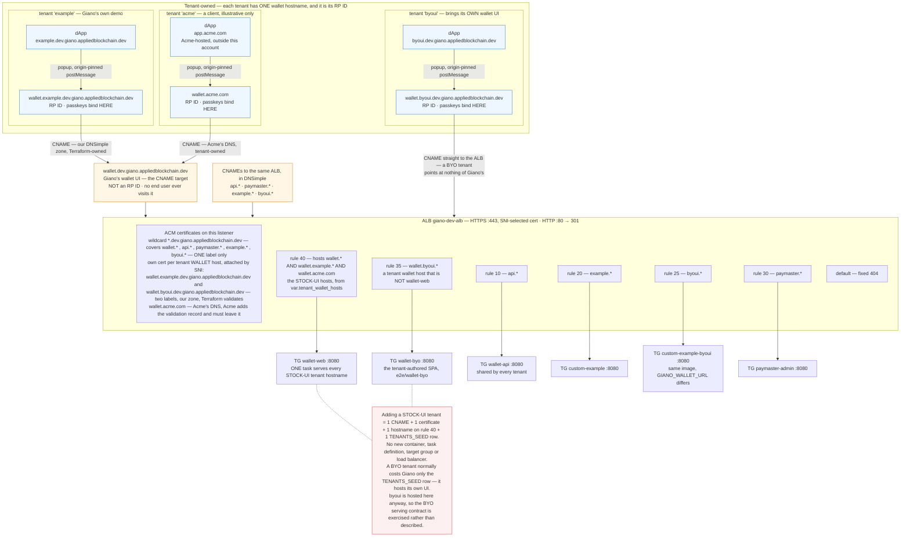
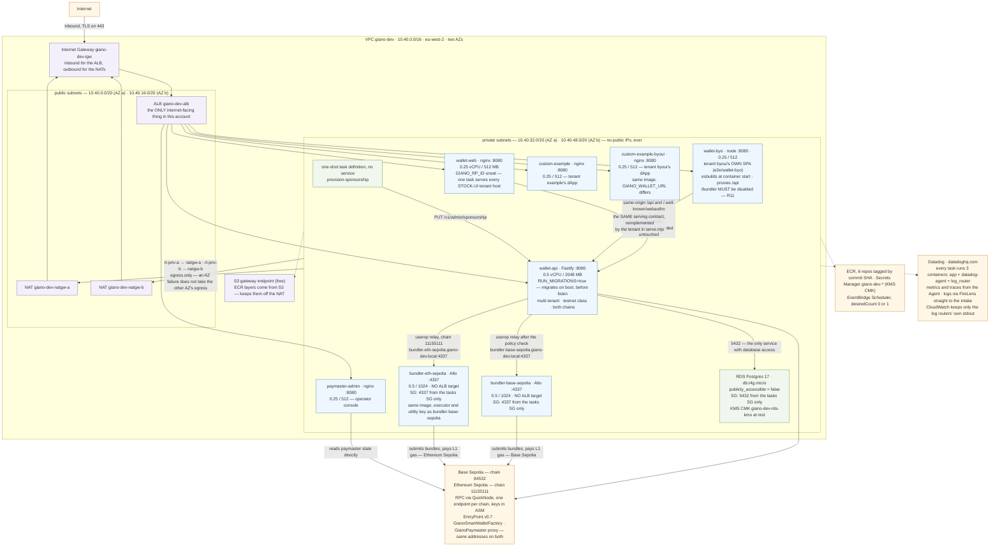
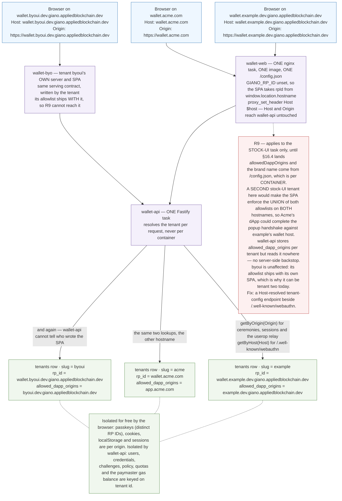

# Giano — infrastructure specification

This document specifies the AWS infrastructure for Giano and the Terraform that provisions it. It is
written to be **executable**: an operator — or Claude Code — should be able to read it and produce
the whole of [`infra/iac`](../infra/iac/) without inventing a convention, guessing a resource name,
or asking which file a resource belongs in. Where a section states a shape, that shape is normative.

The first environment built from it is `dev`: a permanently-available, internet-reachable Giano
stack on **two chains — Base Sepolia and Ethereum Sepolia**, with real hostnames, real passkeys and
real gas sponsorship — the thing a developer, a designer or a prospective integrator can be pointed
at without running `docker compose` first. The same code produces `stg` and `prd` by selecting a
Terraform workspace ([§20](#20-non-goals-and-the-path-to-staging)).

Status: **draft for review.** Every decision taken is recorded in [§2.3](#23-decisions) with its
alternative. [§16](#16-repository-changes-this-requires) lists the code changes the deployment needs
that are not infrastructure at all, and [§19](#19-risks-and-open-items) the questions that remain.

---

## Contents

1. [Introduction](#1-introduction)
2. [Scope and decisions](#2-scope-and-decisions)
3. [Architecture](#3-architecture)
4. [Terraform patterns](#4-terraform-patterns)
5. [VPC and networking](#5-vpc-and-networking)
6. [DNS](#6-dns)
7. [ASM — Secrets Manager](#7-asm--secrets-manager)
8. [RDS](#8-rds)
9. [ECS Fargate](#9-ecs-fargate)
10. [IAM](#10-iam)
11. [ECR](#11-ecr)
12. [1Password](#12-1password)
13. [Chain prerequisites](#13-chain-prerequisites)
14. [The services](#14-the-services)
15. [Images and delivery](#15-images-and-delivery)
16. [Repository changes this requires](#16-repository-changes-this-requires)
17. [Cost, scheduling and observability](#17-cost-scheduling-and-observability)
18. [Bring-up runbook](#18-bring-up-runbook)
19. [Risks and open items](#19-risks-and-open-items)
20. [Non-goals and the path to staging](#20-non-goals-and-the-path-to-staging)

---

## 1. Introduction

Giano is deployed as a small number of stateless containers in front of one Postgres database, and
almost everything interesting about the infrastructure is a consequence of one property of WebAuthn:
**a passkey binds to the hostname in the browser's address bar, irreversibly.** That single fact
decides the DNS model, the certificate model, the load-balancer routing and the tenancy model, and
it is why this document spends more words on hostnames than on compute.

The shape is deliberately ordinary otherwise. One VPC across two availability zones, public subnets
carrying only the load balancer and the NAT gateways, private subnets carrying every task and the
database. One Application Load Balancer terminating TLS and routing by `Host` header to per-service
target groups. ECS Fargate for compute, so there are no hosts to patch and no control-plane fee.
RDS Postgres for state. ECR for images. AWS Secrets Manager for secrets, encrypted with a
customer-managed KMS key and mirrored from 1Password, which is the source of truth. DNSimple for DNS.

Everything is Terraform, in one flat root module at `infra/iac`, with environments selected by
Terraform workspace (`dev`, `stg`, `prd`) rather than by directory. Nothing is created by hand except
the things Terraform genuinely cannot own: the chain deployments, the funded accounts, and the values
inside the 1Password note.

The rest of this document is: what the environment is and why ([§2](#2-scope-and-decisions),
[§3](#3-architecture)); the Terraform conventions everything else obeys ([§4](#4-terraform-patterns));
then one section per resource type, in the order the Terraform files sit on disk
([§5](#5-vpc-and-networking)–[§12](#12-1password)); then the application-level detail — chain
prerequisites, per-service environment, delivery, cost, the runbook and the risks.

---

## 2. Scope and decisions

### 2.1 What is being built

One AWS account region hosting one Giano deployment per environment, serving **seven public
hostnames** from **one load balancer**, backed by **eight Fargate services** — two chains, each
with its own bundler — and **one RDS instance**, provisioned entirely by Terraform from
`infra/iac`.

The hostnames divide by **owner**, and that division is the architecture:

```
# Giano's own infrastructure — shared by every tenant, and never a relying party
wallet.dev.giano.appliedblockchain.dev          the shared wallet UI. The CNAME target. NOT an RP ID.
api.dev.giano.appliedblockchain.dev             wallet-api (also proxied same-origin under each
                                   wallet host's /api)
paymaster.dev.giano.appliedblockchain.dev       the paymaster operator console

# Tenant "example" — stock wallet UI, reached by CNAME
example.dev.giano.appliedblockchain.dev         its dApp — services/custom-example
wallet.example.dev.giano.appliedblockchain.dev  its wallet origin — passkeys live here (RP ID)
                                   CNAME → wallet.dev.giano.appliedblockchain.dev

# Tenant "byoui" — brings its OWN wallet UI, so it CNAMEs to nothing of Giano's
byoui.dev.giano.appliedblockchain.dev           its dApp — a second custom-example task
wallet.byoui.dev.giano.appliedblockchain.dev    its wallet origin — passkeys live here (RP ID)
                                   CNAME → the ALB → its OWN service (e2e/wallet-byo)
```

**Giano serves one wallet UI; each tenant points its own hostname at it with a `CNAME`.** That
tenant hostname — not Giano's — is the tenant's WebAuthn RP ID, because the browser binds passkeys
to the host in the address bar. `wallet.dev.giano.appliedblockchain.dev` is therefore infrastructure that no end
user ever visits: it terminates the shared UI and never becomes a relying party.

The example tenant is shaped as **its own domain with a wallet subdomain underneath it**, because
that is what a real client looks like — `example.dev.giano.appliedblockchain.dev` and
`wallet.example.dev.giano.appliedblockchain.dev` stand in for `acme.com` and `wallet.acme.com`. Naming it flat as
`wallet-example.dev.giano.appliedblockchain.dev` would have let it ride the existing wildcard certificate, and
dev would then never exercise the one onboarding step that costs a client anything
([§6.3](#63-certificates)). Two labels deep is deliberate.

**Two tenants, because there are two ways to be one.** `example` takes Giano's stock UI and reaches
it by `CNAME`; `byoui` serves a wallet SPA it wrote itself
(`e2e/wallet-byo/`, `DEVELOPER-GUIDE.md` §5.5b) at its own wallet origin, so it points at Giano's
wallet hostname not at all. Both are ordinary rows in `TENANTS_SEED`, both resolve against the same
wallet-api, Postgres and bundler, and each has its own irreversible RP ID. A dev environment that
serves only one of the two shapes cannot show that the other works — and cross-tenant isolation is
not observable at all with a single tenant.

For the stock-UI shape, one wallet-web task serves every tenant, so adding such a tenant costs a DNS
record, a certificate and a database row — not another container. What makes *that* safe rather than
merely functional is [§16.4](#164-a-host-resolved-tenant-config-endpoint), which is a prerequisite of
the second stock-UI tenant. `byoui` is deliberately not one: it brings its own SPA and therefore its
own dApp allowlist, so it does not share wallet-web's `/config.json` and does not trip
[R9](#19-risks-and-open-items). It is the one second tenant this environment can carry today.

### 2.2 What `dev` is not

Not staging, not production. Single task per service, no WAF, no multi-region, no disaster recovery,
no HSM, and RDS single-AZ. The *network* is two-AZ throughout — see [§5](#5-vpc-and-networking) —
because that is not where the savings are and because a one-AZ network is not a thing you retrofit.
`dev` is sized and priced as a development environment; its Terraform is written so `stg` and `prd`
are workspace selections rather than forks ([§20](#20-non-goals-and-the-path-to-staging)), but
nothing in the `dev` workspace values should be mistaken for a production posture.

### 2.3 Decisions

| # | Decision | Chosen | Alternative rejected | Why |
|---|---|---|---|---|
| D1 | Compute | **ECS Fargate** | EC2 + compose; EKS; App Runner | No control-plane fee, no hosts to patch, task definitions map ~1:1 onto the existing compose services. EKS costs $73/mo before a pod runs. |
| D2 | Chain | **Two: Base Sepolia (84532) and Ethereum Sepolia (11155111)**, RPC via QuickNode | Self-hosted anvil devnet; Base Sepolia alone | Persistent state and a realistic, multi-chain stack — "one passkey, one address, every chain" is only demonstrable with more than one chain. The canonical factory and implementation are already registered and deployed on both ([§13](#13-chain-prerequisites)). |
| D3 | Bundler | **Self-hosted Alto on Fargate, one per chain** | Pimlico hosted; one bundler shared across chains | `services/bundler` already exists, pinned and env-driven. No third-party account, no shared API key. A bundler's executor and submission endpoint are chain-specific — Alto does not multiplex chains inside one process — so two chains need two services ([§14.7](#147-bundler)). Both share one executor and one utility key, funded on both chains; only the RPC endpoint differs between them. |
| D4 | Database | **RDS Postgres 17, `db.t4g.micro`, single-AZ in `dev`** | Aurora Serverless v2 min-0; Postgres container on EFS | Managed backups for ~$16/mo. Aurora's scale-to-zero is attractive but adds cold-start latency to a stack that is already asleep out of hours (D9). |
| D5 | Region | **`eu-west-2` (London)** | `eu-west-1`; `us-east-1` | Team latency and UK residency, at ~5–10% over Ireland. |
| D6 | DNS | **DNSimple, via the `dnsimple/dnsimple` provider** | Route 53 delegated subdomain | The parent domains already live in DNSimple. Delegating a child zone to Route 53 buys an alias record type we do not need and adds a second DNS system, a manual `NS` handover step and a hosted-zone charge. One provider, one zone, no delegation ([§6](#6-dns)). |
| D7 | TLS + ingress | **ACM in-region + one ALB, host-based routing** | CloudFront; one ALB per service; path-based routing | WebAuthn needs a real HTTPS origin and the RP ID is irreversible per tenant. Host-based routing on one ALB saves ~$54/mo over four, and — unlike path-based — keeps every service same-origin, so no CORS. |
| D8 | Egress | **Private subnets, one NAT Gateway per AZ, no public IPs on tasks** | Public subnets with `assign_public_ip = true`; VPC interface endpoints | ~$70/mo more than public IPs, and worth it: no task is addressable from the internet even by mistake, and the posture carries to `prd` unchanged. Per-AZ NAT so an AZ failure does not take egress from the other AZ. An S3 gateway endpoint (free) keeps ECR layer pulls off the NAT. |
| D9 | Cost control | **Scheduled scale-to-zero out of hours** | Always-on; Fargate Spot | Roughly halves *Fargate*. It does not touch the NAT gateways or the ALB, which after D8 are the larger fixed lines. Spot was declined — restarts during a working day are more annoying than the saving is worth. |
| D10 | Demo dApp | **`services/custom-example`** | `e2e/dapp` thin fixture; both | The richer demo (multi-owner, ROR, cross-chain, paymaster) is what a deployed environment is *for*. Needs a Dockerfile and runtime config ([§16](#16-repository-changes-this-requires)). |
| D11 | Terraform layout | **One flat root module at `infra/iac`, environments as workspaces `dev`/`stg`/`prd`** | `envs/<env>/` root-module directories; a separate infra repo | Infra versioned with the code it deploys. Workspaces mean one copy of every resource definition and one place a drift can hide; env-varying values are maps keyed by `terraform.workspace` ([§4](#4-terraform-patterns)). |
| D12 | Secrets store | **AWS Secrets Manager, encrypted with a customer-managed KMS key, mirrored from a 1Password note** | SSM Parameter Store `SecureString`; SSM with a human `put-parameter` step | ~$0.40/secret/month buys a real source of truth with an audit trail and a rotation signal. The bundle design ([§12](#12-1password)) keeps the secret inventory and Terraform's list of secrets in sync automatically, which the hand-populated SSM path never did. |
| D13 | Secret handling in Terraform | **`ephemeral` resources + write-only arguments everywhere** | `lifecycle { ignore_changes = [value] }`; `data "onepassword_item"` | No secret value reaches the state file at all — not the DB master password, not the signer keys. `ignore_changes` does not achieve this; refresh still writes the value ([§12](#12-1password)). |
| D14 | Observability | **Datadog — Agent sidecar in every task definition, logs via AWS FireLens** | CloudWatch Logs + Container Insights; Prometheus | The org already runs Datadog, so metrics, traces and logs land where the team already looks rather than in a per-project console nobody opens. Fargate has no host to run an Agent on, so the Agent is a container in each task ([§17.3](#173-observability)). Costs two sidecars per task — ~350 MB — which is why every task's memory doubles in [§9.2](#92-the-services). |
| D20 | Log shipping | **FireLens / Fluent Bit → Datadog only** | `awslogs` to CloudWatch; dual-ship to both | The stock `aws-for-fluent-bit` image with inline options and no config file to maintain. One CloudWatch group survives — the log router's own stdout — so a broken router is still diagnosable. Dual-shipping would need a Giano-owned router image and a seventh ECR repository to protect logs nobody would read twice. |
| D15 | Sponsorship signer | **`local` key in ASM, `GIANO_DEPLOYMENT_CLASS=testnet`** | `hsm` | The `hsm` path requires an `HsmSignerAdapter` passed to `buildApp`, which the published image does not wire ([§10.4](#104-the-sponsorship-signer-constraint)). `testnet` is the honest deployment class and it is what makes `local` legal. |
| D16 | Registry & CI | **ECR + GitHub Actions OIDC** | GHCR with a pull secret | Same-region pulls, no egress, no long-lived AWS credentials and no PAT to rotate. |
| D17 | Tenant roster | **Two: `example` on the stock UI, `byoui` bringing its own** | One tenant; two stock-UI tenants | The two supported wallet-UI topologies (`DEVELOPER-GUIDE.md` §5.5a) are the thing most likely to be got wrong by an integrator, and only a deployment that runs both proves both. A second *stock-UI* tenant is blocked by [R9](#19-risks-and-open-items) until [§16.4](#164-a-host-resolved-tenant-config-endpoint); a BYO tenant is not, because it serves its own SPA and its own allowlist. It also makes cross-tenant isolation observable, which one tenant cannot. |
| D18 | Tenant wallet hostnames | **One shared wallet-web; tenants `CNAME` to it, one SNI certificate per tenant host** | One wallet-web container per tenant (`DEVELOPER-GUIDE.md` §5.5) | Onboarding a tenant should cost a DNS record and a certificate, not a container, a task definition, a target group and a listener rule. wallet-web already derives its RP ID from `window.location.hostname` when `GIANO_RP_ID` is unset, and wallet-api resolves tenants per request from `Origin`/`Host` — so the shared path needs no new tenancy concept. It does need [§16.4](#164-a-host-resolved-tenant-config-endpoint) before it is safe: today the dApp allowlist is per *container*, which across tenants would become a union ([R9](#19-risks-and-open-items)). |
| D19 | No JSON templating | **`jsonencode()` and `aws_iam_policy_document` for every policy** | `templatefile("*.json.tpl", …)` | A `.json.tpl` is unvalidated string interpolation: a missing comma or an unquoted ARN is a runtime failure with no plan-time signal. HCL-native policy construction is type-checked, greppable and refactorable. No `templates/` directory exists in this tree. |

---

## 3. Architecture

Three views: the hostname-to-container path, the inside of the VPC, and the tenancy mechanism that
D18 rests on. They show the `dev` workspace's hostnames concretely; the zone is a per-environment
variable ([§6.1](#61-provider-and-zone)), so `stg` and `prd` differ only in that one value.

**Three tenants are drawn; two of them are real.** `example` and `byoui` are both provisioned here
(D17) and are the two ways to be a tenant: `example` takes Giano's stock wallet UI and reaches it by
`CNAME`, `byoui` serves a wallet SPA it wrote itself at its own origin and points at Giano's wallet
hostname not at all. `acme` is illustrative — a client whose hostnames live in *their* DNS, which
changes only who creates the records. Everything else about `acme` is identical to `example`, and
that is why it is worth drawing.

### 3.1 Hostnames, TLS and routing



Every target group is `target_type = "ip"`. Fargate tasks use the `awsvpc` network mode and have no
instance to register, so `instance` is not available and `ip` is not a preference.

### 3.2 Inside the VPC



### 3.3 How one wallet UI serves many tenants

The mechanism behind D18. One image, one task, one `/config.json` — and N relying parties, because
every tenant-specific decision is made from a request header rather than from container state.



### 3.4 What is load-bearing

**The RP ID is the tenant's hostname, never Giano's.** `wallet.dev.giano.appliedblockchain.dev` serves the
wallet UI but is not a relying party: no passkey is ever created against it. `GIANO_RP_ID` is
deliberately left **unset** so wallet-web derives its RP ID from the host the browser used —
`services/wallet-web/src/config.ts` resolves `rpId: raw.rpId || window.location.hostname`, which is
the mechanism the whole CNAME model rests on. Passkeys bind to
`wallet.example.dev.giano.appliedblockchain.dev`, the tenant's own hostname. Per-tenant `rpId` is irreversible —
changing it later orphans every passkey created against it. This is the single choice in the whole
document that cannot be undone by `terraform apply`.

**Tenant resolution is per request, not per container.** wallet-api resolves the tenant of a
ceremony from the `Origin` header and of `/.well-known/webauthn` from the `Host` header, and
wallet-web's nginx forwards both untouched (`proxy_set_header Host $host`). One wallet-web task
answering on N tenant hostnames therefore resolves N distinct tenants with no shared state — the
browser's own origin isolation keeps sessions and storage separate for free.

**Neither bundler has a public listener.** Each is reachable only from the tasks security group. The
wallet origin never talks to either directly; `wallet-api` relays user operations to whichever chain's
bundler after the policy
check.

**Nothing but the ALB is reachable from the internet.** Every task and the database sit in private
subnets with no public IP. Egress is through the per-AZ NAT gateways. Developer access to the
database is via `aws ecs execute-command` into a running task, not a bastion.

---

## 4. Terraform patterns

Everything under `infra/iac` obeys these conventions. They are not stylistic: half of them are the
reason a reader can find a resource without grepping, and the rest are the reason `stg` and `prd`
are workspace selections rather than a fork.

### 4.1 One root module, environments as workspaces

There is **one** root module, at `infra/iac`. There are no `envs/dev`, `envs/stg`, `envs/prd`
directories and no per-environment copies of any resource. The environment is the **Terraform
workspace**, and there are exactly three, plus `default`:

| Workspace | Meaning |
|---|---|
| `default` | never used — it exists because Terraform always creates it |
| `dev` | the environment this document is written against |
| `stg` | staging |
| `prd` | production |

Environment names are **three letters**. There is no `staging`, no `production`, and no numbered
`env-01`/`env-02`/`env-03` scheme: the workspace name is the environment name is the string that
appears in every resource name and every tag.

Every value that varies by environment is a **map keyed by workspace**, read as
`var.<name>[terraform.workspace]`. This is the single mechanism; there are no conditionals on the
workspace name scattered through resources.

```hcl
variable "vpc_cidr" {
  description = "VPC CIDR network, per environment"
  type        = map(string)
  default = {
    dev = "10.40.0.0/16"
    stg = "10.41.0.0/16"
    prd = "10.42.0.0/16"
  }
}

resource "aws_vpc" "vpc" {
  cidr_block           = var.vpc_cidr[terraform.workspace]
  enable_dns_hostnames = true
  enable_dns_support   = true

  tags = { Name = local.name_prefix }
}
```

A resource that must not exist in some environment is gated with `count` on a boolean map —
`count = var.foo_enabled[terraform.workspace] ? 1 : 0` — not with a `terraform.workspace == "dev"`
comparison.

### 4.2 File organisation

**Each resource type gets its own Terraform file, and each such file has a `.vars.tf` sibling for
its variables and a `.outputs.tf` sibling for its outputs.** Nothing else goes in those files. A
reader looking for the NAT gateways opens `nat_gw.tf`; a reader looking for what the ALB exports
opens `alb.outputs.tf`. Files whose name starts with `_` are the cross-cutting ones and sort to the
top.

```
infra/iac/
  _init.tf              terraform block, required_providers, backend "s3" {}, provider blocks,
                        shared data sources (aws_availability_zones, aws_caller_identity, aws_region)
  _init.vars.tf         org_name, project_name, aws_region, profile, s3_tfstate_name
  _locals.tf            name_prefix, default_tags, and any shared derived value
  _outputs.tf           the aggregate outputs an operator consumes

  vpc.tf                vpc.vars.tf                vpc.outputs.tf
  vpc_subnets.tf        vpc_subnets.vars.tf        vpc_subnets.outputs.tf
  internet_gw.tf
  nat_gw.tf             nat_gw.vars.tf
  eip.tf
  route_tables.tf
  vpc_endpoints.tf
  security_groups.tf                               security_groups.outputs.tf
  alb.tf                alb.vars.tf                alb.outputs.tf
  acm.tf                acm.vars.tf                acm.outputs.tf
  dns.tf                dns.vars.tf                dns.outputs.tf
  kms.tf                                           kms.outputs.tf
  asm.tf                asm.vars.tf                asm.outputs.tf
  rds.tf                rds.vars.tf                rds.outputs.tf
  ecr.tf                ecr.vars.tf                ecr.outputs.tf
  ecs.tf                ecs.vars.tf                ecs.outputs.tf
  ecs_services.tf       ecs_services.vars.tf       ecs_services.outputs.tf
  ecs_tasks_oneshot.tf
  iam.tf                iam.vars.tf                iam.outputs.tf
  iam.policies.tf
  cloudwatch.tf         cloudwatch.vars.tf
  datadog.tf            datadog.vars.tf            datadog.outputs.tf
  scheduler.tf          scheduler.vars.tf
  github_oidc.tf        github_oidc.vars.tf        github_oidc.outputs.tf

  modules/
    aws/
      asm/           secrets: one Secrets Manager secret per key, write-only values
      rds/           subnet group, parameter group, instance, security group
      ecs-service/   task definition, service, target group, listener rule, log group, IAM roles
      ecr/           repository, lifecycle policy, scanning configuration
      iam/role/      a role with an assume-role policy and attachments
      s3/backend/    the state bucket — consumed by bootstrap/, not by the root
    dnsimple/
      record-set/    a set of records for one hostname (optional; see §6.5)
    datadog/
      monitor/       one Datadog monitor, with thresholds and notifiers (§17.3.5)

  bootstrap/         a SEPARATE root module, applied once, with LOCAL state
    main.tf          aws provider + module "s3-backend" — deliberately no backend block
    variables.tf
```

**This tree is pure Terraform.** There is no wrapper, no build file and no shell entrypoint —
`terraform init`, `terraform plan` and `terraform apply` are the whole interface
([§4.6](#46-running-terraform)). Backend settings, credentials, the secret inventory and environment
selection are all expressed in Terraform itself. Anything that must be run *before* Terraform is
something that will eventually not be run, and the failure when it is skipped is a stale input
rather than an error.

**Modules use `variables.tf` and `outputs.tf`**, not the `.vars.tf`/`.outputs.tf` suffix pattern the
root uses. Inside a module the resource files keep their own names (`asm.tf`, `rds.tf`,
`security_groups.tf`), and a module may have a `_locals.tf`. This asymmetry is deliberate: it tells
you at a glance whether you are reading root code or module code.

Every module sets a `module` tag on the resources it creates, merged over an optional
`additional_tags` input:

```hcl
# modules/aws/asm/_locals.tf
locals {
  tags = merge(var.additional_tags, {
    module = "aws/asm"
  })
}
```

### 4.3 Naming

Every resource name is prefixed `<project_name>-<env>`, built once in `_locals.tf` and never
reassembled inline:

```hcl
# _locals.tf
locals {
  name_prefix = join("-", [var.project_name, terraform.workspace])

  default_tags = {
    managed_by   = "terraform"
    org_name     = var.org_name
    project_name = var.project_name
    env          = terraform.workspace
    tfstate      = "s3:${var.s3_tfstate_name}"
  }

  # 1Password coordinates for this environment's secrets — §12.2
  op_vault = "${title(var.project_name)} ${var.op_vault_suffix[terraform.workspace]}"
  op_item  = "secrets-${terraform.workspace}"
}
```

`var.project_name` is declared once in `_init.vars.tf` with `default = "giano"` and referenced
everywhere through `local.name_prefix`. It is never re-typed inline and never passed on the command
line.

So in the `dev` workspace: `giano-dev-vpc`, `giano-dev-alb`, `giano-dev-natgw-a`,
`giano-dev-wallet-api`, `giano-dev-app-db`, `giano-dev-asm-kms`. Where a resource is per-AZ it takes
an `-a`/`-b` suffix; where it is per-service it takes the service name.

### 4.3.1 Tagging

**Every taggable resource carries `default_tags` merged with its own `Name`. No exceptions, and no
resource is written without a `Name`.**

The common tags come from the provider, so they cannot be forgotten:

```hcl
provider "aws" {
  region  = var.aws_region[terraform.workspace]
  profile = var.profile[terraform.workspace]

  default_tags { tags = local.default_tags }
}
```

and every resource adds `Name` on top:

```hcl
resource "aws_nat_gateway" "natgw-a" {
  subnet_id     = aws_subnet.subnet-a-pub.id
  allocation_id = aws_eip.nat-gw-a-eip.id

  tags = { Name = "${local.name_prefix}-natgw-a" }
}
```

**Do not hand-merge `local.default_tags` into a resource's `tags`.** The AWS provider merges
`default_tags` with resource-level `tags` itself, so `tags = { Name = … }` already produces the full
set. Writing `merge(local.default_tags, { Name = … })` restates every common tag at the resource
level, which is redundant, and duplicating a key that `default_tags` already sets is a known source
of inconsistent-plan errors. One place defines the common tags; resources contribute only what is
theirs.

`Name` is the tag that makes a console listing readable, so it is worth being strict about: it is
always `${local.name_prefix}-<component>`, matching the resource's own name
([§4.3](#43-naming)) rather than describing it. `giano-dev-natgw-a`, not `NAT gateway (AZ a)`.

**Inside a module**, `_locals.tf` carries the `module` tag and any `additional_tags` the caller
passed, and each resource merges its `Name` over that:

```hcl
# modules/aws/asm/_locals.tf
locals {
  tags = merge(var.additional_tags, { module = "aws/asm" })
}

# modules/aws/asm/asm.tf
resource "aws_secretsmanager_secret" "secret" {
  for_each = var.secrets
  # ...
  tags = merge(local.tags, { Name = "${var.name_prefix}-${each.key}" })
}
```

Provider `default_tags` still apply inside modules — they are a property of the provider, not of the
root module — so this merge adds to them rather than replacing them.

**Two categories are exempt, and only two:**

- **Resources AWS gives no `tags` argument.** In this tree that is `aws_kms_alias`,
  `aws_secretsmanager_secret_version`, `aws_acm_certificate_validation`, `aws_ecr_lifecycle_policy`,
  `aws_ecr_repository_policy`, `aws_lb_listener_certificate`, `aws_route_table_association`,
  `aws_iam_role_policy`, `aws_iam_role_policy_attachment`, `aws_ecs_cluster_capacity_providers` and
  `aws_scheduler_schedule`. Each is a child of something that *is* tagged, so nothing becomes
  unattributable.
- **Non-AWS providers**, which have no `default_tags` at all. `dnsimple_zone_record` has no tag
  concept; `datadog_monitor` has its own, which is why `modules/datadog/monitor` takes
  `additional_tags` and is passed `local.default_tags` explicitly
  ([§17.3.5](#1735-monitors)) — the one place hand-merging the default tags is correct, because
  nothing else applies them.

Anything else appearing in a resource's `tags` block is a signal that it belongs in `default_tags`.

### 4.4 No JSON templating

There is no `templates/` directory and no `.json.tpl` file anywhere in this tree (D19). IAM policies
are built with `data "aws_iam_policy_document"`; anything else that needs JSON uses `jsonencode()`:

```hcl
# GOOD — plan-time validated, greppable, refactorable
data "aws_iam_policy_document" "ecs_task_assume" {
  statement {
    actions = ["sts:AssumeRole"]
    principals {
      type        = "Service"
      identifiers = ["ecs-tasks.amazonaws.com"]
    }
    condition {
      test     = "ArnLike"
      variable = "aws:SourceArn"
      values   = ["arn:aws:ecs:${var.aws_region}:${var.account_id}:*"]
    }
    condition {
      test     = "StringEquals"
      variable = "aws:SourceAccount"
      values   = [var.account_id]
    }
  }
}

resource "aws_ecr_lifecycle_policy" "repo" {
  repository = aws_ecr_repository.repo.name
  policy = jsonencode({
    rules = [{
      rulePriority = 1
      description  = "keep the last ${var.lifecycle_image_count} images"
      selection = {
        tagStatus   = "any"
        countType   = "imageCountMoreThan"
        countNumber = var.lifecycle_image_count
      }
      action = { type = "expire" }
    }]
  })
}
```

Container definitions for ECS are `jsonencode()` too, never a rendered template.

### 4.5 Backend and versions

```hcl
# _init.tf
terraform {
  required_version = ">= 1.11"

  required_providers {
    aws         = { source = "hashicorp/aws",           version = "~> 6.0"  }
    datadog     = { source = "DataDog/datadog",         version = "~> 3.60" }
    dnsimple    = { source = "dnsimple/dnsimple",       version = "~> 1.9"  }
    external    = { source = "hashicorp/external",      version = "~> 2.3"  }
    onepassword = { source = "1Password/onepassword",   version = "~> 3.1"  }
    random      = { source = "hashicorp/random",        version = "~> 3.6"  }
  }

  # Fully specified — there are no -backend-config flags to remember.
  backend "s3" {
    bucket               = "giano-tfstate"
    key                  = "terraform.tfstate"
    workspace_key_prefix = "env"
    region               = "eu-west-2"
    encrypt              = true
    use_lockfile         = true
  }
}
```

`>= 1.11` is a hard floor, not a preference: **write-only arguments** (`secret_string_wo`,
`password_wo`) are what keep secrets out of state ([§12](#12-1password)), and they do not exist
before 1.11. The AWS provider floor is 6.x for the same reason, and the 1Password provider floor is
3.1 for `ephemeral "onepassword_item"`.

State lives in one S3 bucket for the whole project, with **S3 native locking** — `use_lockfile =
true`, no DynamoDB table. The backend block is written out in full rather than left empty: with
workspaces there is nothing left to parameterise, because the backend derives the per-environment
key itself — `env/dev/terraform.tfstate`, `env/stg/…`, `env/prd/…` — from `workspace_key_prefix` and
the selected workspace. An empty `backend "s3" {}` would mean every `terraform init` needs five
flags supplied correctly, which is precisely the kind of thing a wrapper exists to remember and a
person does not.

So initialising is just:

```
terraform init
```

The bucket itself is the usual chicken-and-egg, and it is solved with a **separate root module**
rather than a flag:

```
infra/iac/bootstrap/     # no backend block at all -> local state
  main.tf                # provider "aws" + module "s3-backend"
```

`bootstrap/` is applied once, on its own, before the main root module is ever initialised
([§18](#18-bring-up-runbook) step 4). It creates the bucket — versioned, encrypted with SSE-KMS,
public access blocked — and nothing else.

**It has to be a separate directory, not `-backend=false` in this one.** `-backend=false` tells
Terraform to reuse whatever backend is already initialised; on a fresh clone that is nothing, so the
declared `backend "s3"` stays uninitialised and the very next command fails with *"Backend
initialization required"*. There is no ordering of flags that gets around it, because the
configuration declares a backend pointing at a bucket that does not exist yet. A root module with no
backend block has no such problem.

Keeping it separate also keeps it *small*: `bootstrap/` needs only the AWS provider. Creating the
bucket from the main root module — even with `-target` — drags in the 1Password, DNSimple and Datadog
providers and the secret-inventory data source, none of which have anything to do with an S3 bucket.

`bootstrap/`'s own state is local and stays that way. It describes one bucket and holds nothing
sensitive, so losing it costs a `terraform import` and nothing else. Do not migrate it into the
bucket it manages.

Commit `.terraform.lock.hcl`. An environment that drifts because a provider minor changed a default
is a bad afternoon.

### 4.6 Running Terraform

The whole interface, for any environment:

```
terraform init                      # once per clone — the backend is fully specified (§4.5)
terraform workspace select dev      # or stg, prd
terraform plan -out=dev.tfplan
terraform apply dev.tfplan
```

There is nothing to run beforehand. No wrapper generates an input file, no target exports a
credential, and there is no way to run Terraform "wrong" by forgetting a step — because there is no
step to forget.

That is a design constraint on everything else in this document, not just a convenience. Anything a
wrapper would have supplied has to be expressible *inside* Terraform, and each of the four things
one normally would have is:

| Normally a wrapper's job | Here |
|---|---|
| `-backend-config` flags | a fully specified `backend "s3"` block; workspaces derive the state key ([§4.5](#45-backend-and-versions)) |
| `-var` for non-secret settings | variables with defaults, and workspace-keyed maps ([§4.1](#41-one-root-module-environments-as-workspaces)) |
| Generating the secret inventory | `data "external"` reading the 1Password note at plan time ([§12.4](#124-the-secret-inventory)) |
| Exporting provider credentials | `ephemeral "onepassword_item"` feeding the provider blocks directly ([§4.6.1](#461-provider-credentials)) |

**The operator's shell needs nothing set.** Not a variable, not a profile, not a credential. The
only prerequisite outside Terraform is a signed-in `op` session, and even the account it signs in to
is a Terraform variable ([§4.6.1](#461-provider-credentials)) rather than something the shell has to
carry.

#### 4.6.1 Provider credentials

**No secret is ever passed as a `-var`.** A `-var="datadog_api_key=…"` puts the value in the shell
history, in the process table and — because a `variable` is state — in the state file. Nothing here
does that.

Instead, providers that need a credential read it from an `ephemeral "onepassword_item"` and are
configured from that. Ephemeral values are permitted in provider configuration, which is what makes
the wrapper unnecessary: the credential exists only for the duration of the operation and is never
written anywhere.

```hcl
# _init.vars.tf
variable "op_account" {
  description = "1Password account for the desktop-app SDK integration"
  type        = string
  default     = "applied.1password.com"
}

# _init.tf — the root of every credential in this deployment
provider "onepassword" {
  account = var.op_account      # CI overrides with OP_SERVICE_ACCOUNT_TOKEN instead (§12.2)
}

# ephemeral.vault takes the vault UUID, NOT its name — see below.
data "onepassword_vault" "devops" {
  name = var.op_devops_vault      # "DevOps"
}

ephemeral "onepassword_item" "dnsimple" {
  vault = data.onepassword_vault.devops.uuid
  title = "dnsimple-terraform"
}

provider "dnsimple" {
  # the note is a shell fragment; §6.2 parses the token out of it.
  # the account id is not a secret and is a plain variable — §6.1.
  token   = local.dnsimple_token
  account = var.dnsimple_account
}
```

Datadog is configured the same way, from its own `DevOps` item
([§17.3.2](#1732-credentials)). AWS uses the ambient profile or role, as it always does.

**`ephemeral "onepassword_item"` takes the vault's UUID, not its name.** The provider's schema is
explicit — *"The UUID of the vault the item is in"* — and passing a name does not fail cleanly: the
provider resolves it, returns the UUID, and Terraform rejects the result because an ephemeral
resource's returned attributes must match its configuration exactly:

```
Error: Provider produced invalid ephemeral resource instance
  .vault: planned value cty.StringVal("nb3zfvjlzk3yijqkdgvzruft54")
          does not match config value cty.StringVal("DevOps")
```

So every `ephemeral "onepassword_item"` in this document is fed by a `data "onepassword_vault"`
that turns a human-readable name into a UUID. Vault names stay in the variables, where a person can
read them; UUIDs never appear in the configuration.

`data "onepassword_vault"` is **not** covered by the ban on `data "onepassword_item"`
([§12.5](#125-reading-the-values)). The ban exists because an item data source writes every field
value into state; a vault data source returns a name, a UUID and a description, and no secret can
reach it.

Secrets therefore reach Terraform by exactly two routes, and the rule that decides which is worth
stating once because three sections depend on it:

| The credential is… | Lives in | Reaches Terraform as |
|---|---|---|
| consumed by a **container** at runtime | the 1Password **bundle** ([§12.3](#123-the-bundle)) | an `ephemeral` read → a write-only ASM secret → the task definition's `secrets` block |
| used by a **provider** | a shared item in the **`DevOps` vault** | an `ephemeral` read of its note → the provider block |

The `DevOps` items — `dnsimple-terraform` and `datadog-terraform` — are org infrastructure shared
with other projects. Their notes are shell fragments that `export` the values, and Terraform reads
and parses them rather than requiring them to be sourced first
([§6.2](#62-provider-authentication), [§17.3.2](#1732-credentials)).

One credential crosses the line: the Datadog **API** key is a provider credential *and* a container
secret. It stays in the `DevOps` item, and Terraform mirrors it into Secrets Manager for the
containers ([§7.4](#74-the-derived-secrets)) rather than copying it into Giano's bundle. One value,
one home — and in no case does it touch a file, an environment variable or the state.

### 4.7 Outputs

`_outputs.tf` carries the aggregate outputs an operator consumes. Group them into
objects rather than emitting dozens of scalars, mark anything derived from a secret `sensitive`, and
mark anything derived from an ephemeral value `ephemeral`:

```hcl
output "DEBUG" {
  description = "identity and naming, for confirming which account and environment is targeted"
  value = {
    aws_profile  = var.profile[terraform.workspace]
    account_id   = data.aws_caller_identity.current.account_id
    caller_arn   = data.aws_caller_identity.current.arn
    default_tags = local.default_tags
    name_prefix  = local.name_prefix
  }
}

output "ENDPOINTS" {
  description = "public hostnames and the ALB they resolve to"
  value = {
    alb_dns_name = aws_lb.alb.dns_name
    wallet       = local.hosts.wallet
    api          = local.hosts.api
    paymaster    = local.hosts.paymaster
    tenants      = local.tenant_hosts
  }
}

output "RUN_TASK_NETWORK" {
  description = "network configuration for `aws ecs run-task` (provision-sponsorship)"
  value = {
    subnets          = [aws_subnet.subnet-a-priv.id, aws_subnet.subnet-b-priv.id]
    security_groups  = [aws_security_group.tasks-sg.id]
    assign_public_ip = "DISABLED"
  }
}

# Flat string outputs, so a runbook command can read one inline with
# `terraform output -raw <name>` — see §18.
output "name_prefix"    { value = local.name_prefix }
output "cluster_name"   { value = aws_ecs_cluster.ecs.name }
output "aws_profile"    { value = var.profile[terraform.workspace] }
output "aws_region"     { value = var.aws_region[terraform.workspace] }
output "op_vault"       { value = local.op_vault }
output "op_item"        { value = local.op_item }

output "wallet_host"    { value = local.hosts.wallet }
output "api_host"       { value = local.hosts.api }
output "paymaster_host" { value = local.hosts.paymaster }

# { example = { dapp = "example.dev.giano…", wallet = "wallet.example.dev.giano…" }, byoui = {…} }
output "tenant_hosts" {
  description = "per-tenant dApp and wallet hostnames, keyed by tenant slug"
  value       = local.tenant_hosts
}
```

There is no output that returns a secret value. `RUN_TASK_NETWORK` exists because the one-shot task
in [§9.7](#97-one-shot-tasks) is run by hand, and hand-copying subnet ids is how the wrong subnet
gets used.

The flat outputs exist for the same reason, generalised. Every value a runbook command needs — the
cluster name, the vault, each hostname — is already a variable or a resource attribute here, so the
command reads it with `terraform output -raw` at the point of use rather than from something typed
into a shell earlier. There is no setup block to go stale, and no way to run a command against the
wrong environment while believing otherwise: the value comes from the workspace that is actually
selected.

They are deliberately **flat strings** rather than one structured blob, because `terraform output
-raw` only unwraps a string, and `-raw` is what makes `"https://$(terraform output -raw
api_host)/healthz"` read as an ordinary URL instead of a `jq` incantation.

---

## 5. VPC and networking

One VPC, **two availability zones**, taken from `data.aws_availability_zones.available.names[0]` and
`[1]` rather than hardcoded.

### 5.1 Addressing

The VPC CIDR is a variable, keyed by workspace. So are the four subnet CIDRs. Nothing about the
address plan is hardcoded in a resource.

```hcl
# vpc.vars.tf
variable "vpc_cidr" {
  description = "VPC CIDR network"
  type        = map(string)
  default = { dev = "10.40.0.0/16", stg = "10.41.0.0/16", prd = "10.42.0.0/16" }
}

# vpc_subnets.vars.tf
variable "subnet-a-pub"  { type = map(string)
  default = { dev = "10.40.0.0/20",  stg = "10.41.0.0/20",  prd = "10.42.0.0/20"  } }
variable "subnet-b-pub"  { type = map(string)
  default = { dev = "10.40.16.0/20", stg = "10.41.16.0/20", prd = "10.42.16.0/20" } }
variable "subnet-a-priv" { type = map(string)
  default = { dev = "10.40.32.0/20", stg = "10.41.32.0/20", prd = "10.42.32.0/20" } }
variable "subnet-b-priv" { type = map(string)
  default = { dev = "10.40.48.0/20", stg = "10.41.48.0/20", prd = "10.42.48.0/20" } }
```

| Resource | `dev` value | Name |
|---|---|---|
| VPC | `10.40.0.0/16` | `giano-dev` |
| Public subnet, AZ a | `10.40.0.0/20` | `giano-dev-subnet-a-pub` |
| Public subnet, AZ b | `10.40.16.0/20` | `giano-dev-subnet-b-pub` |
| Private subnet, AZ a | `10.40.32.0/20` | `giano-dev-subnet-a-priv` |
| Private subnet, AZ b | `10.40.48.0/20` | `giano-dev-subnet-b-priv` |

`enable_dns_hostnames` and `enable_dns_support` are both on — Cloud Map service discovery
([§9.4](#94-service-discovery)) and the RDS endpoint both need them.

### 5.2 What goes where

**Public subnets carry exactly two kinds of thing: the ALB's nodes and the NAT gateways.** Nothing
else is ever placed there. `map_public_ip_on_launch = false` on both, because nothing is launched
into them that should get an address by default; the ALB and the NATs take their addresses
explicitly.

**Private subnets carry every ECS task and the RDS instance.** `assign_public_ip = false` on every
service and every one-shot task, without exception. A task with a public IP is a task the internet
can reach if a security group is ever widened by accident, and there is no reason for one to exist:
outbound goes through the NATs.

RDS shares the private subnets with the tasks rather than getting a third tier. Isolation between
them is by security group ([§5.6](#56-security-groups)), which is where it is enforced anyway; a
separate subnet tier would add two CIDRs and two route-table associations and change nothing an
attacker experiences.

### 5.3 Internet Gateway

One, `giano-dev-igw`. It serves **both directions**: inbound for the ALB, outbound for the NAT
gateways. There is no second gateway and no egress-only gateway (no IPv6 in this design).

### 5.4 NAT gateways

**Two — one per AZ**, each in its own public subnet, each with its own Elastic IP.

```hcl
# eip.tf
resource "aws_eip" "nat-gw-a-eip" {
  domain               = "vpc"
  public_ipv4_pool     = "amazon"
  network_border_group = var.aws_region[terraform.workspace]
  tags                 = { Name = "${local.name_prefix}-nat-gw-a-eip" }
}

# nat_gw.tf
resource "aws_nat_gateway" "natgw-a" {
  subnet_id     = aws_subnet.subnet-a-pub.id
  allocation_id = aws_eip.nat-gw-a-eip.id
  tags          = { Name = "${local.name_prefix}-natgw-a" }

  depends_on = [aws_internet_gateway.igw]
}
```

One NAT would be ~$35/mo cheaper and would make an AZ failure in the NAT's own AZ take egress from
*both* AZs — every task in the healthy AZ loses ECR, Secrets Manager and both chains' RPC at
once. Two NATs is the shape that carries to `prd` unchanged, and a dev environment whose network
differs structurally from production is a dev environment that cannot rehearse it.

The Elastic IPs are stable, which is a side benefit worth knowing: they are the source addresses an
RPC provider or a partner would allowlist.

### 5.5 Route tables

**One public route table, two private ones.** The private tables are the reason there are two: each
sends `0.0.0.0/0` to the NAT **in its own AZ**, so an AZ failure does not take egress from the other
AZ.

| Route table | Routes | Associated subnets |
|---|---|---|
| `giano-dev-rt-pub` | `0.0.0.0/0` → IGW | `subnet-a-pub`, `subnet-b-pub` |
| `giano-dev-rt-priv-a` | `0.0.0.0/0` → `natgw-a` | `subnet-a-priv` |
| `giano-dev-rt-priv-b` | `0.0.0.0/0` → `natgw-b` | `subnet-b-priv` |

Cross-AZ association — pointing `subnet-b-priv` at `natgw-a` — is the mistake this table exists to
prevent. It works, costs cross-AZ data transfer on every byte of egress, and turns one AZ's NAT into
a single point of failure for the whole VPC.

An **S3 gateway endpoint** is associated with both private route tables. It is free, and ECR image
layers are served from S3, so it takes the largest egress flow in the environment off the NAT's
per-GB charge.

### 5.6 Security groups

Four, all in `security_groups.tf`, all referencing each other by id rather than by CIDR. There is no
`0.0.0.0/0` ingress anywhere except on the ALB.

| SG | Name | Ingress | Egress |
|---|---|---|---|
| ALB | `giano-dev-alb-sg` | 443 and 80 from `0.0.0.0/0` | to `tasks-sg` on 8080 |
| Tasks | `giano-dev-tasks-sg` | 8080 from `alb-sg` | `0.0.0.0/0` — ECR, Secrets Manager, CloudWatch, both chains' RPC |
| Bundler | `giano-dev-bundler-sg` | 4337 from `tasks-sg` | `0.0.0.0/0` — both chains' RPC. Shared by both bundler services — the boundary is "reachable on 4337 from a task", not one per chain |
| RDS | `giano-dev-app-db-sg` | 5432 from `tasks-sg` | none |

The RDS group takes ingress **from the tasks security group**, not from the VPC CIDR. A VPC-CIDR
rule means anything that ever lands in the VPC can reach the database on 5432; a security-group rule
means only something running as an ECS task can.

Rules are `aws_vpc_security_group_ingress_rule` / `_egress_rule` (one resource per rule), not inline
`ingress {}` blocks. Inline blocks are authoritative for the whole group, so a rule added out of
band vanishes on the next apply with no diff that says so.

### 5.7 The load balancer

One internet-facing ALB, `giano-dev-alb`, in both public subnets.

| Property | Value |
|---|---|
| Type | `application`, internet-facing |
| Subnets | both public |
| Security group | `alb-sg` |
| `drop_invalid_header_fields` | `true` |
| `enable_deletion_protection` | `false` in `dev`, `true` in `prd` (map keyed by workspace) |
| Idle timeout | 60s |

**Two listeners:**

- **:80** — a single default action, `redirect` to HTTPS on 443 with `status_code = "HTTP_301"`.
  No rules, no targets.
- **:443** — HTTPS, `ssl_policy = "ELBSecurityPolicy-TLS13-1-2-2021-06"`, default certificate the
  wildcard ([§6.3](#63-certificates)), default action a **fixed 404**. Tenant wallet-host
  certificates attach to it as additional SNI certificates via `aws_lb_listener_certificate`.

Host-based routing, never path-based. Path-based (`/api` on one hostname) would put wallet-api on a
different origin from the wallet UI for some requests and the same origin for others, and the moment
a browser treats one of those as cross-origin, the whole session and passkey story acquires a CORS
preflight and a `SameSite` problem. Host-based routing plus wallet-web's same-origin `/api` proxy
means the browser only ever sees one origin per tenant.

**Target group names are capped at 32 characters by AWS**, and `<project>-<env>-<service>` does not
fit for every combination. `giano-dev-custom-example-byoui` is 30 and passes; a project name three
characters longer is 33 and fails the apply with `"name" cannot be longer than 32 characters`. The
naming rule in [§4.3](#43-naming) therefore does **not** apply unmodified to target groups, and this
is the one resource in the tree where it does not:

```hcl
locals {
  # Deterministic, and independent of how long var.project_name happens to be.
  # Truncating alone risks two services colliding on the first 32 characters,
  # so the tail becomes a hash of the full name.
  tg_name = length(local.name) <= 32 ? local.name : format(
    "%s-%s", substr(local.name, 0, 23), substr(sha256(local.name), 0, 8)
  )
}

resource "aws_lb_target_group" "svc" {
  name = local.tg_name
  # ...
  tags = merge(local.tags, { Name = local.name })   # the readable name survives here

  lifecycle { create_before_destroy = true }
}
```

The `Name` tag keeps the full, readable name even when the resource name is truncated, so a console
listing is still legible. `create_before_destroy` is not optional: a change to a target group's name
forces replacement, and the listener rule still references the old one while the new one is created.

No `-tg` suffix — the resource type already says what it is, and three characters is a third of the
headroom.

**Target groups are all `target_type = "ip"`.** Fargate's `awsvpc` mode gives each task an ENI and
no instance to register; `ip` is required, not preferred. `deregistration_delay = 30` — the default
300 makes every deploy feel broken.

Listener rules, in priority order:

| Priority | Host condition | Target group | Health check |
|---|---|---|---|
| 10 | `api.dev.giano.appliedblockchain.dev` | `wallet-api` :8080 | `GET /healthz` |
| 20 | `example.dev.giano.appliedblockchain.dev` | `custom-example` :8080 | `GET /` |
| 25 | `byoui.dev.giano.appliedblockchain.dev` | `custom-example-byoui` :8080 | `GET /` |
| 30 | `paymaster.dev.giano.appliedblockchain.dev` | `paymaster-admin` :8080 | `GET /` |
| 35 | `wallet.byoui.dev.giano.appliedblockchain.dev` | `wallet-byo` :8080 | `GET /` |
| 40 | `wallet.dev.giano.appliedblockchain.dev` **plus every stock-UI tenant host** from `var.tenant_wallet_hosts` | `wallet-web` :8080 | `GET /` |
| — | default | fixed 404 | — |

Rule 35 is the one that shows the BYO shape in the routing table: a tenant wallet hostname that
resolves to something other than `wallet-web`. It must sit *above* rule 40 for a defensive reason —
a broadened wallet condition would otherwise capture it and serve `byoui` the stock UI, which fails
closed at the popup handshake and looks like a tenancy bug rather than a routing one.

The wallet rule is the one that grows, and it is placed **last**. With the explicit host list,
priority is not load-bearing — no two conditions overlap — so this is purely the ordering that stays
correct if anyone later broadens the wallet condition. An ALB host condition accepts up to five
values, so past four stock-UI tenants Terraform emits additional rules at descending priority
against the same target group.

A wildcard condition (`*.dev.giano.appliedblockchain.dev`) would collapse this to one static rule, and is
rejected: it would silently swallow any future hostname in the zone, and it cannot express a tenant
host that lives outside the zone — which every real tenant's does. An explicit list makes tenant
onboarding a visible diff.

An explicit 404 default, rather than one service silently absorbing unmatched hosts.

`api.*` is published in addition to the same-origin `/api` proxy each wallet hostname serves through
wallet-web's nginx. The proxy is what the browser uses. The direct hostname exists for the admin
API, for the sponsorship provisioning job and for `curl`.

---

## 6. DNS

### 6.1 Provider and zone

DNS is **DNSimple**, through the
[`dnsimple/dnsimple`](https://registry.terraform.io/providers/dnsimple/dnsimple/latest/docs)
provider. There is no Route 53 hosted zone, no `NS` delegation and no manual handover step: the zone
already lives in DNSimple and Terraform writes records directly into it.

**Terraform does not create the zone.** It creates records *in* a zone that must already exist — the
registrable domain has to be present in the DNSimple account before the first apply, and
[§18](#18-bring-up-runbook) step 1 checks it.

**The zone is one variable per environment**, because it is the value most likely to differ: `dev`
and `stg` sit under Applied Blockchain's test domain, and production will almost certainly not.

```hcl
# dns.vars.tf
variable "dns_zone" {
  description = "registrable DNSimple zone for this environment — MUST already exist in DNSimple"
  type        = map(string)
  default = {
    dev = "appliedblockchain.dev"
    stg = "appliedblockchain.dev"
    prd = "appliedblockchain.dev"   # expected to change — production gets its own domain
  }
}

variable "dns_prefix" {
  description = "hostname prefix under the zone, per environment"
  type        = map(string)
  default = {
    dev = "dev.giano"
    stg = "stg.giano"
    prd = "giano"
  }
}

variable "dnsimple_account" {
  description = "DNSimple NUMERIC account id — appears in every API path. Not a secret."
  type        = string
  default     = "54212"

  validation {
    condition     = can(regex("^[0-9]+$", var.dnsimple_account))
    error_message = "DNSimple account must be the numeric account id (see GET /v2/whoami), not a UUID or an email."
  }
}
```

**The account id is a variable, not a secret.** It appears in the path of every DNSimple API call
and identifies nothing on its own, so it belongs in version control beside the zone rather than in a
shared credential note. The `validation` block is not decoration: DNSimple answers **401**, not 404,
when the value in the path is not an account the token can act on, so a non-numeric value fails
looking exactly like a bad token and costs an hour ([R23](#19-risks-and-open-items)).

The two compose into the apex every hostname hangs off:

```hcl
# _locals.tf
locals {
  dns_zone = var.dns_zone[terraform.workspace]                       # appliedblockchain.dev
  dns_apex = "${var.dns_prefix[terraform.workspace]}.${local.dns_zone}"
                                                                     # dev.giano.appliedblockchain.dev
}
```

Both are per-environment rather than one combined string because DNSimple needs them separately:
`zone_name` on every record is the **registrable** domain, and record names are relative to it. A
single `domain = "dev.giano.appliedblockchain.dev"` variable would have to be split again at every
call site, and the split is exactly where the `trimsuffix` mistakes in
[§6.3](#63-certificates) come from.

The zone's existence is asserted rather than assumed, so a typo or a missing domain fails at plan
time with a clear message instead of on the first record write:

```hcl
# dns.tf
data "dnsimple_zone" "main" {
  name = local.dns_zone
}
```

Every `dnsimple_zone_record` then takes `zone_name = data.dnsimple_zone.main.name`, which also makes
the dependency explicit in the graph.

So the `dev` workspace serves `dev.giano.appliedblockchain.dev` and everything below it. Changing
production's domain later is one map entry — the certificates, records and listener rules all derive
from it.

### 6.2 Provider authentication

The provider needs an API token and an account id. Only the **token** is a secret, and only the
token is read from 1Password — the account id is `var.dnsimple_account`
([§6.1](#61-provider-and-zone)). The token lives in the **`DevOps` vault**, in the
`dnsimple-terraform` item, whose note is a shell fragment:

```
export DNSIMPLE_TOKEN="…"
export DNSIMPLE_ACCOUNT="…"
```

That item is shared infrastructure — it is not Giano's, it predates this deployment, and other
projects use it. **Terraform reads it, rather than requiring it to be sourced first**
([§4.6.1](#461-provider-credentials)): an `ephemeral` read of the note, and a regex for each value.

```hcl
# _init.tf
data "onepassword_vault" "devops" {
  name = var.op_devops_vault      # "DevOps"
}

ephemeral "onepassword_item" "dnsimple" {
  vault = data.onepassword_vault.devops.uuid   # UUID, not name — §4.6.1
  title = "dnsimple-terraform"
}

locals {
  # implicitly ephemeral — derived from an ephemeral resource.
  # \\s* on BOTH sides of the delimiter: the note has been seen written as
  # `export DNSIMPLE_TOKEN ="..."`, and a space before `=` must not break the plan.
  dnsimple_token = regex(
    "DNSIMPLE_TOKEN\\s*[=:]\\s*['\"]?([^'\"\\s]+)",
    ephemeral.onepassword_item.dnsimple.note_value,
  )[0]
}

provider "dnsimple" {
  token   = local.dnsimple_token
  account = var.dnsimple_account      # numeric, from §6.1 — NOT from the note
}
```

**Do not take the account id from the note.** The `DNSIMPLE_ACCOUNT` it exports is not the numeric
account id the API path requires, and using it produces a 401 that reads as an authentication
failure rather than an addressing one. The note is the token's home and nothing else's.

Parsing the note rather than sourcing it keeps the property [§4.6](#46-running-terraform) is built
on: `terraform plan` works with nothing run beforehand, and the credential lives for one operation
instead of sitting in a shell for the session. It costs a dependency on the note's **shape** — if
someone rewrites it in a form the regex misses, the plan fails with a Terraform regex error rather
than a helpful one ([R23](#19-risks-and-open-items)).

The escape hatch, if that ever happens or in a CI runner that already has the values: the provider
still reads `DNSIMPLE_TOKEN` and `DNSIMPLE_ACCOUNT` from the environment when the block's arguments
are null, so sourcing the note by hand also works.

```bash
eval "$(op read 'op://DevOps/dnsimple-terraform/notesPlain')"
```

This item is deliberately **not** the secrets bundle from [§12](#12-1password). The bundle drives
what gets created in Secrets Manager, and a DNS API token has no business being mirrored into the
application's secret store — no container will ever need it.

If `op` is not signed in the ephemeral read fails outright, so a missing session is an
authentication error before the first API call rather than a plan that quietly proposes destroying
every DNS record.

### 6.3 Certificates

One ACM certificate in-region for `dev.giano.appliedblockchain.dev` and `*.dev.giano.appliedblockchain.dev`, DNS-validated.
Validation records are written into DNSimple by Terraform, so `apply` completes without human
intervention:

```hcl
# acm.tf
resource "aws_acm_certificate" "main" {
  domain_name               = local.dns_apex          # dev.giano.appliedblockchain.dev
  subject_alternative_names = ["*.${local.dns_apex}"]
  validation_method         = "DNS"

  lifecycle { create_before_destroy = true }
  tags = { Name = "${local.name_prefix}-cert" }
}

resource "dnsimple_zone_record" "acm_validation" {
  for_each = {
    for dvo in aws_acm_certificate.main.domain_validation_options :
    dvo.domain_name => dvo
  }

  zone_name = var.dnsimple_zone
  # DNSimple names are relative to the zone; ACM emits them fully qualified.
  name  = trimsuffix(trimsuffix(each.value.resource_record_name, "."), ".${var.dnsimple_zone}")
  type  = each.value.resource_record_type
  value = trimsuffix(each.value.resource_record_value, ".")
  ttl   = 60
}

resource "aws_acm_certificate_validation" "main" {
  certificate_arn         = aws_acm_certificate.main.arn
  validation_record_fqdns = [for r in dnsimple_zone_record.acm_validation : r.qualified_name]
}
```

The `trimsuffix` pair is not incidental. ACM returns `_x1.wallet.dev.giano.appliedblockchain.dev.`; DNSimple
wants `_x1.wallet.dev.giano` relative to the zone. Getting this wrong produces a record at
`_x1.wallet.dev.giano.appliedblockchain.dev.appliedblockchain.dev`, which validates nothing and takes
an hour to spot.

**A `CNAME` carries no certificate.** This is the one cost the shared-UI model does not remove: the
ALB must present a certificate valid for the hostname *the browser asked for*, which for a tenant is
their hostname. So each tenant wallet host needs its own certificate, attached to the same HTTPS
listener as an additional SNI certificate (`aws_lb_listener_certificate`). ACM picks the certificate
per connection from SNI; the wildcard remains the default.

**The example tenant is deliberately not exempt.** `wallet.example.dev.giano.appliedblockchain.dev` sits *two*
labels under the apex and a wildcard matches one, so it is not covered: it gets a certificate of its
own, attached by SNI, exactly as a client's would be. Had it been named flat —
`wallet-example.dev.giano.appliedblockchain.dev` — it would have ridden the wildcard for free, the listener would
carry a single certificate, and step 2 of [§6.6](#66-onboarding-a-tenant-hostname) would stay
untested until the first client arrived. Paying that cost once, in dev, is how the step gets
exercised.

`wallet.byoui.dev.giano.appliedblockchain.dev` is two labels deep for the same reason and gets its own
certificate too, even though a BYO tenant's wallet host is never a `CNAME` target. Certificates
follow the *hostname*, not the topology.

Two independent things can put a tenant's wallet host outside the wildcard, and either alone is
enough: **depth** (both dev tenants, in our zone) or a **foreign zone** (every real client). The
only difference between them is who creates the validation record — Terraform for a host in our
zone, the tenant for one in theirs ([R10](#19-risks-and-open-items)).

Tenants' *dApp* hostnames need nothing special: `example.dev.giano.appliedblockchain.dev` and
`byoui.dev.giano.appliedblockchain.dev` are one label deep and ride the wildcard. Only wallet hosts are RP IDs.

### 6.4 Records

Six `CNAME`s to the ALB's DNS name — Giano's `wallet.*`, `api.*` and `paymaster.*`, the two dApps
`example.*` and `byoui.*`, and `wallet.byoui.*` — plus one `CNAME` from `wallet.example.*` to
`wallet.dev.giano.appliedblockchain.dev`. The `dev.giano.appliedblockchain.dev` apex is left unset.

| Record | Type | Value |
|---|---|---|
| `wallet.dev.giano.appliedblockchain.dev` | CNAME | ALB DNS name |
| `api.dev.giano.appliedblockchain.dev` | CNAME | ALB DNS name |
| `paymaster.dev.giano.appliedblockchain.dev` | CNAME | ALB DNS name |
| `example.dev.giano.appliedblockchain.dev` | CNAME | ALB DNS name |
| `byoui.dev.giano.appliedblockchain.dev` | CNAME | ALB DNS name |
| `wallet.byoui.dev.giano.appliedblockchain.dev` | CNAME | ALB DNS name |
| `wallet.example.dev.giano.appliedblockchain.dev` | CNAME | `wallet.dev.giano.appliedblockchain.dev` |

What `wallet.byoui.*` and `wallet.example.*` point *at* is the entire DNS-level difference between
the two topologies, and it survives the move off Route 53 intact. A stock-UI tenant points at
Giano's wallet hostname. A BYO tenant has nothing of Giano's to point at: its wallet origin is its
own deployment, and here that deployment happens to sit behind the same load balancer.

The example tenant's record is not shortcut to a direct ALB `CNAME` even though Terraform owns both
names and it would resolve identically. The point is that the record is *the same record a tenant
creates in their own DNS*: if dev shortcuts it, the CNAME path — the one thing this environment
exists to rehearse — is never actually exercised.

DNSimple supports an `ALIAS` record type for zone apexes. It is not used here because nothing is
served at an apex; if a future environment needs `giano.appliedblockchain.dev` itself, `ALIAS` is the record to
reach for.

### 6.5 The record module

`modules/dnsimple/record-set` is optional and exists only if the record list grows past what a
`for_each` over a local map reads well as. Its input is `{ hostname → { type, value, ttl } }` and
its output is the qualified names. Until then, `dns.tf` holds a single `for_each` over
`local.dns_records` and that is clearer than an indirection.

### 6.6 Onboarding a tenant hostname

The whole per-tenant cost, and the script dev's own example tenant follows:

| # | Step | Owner | Cost |
|---|---|---|---|
| 1 | Tenant creates `CNAME wallet.<tenant>.com → wallet.dev.giano.appliedblockchain.dev` | tenant DNS | one record |
| 2 | Request an ACM certificate for `wallet.<tenant>.com`; tenant adds the validation `CNAME` ACM asks for | Giano + tenant DNS | free |
| 3 | Attach it to the HTTPS listener as an additional SNI certificate | Terraform | free |
| 4 | Add the hostname to `var.tenant_wallet_hosts` → the §5.7 rule 40 host list | Terraform | free |
| 5 | Add the tenant to `TENANTS_SEED` and restart wallet-api | operator | one row |

Steps 1 and 2 need the tenant to act, and step 2 needs them to act *again* on certificate renewal
unless the validation `CNAME` is left in place — ACM renews automatically only while that record
resolves. Tell tenants to leave it.

No new container, task definition, target group or load balancer. That is the whole point of D18,
and it is why [§16.4](#164-a-host-resolved-tenant-config-endpoint) has to land first: with the
per-container dApp allowlist that ships today, step 5 would also mean editing every tenant's
allowlist into one shared list.

**A BYO tenant skips steps 1 to 4 entirely.** It serves its own SPA on its own infrastructure, so
Giano provisions no DNS record, no certificate and no listener rule for it — only step 5, the
`TENANTS_SEED` row. All it must do is reproduce the serving contract (`DEVELOPER-GUIDE.md` §5.5b):
same-origin `/api` and `/.well-known/webauthn` proxies that forward `Origin` untouched and preserve
the browser's `Host`. Tenant `byoui` is the exception that makes it testable — Giano hosts its UI
here ([§14.5](#145-wallet-byo)), so in dev those four steps do apply to it.

---

## 7. ASM — Secrets Manager

Application secrets live in **AWS Secrets Manager**, encrypted with a **customer-managed KMS key**,
and their values come from 1Password ([§12](#12-1password)). This section covers the AWS side: the
key, the module, and how ECS reads them. §12 covers where the values come from and why the design
is shaped the way it is.

### 7.1 The KMS key

A user-managed symmetric key dedicated to secrets, in `kms.tf`:

```hcl
resource "aws_kms_key" "asm-kms-key" {
  description              = "${local.name_prefix}-asm-kms"
  enable_key_rotation      = true
  customer_master_key_spec = "SYMMETRIC_DEFAULT"
  deletion_window_in_days  = 30

  tags = { Name = "${local.name_prefix}-asm-kms" }
}

resource "aws_kms_alias" "asm-kms-key-alias" {
  name          = "alias/${local.name_prefix}-asm-kms"
  target_key_id = aws_kms_key.asm-kms-key.key_id
}
```

The AWS-managed `aws/secretsmanager` key would work and cost nothing. It is rejected because its key
policy cannot be inspected or constrained, so "who can decrypt this environment's secrets" has no
answer you can write down. With a CMK, decrypt is granted explicitly to the task execution roles and
to nothing else, and the grant is a line in `iam.policies.tf` that a reviewer can read.

A **separate** CMK encrypts RDS ([§8.2](#82-encryption)). One key per data domain, so revoking or
rotating one does not touch the other.

### 7.2 The module

There are enough secrets that inlining them would bury `asm.tf`, so
`modules/aws/asm` owns the pair of resources and the root passes it a map.

```
modules/aws/asm/
  asm.tf         aws_secretsmanager_secret + aws_secretsmanager_secret_version, for_each
  variables.tf
  outputs.tf
  _locals.tf     module = "aws/asm" tag
```

```hcl
# modules/aws/asm/variables.tf
variable "name_prefix" {
  description = "[REQUIRED] prefix for every secret name, e.g. giano-dev"
  type        = string
}

variable "kms_key_id" {
  description = "[REQUIRED] customer-managed KMS key id used to encrypt the secrets"
  type        = string
}

variable "recovery_window_in_days" {
  description = "[REQUIRED] deletion recovery window; 0 deletes immediately"
  type        = number
}

# The static inventory. Comes from the data.external read of the note (§12.4)
# and is what for_each iterates — it MUST be known at plan time.
variable "secrets" {
  description = "[REQUIRED] { key => { version = number } } — names and rotation versions, no values"
  type        = map(object({ version = number }))
}

# The values. Ephemeral: they never enter state, and Terraform enforces that a
# non-ephemeral variable cannot receive them.
variable "values" {
  description = "[REQUIRED] { key => string } — the secret values, from the 1Password bundle"
  type        = map(string)
  ephemeral   = true
  sensitive   = true
}

variable "additional_tags" {
  description = "[OPTIONAL] additional tags to be attached to the resources"
  type        = map(any)
  default     = {}
}
```

```hcl
# modules/aws/asm/asm.tf
resource "aws_secretsmanager_secret" "secret" {
  for_each = var.secrets

  name                    = "${var.name_prefix}-${each.key}"
  kms_key_id              = var.kms_key_id
  recovery_window_in_days = var.recovery_window_in_days

  tags = merge(local.tags, { Name = "${var.name_prefix}-${each.key}" })
}

resource "aws_secretsmanager_secret_version" "secret" {
  for_each = var.secrets

  secret_id = aws_secretsmanager_secret.secret[each.key].id

  # write-only: the value is sent to the API and never persisted to state.
  secret_string_wo         = var.values[each.key]
  secret_string_wo_version = each.value.version
}
```

Two rules this module encodes, both of which are the whole point:

**`for_each` iterates `var.secrets`, never `var.values`.** `for_each` keys must be known at plan
time and ephemeral values never are. Iterating the values map is the single most likely way to break
this design, and it fails with a message about unknown keys that does not obviously mean "you used
the wrong map".

**Rotation is `secret_string_wo_version`, nothing else.** Terraform cannot diff a write-only value —
it never reads it back — so the version number is the only signal that a value changed. §12 explains
why the version lives next to the value in the 1Password note.

### 7.3 The secrets

```hcl
# asm.tf
module "asm-app" {
  source = "./modules/aws/asm"

  name_prefix             = local.name_prefix
  kms_key_id              = aws_kms_key.asm-kms-key.key_id
  recovery_window_in_days = var.asm_recovery_window_in_days[terraform.workspace]

  secrets = local.secret_inventory         # static, from data.external (§12.4)
  values  = local.secret_values            # ephemeral, from the 1Password note
}
```

```hcl
# asm.vars.tf
variable "asm_recovery_window_in_days" {
  description = "ASM deletion recovery window, per environment"
  type        = map(number)
  default     = { dev = 30, stg = 30, prd = 30 }
}
```

`30` in every environment, including `dev`. Portafino sets `0` outside production; that is a
reasonable choice when secrets are recreated by hand and a wrong one here, because deleting a key
from the 1Password note **destroys the corresponding ASM secret** ([§12.6](#126-known-weak-points)).
Thirty days is the window in which that is recoverable.

The inventory for `dev`, all values hand-authored in the 1Password note:

| Secret (`giano-dev-…`) | Contents | Consumed by |
|---|---|---|
| `database-password` | RDS master password | RDS itself ([§8.3](#83-the-master-password)), and `database-url` |
| `rpc-url-base-sepolia` | Base Sepolia QuickNode endpoint including the API key | wallet-byo, paymaster-admin, custom-example, custom-example-byoui, bundler-base-sepolia |
| `rpc-url-eth-sepolia` | Ethereum Sepolia QuickNode endpoint including the API key | wallet-byo, custom-example, custom-example-byoui, bundler-eth-sepolia |
| `chains` | the full `GIANO_CHAINS` JSON for wallet-api — both chain descriptors, RPC URLs embedded (§14.2) | wallet-api |
| `chains-web` | the full `GIANO_CHAINS` JSON for wallet-web — same two chains, wallet-web's own field names (§14.3) | wallet-web |
| `sponsorship-signer-key` | 32-byte hex | wallet-api |
| `alto-executor-key` | 32-byte hex — **the same key on both chains**, funded separately on each ([§13.2](#132-funded-accounts)) | bundler-base-sepolia, bundler-eth-sepolia |
| `alto-utility-key` | 32-byte hex — likewise shared, needs no funding | bundler-base-sepolia, bundler-eth-sepolia |
| `tenants-seed` | the [§14.2](#142-wallet-api) JSON, carrying `adminKeys` | wallet-api |
| `metrics-bearer-token` | random string | wallet-api |

**`chains` and `chains-web` are composed secrets, not derived ones** — the same shape as
`tenants-seed`. Most of what they carry (chain id, name, entry point, factory, paymaster address,
policy, and each chain's own bundler's Cloud Map URL) is a plan-time-knowable literal, not a secret at all; but
each chain descriptor's `rpcUrl` embeds a QuickNode API key, and the ECS `secrets` block can only
substitute a **whole** environment variable from a **single** secret ARN — it cannot interpolate a
secret into the middle of a larger JSON string Terraform composes. So the whole array is hand-typed
into 1Password, exactly as `tenants-seed` already is for the same reason (it embeds `adminKeys`
alongside otherwise-literal tenant fields). This is why there are two of them rather than one:
`services/wallet-web/src/config.ts` uses different field names per chain (`factoryAddress` /
`sponsorship`) from `services/wallet-api/src/config.ts` (`factory` / `sponsorshipPaymaster` /
`policy`) — same variable name, incompatible schema, so one JSON blob cannot serve both consumers.

`rpc-url-base-sepolia` and `rpc-url-eth-sepolia` are separate secrets from `chains`/`chains-web`
because four other services need a **scalar** RPC URL, not the multichain array: `bundler-*` (each
needs only its own chain's), `custom-example`/`custom-example-byoui` (per-chain `GIANO_RPC_URL` /
`GIANO_RPC_B_URL`), and `wallet-byo` (`RPC_UPSTREAM` / `RPC_B_UPSTREAM`). Splitting them out means
those services' task definitions map ordinary scalar `secrets` entries, the same as before, rather
than parsing a chain out of a JSON blob meant for a different consumer.

The Datadog keys are **not** in this table. They are not Giano's secrets — they live in the shared
`DevOps` vault ([§17.3.2](#1732-credentials)) — but the Agent sidecar and FireLens both need the API
key from Secrets Manager at runtime, so Terraform mirrors that one into
`giano-dev-datadog-api-key` alongside `database-url` ([§7.4](#74-the-derived-secrets)). The app key
is never mirrored: no container uses it.

Multi-line values — a PEM key, were one ever needed — are **base64-encoded inside the note**, and
the consumer decodes. Raw newlines inside a JSON string are the most common way to make the whole
bundle unparseable, and an unparseable bundle breaks every secret at once.

Placeholders for a key not yet filled in are `PLACEHOLDER-DO-NOT-USE`, never an empty string. A
service handed an empty RPC URL starts and then fails obscurely on the first chain call; one handed
`PLACEHOLDER-DO-NOT-USE` fails at boot with the string visible in the logs.

### 7.4 The derived secrets

`wallet-api` consumes a full DSN, not a password. `database-url` is therefore **not** in the
1Password note — it is composed by Terraform from the ephemeral password and the RDS endpoint, and
declared as its own resource rather than inside the module's `for_each`, because it is not in the
static inventory:

```hcl
# asm.tf
resource "aws_secretsmanager_secret" "database-url" {
  name                    = "${local.name_prefix}-database-url"
  kms_key_id              = aws_kms_key.asm-kms-key.key_id
  recovery_window_in_days = var.asm_recovery_window_in_days[terraform.workspace]

  tags = { Name = "${local.name_prefix}-database-url" }
}

resource "aws_secretsmanager_secret_version" "database-url" {
  secret_id = aws_secretsmanager_secret.database-url.id

  # derived from an ephemeral value, so implicitly ephemeral itself. sslmode=require is not
  # optional: this parameter group's family ships rds.force_ssl = 1 as a SYSTEM default (never
  # disabled by this module), so a plaintext connection is rejected outright —
  # "no pg_hba.conf entry ... no encryption" — not degraded to unencrypted. R30.
  #
  # uselibpqcompat=true is required too, for a second, independent reason: recent
  # pg-connection-string versions treat plain sslmode=require as an ALIAS for verify-full — full
  # CA-chain validation — and RDS's certificate chains to Amazon's own RDS CA, which is not in
  # Node's default trust store. Without it the driver fails with "self-signed certificate in
  # certificate chain" even though the connection is genuinely encrypted; sslmode=require alone
  # closes R30's original symptom and immediately opens this one. uselibpqcompat restores
  # classic libpq semantics, where require means encrypt only, no chain verification — accepted
  # here because the instance is already private-subnet and security-group isolated (§5.6), so
  # the thing chain verification would catch is already excluded by the network path.
  secret_string_wo = format(
    "postgres://%s:%s@%s:%d/%s?sslmode=require&uselibpqcompat=true",
    var.db_username[terraform.workspace],
    urlencode(local.secret_values["database-password"]),
    module.app-db.address,
    module.app-db.port,
    local.app_db_name,
  )

  # Rotates with the password it embeds AND with the DSN's own format — combined, so either
  # trigger works. secret_string_wo is never read back, so the version number is the ONLY
  # signal Terraform has that the value changed; tying it purely to the password's 1Password
  # version means a code-only change to the format() string — adding ?sslmode=require, say —
  # never reaches Secrets Manager at all, because the version number would not move. R30.
  secret_string_wo_version = var.secrets["database-password"].version * 100 + local.database_url_format_version
}
```

`urlencode` on the password is not optional: a `#`, `/` or `@` in a DSN password silently truncates
the connection string, and the failure looks like a wrong hostname.

Tying its version to `database-password`'s means bumping the password's version in 1Password rotates
both the database and the DSN in one apply — and `local.database_url_format_version`
(`_locals.tf`, bumped by hand, currently `2`) means a change to the DSN's *shape* rotates it too,
for the same reason `var.datadog_api_key_version` exists a few paragraphs down: a write-only value's
version is the only thing that moves it, so anything that can change the value has to be able to move
the version.

The second is the **Datadog API key**, mirrored out of the shared `DevOps` vault
([§17.3.2](#1732-credentials)) because the Agent sidecar and FireLens both resolve it from Secrets
Manager at runtime:

```hcl
resource "aws_secretsmanager_secret" "datadog-api-key" {
  name                    = "${local.name_prefix}-datadog-api-key"
  kms_key_id              = aws_kms_key.asm-kms-key.key_id
  recovery_window_in_days = var.asm_recovery_window_in_days[terraform.workspace]

  tags = { Name = "${local.name_prefix}-datadog-api-key" }
}

resource "aws_secretsmanager_secret_version" "datadog-api-key" {
  secret_id                = aws_secretsmanager_secret.datadog-api-key.id
  secret_string_wo         = local.datadog_api_key            # ephemeral, from the DevOps item
  secret_string_wo_version = var.datadog_api_key_version      # plain number, bumped by hand
}
```

Its rotation trigger is a plain variable rather than a version carried next to the value, because the
`DevOps` item is not Giano's to restructure — it is a shell fragment shared with other projects and
has nowhere to put a version number. **If that key is ever rotated, `var.datadog_api_key_version`
must be bumped or Secrets Manager keeps the old one** and every task quietly stops reporting
([R6](#19-risks-and-open-items) applies here with no mitigation from the note's shape).

### 7.5 How ECS reads them

Through the task definition's `secrets` block, resolved by the **execution role** before the
container starts. The application sees an ordinary environment variable and knows nothing about
Secrets Manager.

```hcl
secrets = [
  { name = "DATABASE_URL",  valueFrom = aws_secretsmanager_secret.database-url.arn },
  { name = "GIANO_CHAINS",  valueFrom = module.asm-app.secret_arns["chains"] },
]
```

`valueFrom` is the secret **ARN**, not the name — Secrets Manager appends a random six-character
suffix to every secret's ARN, so the name is not derivable and hardcoding one is how a task ends up
in `ResourceInitializationError` after a recreate. The module outputs the map:

```hcl
# modules/aws/asm/outputs.tf
output "secret_arns" {
  description = "{ key => secret ARN } — for ECS `secrets` blocks and IAM policies"
  value       = { for k, s in aws_secretsmanager_secret.secret : k => s.arn }
}

output "secret_names" {
  description = "{ key => secret name }"
  value       = { for k, s in aws_secretsmanager_secret.secret : k => s.name }
}
```

Neither output is sensitive, because neither is a value. There is no output that returns one.

The execution role needs `secretsmanager:GetSecretValue` on exactly the ARNs that service consumes
and `kms:Decrypt` on the CMK — see [§10.2](#102-what-each-role-gets).

---

## 8. RDS

One Postgres instance per environment, created by `modules/aws/rds`.

### 8.1 The module

```
modules/aws/rds/
  rds.tf              aws_db_instance, aws_db_subnet_group, aws_db_parameter_group
  security_groups.tf  the 5432-from-tasks group
  variables.tf
  outputs.tf
  _locals.tf
```

It is a module rather than root resources for the reason every module here is one: a `stg` root that
wants `multi_az = true` and a different instance class should change inputs, not copy resources.

`dev` inputs:

```hcl
# rds.tf
module "app-db" {
  source = "./modules/aws/rds"

  name_prefix = local.name_prefix
  component   = "app"

  engine_version           = var.app-db-engine-version[terraform.workspace]      # "17"
  instance_class           = var.app-db-instance-class[terraform.workspace]      # db.t4g.micro
  allocated_storage        = var.app-db-allocated-storage[terraform.workspace]   # 20
  storage_autoscale_max    = var.app-db-storage-autoscale-max[terraform.workspace] # 50
  multi_az                 = var.app-db-multi-az[terraform.workspace]            # false in dev
  backup_retention_period  = var.app-db-backup-retention[terraform.workspace]    # 7
  deletion_protection      = var.app-db-deletion-protection[terraform.workspace] # false in dev
  skip_final_snapshot      = var.app-db-skip-final-snapshot[terraform.workspace] # true in dev

  db_name     = local.app_db_name
  db_username = var.app-db-username[terraform.workspace]

  # write-only — see §8.3
  db_password_wo         = local.secret_values["database-password"]
  db_password_wo_version = var.secrets["database-password"].version

  kms_key_id = aws_kms_key.rds-kms-key.arn

  vpc_id         = aws_vpc.vpc.id
  subnet_ids     = [aws_subnet.subnet-a-priv.id, aws_subnet.subnet-b-priv.id]
  source_sg_id   = aws_security_group.tasks-sg.id
}
```

Fixed inside the module, not exposed as inputs, because varying them is never right:

```hcl
publicly_accessible                 = false
storage_encrypted                   = true
storage_type                        = "gp3"
port                                = 5432
copy_tags_to_snapshot               = true
auto_minor_version_upgrade          = true
iam_database_authentication_enabled = false
ca_cert_identifier                  = "rds-ca-rsa4096-g1"
maintenance_window                  = "tue:02:00-tue:02:30"
```

Every resource the module creates — the instance, the subnet group, the parameter group and the
security group — carries `merge(local.tags, { Name = "${var.name_prefix}-${var.component}-<kind>" })`
([§4.3.1](#431-tagging)). `copy_tags_to_snapshot = true` above is what carries that set onto every
automated backup, so a snapshot found months later is still attributable to its environment.

`deletion_protection` and `skip_final_snapshot` are the two inputs that make this a dev database.
Both flip for `stg` and `prd`, and they are keyed by workspace precisely so that flipping them is a
map edit rather than a code edit.

The parameter group sets `log_min_duration_statement = 1000`, so anything over a second lands in the
logs. Its `family` is derived — `"postgres${split(".", tostring(var.engine_version))[0]}"` — not
hardcoded, so a major-version bump does not need two edits.

### 8.2 Encryption

`storage_encrypted = true` with a **dedicated customer-managed KMS key**, separate from the secrets
key ([§7.1](#71-the-kms-key)):

```hcl
# kms.tf
resource "aws_kms_key" "rds-kms-key" {
  description              = "${local.name_prefix}-rds-kms"
  enable_key_rotation      = true
  customer_master_key_spec = "SYMMETRIC_DEFAULT"
  deletion_window_in_days  = 30

  tags = { Name = "${local.name_prefix}-rds-kms" }
}

resource "aws_kms_alias" "rds-kms-key-alias" {
  name          = "alias/${local.name_prefix}-rds-kms"
  target_key_id = aws_kms_key.rds-kms-key.key_id
}
```

Two keys, not one shared key, because they protect different things with different blast radii: the
ASM key gates who can read application credentials, the RDS key gates who can restore a snapshot.
Sharing one means a grant for either purpose is a grant for both.

**The RDS key cannot be changed after creation.** Re-keying an encrypted instance means a snapshot,
a copy under the new key, and a restore — an outage and a new endpoint. Get it right at bring-up.

Automated backups and snapshots inherit the key. `copy_tags_to_snapshot = true` so a snapshot is
attributable to its environment months later.

### 8.3 The master password

The password is **hand-authored in the 1Password bundle** as `database-password` and reaches RDS
through write-only arguments. It is never generated by Terraform:

```hcl
# modules/aws/rds/rds.tf
resource "aws_db_instance" "db" {
  username            = var.db_username
  password_wo         = var.db_password_wo
  password_wo_version = var.db_password_wo_version
  # ...
  tags = merge(local.tags, { Name = "${var.name_prefix}-${var.component}-db" })
}
```

```hcl
# modules/aws/rds/variables.tf
variable "db_password_wo" {
  description = "[REQUIRED] master password, write-only — never persisted to state"
  type        = string
  ephemeral   = true
  sensitive   = true
}

variable "db_password_wo_version" {
  description = "[REQUIRED] bump to rotate the master password"
  type        = number
}
```

`random_password` is the obvious alternative and is rejected: its result is stored in state, in
plaintext, forever. The whole of [§12](#12-1password) exists to keep secret values out of state, and
a Terraform-generated database password would be the single exception that makes the guarantee
useless — "no secrets in state except the one that opens the database" is not a guarantee.

Rotation is: change the value in the note, bump its `version`, `terraform apply`. Both the instance and
the derived `database-url` secret ([§7.4](#74-the-derived-secrets)) move in the same apply.

`ignore_changes = [snapshot_identifier]` on the instance, so a restore-from-snapshot performed out of
band is not reverted by the next apply.

### 8.4 Schema

Terraform creates the instance and **never the schema**. Migrations are owned by
`services/wallet-api/migrations/` and applied by `wallet-api` itself, in-process, before it starts
listening ([§9.6](#96-migrations-run-on-boot)) — so no wallet-api container ever starts serving
against an un-migrated schema. `RUN_MIGRATIONS` is `true` on the application container; the advisory
lock it takes is what makes that safe under `desired_count = 2` rather than a source of a race.

---

## 9. ECS Fargate

One cluster per environment, `giano-dev-ecs`, with eight services and one one-shot task definition.

### 9.1 The cluster

```hcl
# ecs.tf
resource "aws_ecs_cluster" "ecs" {
  name = "${local.name_prefix}-ecs"

  setting {
    name  = "containerInsights"
    value = var.ecs_container_insights[terraform.workspace]   # "disabled" everywhere — see below
  }

  tags = { Name = "${local.name_prefix}-ecs" }
}

resource "aws_ecs_cluster_capacity_providers" "ecs" {
  cluster_name       = aws_ecs_cluster.ecs.name
  capacity_providers = ["FARGATE"]

  default_capacity_provider_strategy {
    capacity_provider = "FARGATE"
    weight            = 1
  }
}
```

`FARGATE` only, no `FARGATE_SPOT` (D9).

**Container Insights is `disabled`, and it stays disabled even though the Agent is a sidecar.** The
question is worth answering properly, because "we already ship metrics to Datadog" is only half the
argument.

The half that is true: Container Insights and the Agent report the same task-level CPU, memory,
network and I/O. Enabling both means paying CloudWatch custom-metric rates — tens of dollars a month
at eight services, on the order of the Fargate bill itself — for a second copy of numbers already in
Datadog.

The half that is usually missed: Container Insights is collected by the **ECS control plane, outside
the task**, so it keeps reporting when the Agent does not. Since the Agent here is
`essential = false` ([§17.3.3](#1733-the-sidecars)), a dead Agent means a task that is serving
traffic and reporting nothing — and an Agent-derived monitor cannot tell that apart from a dead
service ([R17](#19-risks-and-open-items)). That is a real gap, and it is the only honest reason to
want Container Insights here.

It is not the cheapest way to close it. The **Datadog AWS integration** — which this deployment needs
enabled anyway, for `aws.acm.days_to_expiry` ([R10](#19-risks-and-open-items)) — publishes
`aws.ecs.service.desired`, `aws.ecs.service.running` and `aws.ecs.service.pending` from the
`AWS/ECS` CloudWatch namespace, with **no Container Insights required**. Those are control-plane
figures: they survive the Agent, and they are what
[§17.3.5](#1735-monitors)'s task-count monitor is built on. The `ecs.containerinsights.*` variants
of the same three metrics do require it, and say nothing more.

So the rule is: **the Agent covers what happens inside a task, the AWS integration covers whether the
task exists.** Container Insights sits between the two and duplicates both. Turn it on only if
someone needs per-container breakdowns from AWS's side — in which case the variable is already there
and keyed by workspace.

### 9.2 The services

Eight, all Fargate, all `ARM64` (`runtime_platform { cpu_architecture = "ARM64" }`) — cheaper per
vCPU-hour and every image in the repo already builds multi-arch in `docker.yml`.

**Every task runs three containers**, not one: the application, the Datadog Agent and the FireLens
log router ([§17.3](#173-observability)). Nothing runs a fourth — `wallet-api` migrates its own
schema on boot, in-process, before it starts listening ([§9.6](#96-migrations-run-on-boot)), rather
than through a separate init container. The task-level `cpu` and `memory` below are the whole
task's; the split across containers is in [§17.3.3](#1733-the-sidecars).

| Service | Image | Task vCPU / MB | App MB | Port | ALB host | Desired |
|---|---|---|---|---|---|---|
| `wallet-api` | `giano-wallet-api` | 0.5 / 2048 | 1024 | 8080 | `api.*` | 1 |
| `wallet-web` | `giano-wallet-web` | 0.25 / 1024 | 512 | 8080 | `wallet.*` + every stock-UI tenant host | 1 |
| `custom-example` | `giano-example` | 0.25 / 1024 | 512 | 8080 | `example.*` | 1 |
| `custom-example-byoui` | `giano-example` — **same image, different env** | 0.25 / 1024 | 512 | 8080 | `byoui.*` | 1 |
| `wallet-byo` | `giano-wallet-byo` | 0.25 / 1024 | 512 | 8080 | `wallet.byoui.*` | 1 |
| `paymaster-admin` | `giano-paymaster-admin` | 0.25 / 1024 | 512 | 8080 | `paymaster.*` | 1 |
| `bundler-base-sepolia` | `giano-bundler` | 0.5 / 2048 | 1024 | 4337 | **none** — no target group | 1 |
| `bundler-eth-sepolia` | `giano-bundler` — **same image, different `ALTO_RPC_URL`** | 0.5 / 2048 | 1024 | 4337 | **none** — no target group | 1 |

Per-service environment variables are in [§14](#14-the-services), which is the section to read
alongside this one when writing the task definitions.

`wallet-api` gets 1 GB of application memory because Fastify plus the viem clients plus the
per-chain paymaster watcher is not comfortable in 512 MB. The nginx images are comfortable in 512 MB
with room to spare.

**The sidecars are why the task memory is double the application memory**, not the CPU. The Agent
wants ~256 MB and the log router ~100 MB, so ~350 MB of overhead lands on a task that previously
asked for 512. `0.25 vCPU / 1024 MB` is a valid Fargate combination and is what the five small
services take; only memory moves, because Fargate bills vCPU-hours and GB-hours separately and
nothing here is CPU-bound. The whole change is ~4 GB across the eight tasks — about $14/mo
([§17.1](#171-cost)).

Three of the eight exist only because of a second thing this deployment carries. `custom-example-byoui`
is not a new image or a new module variant — it is a second instance of `modules/aws/ecs-service`
with `GIANO_WALLET_URL` pointing at `byoui`'s wallet origin instead of `example`'s, which is the
entire difference between the two dApps, and gives tenant `byoui` a complete shape. `wallet-byo` is
the tenant-authored SPA, and it is the only service in this table that Giano would not run in a real
deployment. `bundler-eth-sepolia` is the same story as `custom-example-byoui` but for chains rather
than tenants: same image as `bundler-base-sepolia`, one environment value different
([§14.7](#147-bundler)).

One task per service. Zero redundancy is deliberate in `dev`: a second task doubles the largest
variable line in the cost table.

### 9.3 The `ecs-service` module

This is the module that earns its keep: eight near-identical services differing only in image, size,
environment, secrets, and whether they get an ALB target. It owns the whole path from hostname to
container, so **target groups and listener rules live here**, not in `alb.tf`.

```
modules/aws/ecs-service/
  ecs-service.tf   task definition (3 containers), service, service-discovery registration
  sidecars.tf      the Datadog Agent and FireLens container definitions — §17.3.3
  alb.tf           target group + listener rule, both count-gated on var.alb_enabled
  iam.tf           execution role, task role, their policies
  cloudwatch.tf    the log router's own log group — the only CloudWatch group left (D20)
  variables.tf
  outputs.tf
  _locals.tf
```

Inputs, in the shape the root passes them:

```hcl
module "svc-wallet-api" {
  source = "./modules/aws/ecs-service"

  name_prefix = local.name_prefix
  service     = "wallet-api"

  cluster_arn        = aws_ecs_cluster.ecs.arn
  cluster_name       = aws_ecs_cluster.ecs.name
  aws_region         = var.aws_region[terraform.workspace]
  account_id         = data.aws_caller_identity.current.account_id

  image              = "${module.ecr["wallet-api"].repository_url}:${local.image_tag}"
  cpu                = 512     # task-level
  memory             = 2048    # task-level — app 1024 + agent 256 + router 100 + headroom
  app_memory         = 1024    # the application container's own limit
  container_port     = 8080
  desired_count      = var.ecs_desired_count[terraform.workspace]

  subnet_ids         = [aws_subnet.subnet-a-priv.id, aws_subnet.subnet-b-priv.id]
  security_group_ids = [aws_security_group.tasks-sg.id]

  environment = { GIANO_DEPLOYMENT_CLASS = "testnet", RUN_MIGRATIONS = "true", /* §14.2 */ }
  secret_arns = {
    DATABASE_URL                 = aws_secretsmanager_secret.database-url.arn
    GIANO_CHAINS                 = module.asm-app.secret_arns["chains"]
    SPONSORSHIP_SIGNER_KEY_REF   = module.asm-app.secret_arns["sponsorship-signer-key"]
    TENANTS_SEED                 = module.asm-app.secret_arns["tenants-seed"]
    METRICS_BEARER_TOKEN         = module.asm-app.secret_arns["metrics-bearer-token"]
  }
  asm_kms_key_arn = aws_kms_key.asm-kms-key.arn

  alb_enabled            = true
  alb_listener_arn       = aws_lb_listener.https.arn
  alb_rule_priority      = 10
  alb_host_headers       = [local.hosts.api]
  health_check_path      = "/healthz"
  # migrations run in-process before wallet-api starts listening, so until they complete
  # /healthz doesn't exist to answer at all — must outlast the slowest one. §9.6
  health_check_grace_period_seconds = 120

  vpc_id                 = aws_vpc.vpc.id
  service_discovery_id   = aws_service_discovery_private_dns_namespace.ns.id
  log_retention_in_days  = var.log_retention_in_days[terraform.workspace]
  enable_execute_command = var.ecs_enable_execute_command[terraform.workspace]

  # observability — §17.3. The same three values go to every service.
  datadog_enabled         = var.datadog_enabled[terraform.workspace]
  datadog_site            = var.datadog_site                          # datadoghq.com
  datadog_api_key_arn     = aws_secretsmanager_secret.datadog-api-key.arn
  datadog_source          = "nodejs"                                  # per service; "nginx" for the SPAs
}
```

`bundler-base-sepolia` and `bundler-eth-sepolia` are the same module with `alb_enabled = false`,
which drops the target group, the listener rule and the load-balancer block on the service — and the
same `image` as each other, differing only in `ALTO_RPC_URL`. `custom-example-byoui` is the same
module with the same `image` as `custom-example` and two different `environment` entries.

Every service definition:

- `network_configuration { assign_public_ip = false }` — always, no exception, no variable.
- `subnets` = both private subnets.
- `deployment_circuit_breaker { enable = true, rollback = true }` — a bad image rolls back instead
  of leaving the service cycling.
- `deployment_minimum_healthy_percent = 100`, `deployment_maximum_percent = 200` where there is an
  ALB target; `0`/`100` for `bundler`, which has no target and only one task.
- `wait_for_steady_state = true` in CI, so a failed deploy fails the workflow.
- `enable_execute_command` from a workspace-keyed variable — on in `dev`, off in `prd`.
- `lifecycle { ignore_changes = [desired_count] }` so the out-of-hours scheduler
  ([§17.2](#172-scheduling)) does not fight Terraform.

#### 9.3.1 Every container definition merges a shared normalization default

`container_definitions` is a single `jsonencode()`-produced string, so Terraform's diff on the task
definition resource is a byte-for-byte text comparison — not a semantic one. `DescribeTaskDefinition`
unconditionally **echoes back** several fields whether or not a container declared them —
`mountPoints`, `volumesFrom`, `systemControls`, `portMappings` and `environment`, all defaulting to
`[]` — and omitting any of them from a container's `jsonencode()` input does not mean "AWS assumes
empty." It means the next `plan`, including a genuine no-op with nothing changed, shows that
container's task definition as `-/+ destroy and then create replacement`, forever. This was found in
production: seven services, applied twice with zero configuration changes between the two applies,
both times reported `Plan: 7 to add, 0 to change, 7 to destroy` — purely from these fields being
absent, on every one of the three container shapes (app, Datadog Agent, FireLens).

Every container shape in `modules/aws/ecs-service` therefore merges one shared local rather than
declaring these fields per container:

```hcl
# modules/aws/ecs-service/ecs-service.tf
locals {
  container_defaults = {
    mountPoints    = []
    volumesFrom    = []
    systemControls = []
    portMappings   = [] # a container that actually listens overrides this in its own block
    environment    = [] # a container with real env vars overrides this in its own block
  }

  app_container = merge(local.container_defaults, {
    name         = var.service
    # ...
    # hostPort is the SAME class of problem as the fields above: in awsvpc network mode it
    # must equal containerPort, and the API always returns it explicitly, so a portMappings
    # entry that sets only containerPort re-triggers the identical perpetual replace.
    portMappings = [{ containerPort = var.container_port, hostPort = var.container_port, protocol = "tcp" }]
    # ...
  })
}
```

`merge()` puts `container_defaults` first specifically so a container's own fields — `app_container`'s
real `portMappings`, or any container's real `environment` — override the placeholder rather than
being overridden by it.

One field is **not** in `container_defaults`, because it is not a universal default: `log_router`'s
`user = "0"`, which ECS's FireLens integration echoes back for that one container and no other. It is
set directly on `firelens_container` instead ([§17.3.3](#1733-the-sidecars)).

**This list is exactly what was observed, not a guarantee AWS documents.** If a future container type
or provider version surfaces a different echoed field, the symptom is identical — a `~` diff line
naming a field neither side's config appears to have changed — and the fix is the same: add it to
`container_defaults`, or to the one container it is specific to.

### 9.4 Service discovery

An AWS Cloud Map **private DNS namespace** `giano-dev.local`, so `wallet-api` reaches the two
bundlers at `http://bundler-base-sepolia.giano-dev.local:4337` and
`http://bundler-eth-sepolia.giano-dev.local:4337`, and wallet-web's nginx reaches the API at
`http://wallet-api.giano-dev.local:8080`. This replaces compose's service names and is what lets the
existing `GIANO_WALLET_API_UPSTREAM` contract stay unchanged.

```hcl
resource "aws_service_discovery_private_dns_namespace" "ns" {
  name = "${local.name_prefix}.local"
  vpc  = aws_vpc.vpc.id

  tags = { Name = "${local.name_prefix}-cloudmap" }
}
```

Each service registers an `A`-record service with a 15-second TTL and a `routing_policy` of
`MULTIVALUE`. Namespace names are per environment, so `giano-stg.local` never resolves in `dev`.

### 9.5 Logging

Application containers use the **`awsfirelens`** log driver and ship to Datadog. The full
`logConfiguration` block and the router's container definition are in
[§17.3.4](#1734-logs-via-firelens); what belongs here is the one thing that is still CloudWatch.

**The log router logs to CloudWatch.** `/ecs/giano-dev/<service>-log-router`, created by the module
with `retention_in_days` from a workspace-keyed variable (7 in `dev`), `awslogs` driver. It is the
only CloudWatch group in the deployment and it exists for one reason: if the router cannot reach
Datadog, its own stdout is the only place that says so — and a router that logs to itself would have
nowhere to report its own failure.

That group is a Terraform resource rather than left to ECS's auto-creation, because an auto-created
group has infinite retention and nothing ever notices.

The **one-shot task** ([§9.7](#97-one-shot-tasks)) is the exception: `provision-sponsorship` uses
plain `awslogs` to `/ecs/giano-dev/<task>`, not FireLens. A task that lives forty seconds can exit
before Fluent Bit has flushed its buffer. `wallet-api`'s own migration-on-boot does not have this
problem — it runs inside the ordinary long-running task, whose router is already up before the
application process starts — so it ships to Datadog like everything else the application logs
([§17.3.4](#1734-logs-via-firelens)).

### 9.6 Migrations run on boot

There is no init container. `wallet-api` migrates its own schema **in-process, before it starts
listening** — `RUN_MIGRATIONS=true` is the whole mechanism (`services/wallet-api/src/index.ts`):

```ts
// services/wallet-api/src/index.ts
const config = loadConfig();

if (config.RUN_MIGRATIONS) {
  const applied = await runMigrations(config.DATABASE_URL);
  if (applied.length > 0) {
    console.log(`Applied migrations: ${applied.join(', ')}`);
  }
}
// ... createDb, seedTenants, buildApp, listen — all AFTER this point
```

`runMigrations` (`services/wallet-api/src/migrate.ts`) applies `migrations/*.sql` in filename order
inside a `pg_advisory_lock`, recording each in a `migrations` table, and is safe to run repeatedly
and concurrently — the same file also serves as the **standalone** `dist/migrate.js` CLI entry for
a one-off manual run, but nothing in this deployment invokes it that way. Terraform sets exactly one
thing to make this happen:

```hcl
# ecs_services.tf — wallet-api's environment
RUN_MIGRATIONS = "true"
```

matching `deploy/docker-compose.infrastructure.yml`'s own comment on the same variable: *"No init
container here, unlike \[an earlier draft of] the AWS stack: one process, one lock, migrations on
boot. The advisory lock makes it safe either way."* An earlier revision of this deployment used a
separate `migrate` init container running `dist/migrate.js` as its own process, gated on
`condition = "SUCCESS"` before the application container was allowed to start. It was removed:
`RUN_MIGRATIONS=true` gives the identical ordering guarantee — the HTTP server does not bind until
migrations have returned — with one fewer container, one fewer image reference to keep in sync on
every deploy ([§15.1](#151-the-deployed-version-is-declared) no longer has a two-image-swap
concern), and one fewer place `dependsOn`/`condition = "SUCCESS"` semantics can be gotten wrong.

Two consequences carry over unchanged from the init-container design, because they are properties of
migrating at every start, not of *how* that start is gated:

- **It runs on every task start**, not once per deploy — deployments, health-check replacements,
  scale events and the 07:00 scale-up ([§17.2](#172-scheduling)). Migrations are tracked, so a
  re-run is a single query against the migrations table, but application start-up is now coupled to
  database reachability permanently.
- **At `desired_count = 2` the replicas race.** The advisory lock serialises them safely, but the
  second replica waits out the first's migration before it starts listening.
  `health_check_grace_period_seconds` must cover the slowest expected migration — 120s in `dev`, and
  worth revisiting before any migration that rebuilds an index.

What it buys is the same guarantee the init container bought, enforced the same way — by ECS's own
health-check grace period rather than a pipeline step: **no wallet-api container ever answers
`/healthz` against an un-migrated schema**, because `/healthz` does not exist to answer until
`buildApp`/`listen` runs, which is after migrations return. The scheduler starts tasks at 07:00
outside any deploy pipeline, so a Terraform apply carrying a new `image_tag` that never went through
the workflow would otherwise come up against an old schema with nothing to notice.

A failed migration now crashes the process outright (`runMigrations` throws, the top-level `await`
rejects, Node exits non-zero) rather than failing a *separate* container — from ECS's side this is
indistinguishable from any other application crash: `Essential container in task exited`, the
service does not stabilise, the circuit breaker rolls back. The evidence is in the same place a
crash's evidence always is — the application container's own log stream, which is the same stream
`seedTenants` and everything else logs to, so there is no second container's logs to think to check.

### 9.7 One-shot tasks

One task definition in `ecs_tasks_oneshot.tf` with **no service attached**, run by `aws ecs run-task`
using the `RUN_TASK_NETWORK` output ([§4.7](#47-outputs)).

**`provision-sponsorship`** — installs a tenant's sponsorship rules through the real admin API, the
way `e2e/devnet/provision-sponsorship.mjs` does for the e2e stack. Run once at bring-up **per
tenant** and whenever the rules change. A tenant with no rules gets no sponsorship, so skipping this
produces an environment where every transaction is refused — which looks exactly like a bug.

It uses the same execution role pattern as the services and its own task role, and runs in the
private subnets with `assign_public_ip = false`.

It is not an init container because it is not a precondition of anything starting: it is an
occasional administrative action against a *running* API, and running it on every task start would
re-`PUT` sponsorship rules a dozen times a day for no reason.

---

## 10. IAM

### 10.1 Two roles per service

Every service gets **two distinct roles**, created by its `ecs-service` module instance. Not one
shared role, and not one role doing both jobs.

**Execution role** — `giano-dev-<service>-exec`. Used by the **Fargate agent**, before the container
starts. It pulls the image from ECR, creates the log stream, and resolves the `secrets` block from
Secrets Manager. The application never uses it.

**Task role** — `giano-dev-<service>-task`. Used by the **application code** at runtime, through the
SDK's default credential chain. Mostly empty in this deployment.

The split matters because the two have different lifetimes and different blast radii. The execution
role can read every secret the task consumes; the task role generally reads none, because the values
are already in the environment by the time the process starts. Collapsing them into one role hands
the application permission to re-read — and enumerate — its own secrets from Secrets Manager, which
it has no reason to do.

**Separate task roles per service, not one shared role.** A shared task role means `wallet-web`'s
nginx carries whatever `wallet-api` needs, and the moment either grows a permission, so does the
other. Eight roles cost nothing and keep the answer to "what can this container do" per container.

### 10.2 What each role gets

| Role | Permissions |
|---|---|
| `<service>-exec` | `ecr:GetAuthorizationToken` (`*`, as AWS requires); `ecr:BatchGetImage`, `ecr:GetDownloadUrlForLayer`, `ecr:BatchCheckLayerAvailability` on **that service's repository ARN only**; `logs:CreateLogStream` + `logs:PutLogEvents` on **its own log-router group ARN only**; `secretsmanager:GetSecretValue` on **exactly the secret ARNs in its `secrets` block, plus `datadog-api-key`**; `kms:Decrypt` on the ASM CMK |
| `<service>-task` | nothing by default. `ssmmessages:*` for Session Manager only when `enable_execute_command` is true |
| `giano-dev-scheduler` | `ecs:UpdateService` on this cluster's services only ([§17.2](#172-scheduling)) |
| `giano-dev-gha-deploy` | ECR push to the six repositories; `ecs:UpdateService` and `ecs:DescribeServices` on this cluster; `iam:PassRole` on **the execution and task roles only** |

Note the shape of every ECR and Logs grant: the *specific* ARN, never `*`. `AmazonECSTaskExecutionRolePolicy`
is the AWS-managed policy that would do this in one line, and it grants ECR pull and log write across
the entire account. It is not used.

**The Datadog Agent needs no task-role permissions.** On Fargate it reads the task metadata endpoint
at `${ECS_CONTAINER_METADATA_URI_V4}`, which is unauthenticated and local to the task. Datadog's
documentation lists `ecs:ListClusters`, `ecs:ListContainerInstances` and
`ecs:DescribeContainerInstances` — those belong to the **AWS-account-level** integration that polls
CloudWatch, which is a separate thing set up once in the Datadog UI, not to the sidecar. Granting
them to a task role here would be permissions for a code path that never executes.

What the Agent *does* need is `DD_API_KEY`, and that arrives through the **execution** role's
`secrets` resolution like any other secret — which is also how FireLens gets the same key for its
`secretOptions` ([§17.3.4](#1734-logs-via-firelens)). One secret, one grant, two consumers.

Nothing anywhere gets `secretsmanager:GetSecretValue` on `*`. The execution role's policy is built
from the same map that produced the task definition's `secrets` block, so the two cannot drift:

```hcl
data "aws_iam_policy_document" "exec" {
  statement {
    sid       = "EcrAuth"
    actions   = ["ecr:GetAuthorizationToken"]
    resources = ["*"]                       # AWS requires * for this one action
  }

  statement {
    sid = "EcrPull"
    actions = [
      "ecr:BatchCheckLayerAvailability",
      "ecr:GetDownloadUrlForLayer",
      "ecr:BatchGetImage",
    ]
    resources = [var.ecr_repository_arn]
  }

  statement {
    sid       = "Logs"
    actions   = ["logs:CreateLogStream", "logs:PutLogEvents"]
    resources = ["${aws_cloudwatch_log_group.svc.arn}:*"]
  }

  dynamic "statement" {
    for_each = length(var.secret_arns) > 0 ? [1] : []
    content {
      sid       = "ReadSecrets"
      actions   = ["secretsmanager:GetSecretValue"]
      resources = values(var.secret_arns)
    }
  }

  dynamic "statement" {
    for_each = length(var.secret_arns) > 0 ? [1] : []
    content {
      sid       = "DecryptSecrets"
      actions   = ["kms:Decrypt"]
      resources = [var.asm_kms_key_arn]
    }
  }
}
```

### 10.3 The trust policy

Both roles trust `ecs-tasks.amazonaws.com`, and both carry `aws:SourceArn` and `aws:SourceAccount`
conditions to prevent the **confused-deputy** problem — another account inducing the ECS service to
assume a role in this one:

```hcl
data "aws_iam_policy_document" "ecs_task_assume" {
  statement {
    actions = ["sts:AssumeRole"]

    principals {
      type        = "Service"
      identifiers = ["ecs-tasks.amazonaws.com"]
    }

    condition {
      test     = "ArnLike"
      variable = "aws:SourceArn"
      values   = ["arn:aws:ecs:${var.aws_region}:${var.account_id}:*"]
    }

    condition {
      test     = "StringEquals"
      variable = "aws:SourceAccount"
      values   = [var.account_id]
    }
  }
}
```

Both conditions, not one. `aws:SourceAccount` alone permits any ECS resource in the account;
`aws:SourceArn` alone is the tighter of the two but the pair is what AWS documents and what a
reviewer expects to see.

**Credentials reach the container through `AWS_CONTAINER_CREDENTIALS_RELATIVE_URI`**, which the
Fargate agent sets and every AWS SDK's default credential chain reads. There is no static access
key, no `AWS_ACCESS_KEY_ID` in any environment variable, and no IAM user for any workload in this
deployment. If a service ever appears to need one, the answer is a task-role permission, not a key.

### 10.4 The sponsorship signer constraint

`services/wallet-api/src/config.ts` refuses `SPONSORSHIP_SIGNER_KIND=local` when
`GIANO_DEPLOYMENT_CLASS=production`, and the `hsm` alternative requires an `HsmSignerAdapter`
instance passed to `buildApp` — supplied by the deployment, not by the published image. The
published `dist/index.js` does not wire one, so **`hsm` is not reachable from the stock container
today.**

Therefore this environment declares itself `testnet`, which is what it is, and uses a `local` key
held in Secrets Manager. The key authorises spending against the paymaster's deposit on **either**
chain and nothing else — it is the same key for both, since it signs paymaster data rather than
holding funds itself. Any environment that would need to declare `production` needs the HSM adapter
wired first; that is a code change and it is out of scope here.

### 10.5 The GitHub Actions OIDC role

`github_oidc.tf` creates the OIDC provider for `token.actions.githubusercontent.com` and one role,
`giano-dev-gha-deploy`, trusted by it with a subject condition pinned to the repository *and* the
ref:

```hcl
condition {
  test     = "StringEquals"
  variable = "token.actions.githubusercontent.com:aud"
  values   = ["sts.amazonaws.com"]
}

condition {
  test     = "StringLike"
  variable = "token.actions.githubusercontent.com:sub"
  values   = [for r in var.gha_allowed_refs[terraform.workspace] :
              "repo:appliedblockchain/giano:ref:refs/heads/${r}"]
}
```

An unpinned `repo:appliedblockchain/giano:*` subject would let a workflow on any branch — including
one opened by a fork's pull request — assume the role. The allowed refs are a workspace-keyed
variable so `dev` can trust a feature branch and `prd` only `main`.

No static credentials anywhere in CI, and no `iam:PassRole` beyond the task and execution roles.

---

## 11. ECR

Six repositories, one per deployed image. ECR is how **this deployment** is fed; the existing GHCR
push stays untouched, because GHCR is how Giano is *distributed* to client projects
([`README.md`](../README.md)). `docker.yml`'s other two images, `giano-devnet` and
`giano-contracts-deployer`, are not deployed here and stay GHCR-only.

```
giano-wallet-api  ·  giano-wallet-web  ·  giano-paymaster-admin
giano-example     ·  giano-wallet-byo  ·  giano-bundler
```

Six repositories for eight services: `custom-example` and `custom-example-byoui` share
`giano-example`, differing only in environment ([§14.4](#144-custom-example)); `bundler-base-sepolia`
and `bundler-eth-sepolia` share `giano-bundler` the same way, differing only in which chain's RPC
endpoint they are given ([§14.7](#147-bundler)).

```hcl
# ecr.tf
module "ecr" {
  for_each = toset(var.ecr_repos)
  source   = "./modules/aws/ecr"

  repo_name              = "${local.name_prefix}/${each.key}"
  image_tag_mutability   = var.ecr_image_tag_mutability[terraform.workspace]
  scan_on_push           = true
  lifecycle_image_count  = var.ecr_lifecycle_image_count[terraform.workspace]
  kms_key_arn            = null   # AES256; layers are not secrets
}
```

`for_each` over a `toset`, not `count` over a list. With `count`, removing a repository from the
middle of the list renames — and therefore destroys and recreates — every repository after it.

| Setting | Value | Why |
|---|---|---|
| `image_tag_mutability` | `IMMUTABLE` in every environment | A tag that can be repointed means the deployed artefact cannot be identified from the console — exactly the question one asks when an environment is misbehaving |
| `scan_on_push` | `true` | Basic scanning is free |
| Lifecycle policy | keep the last 10 images | `jsonencode()`, not a `.json.tpl` (D19) |
| Encryption | `AES256` | Image layers are not secrets; a CMK here buys nothing and complicates cross-account pulls later |

Tags are the **commit SHA**, never `latest`. `IMMUTABLE` makes that a rule the registry enforces
rather than a convention CI is trusted to follow.

The repository namespace includes the environment (`giano-dev/wallet-api`), so `dev` and `prd`
images cannot collide and an accidental `prd` pull of a `dev` tag is impossible.

---

## 12. 1Password

**1Password is the source of truth for every secret value; Secrets Manager is a mirror.** This
section is the design, the constraints it must obey, and the weaknesses it knowingly accepts.
[§7](#7-asm--secrets-manager) is the AWS side.

### 12.1 Environment

| Component | Requirement | Because |
|---|---|---|
| Terraform | ≥ 1.11 | write-only arguments |
| `1Password/onepassword` | ≥ 3.1 | `ephemeral "onepassword_item"`, `note_value_wo` |
| `hashicorp/aws` | 6.x | `secret_string_wo`, `password_wo` |
| 1Password plan | Teams | see the limits below |
| Execution | local, no CI pipeline | state in S3 with SSE-KMS. Still true, and now a requirement rather than a default: the rollout is `deploy.yml` calling the ECS API, not a `terraform apply` ([§15.1](#151-the-deployed-version-is-declared)) |

The Teams plan's rate limits are not a footnote — **they drove the entire design**:

- 1,000 reads/hr and 100 writes/hr per service-account token
- 5,000 requests/day account-wide, across **all** service accounts

### 12.2 Provider authentication

An empty provider block, authenticated by environment variables, so local and a future CI run the
same code:

```hcl
provider "onepassword" {
  account = var.op_account      # default "applied.1password.com"
}
```

| Context | How | Notes |
|---|---|---|
| Local | `var.op_account` | Uses the 1Password **desktop app SDK integration**, not the CLI. Requires *Settings → Developer → Integrate with 1Password SDKs* to be enabled. A variable rather than `OP_ACCOUNT` in the environment, so nothing has to be exported |
| CI (later) | `OP_SERVICE_ACCOUNT_TOKEN` | the one case where an environment variable is unavoidable — a service-account token is not a value to put in a `.tf` file |

#### Which vault

Three vaults, and the split is deliberate:

| Vault | Holds | Used by |
|---|---|---|
| `DevOps` | `dnsimple-terraform`, `datadog-terraform` | provider credentials, shared with every other project ([§4.6.1](#461-provider-credentials)) |
| `Giano dev/stg` | `secrets-dev`, `secrets-stg` | the `dev` and `stg` workspaces |
| `Giano prd` | `secrets-prd` | the `prd` workspace, **and nothing else** |

**Production secrets live in a vault of their own.** That is the point of the split: access to
`Giano prd` is granted separately from access to the environments people develop against, so the set
of humans who can read a production credential is a decision someone makes once, in 1Password, rather
than a consequence of being on the project.

The coordinates are derived, never typed:

```hcl
# asm.vars.tf
variable "op_vault_suffix" {
  description = "1Password vault suffix per environment — prd is deliberately isolated"
  type        = map(string)
  default = {
    dev = "dev/stg"
    stg = "dev/stg"
    prd = "prd"
  }
}

variable "op_devops_vault" {
  description = "shared vault holding provider credentials"
  type        = string
  default     = "DevOps"
}
```

which compose in `_locals.tf` ([§4.3](#43-naming)) into `Giano dev/stg` + `secrets-dev` for the
`dev` workspace. Selecting a workspace therefore selects the vault, and there is no way to point a
`dev` apply at production's secrets short of editing the map.

**The vault name contains a `/`, and that rules out `op read`.** 1Password secret references
(`op://vault/item/field`) are parsed on `/`, so `op://Giano dev/stg/secrets-dev/notesPlain` resolves
the vault as `Giano dev` and fails. Everything that reads these items uses `op item get` with an
explicit `--vault` flag instead ([§12.4](#124-the-secret-inventory)). The `DevOps` items have no
slash and can use either form.

**Never set both.** The provider picks one and the failure mode when both are present is a confusing
auth error rather than a clear one.

**This is the only credential the operator's environment has to carry.** Every other secret and
credential in the deployment — DNSimple, Datadog, the database password, the signer keys — is
reached *through* this provider, so one `op` session unlocks the whole apply
([§4.6](#46-running-terraform)).

The `op` **CLI** must also be installed and signed in, because the secret inventory
([§12.4](#124-the-secret-inventory)) shells out to it. The provider and the CLI authenticate
independently — the provider through the SDK integration, the CLI through `op signin` — so both have
to be working. In practice `OP_ACCOUNT` plus a signed-in desktop app satisfies both.

### 12.3 The bundle

**One 1Password Secure Note holds every secret, as a JSON object.** It is created and edited **by
hand** and is not managed by Terraform.

```json
{
  "database-password":      { "value": "…",                     "version": 1 },
  "rpc-url-base-sepolia":   { "value": "https://…/v2/…",        "version": 1 },
  "rpc-url-eth-sepolia":    { "value": "https://…/v2/…",        "version": 1 },
  "chains":                 { "value": "[{…},{…}]",             "version": 1 },
  "chains-web":             { "value": "[{…},{…}]",             "version": 1 },
  "sponsorship-signer-key": { "value": "0x…",                   "version": 1 },
  "alto-executor-key":      { "value": "0x…",                   "version": 1 },
  "alto-utility-key":       { "value": "0x…",                   "version": 1 },
  "tenants-seed":           { "value": "[{…}]",                 "version": 1 },
  "metrics-bearer-token":   { "value": "…",                     "version": 1 }
}
```

Multi-line values — a PEM private key — are **base64-encoded**, because a raw newline inside a JSON
string is the most common way to make the whole bundle unparseable.

**Why a bundle rather than one item per secret.** With ~100 secrets, one item each would cost ~300
reads per plan+apply cycle — about 16 cycles a day against the Teams limits — and 100 writes to
create, against a 100/hr write ceiling. The bundle is **~4 reads per cycle**.

**Why a JSON note rather than custom fields.** `ephemeral "onepassword_item"` has **no `section` or
`section_map` attribute**. It exposes `note_value`, `password`, `username`, `credential`,
`private_key` and similar top-level fields, and nothing else. Structured data therefore has to live
inside one of those fields, and the note is the only one with room.

### 12.4 The secret inventory

`for_each` needs the list of secret *names* at plan time, and the ephemeral read
([§12.5](#125-reading-the-values)) cannot supply it — ephemeral values are never known during plan.
So the inventory is read separately, by a **`data "external"`** that returns names and version
numbers and **no values at all**:

```hcl
# asm.tf
data "external" "secret_inventory" {
  program = ["bash", "-c", <<-EOT
    set -euo pipefail
    op item get "${local.op_item}" --vault "${local.op_vault}" \
      --account "${var.op_account}" --format json \
      | jq -r '.fields[] | select(.id == "notesPlain") | .value' \
      | jq -c 'map_values(.version | tostring)'
  EOT
  ]
}

locals {
  # { "database-password" = { version = 1 }, "rpc-url-base-sepolia" = { version = 1 }, … }
  secret_inventory = {
    for name, version in data.external.secret_inventory.result :
    name => { version = tonumber(version) }
  }
}
```

`op item get --vault` rather than `op read "op://…"`: the vault is named `Giano dev/stg`, and a
secret reference is parsed on `/`, so the URI form resolves the vault as `Giano dev` and fails
([§12.2](#122-provider-authentication)). The flag takes the name verbatim.

The `tostring` / `tonumber` round-trip is not decoration. The `external` provider's contract is a
**flat `map(string)`** on stdout — nested objects and non-string values are a protocol error, which
is why the jq expression flattens `{value, version}` down to just the version as a string.

That flattening is also what makes this safe. **`data.external` results are stored in state.**
Returning the note verbatim would put every secret value into the state file and defeat the whole of
this section; returning `{name → version}` puts in exactly what is already public — the names of the
secrets, which are visible as ASM resource names anyway, and their rotation counters.

`set -euo pipefail` matters more than it looks: without it, a failed `op item get` sends an empty string
to `jq`, `jq` emits `null`, and Terraform sees an inventory of zero secrets — which plans as
*destroy every secret in the environment*. With it, the data source fails and the plan stops.

This is what keeps the Terraform secret list in sync with 1Password automatically: adding a key to
the note adds an ASM secret on the next plan, removing one removes it. There is no second list to
maintain and no file to regenerate — which is the reason this is a data source rather than a
committed variable.

The cost is that `terraform plan` shells out to `op` and `jq`, so both must be installed and `op`
signed in. That is a real dependency and it is recorded as [R20](#19-risks-and-open-items).

### 12.5 Reading the values

Terraform reads the note through an **ephemeral resource** and `jsondecode`s it into a local. A local
derived from an ephemeral value is implicitly ephemeral, so it cannot be persisted or output by
accident:

```hcl
# asm.tf
data "onepassword_vault" "secrets" {
  name = local.op_vault       # "Giano dev/stg"
}

ephemeral "onepassword_item" "secrets" {
  vault = data.onepassword_vault.secrets.uuid   # UUID, not name — §4.6.1
  title = local.op_item                          # "secrets-dev"
}

locals {
  # implicitly ephemeral — derived from an ephemeral resource
  secret_bundle = jsondecode(ephemeral.onepassword_item.secrets.note_value)
  secret_values = { for k, v in local.secret_bundle : k => v.value }
}
```

Then the ASM module ([§7.2](#72-the-module)) creates the secrets with `secret_string_wo` and
`secret_string_wo_version`. Nothing at any point in this chain touches state.

**Hard constraints — these are not preferences:**

| Constraint | Consequence of ignoring it |
|---|---|
| `for_each` **must** iterate `local.secret_inventory` (static, from `data.external`), never `local.secret_values` | `for_each` keys must be known at plan time; ephemeral values never are. The error is about unknown keys and does not say "wrong map" |
| The note is read **twice** — once by `data.external` for names, once by the ephemeral resource for values | They are different mechanisms with different state behaviour, and only one of them is safe to put a value through. Collapsing them is the mistake that puts every secret in state |
| `ephemeral "onepassword_item"` has **no** `section` / `section_map` | This is why the bundle is a JSON note and not custom fields |
| `data "onepassword_item"` and `data "onepassword_environment"` are **banned** | They put every value into state. `data "onepassword_vault"` is fine and required — it returns a name, a UUID and a description, never an item's contents ([§4.6.1](#461-provider-credentials)) |
| `lifecycle { ignore_changes = [...] }` does **not** keep values out of state | Refresh still writes them. Write-only arguments are the only mechanism that works |
| Terraform has **no** native state encryption | Protection is KMS + IAM + not putting secrets in state. The third is the one that actually holds |
| A module variable receiving an ephemeral value **must** declare `ephemeral = true` | Otherwise the apply fails — correctly — rather than silently persisting the value |

### 12.6 Known weak points

Accepted, with their mitigations. They are recorded here rather than discovered later.

**`secret_string_wo_version` is the only rotation trigger.** Terraform never reads a write-only value
back, so it cannot detect that one changed. Editing a value in 1Password *without* bumping its
version means Secrets Manager silently keeps the old value — and the symptom is a service using a
credential that was rotated a week ago. The version lives immediately next to the value in the JSON
to make this hard to forget, and it is the first thing to check when a rotation "did not take".

**Invalid JSON in the note breaks every secret at once**, not just the edited one. `jsondecode`
fails, the plan fails, and no secret updates. This is the price of the bundle and it is the correct
failure direction — loud and total, rather than partial and silent. Validate with `jq` before saving.

**Deleting a key from the note destroys the ASM secret.** The inventory shrinks, `for_each` drops
the entry, Terraform plans a destroy. Mitigated by `recovery_window_in_days = 30`
([§7.3](#73-the-secrets)) and by *reading the plan* — a removed secret shows up as an explicit
`destroy` on a named resource, which is the one thing this design asks an operator to look at before
typing yes.

**There is no git history of the secret inventory.** The list of what secrets exist lives in a
1Password note, so "when was `stripe-webhook-secret` added, and by whom" is answerable only from
1Password's own item history. A committed inventory variable would carry that history, at the cost
of a second list that can disagree with the note — which is the trade this design declines
([§12.4](#124-the-secret-inventory)).

**Placeholders are `PLACEHOLDER-DO-NOT-USE`** so consumers fail loudly rather than starting with an
empty string and failing obscurely later.

### 12.7 If the limits bite

If the 5,000/day account-wide ceiling or the single-item blast radius becomes a problem, deploy a
**1Password Connect server** — available on Teams, caches locally, and has no rate limits after the
first fetch. Switching is **environment variables only**: `OP_CONNECT_HOST` and `OP_CONNECT_TOKEN`
replace `OP_ACCOUNT` / `OP_SERVICE_ACCOUNT_TOKEN`. No Terraform changes.

That would also make one-item-per-secret affordable again, which would fix the blast radius and
restore per-secret 1Password history — so Connect is the single change that retires three of the
five weak points above. It is not needed at this scale.

---

## 13. Chain prerequisites

This deployment serves **two chains**, not one — Base Sepolia (84532) and Ethereum Sepolia
(11155111) — so that "one passkey, one address, every chain" is demonstrable rather than asserted,
and so the deployment exercises the same multi-chain shape `wallet-api`, `wallet-web` and the demo
dApps already support. Everything in this section happens **on both chains independently**: the
paymaster is deployed twice, two sets of accounts are funded, and two RPC endpoints are provisioned.

`wallet-api` verifies at boot that each served chain carries the canonical factory and
implementation at the addresses frozen in `packages/contracts/canonical.ts`, and refuses to start
otherwise. Both chains satisfy this today, and — because the factory and implementation are deployed
by the same CREATE2 salt on each — at the **same addresses** on both:

| Contract | Address | On 84532? | On 11155111? |
|---|---|---|---|
| EntryPoint v0.7 | `0x0000000071727De22E5E9d8BAf0edAc6f37da032` | yes (canonical, everywhere) | yes |
| `GianoSmartWalletFactory` | `0x26dCd29390eba3B22BcCbd2143989E5994Ac7050` | **yes** — `ignition/deployments/chain-84532` | **yes** — `ignition/deployments/chain-11155111` |
| `GianoSmartWallet` implementation | `0x15cC758f7D3188c2361f6141CEaa9Ab2792bea56` | **yes** — same | **yes** — same |
| `GianoPaymaster` proxy | *not frozen; CREATE2 from the fixed salt* | **no** | **no** |

### 13.1 The paymaster must be deployed on both chains

Neither `gianoAddresses[84532]` nor `gianoAddresses[11155111]` carries a `sponsorshipPaymaster`, and
neither chain has a `GianoPaymaster` entry in its `ignition/deployments/chain-<id>/deployed_addresses.json`.
**Deploying it on both chains is a prerequisite of this environment, not part of it.** It is a
one-off chain operation performed with the existing tooling, before the first `terraform apply` that
enables sponsorship:

```
pnpm --filter @appliedblockchain/giano-contracts hh:deploy:paymaster --network base-sepolia
pnpm --filter @appliedblockchain/giano-contracts provision:paymaster -- …

pnpm --filter @appliedblockchain/giano-contracts hh:deploy:paymaster --network eth-sepolia
pnpm --filter @appliedblockchain/giano-contracts provision:paymaster -- …
```

`GianoPaymaster.ts` takes a `roleAdmin` parameter; for a dev environment that is a developer-held
EOA rather than a timelock, and the same EOA can hold the role on both chains. The fixed CREATE2 salt
means the two deployments land at the **same proxy address** on both chains, as long as each is
deployed from the same deployer address with the same nonce discipline — worth confirming rather
than assuming, since a divergent address on one chain is easy to deploy and hard to notice. The
resulting address is then either committed to `address-overrides.json` (preferred — it makes the
address a reviewed artefact) or passed to Terraform as `var.paymaster_address`, which is chain-keyed
only insofar as the two happen to agree; if they ever do not, it becomes a map.

### 13.2 Funded accounts

Two accounts need ETH on **each** chain — four funding operations, not two — and will need topping
up. Both accounts are dev-only keys that must never have held mainnet value, and both are shared
across the two bundlers rather than being chain-specific keys ([§14.7](#147-bundler)): the same
private key, funded separately on each network.

| Account | Purpose | Drains when |
|---|---|---|
| Alto executor | submits bundles, pays L1 gas — on whichever chain the bundle was submitted to | every sponsored transaction on that chain |
| Paymaster deposit | the EntryPoint deposit + stake the paymaster spends from, on that chain | every sponsored transaction on that chain |

The sponsorship signer key ([§10.4](#104-the-sponsorship-signer-constraint)) signs paymaster data and
holds no funds, on either chain.

A low-balance alarm on any of the four is out of scope for D14; [§19](#19-risks-and-open-items)
records it as the most likely cause of a silently broken environment — and with two chains rather
than one, there are twice as many balances that can go quiet independently.

### 13.3 RPC

A **QuickNode** endpoint per chain — one for Base Sepolia, one for Ethereum Sepolia. QuickNode's free
tier is ample for a dev environment on either. Each URL embeds its own API key, so each is its own
secret ([§7.3](#73-the-secrets)): `rpc-url-base-sepolia` and `rpc-url-eth-sepolia`. Direct consumers
differ by service — `custom-example`/`custom-example-byoui` and `wallet-byo` take both scalar
secrets directly; `wallet-api` and `wallet-web` instead take them pre-composed into their own
`GIANO_CHAINS` secret (`chains` and `chains-web` respectively, [§7.3](#73-the-secrets)); each
bundler takes only its own chain's.

The bundler's safe mode (`ALTO_SAFE_MODE=true`, [§14.7](#147-bundler)) validates every user operation
with `debug_traceCall`, so **both** endpoints must be trace-capable — QuickNode's are, on the tiers
this needs.

Because the browser reaches the RPC directly rather than through the wallet origin's `/rpc` proxy,
the provider must send permissive CORS headers on both endpoints. QuickNode does. If a provider that
does not is chosen later, set `GIANO_RPC_UPSTREAM` / `GIANO_RPC_B_UPSTREAM` on `wallet-web` and point
the chain descriptors' `rpcUrl`s at `/rpc` / `/rpc-b` — the nginx template already supports it, and
the API keys then stay server-side, which is the better posture anyway.

---

## 14. The services

Per-service environment. Read alongside [§9](#9-ecs-fargate), which is the infrastructure shape these
values are poured into. Every row marked **ASM** is injected through the task definition's `secrets`
block ([§7.5](#75-how-ecs-reads-them)); everything else is a plain `environment` entry.

### 14.1 Summary

The table of eight services, their images and sizes is [§9.2](#92-the-services).

### 14.2 `wallet-api`

`GIANO_CHAINS`, not single-chain shorthand — two chains are served, and the two shapes are mutually
exclusive by design (`services/wallet-api/src/config.ts` `superRefine`). Supplying `GIANO_CHAINS`
additionally rejects `CHAIN_ID`, `RPC_URL`, `BUNDLER_URL`, `ENTRYPOINT_ADDRESS`, `FACTORY_ADDRESS`
and `SPONSORSHIP_PAYMASTER_ADDRESS` as shorthand-only.

| Variable | Value | Source |
|---|---|---|
| `GIANO_DEPLOYMENT_CLASS` | `testnet` | literal |
| `DATABASE_URL` | `postgres://…` | **ASM** `giano-dev-database-url` |
| `RUN_MIGRATIONS` | `true` — runs migrations in-process before `listen` ([§9.6](#96-migrations-run-on-boot)) | literal |
| `GIANO_CHAINS` | both chain descriptors, below | **ASM** `giano-dev-chains` (composed — embeds both RPC URLs, [§7.3](#73-the-secrets)) |
| `SPONSORSHIP_ENABLED` | `true` | literal |
| `SPONSORSHIP_SIGNER_KIND` | `local` | literal |
| `SPONSORSHIP_SIGNER_KEY_REF` | 32-byte hex key | **ASM** `giano-dev-sponsorship-signer-key` |
| `PAYMASTER_WATCHER_ENABLED` | `true` | literal |
| `TENANTS_SEED` | two tenants, below | **ASM** `giano-dev-tenants-seed` (carries `adminKeys`) |
| `METRICS_BEARER_TOKEN` | random | **ASM** `giano-dev-metrics-bearer-token` |
| `LOG_LEVEL` | `info` | literal |

The `GIANO_CHAINS` array, one entry per chain — `entryPoint`, `factory` and `sponsorshipPaymaster`
are the same addresses on both, per [§13](#13-chain-prerequisites), and `bundlerUrl` is each chain's
own Cloud Map hostname ([§9.4](#94-service-discovery)):

```json
[
  {
    "chainId": 84532, "name": "Base Sepolia",
    "rpcUrl": "<base sepolia quicknode endpoint>",
    "bundlerUrl": "http://bundler-base-sepolia.giano-dev.local:4337",
    "entryPoint": "0x0000000071727De22E5E9d8BAf0edAc6f37da032",
    "factory": "0x26dCd29390eba3B22BcCbd2143989E5994Ac7050",
    "sponsorshipPaymaster": "<the §13.1 proxy>",
    "policy": { "allowedPaymasters": ["<the §13.1 proxy>"] }
  },
  {
    "chainId": 11155111, "name": "Ethereum Sepolia",
    "rpcUrl": "<eth sepolia quicknode endpoint>",
    "bundlerUrl": "http://bundler-eth-sepolia.giano-dev.local:4337",
    "entryPoint": "0x0000000071727De22E5E9d8BAf0edAc6f37da032",
    "factory": "0x26dCd29390eba3B22BcCbd2143989E5994Ac7050",
    "sponsorshipPaymaster": "<the §13.1 proxy>",
    "policy": { "allowedPaymasters": ["<the §13.1 proxy>"] }
  }
]
```

`allowedPaymasters` is per chain by design: only ops sponsored by our own paymaster on that chain
reach that chain's bundler through the relay. Because the whole array — including the two embedded
`rpcUrl`s — is one hand-authored secret rather than something Terraform composes from literals plus
references, `entryPoint`/`factory`/`sponsorshipPaymaster` are typed here directly rather than left to
default from the contracts registry the way a single-chain shorthand deployment would; getting one
wrong here is a drift risk the shorthand shape does not have, and worth double-checking against
`packages/contracts/canonical.ts` when this secret is authored or updated.

The tenant seed:

```json
[
  {
    "slug": "example",
    "walletOrigin": "https://wallet.example.dev.giano.appliedblockchain.dev",
    "rpId": "wallet.example.dev.giano.appliedblockchain.dev",
    "rpName": "Giano Example",
    "allowedDappOrigins": ["https://example.dev.giano.appliedblockchain.dev"],
    "corsOrigins": ["https://example.dev.giano.appliedblockchain.dev"],
    "openRegistration": true,
    "adminKeys": ["<generated>"]
  },
  {
    "slug": "byoui",
    "walletOrigin": "https://wallet.byoui.dev.giano.appliedblockchain.dev",
    "rpId": "wallet.byoui.dev.giano.appliedblockchain.dev",
    "rpName": "Giano BYO UI",
    "allowedDappOrigins": ["https://byoui.dev.giano.appliedblockchain.dev"],
    "corsOrigins": ["https://byoui.dev.giano.appliedblockchain.dev"],
    "openRegistration": true,
    "adminKeys": ["<generated>"]
  }
]
```

Both rows are tenants of the **app**, never of the environment: each `walletOrigin` is that tenant's
own hostname and `rpId` equals its host, because `validateTenantSeed` requires it to
(`services/wallet-api/src/services/tenants.ts` — decision D1 there). The CNAME model is fully
compatible with that strict rule: the RP ID is still the wallet origin's own host, just the tenant's
rather than Giano's. Nothing in `wallet.dev.giano.appliedblockchain.dev` appears in this seed, and nothing should
— a tenant row for Giano's own serving hostname is how a passkey ends up bound to infrastructure.

The two rows are indistinguishable to wallet-api, which is the point: it has no notion of who wrote
the SPA behind a wallet origin. `byoui` differs only in what answers on its hostname
([§14.5](#145-wallet-byo)) — and, because its allowlist travels with its own SPA rather than with
wallet-web's `/config.json`, in being a second tenant that [R9](#19-risks-and-open-items) does not
block.

Each tenant needs its own sponsorship rules, so [§9.7](#97-one-shot-tasks)'s `provision-sponsorship`
runs once per tenant. A tenant with no rules is refused every transaction.

`openRegistration: true` is defensible here and only here: anyone who can reach the environment is
meant to be able to create a wallet on it. It is the field to turn off first if the hostname ever
leaks beyond the team.

`rpId` is irreversible per tenant. See [§3.4](#34-what-is-load-bearing) and
[§19](#19-risks-and-open-items).

### 14.3 `wallet-web`

`GIANO_CHAINS` again, not single-chain shorthand — same two chains as `wallet-api`
([§14.2](#142-wallet-api)), but a **different schema**: `factoryAddress`/`sponsorship` here, where
`wallet-api` has `factory`/`sponsorshipPaymaster`/`policy`. Same env var name, incompatible shape,
enforced twice (the entrypoint exits 1 if both shapes are given, and the SPA refuses to load) — which
is why this gets its own secret, `giano-dev-chains-web`, rather than reusing wallet-api's
([§7.3](#73-the-secrets)). The browser talks to the RPC directly (CORS, §13.3) and to either bundler
*not at all* — sponsorship mode `service` routes user operations through `wallet-api`, which is what
keeps both bundlers private.

| Variable | Value |
|---|---|
| `GIANO_CHAINS` | both chain descriptors, below (**ASM** `giano-dev-chains-web`) |
| `GIANO_WALLET_API_UPSTREAM` | `http://wallet-api.giano-dev.local:8080` |
| `GIANO_RP_ID` | **unset** — derived per request from the host the browser used |
| `GIANO_ALLOWED_DAPP_ORIGINS` | `["https://example.dev.giano.appliedblockchain.dev"]` — only `example` is served here, so this is a set of one, not a union ([R9](#19-risks-and-open-items)) |
| `GIANO_SPONSORSHIP_MODE` | `service` (the default when no `GIANO_PAYMASTER_ADDRESS` is set) |
| `GIANO_BRAND_NAME` | `Giano Example` — likewise, one stock-UI tenant means no conflict yet |
| `GIANO_CSP_CONNECT_SRC` | both chains' RPC origins, space-separated |

The `GIANO_CHAINS` array:

```json
[
  {
    "chainId": 84532, "name": "Base Sepolia",
    "rpcUrl": "<base sepolia quicknode endpoint>",
    "bundlerUrl": "https://api.dev.giano.appliedblockchain.dev/v1/userops",
    "factoryAddress": "0x26dCd29390eba3B22BcCbd2143989E5994Ac7050",
    "sponsorship": "service"
  },
  {
    "chainId": 11155111, "name": "Ethereum Sepolia",
    "rpcUrl": "<eth sepolia quicknode endpoint>",
    "bundlerUrl": "https://api.dev.giano.appliedblockchain.dev/v1/userops",
    "factoryAddress": "0x26dCd29390eba3B22BcCbd2143989E5994Ac7050",
    "sponsorship": "service"
  }
]
```

Both entries' `bundlerUrl` is the same REST endpoint on `wallet-api`, not either bundler directly —
see the note below this table before assuming otherwise.

`GIANO_RP_ID` being unset is load-bearing, not an omission: it is what lets this one task serve every
tenant hostname ([§3.3](#33-how-one-wallet-ui-serves-many-tenants)). Setting it would pin every
tenant to one RP ID and break the model.

The two rows flagged for §16.4 are the honest statement of what ships before that endpoint lands:
`allowedDappOrigins` and the brand name come from `/config.json`, which is per *container*, so two
tenants sharing this task would get the union of their values rather than their own. Dev has two
tenants and still avoids that, because only `example` is served here — `byoui` brings its own SPA and
its own allowlist. The constraint is therefore "one **stock-UI** tenant per wallet-web task", not
"one tenant per deployment", and it binds the moment a second stock-UI tenant is added.

Each chain descriptor's `bundlerUrl` is required even though sponsorship mode `service` is meant to
route through `wallet-api` rather than dial a bundler directly. Confirm during implementation whether
the wallet origin ever calls it directly in `service` mode; if it does, **both** bundlers need an ALB
target group and a hostname of their own, not just one, and this table changes
([R3](#19-risks-and-open-items)).

### 14.4 `custom-example`

Blocked on [§16.1](#161-a-dockerfile-and-runtime-config-for-custom-example): the demo reads its
configuration from `import.meta.env.VITE_*` at **build** time, which would bake dev hostnames into
the image. Once it gains a runtime `/config.json` like `wallet-web` has, its variables are — named
`GIANO_*` to match the two nginx images that already do this, with the `VITE_*` names kept as
build-time fallbacks for `pnpm dev`:

| Variable | `config.json` field | Value |
|---|---|---|
| `GIANO_CHAIN_ID` | `chainId` | `84532` |
| `GIANO_CHAIN_NAME` | `chainName` | `Base Sepolia` |
| `GIANO_RPC_URL` | `rpcUrl` | Base Sepolia endpoint (**ASM** `giano-dev-rpc-url-base-sepolia`) |
| `GIANO_CHAIN_B_ID` | `chainBId` | `11155111` — the second chain, Ethereum Sepolia |
| `GIANO_CHAIN_B_NAME` | `chainBName` | `Ethereum Sepolia` |
| `GIANO_RPC_B_URL` | `rpcBUrl` | Ethereum Sepolia endpoint (**ASM** `giano-dev-rpc-url-eth-sepolia`) |
| `GIANO_WALLET_URL` | `walletUrl` | `https://wallet.example.dev.giano.appliedblockchain.dev` — the **tenant** hostname. Pointing this at `wallet.dev.giano.appliedblockchain.dev` is the one-character mistake that binds passkeys to infrastructure (§18 step 9) |
| `GIANO_APP_LABEL` | `appLabel` | the brand name |
| `GIANO_TEST_ERC20` | `testErc20` | unset; the devnet default address is meaningless on a real chain |

This image runs **twice**, as `custom-example` and `custom-example-byoui`. Only two values differ,
and they are the whole reason a second instance exists rather than a wallet picker in the UI:

| | `custom-example` | `custom-example-byoui` |
|---|---|---|
| `GIANO_WALLET_URL` | `https://wallet.example.dev.giano.appliedblockchain.dev` | `https://wallet.byoui.dev.giano.appliedblockchain.dev` |
| `GIANO_APP_LABEL` | `Giano Example` | `Giano Example (BYO UI)` |

Each dApp is pinned to exactly one wallet origin, which is what the connector contract expects and
what makes the popup's origin check meaningful. A single dApp offering a choice of wallet origins
would be a code change in `services/custom-example` and would blur precisely the boundary this
environment exists to demonstrate.

### 14.5 `wallet-byo`

Tenant `byoui`'s wallet origin: the framework-free SPA in `e2e/wallet-byo/`, the reference a real
BYO tenant copies (`DEVELOPER-GUIDE.md` §5.5b). It is a Node server that bundles its own SPA with
esbuild at **container start** and reverse-proxies the same paths wallet-web's nginx does, forwarding
`Host` and `Origin` untouched — which is the whole serving contract a BYO tenant must reproduce.

Blocked on [§16.5](#165-a-deployable-byo-wallet-reference).

| Variable | Value |
|---|---|
| `BYO_WALLET_PORT` | `8080` |
| `WALLET_API_UPSTREAM` | `http://wallet-api.giano-dev.local:8080` |
| `RPC_UPSTREAM` | Base Sepolia endpoint (**ASM** `giano-dev-rpc-url-base-sepolia`) — proxied same-origin, so the API key stays server-side |
| `RPC_B_UPSTREAM` | Ethereum Sepolia endpoint (**ASM** `giano-dev-rpc-url-eth-sepolia`) — same posture, second chain |
| `BUNDLER_UPSTREAM` | **must be disabled** — see below ([R11](#19-risks-and-open-items)) |
| `BUNDLER_B_UPSTREAM` | likewise disabled — same reasoning, second chain's bundler |
| `CHAIN_ID` | `84532` |
| `CHAIN_B_ID` | `11155111` — the second chain, Ethereum Sepolia; the fixture emits two chains only when this is set (§16.5) |
| `FACTORY_ADDRESS` | `0x26dCd29390eba3B22BcCbd2143989E5994Ac7050` ([§13](#13-chain-prerequisites), same on both chains), **required** — unlike `wallet-api`/`wallet-web`, this SPA has no contracts-registry dependency and passes the value straight to `createGianoProvider`; `serve.mjs` refuses to start without it |
| `SPONSORSHIP_MODE` | `service` — the real sponsorship path, through `/api/v1/paymaster` |
| `PAYMASTER_ADDRESS` | unset; `service` mode does not use the permissive fixture |
| `BYO_ALLOWED_DAPP_ORIGINS` | `["https://byoui.dev.giano.appliedblockchain.dev"]` — this tenant's own allowlist, which is why R9 does not reach it |

Because the SPA is bundled at container start from these variables, the image is already
environment-independent in the way [§16.1](#161-a-dockerfile-and-runtime-config-for-custom-example)
has to *make* `custom-example` be. That is a happy accident of it being an e2e fixture, not a
designed property, and §16.5 should keep it.

**Neither `/bundler` nor `/bundler-b` proxy may be reachable.** `serve.mjs` proxies both
unconditionally to `BUNDLER_UPSTREAM` / `BUNDLER_B_UPSTREAM`, and this task sits in the `tasks`
security group, which the `bundler` group accepts on 4337 — both bundlers. Deployed as-is,
`https://wallet.byoui.dev.giano.appliedblockchain.dev/bundler` (and `/bundler-b`) would each be a
public, unauthenticated relay to its chain's bundler, bypassing wallet-api's policy check entirely
and draining the shared Alto executor on whichever chain it targets. Sponsorship mode `service` means
the SPA never needs either. Disabling both locations is part of §16.5 and is the single most
important line in it.

### 14.6 `paymaster-admin`

Single-chain, deliberately, unlike every other service in this deployment: the console has no
multi-chain shape to pour two chains into (`services/paymaster-admin` takes one `GIANO_CHAIN_ID`,
full stop), and neither reference compose file runs a second instance for it. Base Sepolia is the
chain shown — an operator who needs to inspect the Ethereum Sepolia paymaster deposit today does so
directly against that chain's explorer, not through this console. A second instance pointed at
`GIANO_CHAIN_ID=11155111` would be a one-line change if that stops being acceptable; nothing here
blocks it.

| Variable | Value |
|---|---|
| `GIANO_CHAIN_ID` | `84532` |
| `GIANO_RPC_URL` | Base Sepolia endpoint (**ASM** `giano-dev-rpc-url-base-sepolia`) |
| `GIANO_PAYMASTER_ADDRESS` | the §13.1 proxy — must be set; the registry has no entry |
| `GIANO_ENVIRONMENT_LABEL` | `dev (Base Sepolia)` |
| `GIANO_REFRESH_SECONDS` | `15` |

It reads the chain directly and needs neither the database nor `wallet-api`. Note that the console
*writes* through an injected browser wallet, so whoever holds the role-admin key from §13.1 is the
only person who can change anything through it.

### 14.7 `bundler`

Two services, `bundler-base-sepolia` and `bundler-eth-sepolia` — the same image
(`giano-bundler`), the same executor and utility key, differing only in `ALTO_RPC_URL`. A bundler's
submission endpoint and executor are chain-specific by nature (D3): Alto does not multiplex chains
inside one process, so one chain means one bundler.

| Variable | `bundler-base-sepolia` | `bundler-eth-sepolia` |
|---|---|---|
| `ALTO_RPC_URL` | Base Sepolia endpoint (**ASM** `giano-dev-rpc-url-base-sepolia`) | Ethereum Sepolia endpoint (**ASM** `giano-dev-rpc-url-eth-sepolia`) |
| `ALTO_ENTRYPOINTS` | `0x0000000071727De22E5E9d8BAf0edAc6f37da032` | same |
| `ALTO_EXECUTOR_PRIVATE_KEYS` | **ASM** `giano-dev-alto-executor-key` | same secret — same key, funded separately on each chain ([§13.2](#132-funded-accounts)) |
| `ALTO_UTILITY_PRIVATE_KEY` | **ASM** `giano-dev-alto-utility-key` | same secret |
| `ALTO_SAFE_MODE` | `true` — this is a real chain | same |
| `GIANO_DEV_MODE` | unset; the entrypoint's Anvil-key guard stays armed | same |

Sharing one executor key across both rather than minting a second is deliberate: it is one EOA, one
address, funded on two chains — no different from how the wallet contracts themselves land at the
same address on both ([§13](#13-chain-prerequisites)) — and it is one fewer key for [§13.2](#132-funded-accounts)'s
low-balance risk to track, not two unrelated ones.

---

## 15. Images and delivery

`.github/workflows/docker.yml` carries the image half, on push to `main` and by
`workflow_dispatch`:

```
assume the OIDC role (no static credentials)     §10.5
build + push the six deployed images to ECR, tagged <full commit sha>     §11
```

The rollout is `.github/workflows/deploy.yml`, on a bump to `infra/versions.json` and by
`workflow_dispatch`. It is **not** a `terraform apply`: Terraform does not run in the pipeline, by
requirement ([§15.1](#151-the-deployed-version-is-declared)).

The image tag is the **full** 40-character SHA and not `sha-<short>` because it is copied from
`git rev-parse HEAD` into `versions.json` unaltered, and validated as forty hex characters in three
places — the file's check job, the deploy workflow, and a `precondition` on the task definition.

### 15.1 The deployed version is declared

**The version each environment runs is declared in `infra/versions.json`, not inferred from what is
newest.**

```json
{ "dev": "deb51227c98a9f204e7bedc89f4b32260c8cdc21", "stg": "", "prd": "" }
```

So the two halves of delivery have different triggers, and that separation is the point:

| Merge | Effect |
|---|---|
| app code | `docker.yml` publishes images tagged `<sha>` to ECR and GHCR. **Nothing deploys** |
| a one-line bump to `versions.json` | `deploy.yml` rolls the services onto that tag |

A deployment is therefore a reviewed diff naming a version — the property a GitOps controller like
ArgoCD provides — and a rollback is a revert. The commit running in an environment is a fact
recorded in the repository rather than in a pipeline's history.

It is a **JSON file rather than a Terraform variable** because it has two readers and only one of
them is Terraform. `_locals.tf` takes it with `jsondecode(file(...))`; `deploy.yml` takes it with
`jq`, and grepping HCL is not parsing.

#### Terraform is not in the pipeline

This is a hard requirement, and everything below follows from it. No `terraform` binary runs in CI:
no state credentials, no `OP_SERVICE_ACCOUNT_TOKEN`, no 1Password rate-limit exposure
([§12.1](#121-environment) stands as written), and no second IAM role — `gha-deploy` already carries
`RegisterTaskDefinition`, `UpdateService`, `DescribeTaskDefinition`, `DescribeServices` and the
scoped `iam:PassRole` ([§10.5](#105-the-github-actions-oidc-role)), which is the entire permission
set this needs.

`.github/workflows/terraform-check.yml` runs `fmt -check` and `validate -backend=false` on pull
requests. That needs no credentials at all, which is what makes it safe in a **public** repository —
a `pull_request` workflow runs the PR's own copy of the workflow file, so any credential such a job
can reach, a PR author can reach.

#### Why the services do NOT carry `ignore_changes = [task_definition]`

CI must register a task definition — with no Terraform there is no other way to get a new image into
ECS — and `aws_ecs_service.task_definition` carries a revision ARN, which Terraform also writes. Two
writers, one attribute. The reflex is to hand the attribute over:

```hcl
lifecycle {
  ignore_changes = [task_definition]   # deliberately NOT done
}
```

**That is the right fix for a different design.** It is required when CI deploys *whatever is newest*
while Terraform holds some other tag: the two disagree permanently and one has to yield. Here both
writers read the **same declared value**, so after a rollout the next apply computes the tag
`deploy.yml` just deployed, registers a revision with that image, and converges on it. Declaring the
version is what removes the conflict — ignoring the attribute as well is redundant.

Redundant, and expensive. It would leave Terraform owning the task definition's *content* — cpu,
memory, environment, secrets, the sidecars — while owning nothing about
which revision is **live**. An apply that changed an environment variable, rotated a secret version
or reconfigured a sidecar would then write a revision the running service ignores, and report
success. *"The apply silently did nothing"* is a worse failure than anything it prevents, because
there is nowhere for it to show up.

What leaving it out costs instead — all of it visible in a plan, which is the failure direction to
prefer:

| | |
|---|---|
| One redundant rollout | The first apply after a deploy replaces all eight task definitions and restarts all eight services, including re-running `wallet-api`'s migrations — tracked and idempotent, so a re-run is one query ([§9.6](#96-migrations-run-on-boot)) |
| Noisier plans | That apply shows around sixteen expected changes, which is the kind of noise that trains people to skim plans |
| A stale checkout downgrades | An apply from a branch cut before a version bump rolls the environment back to the older tag. True of any stale apply; it matters more here because what it reverts is running application code |

This rests on one condition: `deploy.yml` and Terraform must produce **equivalent** task definitions,
or each will spend every apply undoing cosmetic differences from the other. That is why the workflow
patches `DD_VERSION` rather than leaving it stale, and why it renders from the live definition rather
than building one — everything Terraform owns passes through untouched.

`terraform plan` therefore remains the answer to "what is running", which under `ignore_changes` it
would not be.

#### Two things the rollout has to get right

| | Why |
|---|---|
| `DD_VERSION` must be patched | The render action swaps `image` and nothing else, but the Datadog Agent sidecar carries `DD_VERSION` built from the tag ([§17.3.3](#1733-the-sidecars)). Left alone, every trace is attributed to the tag of the last `terraform apply` — worse than no version, because it looks right |
| Eight services, six repositories | `custom-example` and `custom-example-byoui` are one image run twice ([§14.4](#144-custom-example)); `bundler-base-sepolia` and `bundler-eth-sepolia` likewise ([§14.7](#147-bundler)). `wallet-byo` and `custom-example-byoui` are dev-only (`var.byo_wallet_enabled`) |

Only **one** image per service to swap, `wallet-api` included — there is no second, migration-only
container running a copy of the same image that could fall out of sync with it
([§9.6](#96-migrations-run-on-boot)).

`wait-for-service-stability` preserves what `var.ecs_wait_for_steady_state` gives an operator's
apply: a crash-looping container — including one crashing because `RUN_MIGRATIONS` failed — fails
the workflow rather than passing it.

#### The retention floor

`var.ecr_lifecycle_image_count` stops being a cost setting once the tag is pinned. The lifecycle rule
expires on `tagStatus: any` ([§11](#11-ecr)) and `docker.yml` publishes on every push to `main`, so
**a pinned tag more than that many main-pushes old has been deleted out from under its own service.**
Nothing fails at the time; it surfaces at the next task placement — a scale-out, a redeploy, an AZ
replacement — as a task that cannot pull its image. Raised to 30 in every environment for that
reason.

**There is no migration step in the workflow.** `wallet-api` applies its own schema, in-process,
before it starts listening ([§9.6](#96-migrations-run-on-boot)) — the ordering that used to be a
pipeline's responsibility is enforced by the application itself, in the same process that will go on
to serve traffic. A pipeline cannot forget to do something it does not do.

That also changes what a failed migration looks like from the deployer's side. `runMigrations`
throwing crashes the process the same way any other boot-time error would, the wait for steady state
fails (`var.ecs_wait_for_steady_state`), the deployment circuit breaker rolls `wallet-api` back to
the previous task definition, and the reason is in the application container's own logs in Datadog —
the same stream everything else it logs goes to, not a second container's. Worth knowing before the
first time it happens.

The workflow needs no `run-task` at all. `provision-sponsorship`
([§9.7](#97-one-shot-tasks)) is an occasional administrative action run from a workstation, not part
of a deployment.

GHCR pushes stay: they are the distribution channel ([§11](#11-ecr)).

---

## 16. Repository changes this requires

Six changes to this repository that are code, not infrastructure. None is large. Three block
bring-up (§16.1–§16.3); §16.5 blocks tenant `byoui` specifically; §16.4 blocks the second
*stock-UI* tenant, which is a different and more dangerous kind of deadline — it is the one that
looks fine in dev and is a cross-tenant hole in staging; and §16.6 blocks nothing but is the
cheapest thing on the list.

### 16.1 A Dockerfile and runtime config for `custom-example`

`services/custom-example` has no `Dockerfile` — it is the only deployed component that does not. It
also reads every setting from `import.meta.env.VITE_*` at build time (`src/config.ts`), so a naive
Dockerfile bakes the target environment into the image and defeats "one image, every deployment",
which the rest of the stack holds to deliberately.

The fix mirrors what `wallet-web` and `paymaster-admin` already do: a `docker/` directory with an
`entrypoint.sh` that `envsubst`s a `config.json.template` into the served root, an nginx template,
and `src/config.ts` reading the fetched `/config.json` with the `VITE_*` values as build-time
fallbacks for `pnpm dev`.

### 16.2 An ECR-aware deploy workflow ✅

Landed in `.github/workflows/docker.yml`, extended in place rather than as a sibling
`deploy-dev.yml`: one build per image feeds both tag sets, so the digest in ECR is the one that was
validated on the PR and published to GHCR, not a rebuild of the same commit. GHCR pushes stay
([§11](#11-ecr)).

Three constraints shaped it, and each is a rule the registry or the role enforces rather than a
convention CI is trusted to keep:

| Constraint | Consequence in the workflow |
|---|---|
| The role trusts `ref:refs/heads/main` only ([§10.5](#105-the-github-actions-oidc-role)) | The ECR steps are gated on the **ref**, not the event. A PR (`refs/pull/N/merge`) and a `v*` tag push (`refs/tags/v*`) skip ECR and still publish to GHCR — a release tag stays green |
| Tags are `IMMUTABLE` ([§11](#11-ecr)) | No `latest` to ECR, so ECR gets a tag set of its own; and a re-run at an already-published commit drops just the ECR tag instead of failing on `PutImage` |
| The lifecycle policy expires on `tagStatus: any` ([§15.1](#151-the-deployed-version-is-declared)) | `provenance: false` — an attestation manifest per image would spend retention meant for deployable commits |

Not included: the `update-service` sequence — that is `deploy.yml`'s job, on its own trigger
([§15.1](#151-the-deployed-version-is-declared)). No migration step either: `wallet-api` applies its
own schema on boot ([§9.6](#96-migrations-run-on-boot)).

### 16.3 A deployable sponsorship provisioner

`e2e/devnet/provision-sponsorship.mjs` hardcodes the e2e tenants' admin keys and reads
`e2e/devnet/addresses.json`. The dev environment needs the same thing driven entirely by
environment: tenant slug, admin key and chain id in, a `PUT /v1/admin/sponsorship` out. Either
generalise that script or use `packages/paymaster-sdk`'s CLI, which already speaks to the same
endpoints.

### 16.4 A Host-resolved tenant-config endpoint

**This is what makes D18 safe.** Everything else in the CNAME model already works; this does not.

Two settings the wallet UI needs are per *tenant* but reach it per *container*. wallet-web fetches
`allowedDappOrigins` and `branding` from `/config.json`, rendered once at container start
(`services/wallet-web/src/config.ts`), and hands the allowlist to the popup transport as
`TransportHost.allowedOrigins` (`services/wallet-web/src/host.ts`). One task serving N tenants
therefore enforces the **union** of their dApp allowlists: tenant A's dApp can complete the
handshake against tenant B's wallet hostname and drive a passkey ceremony there. The consent screen
still pins and displays the calling origin, so a user *could* notice — but the fail-closed
per-tenant allowlist, which is the actual control, is gone. Branding degrades the same way: every
tenant shows one brand name.

There is no server-side backstop today. wallet-api stores `allowed_dapp_origins` per tenant
(`db/schema.ts`) and writes it at seed time (`services/tenants.ts`), but **reads it nowhere** — no
route consults it.

The fix is small because the data already exists per tenant. Add a public, `Host`-resolved endpoint
beside `/.well-known/webauthn` in `services/wallet-api/src/routes/well-known.ts` — the only other
route that resolves by `Host` — returning the resolved tenant's `allowedDappOrigins`, `rpName` /
`branding` and `rpId`. It reuses `requireTenantByHost`, which exists and is already wired. wallet-web
fetches it after `/config.json` and prefers its values, keeping the env values as the fallback for
single-tenant and local stacks. Then:

- `GIANO_ALLOWED_DAPP_ORIGINS` and `GIANO_BRAND_NAME` leave the §14.3 table.
- The allowlist becomes per tenant again, fail-closed, and provisioned by the same `TENANTS_SEED`
  entry that provisions everything else about a tenant — so §6.6 step 5 stays one row.
- An unknown `Host` gets the same 404 `requireTenantByHost` already returns, so a probe on Giano's
  own serving hostname learns nothing and, correctly, cannot connect any dApp.

Worth doing at the same time, but a separate change: have wallet-api enforce the tenant's
`allowedDappOrigins` server-side rather than trusting the browser. That needs the calling dApp
origin to reach wallet-api on ceremony routes, which today it does not — the `Origin` header there
is the *wallet* origin. Defence in depth, not a substitute for the above.

### 16.5 A deployable BYO wallet reference

`e2e/wallet-byo/` is an e2e fixture, and three of its assumptions are about the devnet rather than
about being a wallet. Tenant `byoui` ([§14.5](#145-wallet-byo)) needs them lifted. None is deep, and
the first is not optional:

- **Make the `/bundler` proxy disableable, and disable it here.** `serve.mjs` proxies `/bundler`
  unconditionally to `BUNDLER_UPSTREAM`, and the task can reach the private bundler on 4337. Left
  as-is, this tenant's wallet origin becomes a public unauthenticated bundler relay that bypasses
  wallet-api's policy check and drains the Alto executor ([R11](#19-risks-and-open-items)). The same
  applies to `/bundler-b`. `service` sponsorship never needs either.
- **Stop requiring `e2e/devnet/addresses.json`.** It is read unconditionally at start-up for
  defaults that every deployment overrides by environment (`CHAIN_ID`, `FACTORY_ADDRESS`,
  `SPONSORSHIP_MODE`, `PAYMASTER_ADDRESS`), so the container simply crashes without a devnet file
  that has no business in the image. The same goes for the `../origins.mjs` import.
- **Make the second chain optional, and set it here.** `src/config.ts` always emits two chain
  entries, named `Devnet A` and `Devnet B`. It should fall away when `CHAIN_B_ID` is unset and the
  names should come from environment — but this deployment sets it, to Ethereum Sepolia
  ([§14.5](#145-wallet-byo)), so the capability matters for other deployments more than it matters
  here. What *does* matter here: the names must read `Base Sepolia` / `Ethereum Sepolia`, not
  `Devnet A` / `Devnet B`, once they come from environment.
- **Add a `Dockerfile`.** Node, the SPA sources and esbuild; no build step, because the bundle is
  produced at container start.

What should *not* change is that start-up bundling. It is why this fixture is already
environment-independent in the way §16.1 has to make `custom-example` be, and it is the cheapest
correct answer for a small SPA.

### 16.6 A chain-balance metric emitter

[R2](#19-risks-and-open-items) — funded accounts draining silently — is the failure most likely to
make this environment look broken for a non-obvious reason, and [§17.3.5](#1735-monitors) declares
the Datadog monitor that would catch it. **Nothing emits the metric it watches.**

The gap is small. `wallet-api` already holds a viem public client per served chain and already runs a
per-chain paymaster watcher on a timer — one instance per entry in `GIANO_CHAINS`, so both chains
already have one. Have each watcher additionally read the (shared) Alto executor's ETH balance on
its own chain and that chain's paymaster's EntryPoint deposit, and submit both to DogStatsD as
`giano.chain.balance` tagged `account:executor` / `account:paymaster` and `chain_id:84532` or
`chain_id:11155111`, whichever the watcher instance is for. The
Agent is at `127.0.0.1:8125` in the same task ([§17.3.1](#1731-why-the-agent-is-a-sidecar)), so
there is no endpoint to configure and no credential to hold — a DogStatsD client pointed at
localhost is the whole of it, gated on a `DD_DOGSTATSD_ENABLED`-style flag so local and e2e stacks
are unaffected.

Doing it inside the watcher rather than as a separate scheduled task is what makes this cheap: the
RPC client, the addresses and the timer all exist. A standalone task would need its own image, its
own task definition, its own schedule and its own copy of the chain configuration to report two
numbers.

### 16.7 The standalone `dist/migrate.js` CLI entry likely never runs — but deployment no longer depends on it ✅

Observed in `dev`, when this deployment still used a separate `migrate` init container running
`node dist/migrate.js` as its own process: after every infrastructure-side blocker was cleared (real
image tag, correct container list, `sslmode=require&uselibpqcompat=true` on `DATABASE_URL` —
[R30](#19-risks-and-open-items)) and `wallet-api` reached the database for the first time this
environment's bring-up, that container exited `0` but its CloudWatch stream carried **zero log
lines** — no "applying migration", no "nothing to do" — and the schema was never created. The
application container then failed at its first query, `error: relation "tenants" does not exist`.

Reading `services/wallet-api/src/migrate.ts` found the likely cause: `runMigrations` itself is a
complete, correct migration runner — advisory lock, tracked applied files, real SQL execution — but
every observable path (`console.log("Applied: ...")`, `console.log("No pending migrations")`,
`console.error` on failure) lives behind a self-invocation guard:

```ts
const isMain = process.argv[1] && fileURLToPath(import.meta.url) === path.resolve(process.argv[1]);
if (isMain) { /* the only code that calls runMigrations() or logs anything */ }
```

Zero log output with exit `0` is only possible if `isMain` evaluated `false` — the module loaded,
defined its function, and exited having never attempted a migration. A missing or empty migrations
directory would both still have produced console output, which rules those out. This
`fileURLToPath(import.meta.url) === path.resolve(process.argv[1])` idiom is a known-fragile pattern
under any indirection between how a file is loaded and its lexical invocation path — symlinks are
the usual cause, and `pnpm`'s `node_modules` layout is exactly that kind of thing even after
`pnpm deploy --prod`.

**This is no longer a deployment blocker.** [§9.6](#96-migrations-run-on-boot) replaced the init
container with `RUN_MIGRATIONS=true`, which calls `runMigrations` directly from
`services/wallet-api/src/index.ts` — a completely different code path from the one above, which
`isMain` cannot affect, since `index.ts`'s own top level calls it unconditionally when the flag is
set. Deployment no longer invokes `dist/migrate.js` as a script at all.

What remains, non-blocking: `dist/migrate.js` is still built as its own entry (`tsup.config.ts`) and
`migrate.ts`'s own docstring documents it as usable for "a one-off manual run." If `isMain` really is
the cause, that manual path is silently broken — worth a fix (drop the guard entirely, since this
file exists specifically to be run as a script and nothing else imports it in production; or compare
via `realpathSync` on both sides to survive symlinks) whenever someone next reaches for it, but
nothing here depends on it working.

## 17. Cost, scheduling and observability

### 17.1 Cost

`eu-west-2`, on-demand, ARM64, excluding VAT. Two columns because D9 changes the answer.

| Line | Always on | With schedule (§17.2) |
|---|---|---|
| ALB (hourly + ~1 LCU) | $20 | $20 |
| **NAT Gateways — 2 × hourly** | **$70** | **$70** |
| NAT data processing (~$0.045/GB) | $2 | $2 |
| Fargate — 8 tasks, 2.75 vCPU / **11 GB** total | $130 | $45 |
| RDS `db.t4g.micro` + 20 GB gp3 | $16 | $16 |
| Public IPv4 — 2 ALB nodes + 2 NAT EIPs | $15 | $15 |
| Secrets Manager — 12 secrets × $0.40 | $5 | $5 |
| KMS — 2 customer-managed keys | $2 | $2 |
| ECR storage | $1 | $1 |
| CloudWatch Logs — log routers only (7-day) | $0 | $0 |
| Data transfer out | $1–3 | $1–3 |
| **AWS total** | **≈ $263/mo** | **≈ $178/mo** |
| **Datadog** — 8 Fargate tasks + log ingest | *billed to the org contract, see below* | |

Notes on the lines that surprise people:

**The NAT gateways are now the largest line**, at $70/mo before a byte moves — more than the ALB and
more than the scheduled Fargate bill. This is the cost of D8, and it is paid deliberately: it buys a
network where no workload is internet-addressable and which is structurally identical to production.
The alternative — tasks in public subnets with public IPs — was ~$32/mo of IPv4 charges, so the real
delta is about $40/mo.

**The schedule no longer halves the bill.** It only touches Fargate. The ALB, the NATs, RDS and the
Elastic IPs all run whether or not a task does, which is why the two columns are $263 and $178 rather
than something closer to half of $263 each way. If the out-of-hours saving matters more than the
rehearsal value, destroying the
whole workspace nightly is the only thing that actually moves the number — and `terraform destroy`
on an environment holding passkeys is not a thing to automate.

**RDS is not scheduled down.** `aws rds stop-db-instance` auto-restarts after 7 days, which turns a
cost optimisation into a resource that comes back at unpredictable times.

**A stock-UI tenant costs nothing in this table.** Under D18 it adds a DNS record, an ACM
certificate and an SNI attachment — all free or fractions of a cent — and one database row. The
per-tenant-container alternative would have added a Fargate task (~$5/mo scheduled) and a target
group for each one.

**Tenant `byoui` is what a tenant costs when it is *not* on the stock UI** — two extra tasks
(`wallet-byo` and `custom-example-byoui`), about $10/mo scheduled. That is the price of D17, and it
is a price no real deployment pays, because a real BYO tenant hosts its own UI.

**A second chain is what D2 costs beyond the RPC bill itself** — one extra task
(`bundler-eth-sepolia`), about $5/mo scheduled ([§14.7](#147-bundler)). Unlike `byoui`, this is not
a dev-only demonstration cost: a real multi-chain deployment pays it too, once per chain served.

**Datadog is not an AWS line and is not priced here.** It bills to the organisation's existing
contract, per Fargate task-hour plus log ingestion and indexing. The shape of the consumption, so
whoever owns that contract can price it: **~5,800 task-hours/month always-on, ~2,850 scheduled**
(8 tasks), and log volume that is small in `dev` but is the line that can surprise — a service in a
crash loop or a debug log level left on ships a great deal more than a quiet one. Confirm the
per-task-hour rate and the ingest tier against the contract before enabling `stg` and `prd`, where
the task count is doubled by `desired_count = 2`.

The AWS side of Datadog is **cheaper than what it replaced**: CloudWatch Logs drops from ~$2/mo to
approximately nothing, because the only groups left are the log routers' own stdout. What it costs
on AWS is memory — the ~350 MB of sidecars per task, which is the $14/mo the Fargate line moved by
([§9.2](#92-the-services)).

Not included: gas on either testnet, which is free from faucets but requires attention on both
chains (§13.2), and the DNSimple subscription, which already exists.

### 17.2 Scheduling

Two EventBridge Scheduler schedules invoking `ecs:UpdateService` through `giano-dev-scheduler`:

| Schedule | Cron (UTC) | Effect |
|---|---|---|
| down | `0 19 ? * MON-FRI *` | `desiredCount = 0` on all eight services |
| up | `0 7 ? * MON-FRI *` | `desiredCount = 1` on all eight services |

Weekends stay down: Friday's `down` fires and nothing brings it back until Monday. Gated by
`var.enable_schedule[terraform.workspace]` — on in `dev`, off in `stg` and `prd`.

Every service carries `lifecycle { ignore_changes = [desired_count] }` so a `terraform apply` at
20:00 does not silently scale the environment back up.

The visible symptom of the schedule is a 502 from the ALB outside working hours. Documenting that in
the team channel is cheaper than the alarm that would explain it.

### 17.3 Observability

**Datadog** (D14). Metrics and traces come from a **Datadog Agent container in every task
definition**; logs come from an **AWS FireLens** router in the same task, using Datadog's Fluent Bit
output plugin to ship straight to the intake (D20). Nothing goes to CloudWatch except the router's
own stdout.

#### 17.3.1 Why the Agent is a sidecar

On EC2 or EKS the Agent runs once per host and discovers every container on it. **Fargate has no
host you can put anything on** — there is no instance, no daemonset, no privileged access to a
container runtime. The only place an Agent can run is inside the task, so every task definition
carries its own.

That has consequences worth stating before the HCL, because they are the things people trip on:

- **The Agent is per task, not per service.** Eight services means eight Agents. Scale a service to
  two tasks and you get two Agents.
- **Sidecars are billed as your Fargate memory.** ~350 MB per task ([§9.2](#92-the-services)).
- **There is no host-level metric.** `system.cpu.*` and `system.mem.*` describe the task's slice, not
  a machine. `DD_HOSTNAME` must be left unset — there is no host, and setting it invents one that
  will collide across tasks.
- **DogStatsD and APM are localhost.** All containers in an `awsvpc` task share a network namespace,
  so the application reaches the Agent at `127.0.0.1:8125` (metrics) and `127.0.0.1:8126` (traces)
  with no port mapping and no service discovery.

#### 17.3.2 Credentials

Both keys live in the **`DevOps` vault**, in the `datadog-terraform` item, whose note exports them
exactly the way `dnsimple-terraform` does ([§6.2](#62-provider-authentication)):

```
export DD_API_KEY="…"
export DD_APP_KEY="…"
```

They are org credentials, not Giano's, so they are read from that shared item rather than copied
into Giano's secrets bundle. Terraform reads the note and parses it — same mechanism, same reason:

```hcl
# _init.tf
ephemeral "onepassword_item" "datadog" {
  vault = data.onepassword_vault.devops.uuid   # UUID, not name — §4.6.1
  title = "datadog-terraform"
}

locals {
  _datadog_note   = ephemeral.onepassword_item.datadog.note_value
  datadog_api_key = regex("DD_API_KEY[=:]\\s*['\"]?([^'\"\\s]+)", local._datadog_note)[0]
  datadog_app_key = regex("DD_APP_KEY[=:]\\s*['\"]?([^'\"\\s]+)", local._datadog_note)[0]
}

provider "datadog" {
  api_key  = local.datadog_api_key      # ephemeral — never in state
  app_key  = local.datadog_app_key
  api_url  = "https://api.${var.datadog_site}"
  validate = var.datadog_enabled[terraform.workspace]
}
```

| Key | Used by | Reaches it as |
|---|---|---|
| **API key** | the Terraform provider; **and** the Agent (`DD_API_KEY`) and FireLens (`apikey`) at runtime | provider: the ephemeral read above. Containers: mirrored into ASM `giano-dev-datadog-api-key` ([§7.4](#74-the-derived-secrets)) and resolved by the execution role |
| **APP key** | the Terraform provider only, to create monitors ([§17.3.5](#1735-monitors)) | the ephemeral read above. Never mirrored — no container uses it |

This is the one credential that crosses the [§4.6.1](#461-provider-credentials) boundary: it is a
provider credential *and* a container secret. It stays in the `DevOps` item — one value, one home —
and Terraform copies it into Secrets Manager for the containers rather than the reverse. Copying it
into Giano's bundle instead would mean the same secret in two 1Password items, rotated in two places.

The escape hatch is the same as DNSimple's — the provider reads `DD_API_KEY` / `DD_APP_KEY` from the
environment when its arguments are null:

```bash
eval "$(op read 'op://DevOps/datadog-terraform/notesPlain')"
```

`validate` is gated on `datadog_enabled` so a workspace with Datadog switched off does not fail
`terraform plan` on a credential it is not going to use.

**`datadoghq.com`** is the default site, matching the org's existing account. It is
`var.datadog_site`, not a literal, because it appears in three places — the provider's `api_url`,
the Agent's `DD_SITE`, and the FireLens `Host` — and they must agree. A mismatch between them is a
silent half-outage: metrics arrive, logs do not.

#### 17.3.3 The sidecars

Both container definitions are built in `modules/aws/ecs-service/sidecars.tf` and appended to every
task definition's `container_definitions`, so no service can be created without them.

```hcl
locals {
  datadog_agent_container = merge(local.container_defaults, {
    name      = "datadog-agent"
    image     = "public.ecr.aws/datadog/agent:latest"
    cpu       = 0
    memory    = 256

    # NOT essential — see below.
    essential = false

    environment = [
      { name = "ECS_FARGATE",                    value = "true" },
      { name = "DD_SITE",                        value = var.datadog_site },
      { name = "DD_APM_ENABLED",                 value = "true" },
      { name = "DD_DOGSTATSD_NON_LOCAL_TRAFFIC", value = "true" },
      { name = "DD_ENV",                         value = terraform.workspace },
      { name = "DD_SERVICE",                     value = var.service },
      { name = "DD_VERSION",                     value = var.image_tag }, # patched by deploy.yml — §15.1
      { name = "DD_TAGS",                        value = "env:${terraform.workspace} project:${var.project_name} service:${var.service}" },
    ]

    secrets = [
      { name = "DD_API_KEY", valueFrom = var.datadog_api_key_arn },
    ]

    healthCheck = {
      command     = ["CMD-SHELL", "agent health"]
      interval    = 30
      timeout     = 5
      retries     = 3
      startPeriod = 15
    }
  })

  firelens_container = merge(local.container_defaults, {
    name              = "log_router"
    image             = "public.ecr.aws/aws-observability/aws-for-fluent-bit:stable"
    essential         = true
    memoryReservation = 100

    # ECS's FireLens integration echoes this back regardless of what is sent — specific to this
    # ONE container, not a universal default, which is why it lives here and not in
    # container_defaults (§9.3.1).
    user = "0"

    firelensConfiguration = {
      type    = "fluentbit"
      options = { "enable-ecs-log-metadata" = "true" }
    }

    # the one CloudWatch destination left in the deployment — §9.5
    logConfiguration = {
      logDriver = "awslogs"
      options = {
        "awslogs-group"         = aws_cloudwatch_log_group.log_router.name
        "awslogs-region"        = var.aws_region
        "awslogs-stream-prefix" = "ecs"
      }
    }
  })
}
```

Both sidecars merge `local.container_defaults` (§9.3.1) for the same reason every other container in
the task definition does: omitting fields ECS always echoes back turns every future `plan` — including
a genuine no-op — into a spurious `-/+ destroy and then create replacement` on the whole task
definition.

Note `DD_TAGS` uses **space** separators, not commas. The FireLens `dd_tags` option a few lines
later uses **commas**. They are different parsers and mixing them up produces one tag whose value is
the rest of the string.

**`essential` differs between the two, deliberately, and it is the only interesting decision here.**

The Agent is `essential = false`: if the Agent dies, the task keeps serving and you lose telemetry.
Datadog's own example sets it `true`. We differ because `essential = true` means *a monitoring
failure takes the application down* — an Agent OOM would stop `wallet-api` and hand a 502 to every
tenant. Trading availability for telemetry is the wrong direction in any environment, and
conspicuously so in one whose whole purpose is being reachable.

The log router is `essential = true`, for the opposite reason. FireLens rewrites the application
container's stdout through the router; if the router is gone, the application's logs go nowhere and
the Docker log driver can back-pressure a writing process. A task with no logs is not a task worth
keeping alive, and unlike telemetry the failure is silent — nothing tells you logs stopped. The
application container also carries `dependsOn = [{ containerName = "log_router", condition = "START" }]`
so it never writes into a router that has not come up.

#### 17.3.4 Logs via FireLens

The application container's own `logConfiguration` — the stock inline-options form, no custom
Fluent Bit config file (D20):

```hcl
logConfiguration = {
  logDriver = "awsfirelens"
  options = {
    Name       = "datadog"
    Host       = "http-intake.logs.${var.datadog_site}"
    TLS        = "on"
    provider   = "ecs"
    dd_service = var.service
    dd_source  = var.datadog_source          # "nodejs" | "nginx"
    dd_message_key = "log"
    dd_tags    = "env:${terraform.workspace},project:${var.project_name},service:${var.service}"
  }

  # the API key is NEVER an inline option — it would be readable in the
  # task definition, which is not a secret store.
  secretOptions = [
    { name = "apikey", valueFrom = var.datadog_api_key_arn },
  ]
}
```

| Option | Value | Note |
|---|---|---|
| `Name` | `datadog` | selects Datadog's Fluent Bit output plugin |
| `Host` | `http-intake.logs.datadoghq.com` | derived from `var.datadog_site`; **must** match the Agent's `DD_SITE` |
| `TLS` | `on` | |
| `provider` | `ecs` | tells the plugin to attach ECS metadata |
| `dd_service` | the service name | what ties a log line to a Datadog service, and to the Agent's `DD_SERVICE` |
| `dd_source` | `nodejs` or `nginx` | selects Datadog's parsing pipeline — wrong value, unparsed logs |
| `dd_tags` | `env:…,project:…,service:…` | **comma**-separated, unlike `DD_TAGS` |
| `apikey` | via `secretOptions` | resolved by the execution role from ASM |

`dd_source` is the field most worth getting right and the easiest to leave wrong. It picks the
integration pipeline that turns a line into structured attributes; set it to something Datadog does
not recognise and the logs arrive as opaque strings with no level, no timestamp parsing and no
facets.

#### 17.3.5 Monitors

`datadog.tf` creates five monitors through `modules/datadog/monitor`, which wraps
`datadog_monitor` with thresholds and a notifier list. Three of them close risks this document has
carried as open items.

| Monitor | Metric | Source | Threshold | Closes |
|---|---|---|---|---|
| Service task count below desired | `aws.ecs.service.running` vs `aws.ecs.service.desired` | AWS integration | running `<` desired for 10m | R5 |
| Service reporting no metrics | `ecs.fargate.cpu.user` | Agent | no data for 15m | **R17** |
| `wallet-api` health check failing | `aws.applicationelb.healthy_host_count` | AWS integration | `< 1` for 5m | — |
| Funded-account balance floor | `giano.chain.balance{account:executor,paymaster}` | DogStatsD, custom | below a per-account floor | **R2** |
| Certificate expiry | `aws.acm.days_to_expiry` | AWS integration | `< 30` days | **R10** |

Note which column each monitor draws from. **The task-count monitor is deliberately not
Agent-derived**: it compares two control-plane figures the AWS integration publishes from the
`AWS/ECS` namespace, so it still fires when the Agent in that task is dead
([§9.1](#91-the-cluster)). An Agent-sourced task count cannot distinguish "the service is down" from
"the Agent is down", which is the whole reason the second monitor exists as a separate no-data check
rather than being folded into the first.

```hcl
module "datadog_monitor_service_task_count" {
  for_each = var.datadog_monitors_enabled[terraform.workspace] ? local.ecs_services : {}
  source   = "./modules/datadog/monitor"

  name = "ECS: ${each.key} is running fewer tasks than desired on ${local.name_prefix}"
  query = join("", [
    "min(last_10m):",
    "avg:aws.ecs.service.running{clustername:${local.name_prefix}-ecs,servicename:${each.key}} - ",
    "avg:aws.ecs.service.desired{clustername:${local.name_prefix}-ecs,servicename:${each.key}} < 0",
  ])

  monitor_thresholds   = { critical = 0 }
  additional_tags      = local.default_tags
  additional_notifiers = local.datadog_monitors["additional_notifiers"]
}

module "datadog_monitor_service_no_metrics" {
  for_each = var.datadog_monitors_enabled[terraform.workspace] ? local.ecs_services : {}
  source   = "./modules/datadog/monitor"

  name  = "Datadog: no metrics from ${each.key} on ${local.name_prefix} — Agent may be down"
  query = "avg(last_15m):avg:ecs.fargate.cpu.user{env:${terraform.workspace},service:${each.key}} < 0"

  # the point of this monitor is the absence of data, not the value
  notify_no_data    = true
  no_data_timeframe = 15

  additional_tags      = local.default_tags
  additional_notifiers = local.datadog_monitors["additional_notifiers"]
}
```

`notify_no_data` is the whole mechanism of the second monitor — the threshold is unreachable on
purpose, so it only ever alerts by going silent. Out of hours the scheduler
([§17.2](#172-scheduling)) takes every service to zero, so both monitors need a downtime schedule
covering the same window in `dev` or they page every evening at 19:00. That downtime is Datadog-side
configuration, not Terraform.

Notifiers default to `["@slack-giano-alerts"]`, extendable through
`var.datadog_monitor_additional_notifiers`. Everything is gated on
`var.datadog_monitors_enabled[terraform.workspace]` so a workspace can run the Agent without paging
anyone.

**The AWS integration is a prerequisite for three of these five.** It is configured once per AWS
account in the Datadog UI, not by this Terraform, and until it exists `aws.ecs.service.*`,
`aws.applicationelb.*` and `aws.acm.*` do not resolve — the monitors are created and silently never
fire. This is what the `ecs:ListClusters` / `ecs:ListServices` / `ecs:DescribeContainerInstances`
permissions in Datadog's documentation are actually for ([§10.2](#102-what-each-role-gets)); they
belong to the integration role, not to any task role here.

**The balance monitor needs something to emit the metric.** Nothing in the stack reports a chain
balance today, so R2 is only half-closed by Terraform: the monitor is declared, and a small
scheduled task must submit `giano.chain.balance` to the Agent's DogStatsD endpoint for it to fire.
That task is a repository change, not an infrastructure one, and it is the cheapest remaining item
in [§16](#16-repository-changes-this-requires) — recorded here rather than quietly assumed.

#### 17.3.6 What is unchanged

ALB target-group health checks remain the liveness signal: `wallet-api` on `/healthz` (already in
the image's own `HEALTHCHECK`), the nginx services on `/`. A failing health check takes a target out
of rotation and ECS replaces the task. Datadog observes that; it does not perform it.

`wallet-api` exposes `/metrics` and it stays exposed and token-protected (`METRICS_BEARER_TOKEN`).
Wiring the Agent's OpenMetrics check at it would be the natural next step and is deliberately not
done here: it needs a check configuration mounted into the Agent container, and the application
metrics that matter in `dev` are visible from traces already.

No Container Insights, for the reasons argued in [§9.1](#91-the-cluster) — it duplicates the Agent
inside the task and the AWS integration outside it, and charges CloudWatch custom-metric rates for
the privilege.

#### 17.3.7 Turning Datadog off

`var.datadog_enabled[terraform.workspace]` is not only the provider's `validate` gate
([§17.3.2](#1732-credentials)) — it changes four things together, in `modules/aws/ecs-service`, and
all four move or none do:

| With it off | Instead of |
|---|---|
| `datadog_agent_container` and `firelens_container` are dropped from `container_definitions` entirely | always present |
| the application container's `logConfiguration` is plain `awslogs`, straight to CloudWatch | `awsfirelens`, shipping to the intake |
| the application container no longer `dependsOn` a `log_router` that was never added | depends on it starting first |
| `aws_cloudwatch_log_group.log_router`'s name drops the `-log-router` suffix — it now holds the application's own logs, not the router's stdout | the router's own stdout only |

The execution role's secret grant already dropped access to `datadog-api-key` when the variable is
false ([§10.2](#102-what-each-role-gets)) — that is only correct because nothing left in the task
definition still references it. **A partial toggle is worse than no toggle**: turning off just the
IAM grant while a still-present `datadog-agent` container keeps a `secrets` block pointing at that
ARN does not disable Datadog, it breaks task placement — the execution role can no longer resolve a
secret a container it is still asked to start still needs, and every replacement task fails the same
way, silently, with nothing at `apply` time to say so.

Flipping the variable is therefore always a full task-definition replacement on every service, plus
a CloudWatch log group rename (the group itself replaces, since its name changed) — never a no-op
and never partial. A plan that touches the IAM policy alone is the signal that these four have come
apart again.

---

## 18. Bring-up runbook

Sixteen steps in four phases. The order matters: several steps are prerequisites of the *next*
`apply` rather than of the first.

Every step is marked with how it is performed — 🖥️ shell, 🌐 browser, ✍️ an edit to this repo or to
1Password — and every shell step is a block you can copy whole.

**Nothing is exported.** There is no setup block and no environment to prepare: every value a
command needs is either literal or read inline with `terraform output -raw`
([§4.7](#47-outputs)), so a command always runs against the workspace that is actually selected.
Where a block needs a value more than once it assigns a plain shell variable at the top of that
block — local to the paste, not to the session.

| Phase | Steps | Ends when |
|---|---|---|
| [18.1 Prerequisites](#181-prerequisites) | 0–3 | 1Password, DNS and the chain are ready |
| [18.2 Provision](#182-provision) | 4–7 | every service is healthy and reporting to Datadog |
| [18.3 Acceptance](#183-acceptance) | 8–12 | a sponsored transaction has settled on both tenants |
| [18.4 Invariants](#184-invariants) | 13–15 | the three things that must never be true, aren't |

---

### 18.1 Prerequisites

Nothing here touches AWS. All of it happens before there is any Terraform state.

#### Step 0 — Install the tooling and sign in 🖥️

`terraform` ≥ 1.11, plus `op`, `jq` and `aws`. **`op` and `jq` are load-bearing, not conveniences**:
`terraform plan` shells out to them for the secret inventory
([§12.4](#124-the-secret-inventory), [R20](#19-risks-and-open-items)).

```bash
cd infra/iac
terraform version | head -1     # must be >= v1.11
op --version
jq --version
aws --version
```

One `op` session is every credential the apply needs. The account is `var.op_account`, so it is
named here and nowhere else in your shell:

```bash
op signin --account applied.1password.com
op whoami
aws sts get-caller-identity
```

#### Step 1 — Fill the 1Password note, and confirm the zone ✍️🖥️

Create the Secure Note ([§12.3](#123-the-bundle)) named **`secrets-dev`** in the
**`Giano dev/stg`** vault, with every key from [§7.3](#73-the-secrets), each
`{ "value": …, "version": 1 }`. Production's note is `secrets-prd` in the separate **`Giano prd`**
vault ([§12.2](#122-provider-authentication)).

The provider credentials are **not** yours to create — `dnsimple-terraform` and `datadog-terraform`
already exist in the shared **`DevOps`** vault. Confirm you can read both, and that each note still
exports what Terraform's regex expects ([§6.2](#62-provider-authentication)):

```bash
for ITEM in dnsimple-terraform datadog-terraform; do
  echo "== ${ITEM}"
  op read "op://DevOps/${ITEM}/notesPlain" \
    | grep -oE '(DNSIMPLE_TOKEN|DNSIMPLE_ACCOUNT|DD_API_KEY|DD_APP_KEY)' \
    | sort -u | sed 's/^/  found: /'
done
```

**The DNS zone must already exist in DNSimple** — Terraform creates records in it, never the zone
itself ([§6.1](#61-provider-and-zone)). This resolves the account from `/whoami` rather than
trusting the note, and checks it against `var.dnsimple_account`:

```bash
(
  TOKEN=$(op read 'op://DevOps/dnsimple-terraform/notesPlain' \
    | sed -nE 's/.*DNSIMPLE_TOKEN[[:space:]]*=[[:space:]]*"?([^"[:space:]]+)"?.*/\1/p')

  ACCOUNT=$(curl -fsS -H "Authorization: Bearer ${TOKEN}" \
    https://api.dnsimple.com/v2/whoami | jq -r '.data.account.id')
  echo "account id: ${ACCOUNT}   # must equal var.dnsimple_account"

  curl -fsS -H "Authorization: Bearer ${TOKEN}" \
    "https://api.dnsimple.com/v2/${ACCOUNT}/zones/appliedblockchain.dev" \
    | jq -r '"zone: \(.data.name)  id=\(.data.id)"'
)
```

Three deliberate choices, each of which cost an hour to learn:

- **`sed`, not `eval`.** The note is a shell fragment, and a stray space — `export DNSIMPLE_TOKEN
  ="…"` — makes zsh perform `=` filename expansion and try to *run* the token as a command, leaving
  the variable empty. Parsing the value never executes the note.
- **`/whoami`, not `DNSIMPLE_ACCOUNT`.** The note's value is not the numeric account id
  ([§6.2](#62-provider-authentication)); `/whoami` returns the one the API path needs.
- **The subshell** keeps the token out of the rest of the session.

**A 401 here is ambiguous and that is DNSimple's fault, not yours.** It means either the token is
bad *or* the account in the path is not one the token can act on. Separate them with
`curl -o /dev/null -w '%{http_code}' -H "Authorization: Bearer $TOKEN"
https://api.dnsimple.com/v2/whoami` — that path carries no account, so a 200 there and a 401 on the
zone is an account-id problem every time.

Then the bundle itself. Note `op item get --vault`, not `op read` — the vault name contains a `/`,
which a secret reference would split on ([§12.2](#122-provider-authentication)).

Malformed JSON breaks **every** secret at once, not just the edited key
([R7](#19-risks-and-open-items)), so this reports *which line* rather than leaving you to count —
with values masked, so the output is safe to paste into a ticket:

```bash
NOTE=$(op item get secrets-dev --vault "Giano dev/stg" --format json \
  | jq -r '.fields[] | select(.id == "notesPlain") | .value')

if ERR=$(jq empty <<<"$NOTE" 2>&1); then
  if jq -e 'to_entries | all(.value | has("value") and has("version"))' >/dev/null <<<"$NOTE"; then
    echo "OK — valid JSON, every key has value + version"
  else
    echo "FAIL — valid JSON, but a key is missing value or version:"
    jq -r 'to_entries[]
           | select((.value|has("value")|not) or (.value|has("version")|not))
           | "  \(.key)"' <<<"$NOTE"
  fi
else
  LINE=$(sed -nE 's/.*at line ([0-9]+).*/\1/p' <<<"$ERR")
  echo "FAIL — the note is not valid JSON"
  echo "  ${ERR}"
  if [ -n "$LINE" ]; then
    RAW=$(sed -n "${LINE}p" <<<"$NOTE")
    echo "  key:  $(sed -nE 's/^[[:space:]]*"([^"]+)".*/\1/p' <<<"$RAW")"
    echo "  line: $(sed -E 's/[A-Za-z0-9+/=_.:-]{6,}/<masked>/g' <<<"$RAW")"
  fi
fi
```

**The masking preserves every delimiter and hides only the value.** That is the whole point: a JSON
syntax error *is* a punctuation error, so a mask that assumes well-formed punctuation will describe
the wrong defect. Masking by `"value": "…"` — matching up to the next quote — reads straight past a
missing closing quote and reports a missing comma instead, sending you to fix the wrong character.
Masking runs of value-ish characters leaves the structure intact and lets you compare a broken line
against a good one directly. The key name is printed separately, from the first quoted token on the
line, which is never a secret.

The two failure shapes:

```
FAIL — the note is not valid JSON
  jq: parse error: Invalid numeric literal at line 4, column 82
  key:  sponsorship-signer-key
  line:   "<masked>": { "value": "<masked>,   "<masked>": 1 },
                                           ^ no closing quote — the string runs on and
                                             swallows the quote of "version"

FAIL — valid JSON, but a key is missing value or version:
  alto-utility-key
```

A healthy line for comparison — note the `",` that the broken one is missing:

```
  line:   "<masked>":      { "value": "<masked>",   "<masked>": 1 },
```

Confirm the inventory is what you expect. This is the exact list Terraform will create in Secrets
Manager:

```bash
op item get secrets-dev --vault "Giano dev/stg" --format json \
  | jq -r '.fields[] | select(.id == "notesPlain") | .value' \
  | jq -r 'to_entries[] | "\(.key)  v\(.value.version)"'
```

#### Step 2 — Settle the tenant wallet hostnames ✍️

**Do this now.** Passkeys bind to these hostnames irreversibly from step 9 onward, and renaming one
later orphans every credential created against it ([R1](#19-risks-and-open-items)).

```hcl
# dns.vars.tf
variable "tenant_wallet_hosts" {
  description = "stock-UI tenant wallet hostnames — RP IDs, irreversible"
  type        = map(list(string))
  default = {
    dev = ["wallet.example.dev.giano.appliedblockchain.dev"]
    stg = []
    prd = []
  }
}
```

Both dev tenants sit two labels deep on purpose, so each gets an ACM certificate of its own rather
than riding the wildcard ([§6.3](#63-certificates)) — which is what makes §6.6 step 2 a tested path
rather than a paragraph.

#### Step 3 — Deploy the paymaster and fund the accounts, on both chains 🖥️

A chain operation, not an infrastructure one, done twice
([§13.1](#131-the-paymaster-must-be-deployed-on-both-chains)):

```bash
pnpm --filter @appliedblockchain/giano-contracts \
  hh:deploy:paymaster --network base-sepolia
pnpm --filter @appliedblockchain/giano-contracts \
  hh:deploy:paymaster --network eth-sepolia
```

Record both proxy addresses and confirm they agree (§13.1). Then fund each chain's EntryPoint
deposit and the (shared) Alto executor account from that chain's faucet — Base Sepolia and Ethereum
Sepolia each have their own ([§13.2](#132-funded-accounts)). All four drain with use, and an empty
one presents as "transactions stopped working" ([R2](#19-risks-and-open-items)) — on whichever chain
it was.

---

### 18.2 Provision

#### Step 4 — Bootstrap the state bucket and workspaces 🖥️

**Once per project.** The state bucket cannot live in the state it stores, so it is created by a
separate root module with local state ([§4.5](#45-backend-and-versions)) — not by this one.

```bash
terraform -chdir=bootstrap init
terraform -chdir=bootstrap apply
```

That leaves `bootstrap/terraform.tfstate` on disk. Keep it; it describes one bucket, holds nothing
sensitive, and is only needed if the bucket is ever changed. Do not migrate it into the bucket it
manages.

Now the main root module can initialise, because its backend finally points at something that
exists:

```bash
terraform init
```

Then create the three environment workspaces:

```bash
for W in dev stg prd; do terraform workspace new "$W" 2>/dev/null || true; done
terraform workspace list
```

`default` is created by Terraform and never used — the environment maps have no entry for it
([§4.1](#41-one-root-module-environments-as-workspaces)), so an apply there fails on a missing key
rather than building something unnamed.

From here on `terraform init` alone is enough, and the selected workspace supplies the state key.

> **Do not reach for `terraform init -backend=false` here.** It means "reuse the backend already
> initialised", which on a fresh clone is none — `init` then succeeds and the next command fails with
> *"Backend initialization required"*. The separate `bootstrap/` directory exists precisely so that
> no flag is needed.

#### Step 5 — Select the workspace and apply 🖥️

**Select the environment. Everything after this is the workspace you are in** — the region, the
profile, the CIDRs, the hostnames and the 1Password vault all follow from it
([§4.1](#41-one-root-module-environments-as-workspaces)).

```bash
terraform workspace select dev        # or stg, or prd
terraform workspace show
```

```bash
terraform plan -out=tfplan
```

**Read the plan before applying.** The secret list comes from the 1Password note, so a key deleted
or mistyped there arrives here as a `destroy` on a real secret
([R8](#19-risks-and-open-items)). This surfaces exactly those:

```bash
terraform show -json tfplan \
  | jq -r '.resource_changes[]
           | select(.change.actions | index("delete"))
           | "DELETE  \(.address)"'
```

Nothing should be listed on a first apply. If something is, stop and check the note.

```bash
terraform apply tfplan
```

This builds the VPC, NATs, ALB, ACM (validated through DNSimple), DNS records, KMS keys, Secrets
Manager, ECR, RDS, the cluster and the services. **Services will fail to start: the ECR repositories
are empty.** Expected.

#### Step 6 — First deploy 🖥️

Two halves, in this order: the workflow builds and pushes the images, then an apply pins the tag and
rolls the services onto it ([§15](#15-images-and-delivery)). **The migration happens inside the
rollout** — `wallet-api` applies its own schema, in-process, before it starts listening
([§9.6](#96-migrations-run-on-boot)). There is nothing to sequence by hand and no migration step in
either half.

```bash
gh workflow run docker.yml --ref main
gh run watch
```

Confirm every repository received the current commit's image:

```bash
SHA=$(git rev-parse HEAD)
PREFIX=$(terraform output -raw name_prefix)
for R in wallet-api wallet-web paymaster-admin example wallet-byo bundler; do
  aws ecr describe-images \
    --repository-name "${PREFIX}/${R}" \
    --image-ids "imageTag=${SHA}" \
    --query "imageDetails[0].imageTags" --output text >/dev/null 2>&1 \
    && echo "  ${R}: ok" || echo "  ${R}: MISSING"
done
```

Then roll the services onto that tag. Set `dev` in `infra/versions.json` to `${SHA}` and apply —
from here on that edit is a PR and merging it is the deployment
([§15.1](#151-the-deployed-version-is-declared)), but the first one is local because no service
exists yet for `deploy.yml` to update:

```bash
terraform apply -var 'ecs_wait_for_steady_state=true'
```

**If `wallet-api` never stabilises, suspect the migration first.** This is the first time
`DATABASE_URL` is resolved from Secrets Manager by a real execution role, the first time the
`tasks-sg` → `app-db-sg` path on 5432 carries traffic, and the first time anything connects to the
instance. There is no separate init container to check — a failed migration crashes the application
container itself, so its own exit code is on the stopped task:

```bash
CLUSTER=$(terraform output -raw cluster_name)
PREFIX=$(terraform output -raw name_prefix)
aws ecs list-tasks --cluster "${CLUSTER}" \
    --family "${PREFIX}-wallet-api" --desired-status STOPPED \
    --query 'taskArns[]' --output text \
  | xargs -r aws ecs describe-tasks --cluster "${CLUSTER}" --tasks \
  | jq -r '.tasks[] | .containers[]
           | select(.name == "wallet-api")
           | "exit=\(.exitCode // "-")  \(.reason // "")"'
```

Its logs are in Datadog under `service:wallet-api`, which is where the actual SQL error will be —
the circuit breaker rolls the deployment back and takes the task with it, so the log line outlives
the evidence.

#### Step 7 — Verify health and observability 🖥️

```bash
CLUSTER=$(terraform output -raw cluster_name)
aws ecs list-services --cluster "${CLUSTER}" --query 'serviceArns[]' --output text \
  | xargs aws ecs wait services-stable --cluster "${CLUSTER}" --services
```

```bash
API_HOST=$(terraform output -raw api_host)
curl -fsS "https://${API_HOST}/healthz" && echo
curl -fsS "https://${API_HOST}/v1/version" | jq
```

**Verify Datadog before going any further.** Every task must show **three** containers — the
application, `datadog-agent` and `log_router` ([§17.3](#173-observability)):

```bash
CLUSTER=$(terraform output -raw cluster_name)
aws ecs list-tasks --cluster "${CLUSTER}" --query 'taskArns[]' --output text \
  | xargs aws ecs describe-tasks --cluster "${CLUSTER}" --tasks \
  | jq -r '.tasks[] | "\(.group)\t\([.containers[].name] | sort | join(","))"'
```

🌐 Then in Datadog: all eight services report under `env:dev`, and logs appear for each with a parsed
`service` and `source`. An unparsed wall of text means `dd_source` is wrong
([§17.3.4](#1734-logs-via-firelens)); metrics arriving while logs do not means `DD_SITE` and the
FireLens `Host` disagree ([R16](#19-risks-and-open-items)). Confirm the five monitors exist and are
not already alerting.

Debugging the next five steps without logs is the avoidable part of this runbook.

---

### 18.3 Acceptance

#### Step 8 — Provision sponsorship, once per tenant 🖥️

A tenant with no rules is refused **every** transaction, which looks exactly like a broken
environment ([§16.3](#163-a-deployable-sponsorship-provisioner)).

```bash
CLUSTER=$(terraform output -raw cluster_name)
PREFIX=$(terraform output -raw name_prefix)
NET=$(terraform output -json RUN_TASK_NETWORK)
SUBNETS=$(jq -r '.subnets | join(",")'       <<<"$NET")
SGS=$(jq   -r '.security_groups | join(",")' <<<"$NET")

for TENANT in example byoui; do
  aws ecs run-task \
    --cluster "${CLUSTER}" \
    --task-definition "${PREFIX}-provision-sponsorship" \
    --launch-type FARGATE \
    --network-configuration \
      "awsvpcConfiguration={subnets=[${SUBNETS}],securityGroups=[${SGS}],assignPublicIp=DISABLED}" \
    --overrides "{\"containerOverrides\":[{\"name\":\"provision-sponsorship\",\"environment\":[{\"name\":\"TENANT_SLUG\",\"value\":\"${TENANT}\"}]}]}" \
    --query 'tasks[0].taskArn' --output text
done
```

🌐 Confirm through the paymaster console that `example` and `byoui` each appear with a balance:

```bash
open "https://$(terraform output -raw paymaster_host)"
```

#### Step 9 — End-to-end check, stock UI 🌐

**This is the acceptance test for the whole document.**

```bash
open "https://$(terraform output -json tenant_hosts | jq -r .example.dapp)"
```

Create a passkey, connect, send a sponsored transaction, confirm the receipt, and confirm the
tenant's balance moved. Anything short of a sponsored transaction settling is an environment that
will waste someone's morning.

#### Step 10 — Verify the CNAME model held 🖥️🌐

A passkey bound to Giano's own serving hostname is unrecoverable once a user has one. Two things to
check, and neither can wait.

🌐 In the popup from step 9: the address bar reads `wallet.example.dev.giano.appliedblockchain.dev`, **never**
`wallet.dev.giano.appliedblockchain.dev`, and the created credential's RP ID is the tenant host.

🖥️ And Giano's serving hostname must not be a relying party at all:

```bash
WALLET_HOST=$(terraform output -raw wallet_host)
TENANT_WALLET=$(terraform output -json tenant_hosts | jq -r .example.wallet)

# MUST be 404 — wallet.* serves the UI but is not an RP
curl -s -o /dev/null -w 'giano wallet host: %{http_code}\n' \
  "https://${WALLET_HOST}/.well-known/webauthn"

# MUST be 200, listing the tenant's own origins
curl -fsS "https://${TENANT_WALLET}/.well-known/webauthn" | jq
```

#### Step 11 — End-to-end check, BYO UI 🌐

```bash
open "https://$(terraform output -json tenant_hosts | jq -r .byoui.dapp)"
```

Repeat step 9. The popup must be `wallet.byoui.dev.giano.appliedblockchain.dev` and must be serving the **BYO
SPA, not the stock one** — if it looks like `example`'s wallet, rule 35 is being shadowed by rule 40
([§5.7](#57-the-load-balancer)).

#### Step 12 — Verify tenant isolation 🌐

With a passkey on each tenant: `byoui`'s credential must not be offered on `example`'s wallet origin
or the reverse, and each tenant's sponsorship balance must move only for its own transactions.

This is what the second tenant is *for*; with one tenant it is unobservable.

---

### 18.4 Invariants

The three checks that cannot be deferred. Run them at bring-up, and again after anything that
touches routing, networking or secrets.

#### Step 13 — Confirm both BYO bundler proxies are shut 🖥️

An open relay here bypasses every policy check wallet-api makes and drains the shared Alto executor
on whichever chain it fronts ([R11](#19-risks-and-open-items), [§16.5](#165-a-deployable-byo-wallet-reference)).
Check **both** — `/bundler` and `/bundler-b` are independently switchable, and a fix that only closes
one looks identical to a fix that closes both until this is run.

```bash
WALLET_BYOUI=$(terraform output -json tenant_hosts | jq -r .byoui.wallet)
for PATH_ in bundler bundler-b; do
  curl -s -o /dev/null -w "byo /${PATH_}: %{http_code}\n" -X POST \
    -H 'content-type: application/json' \
    -d '{"jsonrpc":"2.0","id":1,"method":"eth_chainId"}' \
    "https://${WALLET_BYOUI}/${PATH_}"
done
```

Anything but a `2xx` is a pass, on both lines. A `200` carrying a chain id on either means that
proxy is live — stop and fix §16.5 before anyone else reaches this hostname.

#### Step 14 — Confirm no task has a public IP 🖥️

The invariant D8 exists to hold. Every ENI must report `None`:

```bash
CLUSTER=$(terraform output -raw cluster_name)
aws ecs list-tasks --cluster "${CLUSTER}" --query 'taskArns[]' --output text \
  | xargs aws ecs describe-tasks --cluster "${CLUSTER}" --tasks \
  | jq -r '.tasks[].attachments[].details[]
           | select(.name == "networkInterfaceId") | .value' \
  | xargs -n1 -I{} aws ec2 describe-network-interfaces --network-interface-ids {} \
      --query 'NetworkInterfaces[0].Association.PublicIp' --output text
```

#### Step 15 — Confirm no secret is in state 🖥️

This verifies the whole of [§12](#12-1password) in one command. It compares every value in the
1Password note against every string in the state file, and it passes the values on **stdin** rather
than as arguments — putting them in the process table to prove they are not in the state file would
be a poor trade.

```bash
op item get "$(terraform output -raw op_item)" \
     --vault "$(terraform output -raw op_vault)" --format json \
  | jq -r '.fields[] | select(.id == "notesPlain") | .value' | jq -r '.[].value' \
  | grep -qFf - <(terraform show -json | jq -r '.. | strings') \
  && echo "FAIL — a secret value appears in state" \
  || echo "PASS — no secret value found in state"
```

`-q` is deliberate: without it `grep` prints the matching line, so a tool that exists to prove
secrets are not written down would print one to your scrollback. On a `FAIL`, find the offending
resource by narrowing `terraform show -json` one secret at a time rather than by dropping the `-q`.

Run it once at bring-up and once after the first rotation. A placeholder value shared across several
keys can produce a false positive; a real secret matching is never a false positive.

---

Step 9 is the acceptance test for the whole document. Steps 10, 13 and 15 are the three that cannot
be deferred: the first is unrecoverable after a single user, the second is a live exposure, and the
third is the guarantee everything else in §12 rests on.

---

## 19. Risks and open items

| # | Item | Impact | Disposition |
|---|---|---|---|
| R1 | **`rpId` is irreversible.** Every passkey binds to the *tenant's* host, not Giano's. Renaming it orphans them all. | Total loss of dev accounts | Settle `tenant_wallet_hosts` at runbook step 2. Cheap now, impossible later. Step 10 verifies no passkey bound to Giano's serving hostname instead. |
| R2 | **Funded accounts drain silently.** An empty executor or paymaster deposit presents as "transactions stopped working". | Environment appears broken, cause non-obvious | **Half-closed.** The Datadog monitor exists ([§17.3.5](#1735-monitors)), but nothing emits `giano.chain.balance` yet — a small scheduled task must submit it over DogStatsD. That is a repository change, listed as the cheapest item in §16. Until it lands, the monitor is declared and never fires. |
| R3 | **Each chain descriptor's `bundlerUrl` on `wallet-web`.** Required by the entrypoint even in `service` sponsorship mode; unverified whether the browser ever dials it directly. | Both bundlers may need public exposure, not just one | Verify in §14.3 during implementation. If it does, add an ALB rule for **each** bundler and accept that both become internet-reachable. |
| R4 | **`openRegistration: true`.** Anyone reaching the hostname can create a wallet. | Unbounded rows, no funds at risk | Accepted for dev. First thing to disable if the hostname circulates. |
| R5 | **Single task per service.** Any task failure is downtime until ECS replaces it. | Minutes of downtime | Accepted. It is a dev environment. The *network* is two-AZ, so this is a `desired_count` change and not a rebuild. |
| R6 | **`secret_string_wo_version` is the only rotation signal.** Editing a value in 1Password without bumping its version leaves ASM on the old value, silently. | A rotated credential that never rotated | The version sits next to the value in the JSON. First thing to check when a rotation "did not take" ([§12.6](#126-known-weak-points)). |
| R7 | **A malformed 1Password note breaks every secret at once.** | Total plan failure | Correct failure direction — loud and total. Validate with `jq` before saving. |
| R8 | **Deleting a key from the note destroys the ASM secret.** | Secret loss | `recovery_window_in_days = 30`, and the removal appears in the plan as a named `destroy` — which is why step 5 says read it. |
| R9 | **The dApp allowlist is per container, so across tenants it is a union.** One shared wallet-web enforces every tenant's `allowedDappOrigins` for all of them, and wallet-api never enforces the column at all. | Cross-tenant dApp handshake | [§16.4](#164-a-host-resolved-tenant-config-endpoint) is the fix and is a **prerequisite of the second stock-UI tenant**, not of bring-up. Dev has two tenants and still avoids it: only `example` is served by wallet-web, and `byoui` brings its own SPA and allowlist (D17). The rule to hold is one stock-UI tenant per wallet-web task. |
| R10 | **Tenant certificate renewal depends on the tenant.** ACM renews only while the validation `CNAME` still resolves in the tenant's DNS. | A tenant's wallet host goes dark at renewal, ~13 months in | **Closed.** §6.6 tells tenants to leave the record in place, and the `aws.acm.days_to_expiry` monitor ([§17.3.5](#1735-monitors)) catches it 30 days out. Needs the Datadog AWS integration enabled on the account for the metric to exist. Does not apply to either dev tenant — both hostnames are in our zone. |
| R11 | **The BYO fixture proxies `/bundler` unconditionally.** `e2e/wallet-byo/serve.mjs` relays `/bundler` and `/bundler-b` to `BUNDLER_UPSTREAM`, and its task can reach the private bundler on 4337. | A public unauthenticated bundler relay on a wallet origin, bypassing every wallet-api policy check and draining the Alto executor | **Blocks deploying `wallet-byo` at all.** First bullet of [§16.5](#165-a-deployable-byo-wallet-reference); verified by runbook step 13. |
| R12 | **The RDS KMS key cannot be changed after creation.** Re-keying means snapshot, copy, restore — an outage and a new endpoint. | A wrong key at bring-up is expensive to correct | Get it right at step 5. The key is created in the same apply as the instance, so there is no window in which it can be got wrong quietly ([§8.2](#82-encryption)). |
| R13 | **The NAT gateways are $70/mo and cannot be scheduled away.** They dominate the bill and run at 3am on a Sunday. | The cost-control story is weaker than it looks | Accepted, and stated plainly in [§17.1](#171-cost) so nobody discovers it from an invoice. Revisit only if the environment's total becomes a problem, and then by destroying the workspace rather than by re-architecting the network. |
| R14 | **The `hsm` signer path is unreachable from the published image.** | Blocks a `production` deployment class, not this one | Out of scope; flagged so it is not discovered during a production build ([§10.4](#104-the-sponsorship-signer-constraint)). |
| R15 | **1Password account-wide limit is 5,000 requests/day across all service accounts.** Another project's tooling can exhaust it. | Plans fail with a rate-limit error that looks like an outage | The bundle design keeps this deployment at ~4 reads/cycle. If it bites, 1Password Connect is the answer and it is an env-var change ([§12.7](#127-if-the-limits-bite)). |
| R16 | **`DD_SITE` and the FireLens `Host` can disagree.** They are set in two different container definitions from the same variable, but nothing validates that they match. | Metrics arrive, logs vanish — the most confusing failure in the observability path, because the service *looks* monitored | Both derive from `var.datadog_site` in one module, so they cannot drift once written correctly. Runbook step 8a checks logs and metrics separately for exactly this reason. |
| R17 | **The Datadog Agent is `essential = false`.** A dead Agent leaves the task serving with no telemetry. | Silent loss of monitoring on one service | **Closed.** `essential = false` stays — the alternative is a monitoring failure causing an outage ([§17.3.3](#1733-the-sidecars)) — and the gap is covered instead by two monitors that do not depend on the Agent: a `notify_no_data` check that fires when a service goes quiet, and a task-count monitor built on the AWS integration's control-plane metrics rather than the Agent's ([§17.3.5](#1735-monitors)). This is also why Container Insights is not needed ([§9.1](#91-the-cluster)). |
| R18 | **Log ingestion cost is unbounded.** A crash-looping service or a debug log level left on ships orders of magnitude more than a quiet one, and it bills to the org contract rather than to this project's AWS account. | A surprise on someone else's invoice | `dev` volume is small, but nothing caps it. Whoever owns the Datadog contract should set an ingest budget alert before `stg` ([§17.1](#171-cost)). |
| R19 | **Every task now runs three containers instead of one.** More surface, more images to pull, more that can fail at task start. | Slower cold start, more failure modes | Accepted — it is the only way to run an Agent on Fargate. `deployment_circuit_breaker` already rolls back a task that cannot start, and the router's own CloudWatch group ([§9.5](#95-logging)) is where a start-up failure in the observability path shows up. |
| R20 | **`terraform plan` shells out to `op` and `jq`.** The secret inventory is a `data "external"` ([§12.4](#124-the-secret-inventory)), so a machine without those binaries, or with an expired `op` session, cannot plan at all. | No plan, anywhere, until the tooling is fixed | Accepted as the cost of having no wrapper and no second list to drift. `set -euo pipefail` in the program makes a failed read an error rather than an empty inventory — which would otherwise plan as *destroy every secret*. Runbook step 0 makes the dependency explicit. It is also the one thing standing between this design and a fully hermetic CI run: a pipeline needs `op` installed and `OP_SERVICE_ACCOUNT_TOKEN` set. |
| R21 | **A failed migration presents as a failed deployment, not as a failed job.** `runMigrations` throws, the top-level `await` in `index.ts` rejects, the process exits non-zero, the service does not stabilise and the circuit breaker rolls back — destroying the task that holds the evidence. | Slower diagnosis at the moment it is most needed | There is no separate container to depend on log_router starting — migrations run in the application process itself, which is already depending on it, so its output is in Datadog under `service:wallet-api` and outlives the task ([§9.6](#96-migrations-run-on-boot)). Runbook step 6 says to suspect the migration first and gives the `describe-tasks` query for the application container's own exit code. |
| R22 | **Application start-up is now coupled to database reachability, permanently.** Every task start runs migrations before it starts listening — deploys, health-check replacements, and the 07:00 scale-up. | An unreachable database becomes a start-up failure rather than a degraded service | Accepted: it is the point of the pattern, and `wallet-api` is useless without the database anyway. Migrations are tracked, so a re-run is one query. At `desired_count = 2` replicas serialise on the advisory lock, so `health_check_grace_period_seconds` (120s) must outlast the slowest migration — revisit before any migration that rebuilds an index. |
| R23 | **Provider credentials are parsed out of shared `DevOps` notes with a regex.** `dnsimple-terraform` and `datadog-terraform` belong to no project in particular; anyone may reformat them. **This has already happened once**: the DNSimple note was written `export DNSIMPLE_TOKEN ="…"`, and the space before `=` makes a shell `eval` run the token as a command instead of assigning it. | A plan that fails with a regex error rather than a useful one — or an empty credential and a misleading 401 | The regex allows whitespace on **both** sides of the delimiter ([§6.2](#62-provider-authentication)), which is why that note parses correctly now. Runbook step 1 greps both notes for the expected variable names, and parses with `sed` rather than `eval` so a malformed note can never be executed. Only the token is taken from the note — the account id is a validated variable, which removes the other half of the exposure. |
| R24 | **The Datadog API key has no rotation trigger of its own.** It lives in a shared note with nowhere to carry a version, so its ASM mirror is versioned by `var.datadog_api_key_version` ([§7.4](#74-the-derived-secrets)). | Rotating the key in 1Password without bumping the variable leaves every task shipping to Datadog with a dead key — and the failure is silent | The variable sits next to the mirror resource with a comment saying so. The "no metrics from service X" monitor ([§17.3.5](#1735-monitors)) fires within 15 minutes if it happens, which is the closest thing to a backstop this has. |
| R25 | **DNSimple answers `401` when the *account* in the path is wrong, not `404`.** The account id is not a credential, but getting it wrong is indistinguishable from a bad token at the point of failure. | Time lost debugging authentication when the problem is addressing | `var.dnsimple_account` carries a `validation` block rejecting anything non-numeric ([§6.1](#61-provider-and-zone)), and runbook step 1 resolves the id from `/whoami` and prints it for comparison. `GET /v2/whoami` carries no account in its path, so it is the test that separates the two cases. |
| R26 | **CI can roll the services without a human.** A merge bumping `infra/versions.json` deploys ([§15.1](#151-the-deployed-version-is-declared)). | A bad merge changes a running environment | Bounded by what CI is *able* to do: no Terraform in the pipeline, so `gha-deploy` holds ECR push plus ECS register/update and the scoped `PassRole` and nothing else — it cannot touch the VPC, RDS, DNS, IAM or state. The tag is declared rather than newest, so the default outcome of merging app code is that **nothing deploys**. |
| R27 | **A pinned tag can be expired by the registry it is pinned to.** The lifecycle rule counts `tagStatus: any` and `docker.yml` publishes on every push to `main`, so the deployed tag ages out after `var.ecr_lifecycle_image_count` pushes — and nothing fails until the next task placement. | A service running for weeks cannot restart, and the cause looks like ECS rather than retention | Retention raised to 30 everywhere, which is the floor the pin needs rather than a cost setting ([§15.1](#151-the-deployed-version-is-declared)). Not closed: the real fix is a lifecycle rule that never expires the tag the deployment declares, which ECR cannot express. Redeploy to a current tag if it happens. |
| R28 | **`container_definitions` diffs as text, not structure.** ECS's `DescribeTaskDefinition` echoes back `mountPoints`, `volumesFrom`, `systemControls`, `portMappings`, `environment` (all `[]`) and, on `log_router` only, `user = "0"`, whether or not a container declared them — and a `jsonencode()`'d string that omits any of them never converges. | `terraform plan` proposes `-/+ destroy and then create replacement` on every service's task definition, on every run, including genuine no-ops — confirmed twice in a row with zero config changes between them | Closed by `local.container_defaults`, merged into all four container shapes ([§9.3.1](#931-every-container-definition-merges-a-shared-normalization-default)). Not something AWS documents as a stable contract — if a future field shows the same symptom (a `~` line naming a field neither side's config appears to touch), the fix is the same: add it to the shared default or, if it is specific to one container the way `user` is, to that container alone. |
| R29 | **`datadog_enabled` can be, and was, wired to only one of the four things it has to move together.** An earlier revision gated the execution role's `datadog-api-key` grant ([§10.2](#102-what-each-role-gets)) on the variable but never gated the sidecar containers, the log driver, or the CloudWatch group name — so flipping it dropped IAM access to a secret a still-present `datadog-agent` container still declared in its `secrets` block. | Every task fails at placement, silently — `apply` reports success, the plan showed only an IAM policy change, and nothing says why tasks stopped starting until the ECS events are read | Closed: all four now move together ([§17.3.7](#1737-turning-datadog-off)) — the sidecars are conditionally excluded from `container_definitions`, `logConfiguration` switches `awsfirelens`/`awslogs`, `dependsOn` on `log_router` is conditional with it, and the log group's name (and therefore its identity) changes with it. The signal that they have come apart again is the same one that caught this: a plan touching the IAM policy alone. |
| R30 | **RDS's parameter group family ships `rds.force_ssl = 1` as a system default, and `database-url`'s DSN never requested SSL.** Nothing in this module set `rds.force_ssl` — it was never disabled, just never accounted for — so Postgres rejected `wallet-api`'s plaintext connection outright: `no pg_hba.conf entry ... no encryption`. Fixing that alone traded it for a second, independent failure: plain `sslmode=require` is an alias for `verify-full` on recent `pg-connection-string`, and RDS's certificate chains to Amazon's own RDS CA, not Node's trust store, so the driver then failed with `self-signed certificate in certificate chain` — encrypted, but chain-unverifiable. | `wallet-api` crash-loops on every boot with database errors that read like networking or credentials problems, not a missing query parameter — and `wallet-web`/`custom-example-byoui` cascade from it, since their nginx upstreams (`wallet-api.giano-dev.local`, `bundler.giano-dev.local`) never register in Cloud Map while the service they front never stabilises | Closed: the DSN carries `?sslmode=require&uselibpqcompat=true` ([§7.4](#74-the-derived-secrets)) — the second parameter restores classic libpq semantics, where `require` means encrypt-only, accepted here because the instance is already private-subnet and security-group isolated (§5.6). Required a second, separate fix to actually reach a running task: `secret_string_wo` is never read back, so `secret_string_wo_version` is the only change signal, and it was tied purely to `database-password`'s own 1Password version — a code-only DSN format change moved nothing. Now combined with `local.database_url_format_version`, bumped by hand on every format change (currently `3`), so either trigger rotates the secret. |

---

## 20. Non-goals and the path to staging

Explicitly not in this document: WAF, CloudFront, multi-AZ RDS in `dev`, read replicas, autoscaling,
blue/green deployments, disaster recovery, cross-account separation, SOC2-shaped audit logging, and
an HSM.

`stg` and `prd` are **workspace selections, not forks** — every environment-varying value in this
document is already a map keyed by `terraform.workspace` ([§4.1](#41-one-root-module-environments-as-workspaces)).
What a production workspace changes, and nothing else:

- `app-db-multi-az = true`, `app-db-deletion-protection = true`, `app-db-skip-final-snapshot = false`
- `ecs_desired_count = 2` and `enable_schedule = false`
- `ecs_enable_execute_command = false`
- `enable_deletion_protection = true` on the ALB
- `GIANO_DEPLOYMENT_CLASS = "production"` — which requires [§10.4](#104-the-sponsorship-signer-constraint)
  resolved first
- `openRegistration: false` and server-to-server registration through tenant admin keys
- `gha_allowed_refs = ["main"]`
- its own DNS prefix, its own tenant hostnames, its own passkeys, its own 1Password note
- **§16.4 resolved** — staging is where a second *stock-UI* tenant becomes real, and R9 with it
- no `wallet-byo` service: a real BYO tenant hosts its own UI, so staging carries the tenant row and
  nothing else. Dev hosting it (D17) is a demonstration, not a pattern to copy
- a fuller monitor set and a dashboard worth the name — the five monitors in
  [§17.3.5](#1735-monitors) are a floor, not a production posture, and `desired_count = 2` doubles
  the Datadog task-hour line, so confirm the contract first ([R18](#19-risks-and-open-items))

What does **not** change, and is why the network is two-AZ and the tasks are private from day one:
the VPC topology, the NAT-per-AZ layout, the security-group graph, the IAM role split, the secret
handling, the DNS and certificate model, and the observability path — the same Agent sidecar and the
same FireLens router, pointed at the same Datadog account with a different `env` tag. Those are the
parts that are expensive to retrofit, so `dev` pays for them now.

The one thing that does not carry across is passkeys: a separate `rpId` means separate credentials,
by design.
