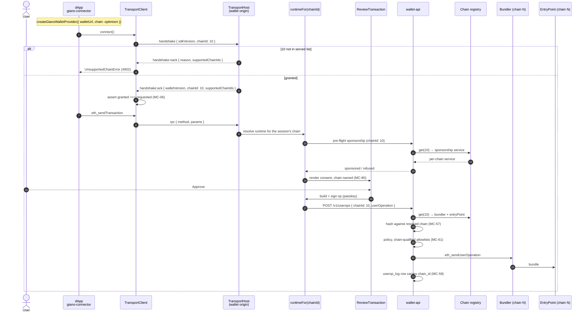

# Giano multi-chain — technical specification

This document is the **how** for the multi-chain work whose **what** is
[`specs/MULTICHAIN_REQUIREMENTS.md`](./MULTICHAIN_REQUIREMENTS.md). It specifies the components,
their interfaces, the wire protocol, the configuration shapes, the data model and the changes to
existing Giano code — at the altitude a technical leader needs to approve the shape of the work, not
at the altitude of function bodies.

Every requirement `MC-nn` referenced here is defined in that document.
[§18](#18-traceability) maps all 140 requirements to the section that implements them.

Status: **draft for technical review.** Every question the requirements left open is answered;
[§1.3](#13-items-closed-since-the-requirements-were-agreed) records how. **One dependency sits
outside this work stream** — the paymaster change in §10.5 — and should be read first.

---

## Contents

1. [Scope and decisions](#1-scope-and-decisions)
2. [Architecture](#2-architecture)
3. [The chain descriptor](#3-the-chain-descriptor)
4. [Address identity](#4-address-identity)
5. [Transport — chain negotiation](#5-transport--chain-negotiation)
6. [The dApp SDK](#6-the-dapp-sdk)
7. [`wallet-core` — the per-chain provider](#7-wallet-core--the-per-chain-provider)
8. [`wallet-web` — the wallet origin](#8-wallet-web--the-wallet-origin)
9. [`wallet-api` — serving several chains](#9-wallet-api--serving-several-chains)
10. [Gas sponsorship across chains](#10-gas-sponsorship-across-chains)
11. [Owner-set convergence](#11-owner-set-convergence)
12. [Data model and migrations](#12-data-model-and-migrations)
13. [Observability](#13-observability)
14. [Test, demo and example stacks](#14-test-demo-and-example-stacks)
15. [Configuration and operations](#15-configuration-and-operations)
16. [Testing strategy](#16-testing-strategy)
17. [Delivery plan](#17-delivery-plan)
18. [Traceability](#18-traceability)

---

## 1. Scope and decisions

### 1.1 What is being built

**One new concept:** the **chain descriptor** — a single configuration shape, carried identically by
the wallet origin, the backend and the operator console, naming every chain a deployment serves
(§3). Everything else is a consequence of it.

**One new protocol exchange:** chain negotiation in the popup handshake, so the dApp names its chain
and the wallet origin grants or refuses it (§5).

**One new invariant, enforced at boot:** the account factory and implementation sit at the same
addresses on every served chain, which is what makes one passkey resolve to one address everywhere
(§4).

**One new background job:** owner-set convergence, which replays owner-management operations onto
every served chain and detects divergence (§11).

**Changed.** `wallet-transport` gains two optional handshake fields and one message type;
`connector` gains chain declaration and confirmation; `wallet-core` moves from one bundler and one
factory to a per-chain resource set, and its `wallet_switchEthereumChain` defect is fixed;
`wallet-web` moves from one runtime to a lazily-built map of runtimes and shows the chain on every
consent screen; `wallet-api` moves from three scalar environment variables to a verified chain
registry, and resolves the chain per request; the sponsorship stack — already chain-keyed
throughout — is fed per-chain rather than a constant; the e2e stack runs two chains and both
demonstration applications gain cross-chain submission.

**Not changed.** Users, credentials, sessions, WebAuthn ceremonies and tenant resolution. They are
chain-agnostic and stay that way (MC-76–MC-79). The sponsorship schema, ledger arithmetic and
reservation semantics are untouched: they were designed chain-keyed and this work only supplies more
than one value.

Everything in
[`MULTICHAIN_REQUIREMENTS.md` §2.3](./MULTICHAIN_REQUIREMENTS.md#23-out-of-scope-for-v1) stays out of
scope. In particular there is no mid-session chain switching and no concurrent multi-chain session.

### 1.2 Decisions taken

Each closes an option that would have changed the architecture.

| # | Decision | Consequence in this document |
|---|---|---|
| S1 | **The chain is a property of the transport session, not of the wallet-api session.** It is negotiated in the handshake and held by the wallet origin for the life of that popup connection | §5.2. Backend sessions stay chain-agnostic (MC-76), so one sign-in serves every chain and nothing has to invalidate a session when a dApp addresses a different chain |
| S2 | **On the backend the chain travels per request, in the body**, resolved against a closed registry before any work happens | §9.3. Answers requirements [Q2](./MULTICHAIN_REQUIREMENTS.md#7-open-questions) in favour of the body: ERC-7677's fixed JSON-RPC shape already carries it there, and a path-based scheme would need two conventions |
| S3 | **Address identity is an admission gate at boot**, checked against the chains themselves, not against a committed file | §4.2. A chain that cannot offer the canonical factory prevents start-up rather than failing a user's first transaction (MC-19, MC-20) |
| S4 | **`credentials.wallet_address` stays a single column.** The schema is deliberately incapable of expressing a per-chain address | §12.2. Makes MC-24 structural: a broken invariant cannot be quietly absorbed into a mapping table |
| S5 | **Owner-set convergence is a durable backend job, not browser best-effort** | §11.3. An ephemeral popup cannot guarantee delivery to N chains; a table plus a worker can, and it is what makes MC-36 and MC-37 answerable |
| S6 | **Address-valued policy is per chain, always, with no inheritance of any kind.** The storage cannot express a chain-agnostic address allowlist | §9.5. Matches `tenant_sponsorship`'s existing `(tenant, chain)` shape (MC-61). Requirements Q4 |
| S11 | **Naming the chain is mandatory; there is no default chain anywhere.** The SDK's `chain` parameter is already required, so this costs integrators nothing | §5.2, §3.1. The handshake change is breaking, which is affordable only because nothing is deployed (MC-11, MC-148). Requirements Q9 |
| S12 | **The sponsorship authorisation for wallet-management operations is chain-independent**; every other class stays bound to one chain | §10.5, §11.2. Without it a sponsored owner-management operation has a different hash per chain and one signature works on one chain only (MC-142). **Depends on a `GianoPaymaster` change** |
| S13 | **Canonical is an explicitly frozen constant**, exported by `packages/contracts`, not "whatever a reference chain holds" | §4.2. A fleet could otherwise agree unanimously on the wrong build (MC-19). Requirements Q1 |
| S7 | **Structural misconfiguration refuses start-up; unavailability does not** | §3.5, §9.6. The two failures have different fixes and different urgencies, so they must not share a code path (MC-92) |
| S8 | **`wallet_switchEthereumChain` is refused with `4200`, and the wagmi adapter's `switchChain` throws a typed error** | §6.3, §7.3. Closes an advertised-but-unimplemented capability rather than leaving it to fail obscurely (MC-14, MC-15) |
| S9 | **Single-chain is the degenerate case, not a mode.** The scalar environment variables map to a one-entry registry, and every multi-chain surface is driven by `chains.length > 1` | §3.4. One artefact serves both profiles (MC-86–MC-90) |
| S10 | **The e2e stack runs two local networks, chain ids `31337` and `31338`**, from the same pre-baked state generator run twice | §14.1. Distinct ids that cannot be confused, no external dependency, and both start by default (MC-116–MC-118) |

### 1.3 Items closed since the requirements were agreed

All thirteen questions in
[`MULTICHAIN_REQUIREMENTS.md` §7](./MULTICHAIN_REQUIREMENTS.md#7-open-questions) are answered. The
items this document previously left open are recorded here as closed, because other sections cite
them.

| # | Item | Resolution |
|---|---|---|
| O1 | The divergent factory | **Clean slate** (Q1). Two independent causes, neither a compiler drift: 381185 was built against a non-canonical EntryPoint, which the implementation hardcodes; Base predates the v1.1.0 contract changes. Freeze canonical now, deploy to every fleet chain, remove pre-freeze entries. §4.5 |
| O2 | Replaying one signed owner-management operation is far more constrained than it looks | **Keep the replay path; make the sponsorship authorisation chain-independent for wallet management only** (Q5). §11 states the five preconditions and how each is met. The blocking one was `paymasterAndData`; S12 resolves it |
| O3 | Relay rate limiting scope | **Shared per tenant** across chains (Q6). §9.4 |
| O4 | A served-chains discovery endpoint | **Not in v1** (Q8). The refusal carries the list. §5.3 |
| O5 | Default chain scope | **No default; naming the chain is mandatory** (Q9). §5.2. The default's two other jobs move: registration deploys on the negotiated chain (§4.6), and canonical becomes a frozen constant (§4.2) |
| O6 | The chain id in the WebAuthn user handle | **Removed** (Q10). §7.4 |
| O7 | One backend process or one per chain | **One process**, with per-chain resource isolation (Q3). §9.2, §9.6 |
| O8 | Which chains the test stack runs | **Two local networks, `31337` and `31338`** (Q13). §14.1 |
| O9 | Withdrawing a chain | **Design for safe re-adoption, defer the exit story** (Q11). §11.5 |

**One dependency outside this work stream.** S12 requires a `GianoPaymaster` change — a
wallet-management authorisation class whose EIP-712 domain omits `chainId` — plus per-chain
reservation and settlement for a single authorisation.
[`PAYMASTER-SPECS.md`](./PAYMASTER-SPECS.md) §3.5 and §9.1 must be updated in step. This is the only
item here that another team owns.

---

## 2. Architecture

### 2.1 Components

| Component | Where | Kind | Responsibility |
|---|---|---|---|
| Chain descriptor | `packages/contracts/src/chains.ts` (new, shared) | new type + validator | The one configuration shape (§3), plus the zod validator every consumer uses |
| Chain registry | `wallet-api/src/services/chains.ts` | new | Builds and verifies the per-chain resource set at boot; the only way to reach a chain |
| Chain verifier | `wallet-api/src/services/chain-verify.ts` + `contracts/scripts/doctor.ts` | new / changed | Endpoint identity, EntryPoint, factory address, paymaster presence (§3.5) |
| Chain negotiation | `wallet-transport/src/{protocol,client,host}.ts` | changed | Two handshake fields, one new message type (§5) |
| SDK chain declaration | `connector/src/thin/create-giano-wallet-provider.ts` | changed | Declares the chain, confirms the grant, refuses switching (§6) |
| Per-chain provider | `wallet-core/src/provider.ts` | changed | Bundler, factory and read client resolved per chain; switch defect fixed (§7) |
| Runtime map | `wallet-web/src/wallet.ts`, `config.ts` | changed | `runtimeFor(chainId)`, lazily built (§8.2) |
| Consent chain display | `wallet-web/src/views/*` | changed | Chain name on every consent screen (§8.3) |
| Per-chain services | `wallet-api/src/app.ts` | changed | Bundler service, read client, paymaster reader and sponsorship service per chain (§9.2) |
| Chain resolution | `wallet-api/src/plugins/chain.ts` | new plugin | Resolves and validates `chainId` on every chain-facing request (§9.3) |
| Owner sync | `wallet-api/src/services/owner-sync.ts` + migration | new | Durable per-chain application of owner-management operations, and divergence detection (§11) |
| Two-chain devnet | `e2e/devnet/`, `deploy/docker-compose.e2e.yml` | changed | Two networks, two bundlers, one wallet-api, one wallet origin (§14.1) |
| Cross-chain demos | `e2e/dapp/`, `services/custom-example/` | changed | Second-chain submission in the fixture and the example app (§14.2, §14.3) |

Tenant resolution, sessions, WebAuthn and the relay's policy engine keep their shape. The chain
registry is additive: everything that currently reads `config.CHAIN_ID` reads
`chains.get(chainId)` instead.

### 2.2 The path a transaction takes



### 2.3 Where the chain is decided, validated and recorded

| Stage | Who decides | What validates it | Where it is recorded |
|---|---|---|---|
| dApp intent | The dApp, at SDK construction | Nothing yet — it is a request (MC-01) | The SDK's session cache key |
| Session grant | The wallet origin, from its served list | Membership of the configured list (MC-03) | The transport session on the wallet origin |
| Grant confirmation | The SDK | Compare granted against requested; `eth_chainId` fallback against an old origin (MC-06, §5.4) | The SDK's cached session |
| Per-request | The caller names it | The chain registry: served, and structurally verified at boot (MC-51, MC-52) | The request context |
| Operation hash | The backend, from the resolved chain | Never from the request body (MC-57) | `userop_log.chain_id` |
| Sponsorship | The ERC-7677 params | Registry membership + per-chain EntryPoint (MC-70) | `sponsorship_decisions.chain_id` |
| On-chain | The EntryPoint | The operation hash commits to the chain id | The chain itself |

The asymmetry is the point. A caller may *name* a chain at every stage; only configuration ever
*admits* one, and the hash the chain will actually verify is computed from the admitted value.

---

## 3. The chain descriptor

### 3.1 The shape

One type, defined once in `@appliedblockchain/giano-contracts` alongside the address registry, and
imported by every consumer (MC-95). Each consumer validates the same core and extends it with what
only it needs.

```ts
/** The core every consumer shares. */
type ChainDescriptor = {
  chainId: number;
  /** Human-readable, shown to users and operators. Required — MC-81 forbids bare ids in the UI. */
  name: string;
  /** Read path. */
  rpcUrl: string;
  /* No `default` field: there is no default chain. A dApp always names the chain it wants
     (S11), and a backend request omits it only when a single chain is configured (§9.3). */
};

/** wallet-api adds submission and the on-chain addresses it must not take from a request. */
type BackendChainDescriptor = ChainDescriptor & {
  bundlerUrl: string;
  /** Both default from the contracts registry for `chainId`; explicit values win. */
  entryPoint?: Address;
  factory?: Address;
  sponsorshipPaymaster?: Address;
  /** Per-chain policy defaults. Address-valued fields are never inherited across chains (§9.5). */
  policy?: {
    maxCallGas?: bigint; maxVerificationGas?: bigint;
    maxFeePerGas?: bigint; maxPriorityFeePerGas?: bigint;
    allowedTargets?: Address[]; allowedPaymasters?: Address[];
  };
};

/** wallet-web adds what the browser needs; it never learns an RPC endpoint it may not use. */
type WalletChainDescriptor = ChainDescriptor & {
  bundlerUrl: string;
  factoryAddress: Address;
  sponsorship: 'service' | 'test-paymaster' | 'off';
  paymasterServiceUrl?: string;
  testPaymasterAddress?: Address;
};
```

`paymaster-admin`'s existing `Deployment` type is the same core plus `paymasterAddress` and
`refreshSeconds`; its `label` field folds into `name`. That console is the in-repo precedent for
this pattern — a runtime-fetched list that is *the whole of what the component can reach* — and this
specification generalises it rather than inventing a second idiom.

### 3.2 `wallet-api` configuration

```
GIANO_CHAINS='[
  { "chainId": 8453,  "name": "Base",        "rpcUrl": "https://…", "bundlerUrl": "https://…" },
  { "chainId": 10,    "name": "OP Mainnet",  "rpcUrl": "https://…", "bundlerUrl": "https://…" }
]'
```

Validated by zod exactly as `TENANTS_SEED` is, with the same failure mode: a bad entry is a start-up
error naming the chain and the field, not a warning (MC-42). Rules:

- `chainId` values are unique. A duplicate is a configuration error.
- `name` is required and need not be unique, but a duplicate name is a warning — operators read
  names, and two chains called "Testnet" is an incident waiting to happen.
- No entry is privileged. There is no default chain: a connection names its chain or is refused
  (MC-11), and a backend request may omit it only when the list has exactly one entry (MC-53).
- `entryPoint`, `factory` and `sponsorshipPaymaster` default from `gianoAddresses[chainId]`. A chain
  absent from the registry must supply `entryPoint` and `factory` explicitly, exactly as today.

### 3.3 `wallet-web` configuration

`config.json` gains a `chains` array and keeps every other key at the top level, because those keys
are genuinely deployment-wide rather than per chain:

```json
{
  "chains": [
    { "chainId": 8453, "name": "Base", "rpcUrl": "…", "bundlerUrl": "…",
      "factoryAddress": "0x…", "sponsorship": "service" },
    { "chainId": 10, "name": "OP Mainnet", "rpcUrl": "…", "bundlerUrl": "…",
      "factoryAddress": "0x…", "sponsorship": "service" }
  ],
  "walletApiUrl": "/api",
  "allowedDappOrigins": ["https://app.example.com"],
  "rpId": "wallet.example.com",
  "branding": { "name": "Example Wallet" }
}
```

The container renders it from environment variables at boot as it does now, so one published image
serves any deployment (MC-41). `GIANO_CHAINS` is passed through as a JSON document rather than
expanded per field, because a per-field template cannot express a variable-length list.

The `allowTestPaymaster` production guard becomes per chain: a production build refuses to load if
**any** descriptor selects the permissive test paymaster without the explicit override. One
misconfigured chain in a list is exactly the case the guard exists for.

### 3.4 Single-chain shorthand, and profile collapse

`CHAIN_ID` / `RPC_URL` / `BUNDLER_URL` (and their `GIANO_*` equivalents in the wallet origin)
continue to be accepted and are normalised into a one-entry list (MC-47, MC-88):

```
CHAIN_ID=8453  RPC_URL=…  BUNDLER_URL=…
   ↓ normalise
[{ chainId: 8453, name: <registry name or "chain 8453">, rpcUrl: …, bundlerUrl: … }]
```

Supplying both the scalars and `GIANO_CHAINS` is a configuration error, not a merge. Silent
precedence between two ways of saying the same thing is how a deployment ends up on a chain nobody
chose.

**Profile collapse.** Every multi-chain surface is driven by one predicate, `chains.length > 1`
(MC-89):

| Surface | `length === 1` | `length > 1` |
|---|---|---|
| Handshake | `chainId` **required**; must match the one served chain | `chainId` **required**; must match a served chain |
| `POST /v1/userops` | `chainId` optional, defaults to the one chain | `chainId` required; omission is a `400` (MC-53) |
| Admin sponsorship routes | `chainId` optional | `chainId` required |
| Wallet UI | No picker; chain still named on consent screens (MC-80) | Chain named; no picker either — the dApp chose it (D1) |
| Example app | No chain selector | Chain selector (§14.3) |
| Metrics | `chain` label present, one value | `chain` label present, N values |

The chain label is present in both cases deliberately: a dashboard should not change shape when a
deployment adds a chain, and an on-premises deployment's metrics should be readable next to the
standalone deployment's.

### 3.5 Boot-time verification

Every configured chain passes `verifyChain(descriptor)` before the deployment serves traffic
(MC-48, MC-100). It returns a structured result rather than throwing, so the caller decides which
failures are fatal (S7):

```ts
type ChainVerification = {
  chainId: number;
  reachable: boolean;
  reportedChainId?: number;         // from eth_chainId
  entryPointPresent?: boolean;
  factoryPresent?: boolean;
  factoryAddressCanonical?: boolean; // §4.2
  implementationAddress?: Address;
  paymasterPresent?: boolean;        // only when sponsorship is enabled
  failures: ChainVerificationFailure[];
};

type ChainVerificationFailure =
  | { kind: 'unreachable'; detail: string }                    // NOT fatal
  | { kind: 'chain-id-mismatch'; declared: number; reported: number }
  | { kind: 'entrypoint-missing'; address: Address }
  | { kind: 'factory-missing'; address: Address }
  | { kind: 'factory-not-canonical'; expected: Address; found: Address }
  | { kind: 'implementation-mismatch'; expected: Address; found: Address }
  | { kind: 'paymaster-missing'; address: Address };
```

**Fatal at start-up:** every failure kind except `unreachable`. These are misconfigurations — the
operator pointed at the wrong endpoint, or deployed the wrong contracts, or is serving a chain whose
factory diverges — and none of them is fixed by waiting (MC-49, MC-92).

**Not fatal:** `unreachable`. The deployment starts, marks that chain unavailable, serves its other
chains, and retries in the background (MC-54).

The same routine backs `giano-doctor chain`, so the pre-deployment check and the boot check are one
implementation and cannot disagree (MC-100).

---

## 4. Address identity

### 4.1 What the address actually depends on

```
account = CREATE2(
    deployer   = factory address,
    salt       = keccak256(abi.encode(owners, nonce)),
    initCode   = ERC-1967 proxy init code, which embeds `implementation`
)
```

Four inputs, and **the chain id is not one of them**. So for a given passkey the address is identical
on chains A and B exactly when:

| Input | Identical because |
|---|---|
| `owners` | The same passkey produces the same 64-byte `x‖y` owner blob |
| `nonce` | Giano always uses `0` (MC-21) |
| factory address | Deterministic deployment with a fixed salt from a byte-identical creation code |
| `implementation` (inside the proxy init code) | Same, and implied by the factory address matching, since the implementation address is a constructor argument baked into the factory's creation code |

The last two are the real preconditions. Each requires:

1. the deterministic-deployment mechanism present **at the same address** on both chains (MC-25);
2. the same fixed salt — `0xAB…AB`, already set in the Ignition strategy configuration;
3. **byte-identical creation code**, which means the same compiler version, optimiser runs,
   intermediate-representation setting, target EVM version and metadata configuration (MC-26).

Because the implementation address is a constructor argument to the factory, a matching factory
address *implies* a matching implementation. Checking the factory address is therefore sufficient —
and the implementation is checked anyway, because a cheap direct check beats an implication when the
consequence is a user's funds arriving at the wrong address.

### 4.2 The admission gate

`verifyChain` (§3.5) performs, for every configured chain:

1. `eth_getCode(factory)` is non-empty → `factoryPresent`.
2. `factory === CANONICAL_FACTORY` → `factoryAddressCanonical`. `CANONICAL_FACTORY` and
   `CANONICAL_IMPLEMENTATION` are constants exported by `packages/contracts`, frozen from the build
   in §4.5 — **not** taken from a reference chain, which would let a fleet agree unanimously on the
   wrong build (S13).
3. `factory.implementation() === CANONICAL_IMPLEMENTATION` → `implementationAddress` check.
4. Once, at boot, a **live cross-check**: `factory.getAddress([probeOwner], 0)` on every served chain
   returns the same address (MC-22). The probe owner is a fixed, well-known 64-byte value that is
   never a real credential.

Steps 2, 3 and 4 failing are fatal (§3.5). Step 4 is the one that would catch a factory at the right
address running different code — the case bytecode comparison alone would miss.

The same cross-check runs as a periodic operational probe, feeding the alert in MC-104: a served
chain whose factory ceases to agree is a page, not a log line.

### 4.3 Deploy pipeline

`packages/contracts` changes:

- **Pre-flight (MC-25).** Before deploying to a new chain, assert the deterministic-deployment
  contract the Ignition `create2` strategy relies on is present at its expected address. If absent,
  place it first, or fail naming the missing contract and its address. *Identifying that contract
  and confirming its cross-chain address is a prerequisite task* — it is a property of the tooling,
  not of Giano, and must be established per candidate chain rather than assumed.
- **Post-deploy assertion (MC-99).** After deploying, assert the produced factory and implementation
  addresses equal the registry's canonical pair. Fail the deployment rather than write a divergent
  registry entry.
- **Compiler pinning (MC-26).** The solc version, optimiser runs, `viaIR` and EVM version are already
  fixed in the Hardhat configuration. Add a check that treats any change to them as an
  address-breaking change: the determinism workflow must fail rather than quietly re-baseline.

### 4.4 Determinism CI

`determinism.yml` today deploys to a fresh local network and compares against the committed **Base**
deployment only. Change it to compare against **every** chain directory under
`ignition/deployments/` that is marked canonical (MC-27):

```
for each chain-<id> in ignition/deployments/, excluding chains marked non-canonical:
    assert deployed_addresses['GianoAccountFactory#GianoSmartWalletFactory'] == local
    assert deployed_addresses['GianoAccountFactory#GianoSmartWallet']        == local
```

Non-canonical chains are listed explicitly in `address-overrides.json` with a reason, so exclusion
is a recorded decision rather than an omission (MC-28).

### 4.5 Freezing canonical, and the pre-freeze entries

The registry today holds **three generations** of the contracts, and a build from `HEAD` matches none
of them:

| Entry | Factory | Why it differs |
|---|---|---|
| 8453 / 84532 (Base) | `0x26dCd293…` | Deployed **before** the v1.1.0 contract changes. Its build compiled 21 sources; 381185's compiled 37. The `ownerIndex` → `ownerBytes` signing change landed afterwards |
| 381185 | `0x3451C877…` | Built against a **non-canonical EntryPoint** (`0xB10F0BF2…`). The implementation hardcodes `entryPoint()`, so that one constant changes the bytecode, the implementation address and therefore the factory address |
| `HEAD` | — | Differs from 381185 by exactly that one line, and from Base by the whole v1.1.0 change set |

Compiler settings are byte-identical across all three (0.8.28, runs 200, `viaIR`, `paris`), so none
of this is toolchain drift. **Nothing was ever canonical**, which is the real finding — "381185 is the
odd one out" was the wrong framing.

Because no production accounts exist, the resolution is a clean freeze (Q1):

1. Tag a canonical contracts build from `HEAD`.
2. Deploy it to every chain in the fleet, including Base, asserting the produced addresses match
   (§4.3).
3. Export `CANONICAL_FACTORY` and `CANONICAL_IMPLEMENTATION` from `packages/contracts` as the
   constants §4.2 compares against.
4. **Remove** the three pre-freeze registry entries. Retaining them as "legacy" would preserve only
   the ambiguity about which build is canonical (MC-28).

**The generalisable lesson is MC-141.** The account implementation hardcodes the EntryPoint address,
so *any* chain not carrying EntryPoint v0.7 at `0x0000000071727De2…` produces a different account
bytecode and a different address for everything downstream. On public chains this is essentially
always satisfied. **On a private chain it is not**, which makes it a required first step of the
on-premises runbook and of the adoption checklist (§15.3) — not a hypothetical, since it is exactly
what happened to 381185.

### 4.6 Lazy per-chain deployment

Same address, different deployment state. The account exists counterfactually on every served chain
and is deployed on each one by its first operation there (MC-29).

- Credential creation deploys the account on the **negotiated chain** — the chain the dApp named for
  the session in which the credential was created. Today `eth_requestAccounts` calls
  `ensureSmartAccountIsDeployed` once; that behaviour is kept and scoped to that chain. This is more
  correct than a fixed chain would be: the user is transacting where they are, and deploying on N
  chains at registration would cost N transactions for chains they may never touch.
- The first operation on any other chain carries `initCode` and deploys as part of itself. This is
  the standard ERC-4337 path and needs no new code — only per-chain `isSmartAccountDeployed`, which
  is already per-client and therefore already correct.
- `signed_eth_call` already falls back to a plain call when the account is not deployed; that
  fallback becomes per chain automatically.
- The wallet reports deployment state per chain and does not present "not deployed here" as an error
  (MC-30).

**Interaction with §11.** Owner-management replay requires the account to be **deployed on every
target chain**, because `initCode` is inside the replayable hash: an operation carrying init code and
one not carrying it are different operations. §11.1 makes this an explicit precondition.

---

## 5. Transport — chain negotiation

### 5.1 Wire changes

Two optional fields and one new message type. The envelope, the version and the origin pinning are
untouched.

```ts
// dApp → wallet. `chainId` is NEW and REQUIRED (S11). This is a breaking protocol change,
// affordable only because nothing is deployed (MC-148).
handshakeMessageSchema.payload = {
  sdkVersion: string;
  capabilities: string[];            // default []
  chainId: number;                   // NEW, REQUIRED — the chain the dApp will transact on
}

// wallet → dApp. Both NEW and REQUIRED.
handshakeAckMessageSchema.payload = {
  walletVersion: string;
  capabilities: string[];
  chainId: number;                   // NEW — the chain granted; always equals the request
  supportedChainIds: number[];       // NEW — every chain this origin serves
}

// NEW message type: the handshake was refused. Distinct from `close`, which is teardown.
handshakeNackMessageSchema = {
  giano: 1; id: string; type: 'handshake:nack';
  payload: {
    reason: 'unsupported-chain' | 'chain-required' | 'origin-not-allowed' | 'protocol-version';
    message: string;
    supportedChainIds?: number[];    // present for 'unsupported-chain'
  };
}
```

`RPC_ERRORS` gains one constant:

```ts
UNSUPPORTED_CHAIN: 4902     // EIP-3326's "Unrecognized chain ID", the ecosystem convention
```

Adding a member to the discriminated union is safe in both directions: `parseTransportMessage`
returns `null` for anything it does not recognise, and an SDK that does not recognise `handshake:nack`
simply times out its connect — a failure, which is the correct outcome, rather than a false success.

### 5.2 Negotiation

On the wallet origin, chain selection happens **once per transport session**, at handshake, and the
granted chain is held on the session object (S1). It is not written to the backend session, which
stays chain-agnostic (MC-76), and it is not persisted: a new popup re-negotiates.

```
TransportHost.onHandshake(message, origin):
  1. origin pinning — unchanged, still first, still fail-closed
  2. requested = message.payload.chainId
  3. if requested is undefined:
         send handshake:nack { reason: 'chain-required', supportedChainIds }
         do not establish the session
     else if requested is in servedChainIds:
         granted = that descriptor
     else:
         send handshake:nack { reason: 'unsupported-chain', supportedChainIds }
         do not establish the session; do not process any rpc message
  4. session.chainId = granted.chainId
  5. send handshake:ack { walletVersion, capabilities, chainId: granted.chainId, supportedChainIds }
```

Every subsequent `rpc` message on that session is served by `runtimeFor(session.chainId)` (§8.2).
There is no path by which a request on a session reaches a different chain's runtime.

### 5.3 Refusal semantics

| Condition | Response | dApp sees |
|---|---|---|
| Requested chain not served | `handshake:nack{ unsupported-chain, supportedChainIds }` | `UnsupportedChainError`, code `4902`, with `supportedChainIds` (MC-04) |
| Origin not allow-listed | `handshake:nack{ origin-not-allowed }` | Existing behaviour, now with a reason instead of silence |
| `wallet_switchEthereumChain` / `wallet_addEthereumChain` | `rpc:response` error `4200` | `TransportRpcError`, unsupported method (MC-14) |
| Chain served but its endpoint is down | Session established; the failing request returns `4901` | Retryable, and distinct from `4902`, which never will be (MC-55) |

`4902` and `4901` carrying different meanings is deliberate and is MC-55: "this deployment does not
serve that chain" is permanent, "that chain is temporarily unavailable" is not, and an integrator
must be able to tell them apart without reading prose.

No unauthenticated served-chains endpoint in v1 (O4). The nack already carries the list at the moment
an integrator needs it, and a public endpoint discloses the deployment's shape to any origin that
asks.

### 5.4 Why this is a breaking change, and why that is affordable

Requiring `chainId` in the handshake means an SDK that does not send one cannot connect, and a wallet
origin that does not understand it cannot serve a new SDK. That is a **breaking protocol change**,
and it is deliberate (S11).

It is affordable exactly once. No wallet origin is deployed and no tenant has integrated, so there is
no compatibility to preserve — and the alternative, a default chain for dApps that name none, *is*
the silent-mismatch path of §1.1, the one thing this work exists to eliminate. A compatibility
affordance that nobody needs and that preserves the defect is not a trade worth making.

What makes it cheap is that **`createGianoWalletProvider` already requires `chain`**. The dApp names
its chain today; this work only puts the value on the wire. No integration signature changes, and
there is no "recommended shape" to document over another — the shape is the only one (MC-12).

The corollary is MC-148: the wire format, the credential user handle, the canonical contract bytecode
and the policy storage are all being fixed while nothing is in production, and each is frozen once
the first tenant integrates. This latitude is available once.

---

## 6. The dApp SDK

### 6.1 Surface

```ts
type CreateGianoWalletProviderParams = {
  walletUrl: string;
  chain: Chain;                    // unchanged: exactly one, fixed for the instance (MC-01)
  transport?: Transport;
  walletApiPath?: string;
  storage?: …;
  sdkVersion?: string;
};

type GianoWalletProvider = {
  request: …;  on: …;  removeListener: …;  isConnected: …;  disconnect: …;
  /** NEW — the chain granted by the wallet origin, once connected. */
  chainId: number;
  /** NEW — chains the wallet origin advertised. */
  supportedChainIds: readonly number[];
};

/** Thrown when the wallet origin refuses the requested chain, or serves none matching. */
class UnsupportedChainError extends TransportError {
  code: 4902;
  requestedChainId: number;
  supportedChainIds: readonly number[];
}
```

`chain` stays singular and required. A dApp addressing two chains constructs two providers
(MC-10) — which works today without change, because the session cache key is already namespaced
`giano:sdk:session:{walletOrigin}:{chainId}` (MC-09). That namespacing, added for a different
reason, is exactly what this design needs.

### 6.2 Read path

`publicClient` is built from `params.chain` and `params.transport` as it is now, and answers every
non-wallet method locally. Because the granted chain is asserted equal to `params.chain` (MC-06),
the read path and the write path cannot disagree — which is the defect in requirements §1.1, closed
(MC-08).

`eth_chainId` returns the granted chain: from the cached session when present, otherwise
`params.chain.id` (MC-07).

### 6.3 Method routing

`WALLET_METHODS` is unchanged. Two methods gain explicit refusals ahead of the read-path fallthrough
(MC-14):

```
case 'wallet_switchEthereumChain':
case 'wallet_addEthereumChain':
    throw new TransportRpcError(RPC_ERRORS.UNSUPPORTED_METHOD,
        'Giano binds one chain per provider instance; construct another provider for another chain')
```

Today these fall through to `publicClient.request`, which sends them to an HTTP RPC endpoint that
cannot honour them — so the current failure is obscure and endpoint-dependent. This makes it a
documented, typed refusal naming the alternative.

### 6.4 The wagmi adapter

`createGianoConnector` currently implements `switchChain` by calling `wallet_switchEthereumChain`
(MC-15). It becomes:

```ts
switchChain: async ({ chainId }) => {
  throw new UnsupportedChainSwitchError(
    'Giano binds one chain per connector instance. Create a connector over a provider ' +
    'constructed for the target chain.')
}
```

Throwing rather than removing the method: wagmi's `useSwitchChain` surfaces a thrown error to the
UI, whereas an absent method produces a less legible failure deeper in the stack. `getChainId`
continues to answer from `eth_chainId`, which is now the granted chain.

---

## 7. `wallet-core` — the per-chain provider

### 7.1 Parameters

`createGianoProvider` already accepts `chains: readonly Chain[]` and
`transports: Record<number, Transport>`. Two singular parameters become per-chain, which is the whole
change:

```ts
type CreateGianoProviderParams = {
  initialChainId: number;
  chains: readonly Chain[];
  transports: Record<number, Transport> | undefined;

  // WAS: bundler: BundlerClient
  bundlers: Record<number, BundlerClient>;                 // one per chain
  // WAS: gianoSmartWalletFactoryAddress: Address
  factoryAddresses: Record<number, Address>;               // one per chain

  injection: GianoProviderInjection;                        // unchanged, chain-agnostic
  logger?: GianoLogger;
  // WAS: () => Promise<FeeValues>
  estimateFeesPerGas?: (chainId: number) => Promise<FeeValues>;
};
```

`factoryAddresses` is a map even though §4 guarantees the values are identical. Passing one address
would encode the invariant in the type where nothing checks it; passing a map keeps the provider
honest about what it is doing, and means a deployment that is *not* address-identical — a
single-chain 381185 deployment beside a canonical one — is still expressible.

### 7.2 Chain-bound state

The provider holds exactly one set of chain-bound state, selected by the current chain:

| State | Chain-bound | Reset on chain change |
|---|---|---|
| `chain`, `transport`, `client` | yes | replaced |
| `bundler` | **yes — not today** | replaced |
| factory address | **yes — not today** | replaced |
| `smartAccount` | yes (derived from `client`) | nulled, already |
| `staticSignature`, `staticSignatureSignedAt`, `staticSignatureLifetime` | **yes — not today** | cleared |
| `injection`, event listeners | no | kept |

### 7.3 The latent defect

`wallet_switchEthereumChain` currently swaps `chain`, `transport` and `client`, and nulls
`smartAccount`. It does **not** swap the bundler, the factory address, or the cached authenticated-read
signature. With one configured chain this is invisible. With two it means a chain switch continues
submitting user operations to the **previous chain's bundler**, and deriving addresses from the
previous chain's factory.

The provider's own bootstrap goes through this same method, so the fix is required even though v1
never switches after bootstrap (D1):

```
wallet_switchEthereumChain([{ chainId }]):
  1. if chainId === current: return null
  2. newChain = chains.find(id) or throw
  3. newTransport = transports[id] or throw
  4. newBundler  = bundlers[id]  or throw          ← NEW
  5. newFactory  = factoryAddresses[id] or throw   ← NEW
  6. smartAccount = null
     staticSignature = null; staticSignatureSignedAt = 0; staticSignatureLifetime = 0n   ← NEW
  7. swap chain, transport, client, bundler, factory
  8. emit chainChanged
```

Steps 4 and 5 throwing rather than falling back is deliberate: a chain configured for reads but not
for submission is a misconfiguration, and silently keeping the old bundler is exactly the failure
this fixes.

The cached authenticated-read signature must be cleared because it is produced against a specific
account on a specific chain and has a bounded lifetime read from that account. Carrying it across a
chain change would present a signature from one chain to a contract on another.

A regression test asserts that after a switch, a submitted operation reaches the **new** chain's
bundler (MC-113).

`wallet_addEthereumChain` remains a stub, and is now an explicit `4200` refusal rather than a
`// TODO` returning `null` (MC-14).

### 7.4 The WebAuthn user handle

`encodeUserId(id, factoryAddress, chainId, chainType)` stamps the chain in force at credential
creation into the handle, and `decodeUserId` reads it back. A credential is valid on **every** served
chain, so that value is misleading by construction.

Resolution (Q10): **remove the chain id from the handle.**

```ts
// was: { userId, walletFactoryAddress, chainId, chainType }
type DecodedUserId = { userId: string; walletFactoryAddress: Address; chainType: ChainType };
```

Every remaining field is genuinely chain-independent: `walletFactoryAddress` is identical on every
served chain by MC-19, and `chainType` denotes the chain *family* (EVM), not a chain. The handle
therefore ends up containing nothing chain-specific — which is exactly right for a credential that
works everywhere.

Retaining the field as "deprecated, informational" was this document's earlier position and is
rejected. It costs the same to carry as to remove, and a value that is misleading by construction
will eventually be trusted by someone reading it fresh. MC-78 becomes a property of the format rather
than a convention someone must remember.

The layout change is free because no production credentials exist (MC-148); it would be expensive
later, since the handle is written into the authenticator at registration and cannot be rewritten.

`ChainType` stays. It is the right place for a future non-EVM family, and it is not a chain id.

---

## 8. `wallet-web` — the wallet origin

### 8.1 Configuration

`loadWalletConfig` returns `chains: WalletChainDescriptor[]` plus the deployment-wide keys (§3.3).
Validation, all fatal (MC-42):

- at least one descriptor;
- unique `chainId`s;
- no privileged entry — there is no default chain (S11);
- each descriptor resolves a `factoryAddress`, from the entry or from the contracts registry;
- the permissive-test-paymaster production guard applied per descriptor (§3.3).

### 8.2 The runtime map

`createWalletRuntime(config)` becomes `createWalletRuntimes(config)`, returning a lazily-memoised
accessor (MC-43, MC-44):

```ts
type WalletRuntimes = {
  runtimeFor: (chainId: number) => WalletRuntime;   // built on first use, then memoised
  servedChainIds: readonly number[];
  descriptorFor: (chainId: number) => WalletChainDescriptor;
};
```

Each `WalletRuntime` is exactly today's runtime, built from one descriptor: its own viem chain, its
own public client, its own bundler client, its own paymaster hooks, its own fee estimator, its own
`GianoProvider`, its own sponsorship pre-flight. Nothing is shared between chains except the
injection — which is chain-agnostic, holds the wallet-api session, and must **not** be duplicated,
because duplicating it would duplicate the session.

Laziness matters (MC-44): a session that uses one chain must not open RPC and bundler clients for
every configured chain. `runtimeFor` builds on first call.

`WalletRuntime` gains `chainName` alongside `chainId`, for the consent screens.

### 8.3 The host and the consent screens

`createWalletHost` resolves the runtime once per transport session, from the chain negotiated in the
handshake (§5.2), and serves every request on that session through it. `CONSENT_METHODS` and the
silent-restore behaviour are unchanged.

The consent request object gains the chain, so views need not reach into configuration:

```ts
type ConsentRequest = {
  kind: 'connect' | 'transaction' | 'sign';
  method: string; params: unknown; dappOrigin: string;
  chainId: number;      // NEW
  chainName: string;    // NEW (MC-81)
};
```

- **Connect** — names the chain the dApp asked for and was granted.
- **ReviewTransaction** — names the chain alongside target and value (MC-80). Also renders the
  per-chain sponsorship pre-flight result, which is computed by that chain's runtime and never reused
  across chains (MC-71).
- **SignMessage** — names the chain. Where the payload is EIP-712 typed data whose domain carries a
  `chainId` that differs from the session's, the mismatch is shown to the user rather than silently
  accepted (MC-82). It is a warning, not a refusal: signing a message scoped to another chain is a
  legitimate thing to do deliberately and an alarming thing to do unknowingly.
- **Unsupported chain** — never reaches a consent screen, because the handshake refused (§5.2), so no
  passkey ceremony can be triggered for an operation that cannot proceed (MC-85).

### 8.4 Settings

Shows chain name and id, the account address, and whether the account is deployed **on that chain**
(MC-84, MC-30). With one chain served this is one row and looks exactly as it does today (MC-89).

### 8.5 The bring-your-own-wallet reference

`e2e/wallet-byo/src/config.ts` takes the same `chains` array from its build-time environment, and its
runtime takes the same `runtimeFor` shape (MC-45). Its configuration shape is effectively public API
— tenants copy it — so it must not lag the stock wallet, and §14.4 exercises it with two chains
(MC-129).

---

## 9. `wallet-api` — serving several chains

### 9.1 Configuration to registry

```
GIANO_CHAINS (or the scalar shorthand, §3.4)
   → zod validation
   → normalisation (registry defaults for entryPoint / factory / sponsorshipPaymaster)
   → verifyChain per entry (§3.5)
   → ChainRegistry
```

### 9.2 The registry

```ts
type ChainServices = {
  descriptor: BackendChainDescriptor;
  chainId: number;
  publicClient: PublicClient;
  bundler: BundlerService;              // bound to this chain's URL and EntryPoint
  entryPoint: Address;
  factory: Address;
  paymaster?: PaymasterReader;          // present when sponsorship is enabled for this chain
  sponsorship?: SponsorshipService;     // constructed with this chainId
  status: 'ready' | 'unavailable';
};

type ChainRegistry = {
  get: (chainId: number) => ChainServices;         // throws UnknownChainError
  tryGet: (chainId: number) => ChainServices | undefined;
  /** The only chain, when exactly one is configured. Throws otherwise — it is a single-chain
   *  affordance (MC-53), NOT a default chain: nothing resolves to it when several are served. */
  sole: ChainServices;
  all: readonly ChainServices[];
  size: number;
};
```

Built once in `buildApp`, replacing the module-level `bundler`, `publicClient`, `paymaster` and
`sponsorship` singletons. Every existing read of `config.CHAIN_ID`, `config.BUNDLER_URL`,
`config.RPC_URL`, `config.ENTRYPOINT_ADDRESS` and `config.FACTORY_ADDRESS` is replaced by a lookup on
this registry (MC-50).

`buildApp`'s existing design constraint — *never read the tenants table at boot* — is preserved. The
registry reads chains, not tenants.

**One process, per-chain isolation inside it** (O7). The registry is the seam: if per-chain process
isolation is later wanted, it is the only thing that has to change shape.

### 9.3 Request-level chain resolution

A small Fastify plugin, `plugins/chain.ts`, mirroring `plugins/tenant.ts`:

```ts
declare module 'fastify' {
  interface FastifyRequest { chain?: ChainServices }
}

// preHandler, after requireSession where a session is needed
app.requireChain = async (request, reply) => {
  const named = extractChainId(request);              // body.chainId | params[2] for ERC-7677 | query.chainId
  if (named === undefined) {
    if (registry.size === 1) { request.chain = registry.sole; return; }      // MC-53
    return reply.code(400).send({ error: 'chain-required',
      message: 'chainId is required: this deployment serves several chains',
      servedChainIds: registry.all.map(c => c.chainId) });
  }
  const chain = registry.tryGet(named);
  if (!chain) return reply.code(400).send({ error: 'unsupported-chain',      // MC-52
      message: `this deployment does not serve chain ${named}`,
      servedChainIds: registry.all.map(c => c.chainId) });
  if (chain.status !== 'ready') return reply.code(503).send({ error: 'chain-unavailable',  // MC-55
      message: `chain ${named} is temporarily unavailable` });
  request.chain = chain;
};
```

`400` for unsupported and `503` for unavailable, mirroring the transport's `4902`/`4901` split
(§5.3). Never guessing when the chain is omitted and several are served (MC-53) is what keeps a
mistyped or absent field from silently reaching some arbitrary chain.

**Endpoints that do not need it.** `GET /v1/userops/:hash` and `/:hash/receipt` resolve the chain
from the logged row, because the operation hash commits to the chain and `userop_log` now records it
(§12.1). No API change, and the SDK's receipt polling keeps working untouched — which matters,
because that path is used by every dApp.

### 9.4 The relay path

`POST /v1/userops` body gains `chainId: number` — required when the deployment serves more than one
chain, optional otherwise (§3.4). Within the handler:

```
chain = request.chain                                  ← resolved and validated, never body-trusted
useropHash = getUserOperationHash({ chainId: chain.chainId,
                                    entryPointAddress: chain.entryPoint, … })    ← MC-57
policy     = evaluatePolicy(op, session.walletAddress, tenantPolicyFor(request, chain.chainId))  ← §9.5
submit     → chain.bundler.sendUserOperation(op)       ← MC-58
log        → useropLog.insert({ …, chainId: chain.chainId })   ← MC-59
```

The existing comment on that handler — *"the request cannot influence where this op is valid"* —
remains true and is now load-bearing: the chain is resolved from configuration and the hash is
computed from the resolution.

**Rate limiting** stays per tenant, shared across chains (O3). The limit protects the relay and the
tenant's own spend, neither of which becomes N times more available because the deployment gained
chains. Changing it to per tenant and chain is a one-line change to the window key if product
prefers.

### 9.5 Chain-qualified policy

Address-valued policy fields must not cross chains: the same address is different code on different
chains, and an attacker able to deploy to a chosen address on a chain the tenant does not watch would
otherwise inherit an allow (MC-61).

Tenant `policy` jsonb gains an optional per-chain layer:

```ts
type TenantPolicy = {
  // chain-agnostic: safe to inherit
  maxCallGas?: string; maxVerificationGas?: string;
  maxFeePerGas?: string; maxPriorityFeePerGas?: string;
  relayRateLimitPerMinute?: number;
  // address-valued: NEVER inherited across chains
  allowedTargets?: Address[]; allowedPaymasters?: Address[];
  // NEW
  perChain?: Record<number, Partial<TenantPolicy>>;
};
```

Resolution for `(tenant, chain)`:

| Field class | Resolution |
|---|---|
| Gas and fee caps, rate limit | `deployment default` ← `chain descriptor policy` ← `tenant base` ← `tenant perChain[chainId]`. Later wins; inheritance across chains is fine and wanted (MC-62) |
| `allowedTargets`, `allowedPaymasters` | **`perChain[chainId]` only.** No base value, no inheritance, no fallback. Absent an entry, the tenant permits nothing on that chain |

Address-valued fields do not appear at the tenant base level at all — the type above places them
**only** under `perChain`, so a chain-agnostic address allowlist is not expressible (S6, MC-61). This
is the same move as S4: make the violation unrepresentable rather than prevent it with a resolution
rule that a future reader might misapply.

It matches `tenant_sponsorship`, which is already keyed `(tenant_id, chain_id)` with no inheritance
and denies by default (MC-67). Relay policy and sponsorship policy protect the same kind of thing and
now have the same shape.

There is no migration: nothing is in production (Q4). A tenant configuring its first chain writes one
`perChain` entry, and when the deployment serves a single chain the admin API supplies the chain id
for them (MC-53), so an on-premises tenant never encounters the dimension.

The existing sense of an empty `allowedTargets` — *any target allowed* — is preserved **within** a
`perChain` entry. "No entry at all" and "an entry permitting everything" are therefore distinct
states, and the first denies.

### 9.6 Health, readiness and degradation

```ts
GET /v1/version  →  {
  version: string,
  chainId: number | null,                // the sole chain when one is served; null otherwise
  chains: [{ chainId, name, status: 'ready' | 'unavailable' }]                     // NEW (MC-56)
}
```

`GET /healthz` reports the process. A chain being unavailable does **not** make it unhealthy
(MC-54) — that would take a deployment out of rotation because one endpoint blinked, with the other
chains working. `/readyz` requires **at least one** chain ready; per-chain
detail lives in `/v1/version` and in metrics.

A background prober re-runs the reachability half of `verifyChain` on the interval and flips
`status`. It never re-runs the structural half as a status flip: a factory that ceases to match is an
alert and a page (MC-104), not a silent transition to `unavailable`.

### 9.7 API surface summary

| Endpoint | Change |
|---|---|
| `POST /v1/userops` | `chainId` in the body — required when several chains are served |
| `GET /v1/userops/:hash`, `/:hash/receipt` | None; chain resolved from the logged row |
| `POST /v1/paymaster` (ERC-7677) | Routes on the chain already in `params[2]` instead of rejecting all but one (§10.1) |
| `GET/PUT /v1/admin/sponsorship*` | `chainId` query parameter — required when several chains are served (§10.2) |
| `GET /v1/admin/sponsorship/balance`, `/settlements`, `/decisions` | Same |
| `GET /v1/version` | `chains[]` added; `chainId` retained |
| WebAuthn, credentials, sessions, well-known, admin ROR | **No change** (MC-76) |

Every changed schema is regenerated into `openapi/openapi.json`; the CI drift check is expected to
fail until it is, and must be satisfied rather than suppressed (MC-64).

---

## 10. Gas sponsorship across chains

The sponsorship stack was built chain-keyed and needs no schema change. Every table already carries
`chain_id` — most in the primary key — and every service already takes `chainId` as an argument. This
section is almost entirely about **supplying more than one value**, with one genuine exception in
§10.5.

### 10.1 ERC-7677 routing

The standard already puts the chain on the wire: `pm_getPaymasterStubData` and `pm_getPaymasterData`
take `[userOp, entryPoint, chainId, context]`. Today the route *rejects* everything but the configured
chain. It now routes on it:

```
1. chain = registry.tryGet(BigInt(params[2]))
   absent      → rpcError(REASON_CODES['chain-or-entrypoint-mismatch'],
                          'this service does not sponsor operations on chain <id>')
   unavailable → rpcError('temporarily-unavailable')          ← retryable, distinct (MC-55)
2. params[1] (entryPoint) must equal chain.entryPoint          ← per chain, not global (MC-70)
3. chain.sponsorship must exist                                ← sponsorship may be enabled per chain
4. delegate to chain.sponsorship, which was constructed with this chainId
```

Steps 1 and 2 preserve the existing convention exactly — the chain and the EntryPoint are validated
against server configuration, never trusted from the request — and only widen what "server
configuration" contains.

### 10.2 Tenant configuration and the admin API

`tenant_sponsorship` is keyed `(tenant_id, chain_id)`, so a tenant's rules are already per chain and
already deny by default when no row exists (MC-67). The admin routes stop reading `config.CHAIN_ID`
and take `chainId` as a query parameter, required when several chains are served and supplied
automatically when one is (MC-53).

| Route | Change |
|---|---|
| `GET/PUT /v1/admin/sponsorship` | `?chainId=` selects the row; `PUT` writes `(tenant, chain)` |
| `GET /v1/admin/sponsorship/history` | `?chainId=` filters |
| `GET /v1/admin/sponsorship/balance` | `?chainId=` — a tenant has one balance **per chain** |
| `GET /v1/admin/sponsorship/settlements`, `/decisions` | `?chainId=` filters |
| `POST /v1/admin/sponsorship/register` | Registers the tenant on **one** chain; registering on three is three calls |

A refusal because the tenant has no configuration or no balance **on the requested chain** carries a
reason distinct from a rule refusal (MC-68), because the operator action differs: fund a balance, or
edit a rule.

### 10.3 Per-chain watchers

`paymaster-watcher` already takes `chainId` and keys its cursor on `paymaster_state.chain_id`. One
instance per chain, started from `index.ts`:

- independent poll loop, cursor and confirmation depth;
- independent lag metrics, labelled by chain (MC-103);
- a chain falling behind, or being unreachable, **must not stall another** (MC-73) — so the loops are
  independent tasks, not one loop iterating chains;
- reconciliation and the accounting invariant are evaluated per chain, because the invariant is a
  per-deposit property and each chain has its own deposit.

### 10.4 Pre-flight

`checkSponsorship` is a method on a `WalletRuntime`, and runtimes are per chain (§8.2), so the
pre-flight is automatically evaluated for the chain the operation will be submitted to (MC-71). No
result is cached across runtimes.

### 10.5 Wallet-management authorisations are chain-independent

**This is the one substantive change to the sponsorship design, and it depends on a
`GianoPaymaster` change owned by another work stream (S12).**

§11.1 shows why it is required: the chain-free operation hash covers `paymasterAndData`, so a
per-chain sponsorship signature gives a sponsored owner-management operation a different hash on every
chain, and the user's single signature is then valid on exactly one of them.

```
ordinary operation      → domain { name, version, chainId, verifyingContract }   ← unchanged
wallet-management op    → domain { name, version,          verifyingContract }   ← chainId omitted
```

**Why omitting `chainId` is safe here specifically.** The paymaster proxy sits at the same address on
every chain, by the same CREATE2 determinism that fixes the factory address — so `verifyingContract`
already discriminates the deployment, and only the chain id has to come out. The authorisation
remains bound to the sender, the nonce, the gas limits and `validUntil`. Each chain's EntryPoint
spends that nonce once. So the authorisation can be used **at most once per chain, for exactly the
operation the user approved** — which is the intended semantics, since the operation is meant to run
on every chain.

**What the paymaster must enforce.** The chain-independent domain is accepted **only** when the
operation's calldata selector is `executeWithoutChainIdValidation`. That check is structural and
on-chain, mirroring the account's own restriction, so the widened replay surface cannot be reached by
an ordinary transaction even if the service were compromised into signing one.

**Ledger consequences.** One authorisation is applied on N chains, so:

- the sponsorship service **reserves on every chain it will be applied to**, at authorisation time,
  not lazily — otherwise the balance check on chain 3 has not happened when the signature is issued
  (MC-143);
- settlement happens N times, once per chain's `Sponsored` event, against N reservations;
- a chain whose reservation cannot be taken (insufficient balance there) fails the whole
  authorisation, because a partial owner sync is precisely the divergence this exists to prevent. The
  refusal names the chain and the shortfall;
- the gas figure the reservation is denominated in is the same on all chains (§11.1), so cheap chains
  are **over-reserved** until settlement releases the difference. This is accepted: the over-reservation
  is short-lived, bounded by `SPONSORSHIP_RESERVATION_TTL_SECONDS`, and applies only to
  wallet-management operations, which are rare.

**Platform cap.** Wallet management is already sponsored under a platform policy and a platform cap
rather than a tenant allowlist. That cap now applies **per chain**, so an N-chain sync costs at most
N × cap. The cap should be reviewed against N when the fleet grows.

---

## 11. Owner-set convergence

### 11.1 What the replay path actually requires

The account contract keeps its chain-independent path, restricted to wallet management exactly as it
already restricts it (Q5). `validateUserOp` substitutes a chain-free hash when the calldata selector
is `executeWithoutChainIdValidation`, guarded by the reserved nonce key in both directions, and
`canSkipChainIdValidation` admits only owner add/remove and `upgradeToAndCall`.

```
getUserOpHashWithoutChainId(op) = keccak256(abi.encode(UserOperationLib.hash(op), entryPoint()))
```

`UserOperationLib.hash` covers **sender, nonce, keccak(initCode), keccak(callData), accountGasLimits,
preVerificationGas, gasFees, keccak(paymasterAndData)**. It drops the chain id and nothing else. So
one signature replays onto N chains only if **all eight are byte-identical**. Five preconditions
follow, and each has to be met deliberately:

| # | Field | Precondition | How it is met |
|---|---|---|---|
| P1 | `sender` | identical address on every chain | MC-16, §4 |
| P2 | `callData` | identical | same operation by construction |
| P3 | `nonce` | the sequence under the reserved key must be **in step** on every chain | §11.3 — the sync job submits to all chains and repairs a lagging chain by replaying its missing operations in order |
| P4 | `initCode` | identical, therefore empty, therefore **the account must already be deployed on every target chain** | §11.3 step 1 deploys where needed first, as ordinary chain-bound sponsored operations |
| P5 | `accountGasLimits`, `preVerificationGas`, `gasFees` | one figure serving every chain | §11.2 — take the maximum across chains |
| P6 | `paymasterAndData` | identical | §10.5 — chain-independent wallet-management authorisation |

P6 was the blocker: without it the operation cannot be sponsored, and Giano accounts hold no native
token by design, so it could not be paid for at all.

### 11.2 Building the operation

```
1. targets    = every served chain
2. deployOn   = targets where the account is not yet deployed
                → submit ordinary, chain-bound, individually sponsored deployment operations first,
                  and wait for them (P4)
3. nonce      = REPLAYABLE_NONCE_KEY << 64 | seq, where seq must agree across targets (P3).
                Disagreement → repair first (§11.4), do not proceed.
4. gas        = for each of callGasLimit, verificationGasLimit, preVerificationGas,
                maxFeePerGas, maxPriorityFeePerGas: the MAXIMUM of each chain's estimate (P5)
5. paymaster  = ONE chain-independent wallet-management authorisation (§10.5),
                reserved on every target
6. sign       = ONE passkey ceremony over getUserOpHashWithoutChainId
7. submit     = the identical operation to every target's bundler
```

Step 4 is where the cost sits. `preVerificationGas` on an L2 includes the L1 data-availability
component, which can be orders of magnitude above a cheap chain's; `maxFeePerGas` varies as widely.
Taking the maximum means cheap chains carry inflated limits — which is safe (limits are ceilings, and
the EntryPoint charges actual consumption) but inflates the reservation until settlement releases it
(§10.5).

Step 6 is one ceremony, which is the whole point (MC-33).

### 11.3 The convergence job

Browser best-effort is not sufficient: the popup is ephemeral, and an owner change half-applied is
worse than one not attempted (S5). The wallet builds and signs; a durable backend job applies.

```
owner_sync_ops(
  id, account_address, kind ∈ {add-owner, remove-owner, upgrade},
  seq,                          -- position in the reserved-nonce sequence; ordering is meaningful
  signed_user_op jsonb,         -- the complete signed operation, replayable verbatim
  authorisation_expires_at,
  created_at,
  PRIMARY KEY (id),
  UNIQUE (account_address, seq))

owner_sync_targets(
  sync_op_id, chain_id,
  state ∈ {pending, submitted, applied, failed, expired},
  userop_hash, attempts, last_error, updated_at,
  PRIMARY KEY (sync_op_id, chain_id))
```

`account_address` rather than a credential or user id, because the account is the thing whose owner
set converges and its address is the same everywhere (MC-16) — which makes it a genuinely
chain-independent key, and is what lets a re-adopted chain be reconciled against history it was
absent for (MC-144, §11.5).

Worker behaviour:

- retries `pending` and `failed` targets while `authorisation_expires_at` is in the future;
- **stops retrying once the authorisation expires** and marks remaining targets `expired`. The
  paymaster data is inside the signed hash, so the operation cannot be re-sponsored later (§10.5) —
  an expired sync needs a fresh user authorisation, not a retry;
- applies targets **in `seq` order per chain**, because P3 makes ordering load-bearing;
- an operation is complete only when every target is `applied` (MC-36).

### 11.4 Divergence detection and repair

A periodic reconciler reads each account's owner set from every served chain and compares. Divergence
is an alert (MC-105, MC-37), and its cause determines the repair:

| Cause | Repair |
|---|---|
| A target is `pending`/`failed` and the authorisation is still valid | the worker retries; no user involvement |
| The authorisation expired mid-sync | the wallet prompts for a fresh authorisation covering the outstanding chains |
| A chain is behind by several operations | replay its missing `owner_sync_ops` in `seq` order — possible only while their authorisations are valid, otherwise a fresh sync |
| A chain was newly added or re-adopted | §11.5 |

### 11.5 Newly added and re-adopted chains

An account created before a chain was served has, on that chain, only the owner set baked in at
deployment. Its historical `owner_sync_ops` cannot simply be replayed, because their sponsorship
authorisations expired long ago and the authorisation is inside the signed hash.

So: **backfill on first use, with a fresh authorisation** (MC-38).

```
on the first operation an account attempts on chain C:
  1. read the owner set on C; compare against the account's converged owner set
  2. if identical → proceed normally
  3. if behind    → the wallet shows a one-time sync consent naming chain C,
                    takes ONE passkey ceremony, and applies the difference to C
                    before the user's original operation
```

It costs one extra consent, once per account per newly added chain, and only for accounts whose
owners changed since creation. An account that never added an owner is never behind.

**Re-adoption is the same path**, and works because `owner_sync_ops` is keyed by account address and
survives a chain leaving the served list (MC-144). A chain that leaves and returns is detected as
behind and reconciled, rather than silently presenting a stale owner set — the one part of chain
withdrawal that would have been expensive to retrofit (Q11).

### 11.6 Consent

The sync consent screen names **every chain the change will apply to** (MC-35). With the operation
built as in §11.2, that list is the set of targets, so the copy enumerates real state rather than
making a promise the system might not keep.

`upgradeToAndCall` remains in the chain-independent set. It is the most powerful selector in the
contract, so its consent screen must say plainly that the account's own code is being replaced on
every listed chain. The `InvalidImplementation` check that the target has code stays where it is, on
this path.

---

## 12. Data model and migrations

### 12.1 Changes

```
userop_log             + chain_id bigint NOT NULL                       -- MC-59
                       + index (chain_id, created_at)

owner_sync_ops         NEW                                              -- §11.3
owner_sync_targets     NEW                                              -- §11.3

tenants.policy jsonb   perChain: { [chainId]: { … } }; address-valued
                       fields exist ONLY under perChain                 -- §9.5, MC-61
```

**No backfill.** Nothing is in production, so `userop_log.chain_id` is `NOT NULL` from the outset
rather than nullable-then-backfilled, and no policy migration is needed (Q4, MC-60).

### 12.2 What deliberately does not change

| Table | Why |
|---|---|
| `users`, `credentials`, `challenges`, `sessions` | Identity is bound to the wallet origin, not to a chain (MC-76). One sign-in serves every chain (MC-77) |
| `credentials.wallet_address` | Stays a **single column** (S4, MC-24). The schema is deliberately incapable of expressing a per-chain address, so a violated address invariant cannot be quietly absorbed into a mapping table — it must surface as a fault (MC-23) |
| `tenant_sponsorship`, `paymaster_tenants`, `sponsorship_reservations`, `sponsorship_settlements`, `sponsorship_decisions`, `paymaster_state` | Already chain-keyed. They were designed for this and need nothing |

`userop_log.userop_hash` stays globally unique. The hash commits to the chain id, so two chains cannot
collide, and the constraint continues to back relay idempotency.

---

## 13. Observability

### 13.1 Metrics

Every chain-facing metric gains a `chain` label (MC-102). Cardinality is bounded because the chain
list is closed and fixed at boot (D8) — which is the practical payoff of refusing a runtime-mutable
chain set.

The label is present **even when one chain is served** (§3.4), so a dashboard does not change shape
when a deployment adds a chain, and an on-premises deployment's metrics are readable beside the
standalone deployment's.

| Metric | Labels added | Notes |
|---|---|---|
| `userop_relayed_total`, `userop_latency_seconds` | `chain` | existing `status`, `tenant` retained |
| `policy_rejections_total` | `chain` | a rejection means different things on different chains |
| `sponsorship_decisions_total`, `sponsorship_signatures_total` | `chain` | |
| `paymaster_watcher_lag_{blocks,seconds}` | `chain` | **was a single gauge** — now one series per chain (MC-103) |
| `chain_available` (new, gauge 0/1) | `chain` | drives the availability alert |
| `chain_rpc_latency_seconds` (new) | `chain` | |
| `owner_sync_pending` (new, gauge) | `chain` | outstanding sync targets |
| `owner_set_divergent_accounts` (new, gauge) | `chain` | feeds MC-105 |

### 13.2 Alerts

| Alert | Condition | Severity |
|---|---|---|
| Chain unavailable | `chain_available == 0` beyond the probe interval | warn, page if sustained |
| **Canonical address drift** | a served chain's factory or implementation ceases to equal the canonical constant | **page** (MC-104) |
| **Owner-set divergence** | `owner_set_divergent_accounts > 0` beyond one reconciliation cycle | **page** (MC-105) |
| Owner sync expiring | targets still `pending` within one minute of authorisation expiry | warn |
| Watcher lag | per-chain lag beyond threshold | warn |
| Sponsorship refusals spiking | per chain, per tenant | warn |

Canonical address drift is a page rather than a log line because it means the address-identity
guarantee has stopped holding for a chain currently serving users — the property everything else in
this specification rests on.

### 13.3 Logs

Every chain-facing log line carries the chain (MC-106). The relay, the sponsorship service, the
watchers and the sync worker each bind `chainId` into their logger context at the point the chain is
resolved, so it is present without each call site remembering.

---

## 14. Test, demo and example stacks

### 14.1 The two-chain devnet

Two anvil instances, both started by the stack's normal start-up with no opt-in (MC-118):

| | Chain A | Chain B |
|---|---|---|
| chain id | `31337` | `31338` |
| RPC | `:8545` | `:8546` |
| bundler (Alto) | `:4337` | `:4338` |
| state | `e2e/devnet/state.json` | `e2e/devnet/state-31338.json` |

Retaining `31337` as chain A means every existing single-chain test passes unmodified, demonstrating
MC-128 rather than asserting it.

`generate-state.mjs` takes a chain id and emits one state file per chain, run under the pinned anvil
(`with-pinned-anvil.mjs`) — the state format must match the pinned build, and a version mismatch takes
the whole stack down in a way that reads as something else entirely. Both files are committed and
regenerable (MC-119).

Both chains receive **identical** canonical contracts at identical addresses, which is the property
the suite exists to verify (MC-116). The generator asserts it and fails rather than emitting a
divergent pair.

Both are provisioned identically for sponsorship (MC-117) by
`provision-sponsorship.mjs`, run per chain, so a test can exercise a sponsored transaction on either
without per-test setup.

The two chains are otherwise identical. Making chain B lack the P-256 precompile was considered and
is unavailable: the pinned anvil provides RIP-7212 natively and it cannot be toggled, and the baked
state deploys the in-contract fallback verifier regardless. Precompile-availability differences are
covered by the per-chain verification check instead (§15.3).

`wallet-api` receives both chains through `GIANO_CHAINS`; `wallet-web` receives both through its
`chains` array. One wallet-api, one wallet origin, one Postgres, two chains — which is the topology
the standalone profile actually uses.

### 14.2 The demo fixture (`e2e/dapp`)

The barebones Playwright target: one static page, stable element ids, no framework. It gains a second
provider and one control (MC-121):

```html
<button id="connect">Connect</button>
<button id="send">Send 0 ETH to self</button>
<button id="send-chain-b">Send 0 ETH to self on chain B</button>   <!-- NEW -->
…
<pre id="out" data-testid="out"></pre>
```

`main.ts` constructs **two providers over the same wallet URL**, one per chain — which is the real
mechanism (MC-10), not a simulation of it:

```ts
const providerA = createGianoWalletProvider({ walletUrl, chain: chainA });
const providerB = createGianoWalletProvider({ walletUrl, chain: chainB });
```

`#send-chain-b` drives `providerB` through the full path: its own handshake naming chain B, its own
negotiated session, its own submission (MC-122). Nothing is stubbed — a test that passed against a
simulated path would assert nothing.

Output is extended so a test can assert the two facts that matter, directly rather than by inference
(MC-123):

```
{ "action": "send", "chainId": 31338, "account": "0x…", "userOpHash": "0x…", "receipt": { … } }
```

### 14.3 The example app (`services/custom-example`)

The real UI, and the place the guarantee should be visible to a person in seconds. A new
`CrossChainPanel`, alongside the existing wallet, ERC-20 and sponsorship panels:

- a **chain selector** over the configured chains (MC-124);
- the **account address shown beside the selected chain**, and visibly unchanged as the selection
  changes (MC-125) — this is the clearest possible demonstration of MC-16, and it costs one line of
  layout;
- a submit control, the resulting chain and receipt, and a per-chain deployment indicator
  ("deployed here" / "deploys with your first transaction") so lazy deployment reads as normal rather
  than as an error (MC-30);
- outcomes surfaced **on screen and in the browser console**, success and failure alike, consistent
  with how the existing panels report (MC-126).

The panel holds one provider per configured chain, constructed once, selected by the picker. Switching
the selector switches provider — it does not switch a chain, because providers do not switch chains
(D1). That distinction is worth making visible in the example, since it is the thing an integrator
most needs to understand.

### 14.4 Playwright scenarios

| Scenario | Asserts | Requirement |
|---|---|---|
| One passkey, both chains | a transaction succeeds on A and on B, and `account` is **identical** in both outputs | MC-108 |
| Unserved chain refused | a provider for an unconfigured chain fails at connect with `4902` and reports the served ids | MC-109 |
| Chain omitted | a handshake without `chainId` is refused with `chain-required` | MC-11 |
| Owner added on A usable on B | add an owner while connected to A; sign on B with the new credential | MC-110 |
| Sponsorship does not cross chains | an authorisation issued for A is rejected on B | MC-111 |
| Per-chain sponsorship config | tenant sponsored on A, refused on B for lack of configuration, with the reason distinguishing "not configured here" from a rule refusal | MC-127, MC-68 |
| Chain-qualified allowlist | a target permitted on A is refused on B | MC-114 |
| Wrong-chain endpoint refused at boot | a chain whose RPC reports a different id prevents start-up | MC-112 |
| Correct bundler per chain | an operation for B reaches B's bundler, not A's | MC-113 |
| Existing single-chain suite | passes unmodified against the two-chain stack | MC-128 |
| BYO wallet, two chains | the bring-your-own-UI reference works on both | MC-129 |

No shared helper may hardcode a chain id (MC-130); `e2e/tests/helpers.ts` takes the chain as a
parameter, so a test that used the wrong one fails rather than passes.

---

## 15. Configuration and operations

### 15.1 Configuration summary

| Variable | Component | Notes |
|---|---|---|
| `GIANO_CHAINS` | wallet-api, wallet-web, paymaster-admin | JSON array of chain descriptors (§3). One shape across all three (MC-95) |
| `CHAIN_ID`, `RPC_URL`, `BUNDLER_URL` | wallet-api | Single-chain shorthand, normalised to a one-entry list (§3.4). Supplying both these and `GIANO_CHAINS` is a configuration **error**, not a merge |
| `USEROP_ALLOWED_TARGETS`, `USEROP_ALLOWED_PAYMASTERS` | wallet-api | Move **into** the chain descriptor's `policy`. Address-valued deployment defaults cannot be chain-agnostic (MC-61) |
| `SPONSORSHIP_PAYMASTER_ADDRESS` | wallet-api | Moves into the descriptor; the deployment-wide `SPONSORSHIP_ENABLED` master switch stays |
| `PAYMASTER_WATCHER_*` | wallet-api | Stay deployment-wide; one watcher per chain uses them |

Both container composition and the Helm chart express the chain list the same way — a JSON document
passed through, not a per-field template, since a per-field template cannot express a variable-length
list (MC-94, MC-124 of the requirements).

### 15.2 The single-chain profile

An on-premises deployment sets `CHAIN_ID`, `RPC_URL` and `BUNDLER_URL` and is done (MC-88). It never
supplies `GIANO_CHAINS`, never sees a chain picker, never supplies a `chainId` on a backend request,
and its operator needs no knowledge of the multi-chain shape (MC-90).

The one thing it **does** need, and which is easy to miss: **EntryPoint v0.7 at
`0x0000000071727De2…`** (MC-141). A private chain will not have it. The account implementation
hardcodes that address, so without it every Giano address in that deployment shifts and nothing lines
up. It is the first step of §15.3, before any Giano contract is deployed.

### 15.3 The chain adoption checklist

Chains are adopted on client demand rather than from a fixed list (Q7), so adoption is a routine
operation and must be turnkey rather than tribal knowledge. This checklist is a deliverable
(MC-146), and passing it is a **gate**, not an advisory (MC-147).

```
1.  Deterministic deployer present at its expected address?   → else deploy it first
2.  EntryPoint v0.7 at 0x0000000071727De2…?                   → else deploy it there (MC-141)
3.  RIP-7212 precompile present?                              → informational; drives fee tuning
4.  Deploy canonical contracts                                → hh:deploy with the frozen build
5.  Assert produced addresses == CANONICAL_FACTORY /
    CANONICAL_IMPLEMENTATION                                  → else FAIL, do not register (§4.3)
6.  Fund the bundler's executor account
7.  Deploy, stake and fund the paymaster; register tenants on this chain
8.  giano-doctor chain --chain-id <id>                        → must be green (§3.5)
9.  Add the descriptor to GIANO_CHAINS; roll the deployment
10. Verify: /v1/version lists the chain ready; a sponsored transaction succeeds end to end
```

Steps 1, 2 and 5 are the ones that fail silently if skipped, and are the reason 381185 diverged.

### 15.4 Runbook additions

- **A chain is unavailable.** Deployment stays up and serves other chains (MC-54). Check
  `chain_available`, the RPC endpoint, and the watcher lag. Requests for that chain return `503`
  `chain-unavailable`, which is retryable and distinct from `400` `unsupported-chain`, which is not.
- **Canonical address drift alert.** Treat as an incident. The chain's factory no longer matches the
  frozen constant; a redeployment or a wrong endpoint is the likely cause. Remove the chain from the
  served list until resolved — accounts on it are at risk of address confusion.
- **Owner-set divergence alert.** Inspect `owner_sync_targets` for the account. Retry if the
  authorisation is live; otherwise the user must re-authorise (§11.4).
- **Adding a chain.** §15.3. Expect a rolling restart of the wallet-api (one process, D3).
- **Per-chain funding.** Each chain needs its own funded executor and its own paymaster deposit and
  stake, monitored separately (MC-98, MC-75). This cost is linear in the number of chains and does not
  amortise.

---

## 16. Testing strategy

| Level | Coverage |
|---|---|
| Unit — `wallet-transport` | handshake with, without and with an unserved `chainId`; `handshake:nack` shapes; that an unknown message type parses to `null` |
| Unit — `connector` | granted-chain assertion; `UnsupportedChainError` carries the served list; two providers over one wallet URL keep separate session caches; `wallet_switchEthereumChain` throws `4200` |
| Unit — `wallet-core` | **that a chain change swaps the bundler and the factory, not just the read client** (§7.3 — the latent defect); that the cached authenticated-read signature is cleared; per-chain fee estimation |
| Unit — `wallet-api` | chain resolution: named/omitted/unserved/unavailable × one-chain/many-chain; policy resolution with and without a `perChain` entry; operation hash computed from the resolved chain |
| Unit — contracts | Merkle-free replay path unchanged; `canSkipChainIdValidation` allowlist; nonce-key invariant both directions |
| Contract — paymaster | chain-independent domain accepted **only** for `executeWithoutChainIdValidation` calldata; rejected for any other selector (§10.5) |
| Integration — `wallet-api` | two-chain registry against two anvils; per-chain watchers; a chain unavailable does not fail the other; reservation on N chains for one wallet-management authorisation |
| Integration — owner sync | full convergence; a lagging chain repaired in `seq` order; authorisation expiry marks `expired` and does not retry; backfill on first use of a newly added chain |
| E2E — Playwright | §14.4 |
| CI — determinism | canonical addresses reproduced for every registered chain (§4.4) |
| CI — both profiles | a single-chain deployment and a two-chain deployment both exercised (MC-115) |

The `wallet-core` chain-change test is called out because it covers a defect that exists **today**,
is invisible with one chain configured, and would silently submit to the wrong chain the moment a
second is added.

---

## 17. Delivery plan

Ordered so that each phase is independently valuable and testable, and so the contract freeze — which
everything downstream depends on — happens first.

| Phase | Contents | Depends on |
|---|---|---|
| **0. Freeze canonical** | Tag the contracts build; export `CANONICAL_FACTORY` / `CANONICAL_IMPLEMENTATION`; deploy to the fleet; remove pre-freeze registry entries; extend `determinism.yml` to every chain; add the EntryPoint pre-flight (§4.3–§4.5) | — |
| **1. Fix the latent defect** | `wallet_switchEthereumChain` swaps bundler, factory and cached signature; regression test (§7.3) | — (ship independently) |
| **2. Chain descriptor + verifier** | Shared type and validator; `verifyChain`; `giano-doctor chain`; adoption checklist (§3, §15.3) | 0 |
| **3. `wallet-api` multi-chain** | Registry, per-chain services, chain plugin, relay, policy, health, OpenAPI (§9) | 2 |
| **4. Sponsorship multi-chain** | ERC-7677 routing, admin `chainId`, per-chain watchers (§10.1–§10.4) | 3 |
| **5. Two-chain devnet** | Second anvil and bundler, per-chain state generation, provisioning (§14.1) | 3 |
| **6. Transport + wallet origin** | Handshake negotiation, `runtimeFor`, consent screens, settings (§5, §8) | 3 |
| **7. SDK** | Chain declaration, grant assertion, switch refusal, wagmi adapter (§6) | 6 |
| **8. Paymaster wallet-management domain** | `GianoPaymaster` change and per-chain reservation (§10.5) | **owned by the paymaster work stream** |
| **9. Owner-set convergence** | Sync tables, worker, reconciler, backfill, consent (§11) | 7, 8 |
| **10. Demos and E2E** | Fixture control, example-app panel, Playwright scenarios (§14.2–§14.4) | 7, 5 |
| **11. Documentation** | Integration, deployment, transaction flow, tenant-facing (§18 MC-136–MC-140) | all |

**Phase 1 ships first and alone.** It is a correctness fix for a defect that exists today, needs
nothing else, and its regression test is what stops phase 6 from silently reintroducing the problem.

**Phase 8 is the critical-path risk.** It is owned by another team and phase 9 cannot complete without
it. If it slips, phase 9 degrades to per-chain owner management with N consents — usable, but it
breaks MC-33 and the divergence trap returns, so it should be flagged early rather than absorbed.

---

## 18. Traceability

| Requirement | Implemented in |
|---|---|
| MC-01, MC-02 | §5.1 handshake `chainId` · §6.1 |
| MC-03, MC-04 | §5.2 negotiation · §5.3 refusal table |
| MC-05 | §5.1 ack fields |
| MC-06 | §5.2 step 3 · §6.1 grant assertion |
| MC-07, MC-08 | §6.2 read path |
| MC-09, MC-10 | §6.1 session key namespacing |
| MC-11, MC-12 | §5.2 (no default; refusal on omission) · §5.4 |
| MC-13 | §5.3 (no discovery endpoint) |
| MC-14, MC-15 | §6.3 method routing · §6.4 wagmi adapter · §7.3 |
| MC-16, MC-17, MC-18 | §4.1 derivation |
| MC-19, MC-20 | §4.2 admission gate · §3.5 fatal failures |
| MC-21 | §4.1 (nonce 0) |
| MC-22 | §4.2 step 4 live cross-check |
| MC-23 | §4.2 · §13.2 drift alert |
| MC-24 | §12.2 single address column |
| MC-25 | §4.3 pre-flight · §15.3 step 1 |
| MC-26 | §4.3 compiler pinning |
| MC-27 | §4.4 determinism CI |
| MC-28 | §4.5 pre-freeze entries removed |
| MC-29, MC-30 | §4.6 lazy deployment · §14.3 indicator |
| MC-31 | §18 docs row MC-140 |
| MC-32, MC-33 | §11.1 replay path · §11.2 |
| MC-34 | §11.1 (`canSkipChainIdValidation` unchanged) · §16 contract tests |
| MC-35 | §11.6 consent |
| MC-36 | §11.3 worker completion rule |
| MC-37 | §11.4 reconciler · §13.2 |
| MC-38 | §11.5 backfill on first use |
| MC-39–MC-42 | §3.3 wallet-web config · §8.1 validation |
| MC-43, MC-44 | §8.2 runtime map |
| MC-45 | §8.5 BYO reference |
| MC-46, MC-47 | §9.1 · §3.4 shorthand |
| MC-48, MC-49 | §3.5 `verifyChain` · §9.6 |
| MC-50 | §9.2 registry |
| MC-51, MC-52, MC-53 | §9.3 chain plugin |
| MC-54, MC-55, MC-56 | §9.6 health and degradation |
| MC-57, MC-58 | §9.4 relay path |
| MC-59 | §12.1 `userop_log.chain_id` |
| MC-60 | *(removed — no backfill, §12.1)* |
| MC-61 | §9.5 per-chain address policy |
| MC-62 | §9.5 inheritance table (gas/fee row) · §3.1 descriptor policy |
| MC-63 | §9.4 rate limiting |
| MC-64 | §9.7 OpenAPI regeneration |
| MC-65, MC-66 | §10.1 · §10.2 |
| MC-67, MC-68 | §10.2 deny by default and distinct refusal |
| MC-69 | §10.1 step 2 · §16 (authorisation does not cross chains) |
| MC-70 | §10.1 routing |
| MC-71 | §10.4 pre-flight |
| MC-72 | §10.5 (one key, domain-separated) |
| MC-73 | §10.3 independent watchers |
| MC-74 | §15.1 per-chain descriptor policy |
| MC-75 | §15.4 runbook |
| MC-76, MC-77 | §12.2 unchanged tables |
| MC-78 | §7.4 handle carries no chain |
| MC-79 | §12.2 (clean state; nothing to preserve) |
| MC-80, MC-81 | §8.3 consent screens |
| MC-82 | §8.3 typed-data domain mismatch |
| MC-83 | §5.3 · §6.1 typed error |
| MC-84 | §8.4 settings |
| MC-85 | §5.2 (refusal precedes any ceremony) |
| MC-86, MC-87 | §3.1 shared type · §15.1 |
| MC-88, MC-89, MC-90 | §3.4 profile collapse · §15.2 |
| MC-91 | §3.2 (configuration only; no admin path) |
| MC-92 | §3.5 fatal vs non-fatal |
| MC-93 | §9.5 (no cross-chain inheritance) |
| MC-94 | §15.1 Helm and compose |
| MC-95 | §3.1 one shape |
| MC-96 | §9.2 registry is the only route to a chain |
| MC-97 | §15.3 adoption checklist |
| MC-98 | §14.1 per-chain bundler · §15.4 |
| MC-99 | §4.3 post-deploy assertion |
| MC-100 | §3.5 shared with `giano-doctor` |
| MC-101 | §14.1 topology |
| MC-102 | §13.1 metrics |
| MC-103 | §13.1 per-chain watcher lag |
| MC-104, MC-105 | §13.2 alerts |
| MC-106 | §13.3 logs |
| MC-107 | §14.1 two-chain devnet |
| MC-108–MC-114 | §14.4 scenario table |
| MC-115 | §16 both profiles in CI |
| MC-116–MC-120 | §14.1 |
| MC-121–MC-123 | §14.2 demo fixture |
| MC-124–MC-126 | §14.3 example app |
| MC-127 | §14.4 |
| MC-128 | §14.1 (`31337` retained) · §14.4 |
| MC-129 | §8.5 · §14.4 |
| MC-130 | §14.4 helpers |
| MC-131 | §15.1 · §18 docs |
| MC-132 | §3.4 shorthand · §15.2 |
| MC-133, MC-134, MC-135 | *(removed — §5.4)* |
| MC-136–MC-140 | Phase 11, §17 |
| MC-141 | §4.5 · §15.2 · §15.3 step 2 |
| MC-142 | §10.5 chain-independent domain |
| MC-143 | §10.5 ledger consequences |
| MC-144 | §11.3 durable records · §11.5 re-adoption |
| MC-145 | §9.2 · §9.6 per-chain isolation |
| MC-146, MC-147 | §15.3 adoption checklist and gate |
| MC-148 | §5.4 (frozen once a tenant integrates) |

---

## Related documents

- [`specs/MULTICHAIN_REQUIREMENTS.md`](./MULTICHAIN_REQUIREMENTS.md) — the requirements this
  specification implements, and the thirteen decisions in its §7
- [`specs/PAYMASTER-SPECS.md`](./PAYMASTER-SPECS.md) — **must be updated in step**: §3.5 and §9.1 gain
  the chain-independent wallet-management authorisation class (§10.5, S12)
- [`specs/PAYMASTER-REQUIREMENTS.md`](./PAYMASTER-REQUIREMENTS.md) — its Q6 anticipated several chains
  with per-chain balances; this work holds to that and adds per-chain routing
- [`specs/DEVELOPER-GUIDE.md`](./DEVELOPER-GUIDE.md) — gains the multi-chain configuration shape, the
  adoption checklist (§15.3) and the single-chain profile (§15.2)
- [`specs/INTEGRATION.md`](./INTEGRATION.md) — gains chain selection, refusal semantics and the
  address-identity guarantee
- [`specs/TRANSACTION-SUBMISSION-FLOW.md`](./TRANSACTION-SUBMISSION-FLOW.md) — gains §2.3's table of
  where the chain is decided, validated and recorded
- [`README.md`](../README.md) — the example app and demo fixture distinction that §14.2 and §14.3 build on
