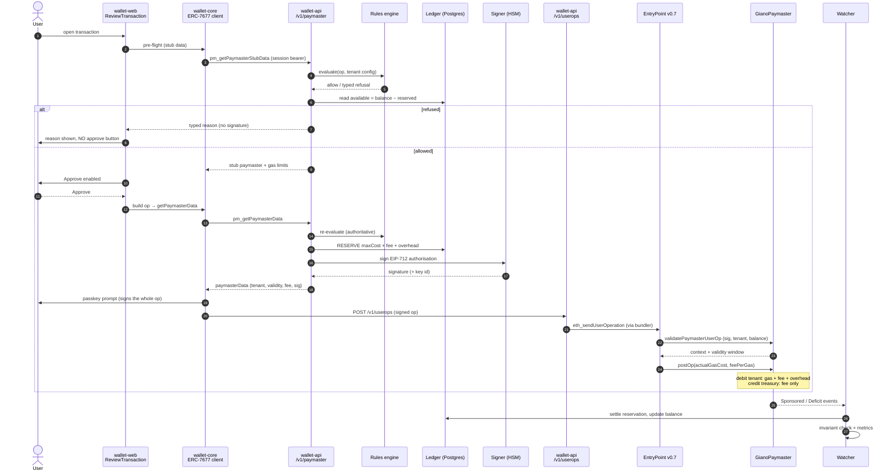

# Giano paymaster — technical specification

This document is the **how** for the paymaster work whose **what** is
[`specs/PAYMASTER-REQUIREMENTS.md`](./PAYMASTER-REQUIREMENTS.md). It specifies the components,
their interfaces, the on-chain accounting arithmetic, the data model and the changes to existing
Giano code — at the altitude a technical leader needs to approve the shape of the work, not at the
altitude of function bodies.

Every requirement `R-xx` referenced here is defined in that document.
[§16](#16-traceability) maps all 67 requirements to the section that implements them.

Status: **draft for technical review.** [§1.3](#13-open-items-for-the-technical-leader) lists what
still needs a call before implementation starts.

---

## Contents

1. [Scope and decisions](#1-scope-and-decisions)
2. [Architecture](#2-architecture)
3. [On-chain — `GianoPaymaster`](#3-on-chain--gianopaymaster)
4. [Deployment, addressing, upgrades and stake](#4-deployment-addressing-upgrades-and-stake)
5. [Sponsorship service — API surface](#5-sponsorship-service--api-surface)
6. [Rules engine and tenant configuration](#6-rules-engine-and-tenant-configuration)
7. [Balance and reservation ledger](#7-balance-and-reservation-ledger)
8. [Chain watcher, settlement and reconciliation](#8-chain-watcher-settlement-and-reconciliation)
9. [Signing and key management](#9-signing-and-key-management)
10. [Client changes](#10-client-changes)
11. [Relay-path interplay](#11-relay-path-interplay)
12. [Test paymaster separation and local development](#12-test-paymaster-separation-and-local-development)
13. [Configuration and operations](#13-configuration-and-operations)
14. [Testing strategy](#14-testing-strategy)
15. [Delivery plan](#15-delivery-plan)
16. [Traceability](#16-traceability)

---

## 1. Scope and decisions

### 1.1 What is being built

Four things that do not exist today, plus changes to five that do:

**New.** An upgradeable on-chain paymaster with per-tenant balances, a platform fee and a role
model (§3, §4). A sponsorship decision service speaking ERC-7677 (§5, §6). A reservation ledger
that makes per-tenant segregation hold under concurrency (§7). A chain watcher that settles
reservations from events, reconciles the ledger against the deposit and monitors the accounting
invariant (§8).

**Changed.** `wallet-api` gains the service, ledger, watcher, admin write path and metrics;
`wallet-core` gains an ERC-7677 paymaster client; `wallet-web` gains a pre-approval sponsorship
gate and typed refusal UI; `packages/contracts` gains the contract, its deployment and registry
entry; the e2e suite gains production-paymaster scenarios.

Everything in [`PAYMASTER-REQUIREMENTS.md` §2.3](./PAYMASTER-REQUIREMENTS.md#23-out-of-scope-for-v1)
stays out of scope, and the permissive test paymaster stays exactly as it is (§12).

### 1.2 Decisions taken

Confirmed in review; each closes an option that would have changed the architecture. S1–S6 were
settled before this document was written; S7 and S8 came from a later pass over the requirements
and are the two that changed a position this document had already taken.

| # | Decision | Consequence in this document |
|---|---|---|
| S1 | **The service is new routes on `wallet-api`**, not a fifth service — with the signer behind a narrow interface so the key can leave the process without touching the API or the ledger | §5 adds routes to the existing app; §9 defines `SponsorshipSigner`; no new image, no new per-tenant edge route |
| S2 | **Sponsorship config lives in its own table**, written only through the tenant's existing admin key. `TENANTS_SEED` never touches it | §6.4 — R-08 self-service without breaking the declarative meaning of `TENANTS_SEED` |
| S3 | **An AWS HSM key from day one, through [`evm-hsm-signer`](https://github.com/appliedblockchain/evm-hsm-signer)**; a local-key implementation of the same interface serves development *and testnet*, and is refused for a production deployment | §9 — the key that authorises spending customer funds never sits in an env var where the funds are real. Requirements D16 / R-66 |
| S4 | **UUPS proxy; `UPGRADER_ROLE` and a single `ROLE_ADMIN` both held by an OZ `TimelockController` whose proposers are a Safe; `DEFAULT_ADMIN_ROLE` never granted** | §4.3 — R-46 and R-51 become on-chain properties rather than process promises |
| S5 | **The pre-approval refusal (R-15) is implemented by calling the rules engine from the wallet's review screen** — `pm_getPaymasterStubData` doubles as the read-only pre-flight | §5.2, §10.3. This settles requirements [Q7](./PAYMASTER-REQUIREMENTS.md#7-open-questions) in the affirmative for the wallet's own UI, without a second rules implementation |
| S7 | **Wallet management is sponsored by default, under platform policy** — not an entry in the tenant's allowlist. Detected structurally, capped by a platform figure, with an explicit tenant opt-out and no way to switch it off by omission | §6.1, §6.2, §6.6. Requirements D15 / R-05 / R-65; reverses the earlier deny-by-default |
| S8 | **No dApp-facing pre-flight surface.** The refusal is shown in the popup, naming the specific reason and the fact that the app's operator is who can act | §10.3. Requirements Q7 / R-67; the wallet's own pre-approval evaluation (S5) is unchanged |
| S6 | **OpenZeppelin first.** Where OZ ships a primitive, the paymaster uses it rather than a hand-rolled equivalent — access control, enumeration, pausing, EIP-712, signature recovery, safe casts, the proxy, the timelock and the upgrade-safety tooling | §3.1 lists the mapping; §4.2 and §4.4 follow it for deployment and storage safety. Bespoke code is confined to what is genuinely Giano-specific: the tenant ledger and the settlement arithmetic |

S5 deserves a sentence of justification, because it is the one decision the requirements did not
anticipate. Today `wallet-web`'s consent gate shows *Approve* first and builds the UserOperation
afterwards (`host.ts` → `wallet.ts`), so a refusal discovered while building would arrive after the
user had already approved. R-15 forbids that. The review screen must therefore ask the rules engine
*before* it renders a button — which is precisely a pre-flight check, so v1 gets one whether or not
the dApp-facing version of it (Q7) is ever built.

### 1.3 Open items for the technical leader

Seven things this document takes a position on. Six are not settled; O5 is recorded as closed
rather than renumbered, because other sections cite it. Each is marked where it appears.

| # | Item | Position taken here |
|---|---|---|
| O1 | **Tenant identity on-chain.** The contract needs a 16/32-byte tenant id | Use the `tenants.id` UUID as `bytes16` — already immutable, already unique, never reused, and needs no new mapping. The slug travels in the registration event for human auditing |
| O2 | **Overhead allowance formula** (R-41). A flat gas figure under-covers when a client grossly over-estimates `callGasLimit`, because the EntryPoint's 10% penalty scales with that over-estimate | §3.6 charges a *bound* derived from the op's own gas limits rather than a flat number. Needs a calibration run on the target chain before the first tenant funds |
| O3 | **Strictness of the permissive/production separation** (R-29) | §12 layers artifact separation, registry typing and boot-time refusal. Deliberate misuse remains possible; a chain-id guard inside the test contract is offered as a fifth layer if that is judged insufficient |
| O4 | **Initialiser front-running.** Address stability requires an empty-init proxy, which leaves a window between deploy and `initialize` | §4.2 closes it by deploying and initialising in one transaction from a small deployer built on OZ `Create2`, keeping the proxy itself stock `ERC1967Proxy`. Needs confirmation that the deployment tooling can run that one call instead of Ignition's two steps |
| O5 | **Number of chains** — *closed* (requirements Q6) | One paymaster deployment per chain, and a tenant funding a balance per chain, is the accepted shape. The ledger and config are chain-keyed throughout; nothing here needs a decision, only per-chain fee and overhead calibration (O2) |
| O6 | **Who pays for wallet management, and may a tenant opt out** (requirements Q1) | §6.1–§6.2 implement it as sponsored-by-default under a platform cap, **charged to the tenant**, with an explicit opt-out. §6.6 sets out what changes if the platform pays instead — a platform balance, a signed payer flag, a wider invariant. Product has to choose |
| O7 | **Deficit policy.** R-35 requires recording and alerting a shortfall, not what happens next | §3.6 clamps, records and alerts; §7.5 blocks further authorisation for a tenant carrying a deficit until it is funded. Whether that is commercially right is a call for the business |

---

## 2. Architecture

### 2.1 Components

| Component | Where | Kind | Responsibility |
|---|---|---|---|
| `GianoPaymaster` | `packages/contracts/src/paymaster/` | new contract | Verifies the authorisation signature, holds per-tenant balances and the treasury, charges gas + fee + overhead, enforces roles |
| `GianoPaymasterProxy` | same | new contract | ERC-1967 UUPS proxy with an empty initialiser payload, so the address is bytecode-determined (§4.2) |
| Sponsorship service | `wallet-api/src/routes/paymaster.ts` | new routes | ERC-7677 `pm_*` methods; authenticates, evaluates, reserves, signs |
| Rules engine | `wallet-api/src/services/sponsorship-rules.ts` | new, pure | Deny-by-default evaluation of one candidate op against one tenant's config |
| Ledger | `wallet-api/src/services/sponsorship-ledger.ts` + migration | new | Balances, reservations, decisions, settlements, deficits |
| Watcher | `wallet-api/src/services/paymaster-watcher.ts` | new job | Ingests paymaster events, settles reservations, reconciles, exports invariant metrics |
| Signer | `wallet-api/src/services/sponsorship-signer.ts` | new | `SponsorshipSigner` interface; HSM (`evm-hsm-signer`) and local implementations |
| Admin config API | `wallet-api/src/routes/admin.ts` | changed | Tenant-scoped read/write of sponsorship config |
| ERC-7677 client | `wallet-core/src/paymaster/` | new | viem-shaped `getPaymasterStubData` / `getPaymasterData` against the service, with typed errors |
| Wallet review gate | `wallet-web/src/views/ReviewTransaction.tsx`, `wallet.ts`, `config.ts` | changed | Pre-approval sponsorship check, refusal rendering, console logging |
| Registry & deploy | `packages/contracts/{ignition,addresses.ts,scripts}` | changed | Deterministic deploy, registry entry, `giano-doctor` checks |

Nothing about tenant resolution, sessions, WebAuthn or the relay changes shape; the sponsorship
service reuses `plugins/tenant.ts` and `plugins/auth.ts` exactly as the relay does.

### 2.2 The sponsored path



### 2.3 Where each rule is enforced

| Rule | Off-chain (authoritative) | On-chain (backstop) |
|---|---|---|
| Contract / function allowlist | Rules engine, before signing | — (implied: no signature, no sponsorship) |
| Wallet management | Rules engine, structurally: a self-call is sponsored under the platform cap unless the tenant opted out | — (the contract does not distinguish it; the cap it enforces is the one pinned in the authorisation) |
| Max cost per transaction | Rules engine | Validation rejects if `maxCost + fee + overhead` exceeds it |
| Sufficient balance | Ledger, `balance − reserved` | Validation rejects if the ledger balance alone cannot cover the op |
| Tenant segregation | Reservation is per tenant | Debit is per tenant; a tenant can only ever be charged against its own balance |
| Single use | Reservation keyed on `(sender, nonce)` | EntryPoint nonce, plus the signature binding chain, paymaster, sender and nonce |

The asymmetry is deliberate and is D5's point: the chain cannot be the primary gate because it sees
one op at a time, and the ledger cannot be the only gate because a compromised backend would then
be unbounded.

---

## 3. On-chain — `GianoPaymaster`

### 3.1 Shape

```solidity
contract GianoPaymaster is
    IPaymaster,                              // @account-abstraction 0.7
    Initializable,                           // OZ
    AccessControlEnumerableUpgradeable,      // OZ — roles, enumerable holders
    PausableUpgradeable,                     // OZ — emergency stop
    EIP712Upgradeable,                       // OZ — typed-data domain
    UUPSUpgradeable                          // OZ — upgrade authorisation
```

**Nothing here is hand-rolled that OpenZeppelin already ships** (S6). The mapping, so review can
check it at a glance:

| Concern | OZ primitive (v5) | Not doing |
|---|---|---|
| Roles, no owner | `AccessControlEnumerableUpgradeable` | A bespoke role mapping |
| Reading who holds a role | `getRoleMemberCount` / `getRoleMember` from the same contract | An off-chain role registry |
| Emergency stop | `PausableUpgradeable` + `whenNotPaused` | A custom `paused` flag |
| Typed-data domain and digest | `EIP712Upgradeable` | A packed `keccak256` preimage |
| Signature verification | `SignatureChecker.isValidSignatureNow` (which wraps `ECDSA.recover`) | A raw `ecrecover` |
| Signer set | `EnumerableSet.AddressSet` | `mapping(address => bool)` plus a length counter |
| Narrowing to `uint128` | `SafeCast.toUint128` | Unchecked casts with hand-written bounds |
| Proxy | `ERC1967Proxy` + `UUPSUpgradeable` | A custom proxy (§4.2) |
| Upgrade delay and role-grant delay | `TimelockController` | An in-contract delay implementation (§4.3) |
| Deterministic deploy helper | `Create2` | Hand-assembled CREATE2 calls |
| Upgrade safety checks | `@openzeppelin/upgrades-core` | Eyeballing the storage layout (§4.4) |

`SignatureChecker` rather than bare `ECDSA.recover` is a deliberate small win: because the authorising
key travels in `paymasterData` (§3.5) the check is a membership test plus one verification either
way, and `SignatureChecker` additionally accepts ERC-1271 signers, so a future per-tenant key held in
a contract or a multisig needs no contract change (D2).

`BasePaymaster` from the account-abstraction package is the one thing **not** reused: it is
`Ownable` (R-44 forbids an owner) and takes the EntryPoint as a constructor immutable (D14 requires
configuration in storage). `IPaymaster` is implemented directly, and its EntryPoint plumbing is
about twenty lines.

`@openzeppelin/contracts-upgradeable` v5 is a new dependency on `packages/contracts` (the
non-upgradeable `@openzeppelin/contracts` v5.3 is already there and stays, for `TimelockController`,
`Create2` and the libraries). Its contracts use ERC-7201 namespaced storage, which is the discipline
`MultiOwnable` already follows and the reason an upgrade cannot collide with role or pause state.

### 3.2 Storage

One ERC-7201 namespace, `giano.storage.Paymaster`, containing:

| Field | Type | Notes |
|---|---|---|
| `entryPoint` | `IEntryPoint` | Set by the initialiser, not a constructor immutable |
| `tenants` | `mapping(bytes16 => Tenant)` | Tenant id = the `tenants.id` UUID (O1) |
| `treasury` | `uint256` | Accrued fees. Withdrawable only by `FEE_COLLECTOR_ROLE`, capped at this value |
| `defaultFeeWei` | `uint128` | Deployment-wide platform fee per sponsored op |
| `postOpGasAllowance` | `uint32` | Gas units charged for the accounting step itself (§3.6) |
| `penaltyBps` | `uint16` | Basis points of execution gas limits charged as the EntryPoint penalty bound; 1000 = the EntryPoint's 10% |
| `signers` | `EnumerableSet.AddressSet` | The authorised signer set (D2), enumerable so the live set is readable on-chain |

```solidity
struct Tenant {
    bool registered;
    bool enabled;          // per-tenant on/off, on-chain twin of the config switch
    address withdrawAddress;
    uint128 balance;
    uint128 deficit;       // R-35: recorded, never silently absorbed
    uint128 feeWeiOverride; // 0 = use defaultFeeWei
    bool hasFeeOverride;
}
```

Pause state lives in `PausableUpgradeable`'s own namespace, not in this struct.

Balances are `uint128` (3.4e38 wei — twelve orders of magnitude beyond any plausible gas balance)
so that `balance` and `deficit` pack into a single slot, with `SafeCast.toUint128` on every
narrowing. A `Tenant` occupies three slots in total — the three flags and the withdrawal address in
the first, the packed balance and deficit in the second, the fee override in the third — which is
minimal for these field widths; the committed layout snapshot (§4.4) records it. Validation reads
the first two; settlement writes the second.

No arrays, no unbounded iteration: the invariant in §8.4 is computed off-chain and checked against
`balanceOf`, never by summing a mapping on-chain.

### 3.3 Roles

Role constants map one-to-one onto D13. There is no owner and no `DEFAULT_ADMIN_ROLE` holder.

| Constant | Gates |
|---|---|
| `SIGNER_ADMIN_ROLE` | `addSigner`, `removeSigner` |
| `FEE_ADMIN_ROLE` | `setDefaultFee`, `setTenantFee` |
| `FEE_COLLECTOR_ROLE` | `withdrawFees(to, amount)` — reverts above `treasury` |
| `STAKE_ADMIN_ROLE` | `addStake`, `unlockStake`, `withdrawStake` |
| `TENANT_ADMIN_ROLE` | `registerTenant`, `setTenantWithdrawAddress`, `setTenantEnabled` |
| `PARAM_ADMIN_ROLE` | `setPostOpGasAllowance`, `setPenaltyBps` |
| `PAUSER_ROLE` | `pause`, `unpause` |
| `UPGRADER_ROLE` | `_authorizeUpgrade` |
| `ROLE_ADMIN` | Granting and revoking every role above, **including itself** |

The initialiser calls `_setRoleAdmin(role, ROLE_ADMIN)` for every role and grants `ROLE_ADMIN` to
exactly one address — the timelock (§4.3) — and never grants `DEFAULT_ADMIN_ROLE`. That is what
makes R-46 structural: there is no account that can grant itself a role without going through the
timelock's public queue and delay.

Because the base is `AccessControlEnumerable`, "who holds `UPGRADER_ROLE`" is a plain call rather
than a log-replay exercise — which is what makes the R-55 review and the `giano-doctor` role
assertions (§4.6) cheap enough to run on every deployment.

OZ's `AccessManager` was the alternative considered: it offers per-function roles and built-in
execution delays in one component. It was not chosen because the delay Giano needs applies to
*granting* roles rather than to calling functions, `TimelockController` already provides exactly
that, and a contract-local role set keeps the paymaster readable without a second authority
contract to audit. Revisit if a second Giano contract needs the same governance.

No role can move a tenant balance (R-48). `withdrawFees` is capped at `treasury`, `withdrawStake`
touches the stake and not the deposit, and no function transfers between tenants. The only path
that reaches tenant funds is `upgradeToAndCall`, which is R-33's stated exception.

### 3.4 Funding and withdrawal

| Function | Caller | Behaviour |
|---|---|---|
| `depositFor(bytes16 tenantId) payable` | anyone | The only funding path. Reverts for an unregistered tenant, so funds can never arrive un-attributed (R-30). Credits `balance`, applies any outstanding `deficit` first, forwards the value to `EntryPoint.depositTo(address(this))` |
| `receive()` | anyone | **Reverts.** A bare transfer carries no tenant, and silently pooling it would break attribution |
| `withdrawTenant(bytes16 tenantId, uint256 amount, address to)` | the tenant's registered `withdrawAddress` only | Debits `balance`, calls `EntryPoint.withdrawTo`. Available while paused (R-53) |
| `withdrawFees(address to, uint256 amount)` | `FEE_COLLECTOR_ROLE` | Debits `treasury`, capped at it (R-42) |
| `addStake / unlockStake / withdrawStake` | `STAKE_ADMIN_ROLE` | Straight through to the EntryPoint |

`registerTenant(bytes16 id, address withdrawAddress, string slug)` emits the slug in its event so
the on-chain record can be read against the backend's tenant table without a side channel.

Withdrawal is a two-step in one transaction (ledger debit, then `EntryPoint.withdrawTo`), which
keeps the invariant true at every observable point: the ledger drops before the deposit does.

### 3.5 Validation

`paymasterData` — the bytes after the EntryPoint's fixed 20+16+16 prefix:

| Offset | Size | Field |
|---|---|---|
| 0 | 1 | `version` (0x01) |
| 1 | 16 | `tenantId` |
| 17 | 6 | `validUntil` (uint48, seconds) |
| 23 | 6 | `validAfter` (uint48) |
| 29 | 16 | `feeWei` — the fee **pinned** at authorisation (R-39) |
| 45 | 20 | `signer` — which authorised key signed, so verification is one check, not a loop |
| 65 | 65 | the signature |

The signature is over EIP-712 typed data, with the domain built by `EIP712Upgradeable`
(`GianoPaymaster` / version `1` / `chainId` / `verifyingContract`), covering: `sender`, `nonce`,
`keccak256(callData)`, `accountGasLimits`, `preVerificationGas`, `gasFees`,
`paymasterVerificationGasLimit`, `paymasterPostOpGasLimit`, `tenantId`, `validUntil`, `validAfter`,
`feeWei`. It deliberately excludes the account signature — the user's passkey signs the whole
operation afterwards, including this authorisation, so neither signature can be altered without
invalidating the other.

Typed data rather than the `VerifyingPaymaster` sample's packed hash, because the domain separator
gives replay separation across chains and paymaster addresses for free, because OZ's implementation
handles the cached-separator and chain-fork cases already, and because tenants can verify a charge
from readable data.

`validatePaymasterUserOp` performs, in order, reverting or returning failure without a state write
wherever it can:

1. caller is the configured EntryPoint;
2. not paused (`whenNotPaused`);
3. `version` recognised and `paymasterData` length exact;
4. tenant registered and enabled;
5. `signers.contains(signer)` and `SignatureChecker.isValidSignatureNow(signer, digest, sig)` —
   an unlisted or revoked key fails on the cheap set lookup before any cryptography runs;
6. `requiredCharge = maxCost + feeWei + overheadBound(userOp)` (§3.6) is covered by `balance`, and
   the tenant carries no `deficit`;
7. returns `context = abi.encode(tenantId, feeWei, executionGasLimit, sender)` and
   `validationData = packValidationData(false, validUntil, validAfter)`.

A failed signature check returns `SIG_VALIDATION_FAILED` (so the bundler treats it as an invalid op
rather than a paymaster fault); everything else reverts with a custom error, because those are
conditions the service should never have signed into existence and silent failure would hide a bug.

**Single use** (R-07) needs no on-chain replay store: the signature binds `sender` and `nonce`, and
the EntryPoint already refuses a reused nonce. Expiry comes from `validUntil` (§13.1 sets it to
minutes), and chain binding from the EIP-712 domain.

### 3.6 Settlement

The EntryPoint hands `postOp` an `actualGasCost` that **excludes** `postOp`'s own gas and excludes
the unused-gas penalty — both are added to the deposit debit after `postOp` returns
(`vendor/account-abstraction/contracts/core/EntryPoint.sol`, `PENALTY_PERCENT = 10` on unused
`callGasLimit + paymasterPostOpGasLimit`). The overhead allowance exists to cover exactly that gap,
and R-41 requires it to err generous.

```
charge      = actualGasCost
            + overheadWei                          // leaves the ledger, credited to nobody
            + feeWei                               // pinned at authorisation, credited to treasury

overheadWei = actualUserOpFeePerGas
            × ( postOpGasAllowance                 // this function's own gas, per-chain tunable
              + executionGasLimit × penaltyBps / 10_000 )   // bound on the EntryPoint penalty
```

`executionGasLimit` is `callGasLimit + paymasterPostOpGasLimit`, pinned into `context` at validation
because `postOp` does not receive the op. Charging `penaltyBps` of the whole execution limit is a
strict upper bound on a penalty the EntryPoint levies only on the *unused* part, so the ledger
always falls at least as fast as the deposit — the direction D1 requires. It also self-adjusts to
the real driver of the penalty, which is the client's own gas over-estimation, in a way a flat
figure cannot (O2). The price is an overcharge of up to `penaltyBps` of the gas actually used;
§8.4's slack alert is what keeps that honest, and calibration on the target chain is a prerequisite
for the first tenant funding.

Debit order when `charge > balance` — possible only in the concurrency case D5 describes:

1. gas and overhead are taken first, up to the balance;
2. the fee is taken from whatever remains, and only that part is credited to `treasury`;
3. the uncovered remainder is added to `deficit`, and `SponsorshipDeficit` is emitted.

`postOp` never reverts on a shortfall — the transaction has already executed and the deposit has
already paid — so clamping and recording is the only safe behaviour (R-35). A tenant carrying a
non-zero `deficit` fails validation step 6 until `depositFor` clears it, which stops the hole
growing while the alert is being handled.

The fee is charged for `PostOpMode.opSucceeded` and `opReverted` alike (R-40). `postOpReverted` is
not delivered to us by the EntryPoint at all; the deposit is still debited, so it appears as slack
and is caught by reconciliation rather than by the ledger.

### 3.7 Events and errors

Events are the ledger's source of truth off-chain (§8), so each carries everything the watcher and
a tenant's own reconciliation need — R-43's separate visibility of gas, fee and overhead lands here.

| Event | Fields |
|---|---|
| `TenantRegistered` | `tenantId`, `withdrawAddress`, `slug` |
| `TenantFunded` | `tenantId`, `from`, `amount`, `deficitCleared`, `newBalance` |
| `TenantWithdrawn` | `tenantId`, `to`, `amount`, `newBalance` |
| `Sponsored` | `tenantId`, `sender`, `userOpHash`, `gasCostWei`, `feeWei`, `overheadWei`, `newBalance`, `success` |
| `SponsorshipDeficit` | `tenantId`, `userOpHash`, `shortfallWei`, `totalDeficitWei` |
| `FeesAccrued` / `FeesWithdrawn` | `amount`, `newTreasury` (+ `to`) |
| `SignerAdded` / `SignerRemoved` | `signer` |
| `FeeChanged` / `TenantFeeChanged` / `ParamChanged` | old, new |
| `TenantEnabledChanged` | `tenantId`, `enabled`, actor |
| `Paused` / `Unpaused` | inherited from OZ `Pausable` |
| Role grants/revocations | inherited from OZ `AccessControl` (R-47) |

Custom errors mirror the validation steps (`NotEntryPoint`, `PaymasterPaused`, `UnknownTenant`,
`TenantDisabled`, `BadPaymasterData`, `UnauthorisedSigner`, `InsufficientTenantBalance`,
`TenantInDeficit`, `NotWithdrawAddress`, `ExceedsTreasury`) so that a refusal reason is legible
from a trace.

### 3.8 Gas expectations

Measured, not estimated — `test/GianoPaymaster/Gas.t.sol` asserts these as ceilings so a regression
fails CI rather than surfacing as a `postOp` that ran out of gas:

| Step | Measured | Budget asserted |
|---|---|---|
| `validatePaymasterUserOp` | ~38.8k | < 60k |
| `postOp`, cold treasury slot | ~49.5k | < 80k |
| `postOp`, warm treasury slot | ~9.7k | < 80k |

> **Corrected during implementation.** This section originally budgeted 15–20k for validation and
> 25–35k for settlement. Validation is about twice the original figure: the EIP-712 digest covers
> twelve fields, and the two cold storage reads (the tenant's registration/withdrawal slot and its
> balance/deficit slot) plus `ecrecover` do not fit 20k. The figures above are what the contract
> actually costs.

The warm number is the one to calibrate `postOpGasAllowance` against, because it is what most
operations pay: the treasury slot is cold only for the first sponsored operation after a fee
withdrawal. The default of 40,000 sits deliberately between the two.

This is D4's accepted consequence: it must be pre-funded, it raises the floor on a workable
per-transaction cost cap, and `paymasterPostOpGasLimit` must be set high enough that `postOp` cannot
run out of gas — a `postOp` revert is a `PostOpReverted` for the whole operation.

---

## 4. Deployment, addressing, upgrades and stake

### 4.1 Toolchain

Unchanged from the rest of the stack: solc 0.8.28, optimizer 200, `viaIR`, Hardhat Ignition with
`--strategy create2` and the repo's fixed salt. New module `ignition/modules/GianoPaymaster.ts`,
kept out of `Testing.ts` and out of the `index.ts` aggregate that the deployer image runs for
testing contracts.

### 4.2 Address stability

Both artifacts must be bytecode-determined, or the deployed address varies per operator and D10's
promise fails:

- the **implementation** takes no constructor arguments (everything is in the initialiser);
- the **proxy** is constructed with the implementation address and an **empty** initialisation
  payload. Passing initialiser calldata into the proxy constructor — the usual OZ pattern — would
  bake the operator's own role-admin address into the init code and change the address.

That leaves the deploy→initialise window (O4): between the two transactions, anyone watching the
mempool could call `initialize` and take the roles. It is closed **without a custom proxy** (S6) — the
proxy stays stock OZ `ERC1967Proxy` — by doing both steps in one transaction from a minimal
`GianoPaymasterDeployer` built on OZ's `Create2`:

```solidity
// deploy(salt, implementation, initCalldata) → CREATE2 the stock ERC1967Proxy with empty data,
// then call initialize in the same transaction, then revert if initialisation did not take.
address proxy = Create2.deploy(0, salt, abi.encodePacked(type(ERC1967Proxy).creationCode,
                                                        abi.encode(implementation, "")));
GianoPaymaster(proxy).initialize(...);
```

The deployer contract is itself deployed deterministically (the repo already vendors the Safe
singleton deployer), so the proxy address remains a pure function of deployer + salt + init code and
the determinism check in §4.5 still holds. `initialize(entryPoint, roleAdmin, defaultFeeWei,
postOpGasAllowance, penaltyBps)` is OZ `initializer`-guarded, so a second call is impossible
regardless.

The fallback, if the deployment tooling cannot be made to run that single call, is to deploy through
a private RPC and assert the post-deploy state before announcing the address — weaker, and the
reason O4 is still listed as open.

### 4.3 Upgrade and role authority

```
Safe multisig  ──proposes──▶  TimelockController  ──holds──▶  ROLE_ADMIN + UPGRADER_ROLE
   (N-of-M)                    (published minDelay)              on GianoPaymaster
```

`_authorizeUpgrade` is `onlyRole(UPGRADER_ROLE)`. Because the timelock holds it, every upgrade is
queued publicly, visible for the full delay, and executable only afterwards — R-51's exit window is
enforced by the timelock, not by a promise, and there is no bypass path for an "urgent" change.
Because the timelock also holds `ROLE_ADMIN`, every role grant is subject to the same queue and
delay, which is what R-46 asks for. Shortening the delay is itself a timelocked operation.

Operational rules: the timelock's proposer set is the Safe and nothing else; no operational key
holds any role; the executor set is either the Safe or open (an open executor cannot bring a
proposal forward in time, only run one whose delay has elapsed).

### 4.4 Storage-layout safety

R-52 requires mechanical verification. Two layers, both in CI:

- ERC-7201 namespacing means each module's storage is at a hash-derived root, so appending fields to
  the `Paymaster` struct is safe by construction and no future contract can collide with it;
- a **committed layout snapshot** (`storage-layout/GianoPaymaster.json`, checked by
  `pnpm storage:check` in CI) that any change has to show up as a diff someone acknowledges in a
  pull request. Appending a field produces a small additive diff; a reordering, a removal or a type
  narrowing should stop the reviewer cold.

  > **Corrected during implementation.** `forge inspect GianoPaymaster storageLayout` reports
  > **nothing** — the ERC-7201 namespace is addressed from assembly, so the compiler sees no storage
  > for the contract at all, and a snapshot of it would be an empty file that passes forever. The
  > snapshot is therefore taken from a test-only probe contract that declares the same struct as an
  > ordinary state variable, and the script fails if that probe ever stops producing a layout.
  > Solidity's AST node ids are stripped from the snapshot, because they renumber on every unrelated
  > edit and a snapshot nobody reads the diff of protects nothing.

- `@openzeppelin/upgrades-core`'s `validateUpgrade` against the previous implementation, for unsafe
  constructs and missing initialiser gaps — the tool OZ ships for exactly this. **Not yet wired**:
  it needs a previous implementation to compare against, so it becomes meaningful at the first
  upgrade rather than at the first deployment.

Reviewing this by eye is explicitly not enough, because a mis-ordered slot silently re-attributes
real money.

### 4.5 Registry and determinism

`GianoDeployment` in `packages/contracts/addresses.ts` gains `sponsorshipPaymaster?: 0x...`, and the
existing `paymaster` field is renamed `testPaymaster` to make the two structurally distinguishable
in every consumer's types (§12). `scripts/generate-addresses.ts` and every reader
(`wallet-api/src/config.ts`, `wallet-web/src/config.ts`, `scripts/doctor.ts`) follow.

`determinism.yml` gains the paymaster: recompute the CREATE2 addresses on a fresh anvil, assert
equality with the committed registry. No carve-out is needed — that is the point of §4.2.

### 4.6 Stake, deposit and deployment completion

A validating paymaster that returns a validity window needs a stake before bundlers will accept its
ops, and R-24 makes "deployed but unstaked" a failed deployment rather than a puzzling client bug.
The deployment sequence is therefore: deploy implementation → deploy proxy → `initialize` →
timelock-queue the role grants → `addStake(unstakeDelaySec)` → `registerTenant` per tenant →
tenant funds via `depositFor`.

`giano-doctor chain` grows checks that fail the exit code, not just warn: paymaster proxy has code;
implementation address matches the registry; stake present and above the configured minimum;
`EntryPoint.balanceOf(paymaster)` above the low-water mark; the signer set is exactly the expected
keys; `ROLE_ADMIN` and `UPGRADER_ROLE` are held by the timelock and by nothing else;
`Σ balances + treasury ≤ deposit`; and at least one tenant balance is non-zero.

---

## 5. Sponsorship service — API surface

### 5.1 Transport

One new route, `POST /v1/paymaster`, speaking JSON-RPC 2.0 as ERC-7677 specifies (R-22). It is
reached the same way everything else is — through the tenant's own edge, same-origin under
`/api` — so no tenant onboarding changes and standard wallet tooling can point at
`https://wallet.tenant.example/api/v1/paymaster`.

Methods: `pm_getPaymasterStubData` and `pm_getPaymasterData`, both taking
`[userOp, entryPoint, chainId, context]`.

Per R-14, `entryPoint` and `chainId` are **validated, not trusted**: they must equal the server's
configured values, and a mismatch is a typed error. `context` is accepted and ignored in v1 except
for an optional `{"preflight": true}` hint (§5.2); unknown keys are rejected rather than silently
dropped, so a tenant cannot come to depend on a field we do not honour.

### 5.2 Method semantics

The split matters, because the two methods are called a different number of times.

| | `pm_getPaymasterStubData` | `pm_getPaymasterData` |
|---|---|---|
| Called | During gas estimation, possibly repeatedly; and by the wallet's review screen as a pre-flight (S5) | Once, immediately before the user's passkey signature |
| Rules evaluated | Yes — this is what makes a pre-approval refusal possible | Yes, authoritatively (config or balance may have moved) |
| Balance checked | Yes, read-only | Yes, as part of the atomic reservation |
| Reserves | **No** | **Yes** (§7.3) |
| Signs | No — returns a correctly-sized dummy signature so gas estimation is accurate | Yes |
| Returns | `paymaster`, stub `paymasterData`, `paymasterVerificationGasLimit`, `paymasterPostOpGasLimit` | The same fields with real `paymasterData` |

Reserving in `getPaymasterData` and not in the stub call is what keeps the reservation ledger from
filling with estimation noise, and still puts the reservation strictly before the moment the user
can commit (D5).

Each call writes a decision record (§6.5) with its rule-by-rule results, so R-06 is answered for
refusals and approvals alike, including the pre-flight ones that never became transactions.

### 5.3 Authentication and binding

Identical to the relay path, and for the reasons D9 gives:

1. a valid session bearer, or nothing (R-11);
2. tenant resolved from `Origin` by the existing `onRequest` hook; `requireSession` cross-checks it
   against the session's tenant and returns the same generic 401 on mismatch, incrementing
   `giano_cross_tenant_rejections_total` (R-12 — no oracle in the body, so a probe learns nothing
   about whether another tenant exists);
3. `userOp.sender` must equal the session credential's wallet address (R-13);
4. the tenant billed is the session's tenant, never anything in the request — and it is bound into
   the signature, which is what stops a user redirecting a charge (§5.1 of the requirements).

Rate limiting reuses the relay's per-tenant window shape, with its own limit, so pre-flight traffic
cannot be used to hammer the signer.

### 5.4 Refusal model

Errors are JSON-RPC errors carrying a stable machine-readable `data.reason` (R-16). The wallet keys
its copy off `reason`, never off the message.

| `reason` | Code | Meaning | Retryable |
|---|---|---|---|
| `sponsorship-disabled` | -32001 | Off for this tenant (R-09) | no |
| `no-sponsorship-config` | -32002 | No config, empty, or unparseable — deny by default (R-02, R-10) | no |
| `contract-not-allowed` | -32003 | Target not on the allowlist | no |
| `function-not-allowed` | -32004 | Target allowed, selector not | no |
| `wallet-management-not-sponsored` | -32005 | Self-call, and this tenant has explicitly opted out of wallet-management sponsorship (R-65). **Not** reachable by a tenant merely leaving something out of its allowlist — wallet management is sponsored by default (R-05) | no |
| `cost-exceeds-cap` | -32006 | Above the tenant's per-transaction cap (R-04) | no |
| `insufficient-balance` | -32007 | `balance − reserved` cannot cover it (R-16) | after funding |
| `tenant-in-deficit` | -32008 | Ledger deficit outstanding (O7) | after funding |
| `not-your-wallet` | -32009 | Sender is not the session's wallet | no |
| `chain-or-entrypoint-mismatch` | -32010 | Request disagreed with server config | no |
| `temporarily-unavailable` | -32011 | Signer, HSM or database unavailable (R-21) | yes |

`temporarily-unavailable` is separated from every rule refusal on purpose: R-21 requires the wallet
to be able to tell an outage from a misconfiguration, and the sponsorship service is now on the
critical path for transacting.

### 5.5 Admin configuration API

Tenant-scoped by the existing admin-key mechanism (`requireAdmin` → `request.adminTenant`), so a key
can only ever read or write its own tenant's rules (R-08, D7).

| Method | Behaviour |
|---|---|
| `GET /v1/admin/sponsorship` | Current config plus its `updatedAt` and the writer's label |
| `PUT /v1/admin/sponsorship` | Full replace, validated by the zod schema (§6.1); rejected as 400 with per-path messages on any violation (R-10) |
| `PATCH /v1/admin/sponsorship` | Field-level update, same validation |
| `GET /v1/admin/sponsorship/history` | Config revisions, who wrote them and when (R-06 for configuration changes) |

Balance and fee are absent from this surface by construction (D7): balance moves only through the
chain, and the fee is Giano's (§13.1 covers the operator-side path for fee overrides).

### 5.6 Tenant-facing reads

R-36 requires a tenant to be able to see and reconcile its own position, so three read endpoints
under the same admin key:

| Method | Returns |
|---|---|
| `GET /v1/admin/sponsorship/balance` | On-chain balance, outstanding reservations, available, deficit, the block the balance was read at, and the paymaster address to fund |
| `GET /v1/admin/sponsorship/spend` | Paginated settlements: userop hash, timestamp, gas, fee, overhead, total, success — the R-43 breakdown, each row traceable to a `Sponsored` event |
| `GET /v1/admin/sponsorship/decisions` | Paginated decisions including refusals, with rule-by-rule results |

Every figure is derived from chain events, and the response carries the block height it was computed
at, so a tenant can reproduce it independently rather than trusting Giano's books.

---

## 6. Rules engine and tenant configuration

### 6.1 Configuration schema

Validated by zod at every write, stored as `jsonb`, and re-validated on read with an unparseable
value treated as *no sponsorship* rather than as permissive (R-02, R-10).

```ts
sponsorship: {
  enabled: boolean,                       // default false — a new tenant sponsors nothing
  maxCostPerTxWei: bigintString,          // required when enabled (R-04)
  allowlist: Array<{
    contract: Address,
    // 'all' allows the whole contract; otherwise selectors or human-readable signatures
    functions: 'all' | Array<`0x${string}` | string>,
  }>,                                     // non-empty when enabled; no wildcard contract (R-03)
  walletManagement?: {                    // opt-*out* only; sponsored by default (R-05, R-65, O6)
    enabled: boolean,                     // default true — absent means sponsored, not denied
    maxCostPerTxWei?: bigintString,       // may only *lower* the platform cap; a higher value is
                                          // a validation error, not a silent clamp
  },
  lowBalanceThresholdWei?: bigintString,  // per-tenant alert threshold (R-18)
}
```

There is deliberately no way to express "any contract". `functions: 'all'` covers the legitimate
need R-03 describes — allowing a contract without enumerating its ABI — while keeping the target
set explicit. Signatures are normalised to selectors at write time, so a rules evaluation never
does string work.

`walletManagement` is the one field whose default is *permissive*, and it is the only one that
should be. Its absence means sponsored, because R-05 requires it and a tenant must not be able to
break account recovery by forgetting a key. `enabled: false` is therefore a deliberate statement,
recorded in the config history like any other, and the platform cap
(`SPONSORSHIP_WALLET_MANAGEMENT_CAP_WEI`, §13.1) applies whether the tenant names one or not. A
tenant may only tighten it — allowing a tenant to raise it would hand it a way around the platform's
own bound on a path it does not control.

### 6.2 Evaluation

A pure function, no I/O, so it is trivially testable and can be reused by any future pre-flight
surface without a second implementation (requirements Q7):

```ts
evaluateSponsorship(candidate, config, balanceView): SponsorshipDecision
// → { allowed, results: RuleResult[], reason?, maxChargeWei, feeWei }
```

`RuleResult` deliberately mirrors the relay's `PolicyRuleResult` shape (`{ rule, passed, detail }`)
so decisions and relay audits read alike and can share dashboards.

Rules, in order — first failure decides, but every rule is still recorded:

| Rule | Check |
|---|---|
| `sponsorship-enabled` | Tenant switch on, config parses |
| `sender-binding` | `userOp.sender` is the session's wallet |
| `decodable-calls` | `callData` decodes as `execute` / `executeBatch`; anything else is refused, not guessed |
| `wallet-management` | Any call whose target is the sender itself is wallet management: sponsored under the platform cap (or the tenant's lower one) unless the tenant has explicitly opted out |
| `contract-allowlist` | Every inner call's target is listed |
| `function-allowlist` | Every inner call's selector is permitted for its target |
| `max-cost` | `maxCost + fee + overheadBound ≤ maxCostPerTxWei` |
| `sufficient-balance` | `≤ balance − reserved − deficit` (§7) |

Two details worth naming. **Batches are all-or-nothing**: one disallowed call in an
`executeBatch` refuses the whole operation, because partial sponsorship is not a thing the chain can
express. And **wallet management is detected structurally** — a call from the wallet to itself is
`addOwner`, `removeOwner` or `upgradeToAndCall` — rather than by selector list. That structural test
now cuts both ways, which is why it is the right one: a self-administration function added to the
wallet later can neither become sponsorable by omission (the original reason) nor become
*unsponsorable* by omission, which is what R-05 needs once these transactions must be sponsored.

A self-call bypasses `contract-allowlist` and `function-allowlist` entirely rather than needing an
entry in them. That is R-65: the tenant does not own this rule, so its list is not consulted for it.
A mixed batch that touches both the wallet itself and an application contract is evaluated under
both rules — the application calls against the allowlist, the self-calls against the platform
policy — and the tighter of the two caps applies, because the operation is one charge and the chain
cannot split it.

`maxCost` is computed the way the EntryPoint computes the prefund, from the op's own gas limits and
fees, and `overheadBound` uses the same formula the contract will apply (§3.6) so the reservation
and the eventual charge cannot drift apart in shape.

### 6.3 Cost cap and fee resolution

`feeWei` for an authorisation resolves as tenant override → deployment default, read from the
contract (not from the service's config) so that what is pinned is what the chain will charge, and
cached briefly against `FeeChanged` / `TenantFeeChanged` events.

The cost cap resolves differently depending on what the operation is:

| Operation | Cap applied |
|---|---|
| Application calls only | The tenant's `maxCostPerTxWei` |
| Self-calls only (wallet management) | `min(platform cap, tenant's walletManagement cap if set)` |
| A batch containing both | The lower of the two, since one charge cannot be split |

The platform cap is service configuration rather than on-chain state, because it bounds what the
*service* will sign and the contract already has the tenant's balance and the pinned fee as its
own backstops. It is deliberately tight — a passkey addition is a small, predictable operation, and
a cap that only has to cover that is a cheap bound on the one path a tenant cannot close.

### 6.4 Storage and the seed

Per S2, a new table owned by the admin API:

```
tenant_sponsorship(tenant_id PK → tenants.id, chain_id, config jsonb,
                   updated_at, updated_by_key_hash)
tenant_sponsorship_history(id, tenant_id, chain_id, config jsonb, created_at, created_by_key_hash)
```

`seedTenants` does not touch it — no clause, no default, no replace-set — so `TENANTS_SEED` keeps
its current declarative meaning and a restart can never revert a tenant's own edit. A tenant with
no row sponsors nothing, which is R-02 in the storage layer as well as in the engine.

Requirements Q5 is closed: **no example configuration is seeded**, for real tenants or for new ones.
A tenant with no row sponsors nothing and that is the intended state, so there is no seeded row to
keep out of production (R-62) and no default a tenant can be surprised by. The "sponsorship looks
broken" misreading Q5 worried about is addressed in the onboarding documentation (R-23), which is
where it belongs. The demo stack is unaffected — its configuration is written through the same admin
API a tenant uses (§12.2).

### 6.5 Decision records

Every evaluation writes one row: tenant, user, session, method (`stub` / `data` / future preflight),
sender, userop hash where known, the full rule results, the outcome, the pinned fee, the reserved
amount and the reservation id. This is R-06's audit trail, and it is also what makes the
"unusual spike in refusals for one tenant" alert (R-25) computable.

Wallet-management decisions are worth being able to find in that table on their own, so the rule
results record which cap applied and where it came from. "How much are we spending on recoveries,
and for whom" is a question O6 will be decided on, and it should be answerable from the data before
the decision is taken rather than after.

### 6.6 If the platform pays for wallet management

Everything above charges the **tenant** for wallet management, under a platform-set cap. That is the
position taken, and it is the one that needs no contract change: a self-call is an ordinary sponsored
operation whose cap came from a different place. If product decides the platform should pay instead
(requirements Q1), the change is not a configuration flag — it reaches the contract, the invariant
and the ledger. Set out here so the decision can be taken with its cost visible.

**Contract.** A `platformBalance` joins the `Paymaster` namespace, funded by its own payable path
(the `receive()` revert stays: attribution is still mandatory). Settlement debits it instead of the
tenant's balance when the authorisation says so, and **no fee is charged** — a fee moves value from
`platformBalance` to `treasury`, both inside the ledger, so it is an accounting no-op that only
obscures what the operation cost.

**The payer has to be signed.** A bit in `paymasterData`'s `version`/flags byte, covered by the
EIP-712 payload, saying which balance settles this operation. Without it the chain has no way to
charge whoever the service decided, and the service's decision would be advisory — precisely the
gap D1's on-chain enforcement exists to close. Unsigned, a user could redirect their own recovery
onto the platform's balance at will.

**Invariant.** `Σ tenant balances + platformBalance + treasury ≤ deposit`. §8.4's computation and the
`giano-doctor` assertion both grow a term; the breach and slack alerts are otherwise unchanged.

**Ledger.** `paymaster_tenants` gains a platform row (or a sibling table), reservations key on the
payer rather than assuming the tenant, and §7.3's per-tenant row lock becomes a per-*payer* lock —
at which point every tenant's recoveries serialise against one another, where today they do not.

**And the reason to think twice.** A shared platform balance is a shared pot: one tenant's users'
recoveries draw down a balance every tenant depends on, and exhausting it stops recovery everywhere.
That is the coupling D1 rejected for gas generally, reappearing at smaller scale on the one path a
tenant cannot switch off. It is containable — per-user rate limits (roadmap item 1) and a low-balance
alert on the platform balance — but it is a real reintroduction of a problem this design otherwise
does not have, and it is the strongest argument for leaving the charge with the tenant.

---

## 7. Balance and reservation ledger

### 7.1 Why it is off-chain

D5 explains the requirement; the mechanism is that the ledger must refuse the *third* signature
before it exists, which is a decision no on-chain check can make — the chain sees one op at a time
and validates it against a balance nothing has yet debited. On-chain reservations were rejected: a
storage write during validation on every op, paid by every tenant, to duplicate a check the signer
must do anyway.

### 7.2 Data model

```
paymaster_tenants(tenant_id, chain_id, paymaster_address,
                  balance_wei, deficit_wei, withdraw_address,
                  last_synced_block, last_synced_at, PRIMARY KEY (tenant_id, chain_id))

sponsorship_reservations(id, tenant_id, chain_id, sender, nonce,
                         userop_hash, max_cost_wei, fee_wei, overhead_wei, total_wei,
                         state ∈ {reserved, settled, expired, released},
                         expires_at, created_at, settled_at,
                         UNIQUE (chain_id, sender, nonce) WHERE state = 'reserved')

sponsorship_settlements(chain_id, userop_hash PK, tenant_id, sender,
                        gas_cost_wei, fee_wei, overhead_wei, total_wei, success,
                        block_number, log_index, observed_at)

sponsorship_decisions(id, tenant_id, method, sender, userop_hash, outcome, reason,
                      rule_results jsonb, fee_wei, reservation_id, created_at)

paymaster_state(chain_id PK, treasury_wei, deposit_wei, last_synced_block,
                invariant_slack_wei, checked_at)
```

`balance_wei` is a **cache of chain state**, rebuilt from events (§8) and reconciled against
`balanceOf`; it is never the authority. Reservations are the only thing the service owns outright.
The partial unique index makes a duplicate reservation for the same `(sender, nonce)` a database
error rather than a race.

### 7.3 Reserving

> **Corrected during implementation.** This section originally specified a single
> `INSERT … SELECT` whose `WHERE` compares the balance against `SUM(reserved)`, on the grounds that
> "the check and the write are the same statement". **That is not atomic**, and the concurrency test
> caught it: under PostgreSQL's default `READ COMMITTED`, each statement evaluates against a
> snapshot taken when it began, so two concurrent statements both see a reservation set that
> predates the other's insert, both find the balance sufficient, and both commit. Measured on
> Postgres 17, three concurrent requests for 5 wei against a balance of 10 were **all three
> granted** — precisely the overdraw the ledger exists to prevent, and precisely the failure §14
> warns about ("if it passes only because the ledger happens to be slow, segregation leaks in
> production").

The affordability test and the write are serialised **per tenant** by a row lock on that tenant's
`paymaster_tenants` row:

```sql
BEGIN;
  -- serialises every concurrent authorisation for this tenant
  SELECT balance_wei, deficit_wei FROM paymaster_tenants
   WHERE tenant_id = :tenant AND chain_id = :chain
     FOR UPDATE;

  SELECT COALESCE(SUM(total_wei), 0) FROM sponsorship_reservations
   WHERE tenant_id = :tenant AND chain_id = :chain
     AND state = 'reserved' AND expires_at > now();

  -- only if balance − reserved >= total
  INSERT INTO sponsorship_reservations (...) VALUES (...);
COMMIT;
```

The lock is what makes this correct, and the reason is the same `READ COMMITTED` behaviour that
broke the single-statement version: each statement takes a *fresh* snapshot, so whichever request
acquires the lock second sees the first one's committed reservation when it re-reads the sum.

No row, or a non-zero deficit, means no reservation — deny-by-default expressed in the storage
layer, since a tenant the paymaster has never registered has no row to lock.

The cost is that one tenant's concurrent authorisations serialise. That is not a regression to be
optimised away later: serialising the affordability decision is the entire purpose, and the lock is
per tenant, so tenants do not contend with each other. Zero rows inserted is the
`insufficient-balance` refusal the wallet shows, and `available = balance − reserved` remains a
computed view rather than a stored column, so it cannot go stale.

An expired reservation stops counting against the balance immediately rather than when the sweep
runs, so a stalled sweeper can never lock a tenant out of its own funds.

### 7.4 Releasing

| Trigger | Action |
|---|---|
| `Sponsored` event observed (§8) | Reservation → `settled`; settlement row written; balance updated from the event's `newBalance` |
| `expires_at` passed with no settlement | Reservation → `expired` by a sweep running on the same interval as the watcher; the funds return to available (D5's "swept back") |
| Signing or relay failed inside the request | Reservation → `released` immediately, so a failed submission does not hold funds for the TTL |

The reservation TTL is set slightly longer than the authorisation's `validUntil`, so an op can never
be valid on-chain while its reservation has already been swept.

### 7.5 Deficits

A `SponsorshipDeficit` event sets `deficit_wei`, which the reservation statement's
`deficit_wei = 0` clause turns into an immediate stop on new authorisations for that tenant, and
raises an alert. `depositFor` clears it on-chain first (§3.4) and the watcher clears it here. This
is the position taken on O7 and it should be confirmed commercially: it stops the hole growing, and
it stops that tenant transacting until someone acts.

### 7.6 Why this holds across replicas

R-32 has to hold when `wallet-api` runs several replicas behind a load balancer, which is the normal
deployment. The worry to answer is a design where each instance keeps its own view of what is in
flight, so that two of them authorise against the same balance and the requirement is satisfied
nowhere. Nothing above is per-process, and that is the whole reason it is shaped this way.

**One ledger, and it is the database.** Reservations exist only in `sponsorship_reservations`. There
is no in-memory list of outstanding authorisations, no per-process available-balance cache, and no
cross-replica coordination that could fall out of step. `available = balance − reserved` is computed
by a query at the moment it is needed and never stored (§7.3), which is why it "cannot go stale" —
there is nothing holding it. Two replicas cannot disagree about availability; they can only be at
different points in one serialised sequence.

**The lock is a database lock, so it serialises replicas and not merely threads.**
`SELECT … FOR UPDATE` on the tenant's `paymaster_tenants` row is held by the Postgres transaction for
as long as it runs. A second request for the same tenant blocks there whichever replica it arrived
at, and when it proceeds it re-reads the reservation sum in a fresh statement and sees the first
request's committed row. This is the same `READ COMMITTED` snapshot behaviour that made the original
single-statement version wrong, used deliberately: fresh-snapshot-per-statement is useless without
the lock and sufficient with it. Nothing about the correctness argument mentions process count.

**The reservation must commit before the signature exists.** §5.2's ordering is load-bearing across
replicas, not just within one. A replica signs only after its reservation transaction has committed.
Signing first would open a window in which two replicas both produce a signature against the same
balance, and no lock taken afterwards can recover from that — the signatures are already in the
users' hands and the chain will honour both. When signing or relay then fails, the reservation is
released immediately (§7.4) rather than left to expire, so the ordering costs nothing in practice.

**Racing on the same operation is caught by the schema, not by a check.** The partial unique index on
`(chain_id, sender, nonce) WHERE state = 'reserved'` turns two replicas racing on one operation into
a unique violation on the loser, which the service reports as a refusal. A constraint has no window;
a check-then-insert would.

**Balance has one writer and many readers.** The watcher is a singleton elected by a Postgres
advisory lock (§8.1), so `balance_wei` is written by exactly one replica and read by all of them
from the same row. A lagging watcher therefore makes the cached balance *uniformly* stale rather than
differently stale per instance — the failure mode is "everyone is slightly behind the chain", never
"these two disagree". Stale-low is the safe direction: it refuses sponsorship that was affordable.
Stale-high is the dangerous one, and it is bounded by the reservation ledger, which is not derived
from chain state at all — money already authorised is already subtracted, whatever the cached balance
says.

**Two places where clocks re-enter, and one of them was wrong.** Reservation expiry is compared
against `now()` — database time — so every replica agrees on which reservations are live. But
`expires_at` was *written* from the replica's own clock (`new Date(Date.now() + ttlSeconds * 1000)`),
which was the one asymmetry left in the design. A replica whose clock ran behind the database by more
than the TTL would write a reservation already expired in database time, so it would stop counting
against the balance while its authorisation was still valid on-chain — an overdraw path opened by
clock skew alone, and one no amount of locking catches. It is now computed in the insert itself as
`now() + make_interval(secs => …)`, putting the whole expiry calculation in one clock domain.

The regression test for it is exact rather than approximate, which is what makes it a test at all:
Postgres `now()` is the *transaction* timestamp, so a row whose `expires_at` and `created_at` both
come from it differs by precisely the TTL, while an application-clock write carries the latency of the
two queries that precede the insert. The old implementation produces 300.005-something seconds
against an asserted 300.

The authorisation's own `validUntil` is unavoidably wall-clock, because the chain compares it against
block timestamps; that is a separate problem, and it is why NTP is a deployment requirement and drift
is monitored (§9.2).

---

## 8. Chain watcher, settlement and reconciliation

### 8.1 Placement

A background job inside `wallet-api`, enabled by config, holding a Postgres advisory lock so that
exactly one replica runs it and a rolling deploy cannot double-ingest. It is the only stateful
singleton the service acquires, and losing it degrades gracefully: settlements queue up on-chain,
reservations expire by TTL rather than by settlement, and authorisation keeps working against a
slightly stale balance until it catches up — with an alert on watcher lag.

### 8.2 Ingestion

Poll `Sponsored`, `SponsorshipDeficit`, `TenantFunded`, `TenantWithdrawn`, `TenantRegistered`,
`FeesAccrued`, `FeesWithdrawn` from a persisted cursor, with a confirmation lag appropriate to the
chain, and process idempotently — reorg-safe because re-processing the same log is a no-op and a
reorged-away log is corrected by the balance the next event carries. Each event's `newBalance` is
written straight through, so the cache converges on chain truth rather than accumulating deltas.

Two things this section originally left implicit, both found while implementing it:

**Events give the breakdown; the contract gives the balance.** A cold start can only look back a
bounded number of blocks, and on a real chain a tenant's funding transaction may be millions of
blocks behind the head. A cache built *only* from events would then read zero and every sponsorship
would be refused for "insufficient balance" — a deployment that comes up looking healthy and cannot
sponsor anything, which is exactly what R-60 forbids. So the reconciliation pass (§8.3) re-reads
each known tenant's balance **from the contract** rather than accumulating events, and event
ingestion is what produces the per-operation settlement rows a tenant reconciles against (R-43).

**Settlement needs the operation hash, which the service must compute.** `Sponsored` carries the
operation hash and *not* its nonce, so a reservation with no hash recorded against it cannot be
matched to its settlement — every reservation would sit until its TTL expired, with the tenant's
balance looking spent the whole time. The hash is computable at authorisation: it covers
`paymasterAndData` but not the account signature, so it is fixed the moment the authorisation is
signed. The service therefore computes it and records it against both the reservation and the
decision — which is also what gives R-06's relay linkage something to join on.

**A shared paymaster carries tenants a given backend does not know.** Another deployment against the
same chain, or a tenant since removed, will produce events for tenant ids with no local row.
Ingestion skips them rather than failing, because one such event must not stall the pass for
everybody else.

### 8.3 Reconciliation

On a slower interval (R-26): read `EntryPoint.balanceOf(paymaster)` and the contract's `treasury`,
sum the cached tenant balances, and compare. A drawdown the events do not explain means
sponsorships are being issued that the backend did not record — which is the signature of a
compromised or leaked signing key, and is alerted as such rather than as an accounting nit.

### 8.4 The invariant

```
Σ tenant balances  +  treasury  ≤  EntryPoint.balanceOf(paymaster)
```

Computed every reconciliation pass and exported as two numbers: a breach flag and the slack. A
breach — claims exceeding the deposit — is an insolvency and pages immediately (R-34). Slack is
expected and safe (D1), but its *growth rate* is the calibration signal for `postOpGasAllowance`
and `penaltyBps`: slack growing faster than the overhead model predicts means tenants are being
overcharged, and that alerts too. Anyone can recompute both from the chain, which is R-34's
independent-verifiability clause.

### 8.5 Metrics and alerts

New Prometheus series, all `tenant`-labelled to match the existing convention
(`plugins/metrics.ts`):

| Metric | Type | Alert |
|---|---|---|
| `giano_sponsorship_decisions_total{tenant,method,outcome,reason}` | counter | Refusal-rate spike for one tenant (R-25) |
| `giano_sponsorship_signatures_total{tenant,key_id}` | counter | Any signature from an unexpected `key_id`; signing stopped entirely |
| `giano_tenant_balance_wei{tenant}` / `_reserved_wei` / `_available_wei` | gauge | Available below the tenant's threshold (R-18), to tenant and operator |
| `giano_tenant_deficit_wei{tenant}` | gauge | Non-zero (R-35) |
| `giano_paymaster_invariant_slack_wei` / `_breach` | gauge | Breach pages; slack growth rate warns (R-34) |
| `giano_paymaster_deposit_wei` / `_treasury_wei` / `_stake_wei` | gauge | Deposit or stake below the low-water mark (R-24) |
| `giano_paymaster_watcher_lag_blocks` / `_seconds` | gauge | Watcher stalled |
| `giano_sponsorship_unavailable_total{cause}` | counter | Signer/HSM/database failures — outage, not misconfiguration (R-21) |
| `giano_paymaster_reconciliation_divergence_wei` | gauge | Unexplained drawdown (R-26) |

`GET /readyz` gains the signer and the paymaster's reachability, so a deployment that cannot sponsor
does not report itself healthy.

---

## 9. Signing and key management

### 9.1 Interface

```ts
type SponsorshipSigner = {
  readonly keyId: string;                                  // logged and metric-labelled
  address(): Promise<Address>;                             // must be in the on-chain signer set
  signAuthorisation(payload: AuthorisationPayload): Promise<Hex>;   // EIP-712, §3.5
  health(): Promise<'ok' | 'unavailable'>;
};
```

Two implementations (S3, D16):

| Implementation | Used by | Holds key material |
|---|---|---|
| **HSM** — an `evm-hsm-signer` adapter over a key held in an AWS HSM | Production | No. The process sends a 32-byte digest and receives a signature |
| **Local** — `privateKeyToAccount` over an env-var key | Local development, tests, e2e, and testnet | Yes, in the environment |

The interface boundary the HSM signer plugs into already exists: `KmsSignerAdapter` is
`{ keyId, getAddress(), signDigest(digest) → 65-byte (r, s, v), ping? }`, and
`createKmsSponsorshipSigner` builds the EIP-712 digest itself and asks the adapter only to sign it.
That is exactly the shape a remote key service offers, so adopting `evm-hsm-signer` is writing that
adapter — confirm against the library's own API, since if it exposes a viem-account-shaped signer it
may be cleaner to implement `SponsorshipSigner` directly and skip the adapter.

secp256k1 signing is what HSM-backed services support best, and the recovered address is what the
contract's signer set holds — no new curve work, and `ecrecover` stays the on-chain check.

**The gate between the two is not `NODE_ENV`.** It was: `config.ts` refused
`SPONSORSHIP_SIGNER_KIND=local` when `NODE_ENV=production`, which was right when the local signer was
for development only. D16 puts testnet on the local signer too, and a testnet deployment runs as a
production build — so that check refused a configuration that is now intended. The gate is instead an
explicit statement of what the deployment is:

```
GIANO_DEPLOYMENT_CLASS: 'development' | 'testnet' | 'production'   // no default; must be stated
```

`SPONSORSHIP_SIGNER_KIND=local` is refused at config load when the class is `production` (R-66) —
at boot, with a legible message, rather than at the first sponsorship request. Requiring the class to
be stated rather than defaulted is deliberate: a default that happens to be permissive is how an
env-var key reaches production.

`giano-doctor chain` cannot corroborate this today: it reads the chain, so it asserts the on-chain
signer *set* and not which key the service is actually signing with. Closing that gap means having it
read `/readyz` (which reports the signer's `keyId`) and cross-check it against the expected key —
worth doing, currently **not wired**, and until it is, the config-load refusal is the only
enforcement.

### 9.2 Rotation, revocation and stop

- **Rotation** (R-20): add the new key to the on-chain signer set (`SIGNER_ADMIN_ROLE`, through the
  timelock), point the service at the new `keyId`, then revoke the old key. Both are valid in the
  middle, so there is no downtime and no redeployment. The service holds one signer at a time; the
  contract holds a set, which is D2's "built to become many".
- **Emergency stop** (R-19): two independent levers — the deployment-wide config switch that stops
  the service issuing signatures immediately without a restart, and `pause()` on the contract, which
  stops even a leaked key from being useful. Tenant withdrawal stays open through both (R-53).
- **Clock synchronisation**: `validUntil` / `validAfter` are absolute seconds compared against block
  timestamps. A signer whose clock drifts issues authorisations that are already expired or not yet
  valid, and the symptom is an unexplained `AA32`-shaped failure. NTP is a deployment requirement,
  the drift is monitored, and the runbook says so (R-27).

---

## 10. Client changes

### 10.1 `wallet-core` — the ERC-7677 client

New, small, exported from the package:

```ts
createErc7677PaymasterClient({
  url, getSessionToken, chainId, entryPointAddress, logger,
}): {
  getPaymasterStubData(params): Promise<PaymasterStubResult>;
  getPaymasterData(params): Promise<PaymasterResult>;
  checkSponsorship(params): Promise<SponsorshipCheck>;   // stub call, refusal-shaped result
}
```

The first two are the shape viem's `createBundlerClient({ paymaster })` already expects, so wiring
is a config change rather than a provider change. The third exists for the review screen (§10.3):
same request, but a refusal comes back as a value instead of a throw, because a refusal is an
expected outcome there and not an error.

Failures map to `GianoError` with `code`, `reason` (§5.4) and `retryable`, so the popup and the dApp
can branch without parsing prose.

### 10.2 `wallet-web` — configuration

`config.json` gains `paymasterServiceUrl` (default `${walletApiUrl}/v1/paymaster`) and
`sponsorship: 'service' | 'test-paymaster' | 'off'`, rendered by the existing envsubst template.
`wallet.ts` chooses the bundler client's `paymaster` hooks from that: the new client, the existing
permissive-address shim (dev only, §12), or none — in which case the wallet behaves exactly as the
unsponsored path does today (R-09).

The `estimateFeesPerGas` warning in the current code becomes load-bearing rather than advisory: a
200 gwei fallback on a 1 gwei chain now inflates `maxCost`, and therefore the *reservation*, by
two orders of magnitude — it would exhaust a tenant's available balance without spending it.

### 10.3 `wallet-web` — the pre-approval gate

`ReviewTransaction` runs `checkSponsorship` on mount, before it renders an action, and shows one of
three states (R-15, R-17, and the project convention that a demo-visible outcome is both shown and
logged):

| State | UI | Console |
|---|---|---|
| Sponsored | Normal approve button, plus what sponsorship means here | `console.info` with the decision |
| Refused | The reason, in tenant-appropriate words, and **no approve button, no passkey prompt** | `console.error` with `reason` and rule results |
| Unavailable | "Sponsorship is temporarily unavailable" with a retry, distinct from any refusal (R-21) | `console.error` with the cause |

`host.ts`'s consent gate is otherwise unchanged: it still owns the decision to show the view, and
the view now owns whether approval is offered.

Copy per reason lives in one map, keyed by the `reason` codes, so "this app doesn't support that
contract" and "this app has run out of gas credit" are genuinely different sentences (D6).

Each of those sentences also has to **name who can act** (R-67). None of these conditions is
something the user can resolve — they cannot fund a tenant's balance or edit its allowlist — so copy
that stops at "this transaction cannot be sponsored" leaves them retrying something that will never
work. The pattern is *what happened, and that the app's operator is who fixes it*: "This app has run
out of gas credit. Nothing you can do will change that — let the app's team know." The console line
carries the machine-readable detail for whoever the user then talks to.

This is requirements Q7 answered (S8): the popup is where the refusal belongs, and no separate
dApp-facing "would this be sponsored?" surface is built in v1. The wallet's own pre-approval
evaluation (S5) stays exactly as specified — it is what makes R-15 true — and building a second,
dApp-facing surface would risk the second rules implementation Q7 warned about for a benefit the
specific-reason copy already delivers.

### 10.4 Bring-your-own-UI tenants and the dApp SDK

A BYO tenant needs no new plumbing: `/api` already proxies to `wallet-api`, so
`/api/v1/paymaster` is reachable through the same route, and `Origin` forwarding — already
load-bearing for the relay — is what makes tenant resolution work here too. `e2e/wallet-byo/`
gains the same gate as the reference implementation. The dApp-facing SDK (`packages/connector`) does
not change: sponsorship is decided and consumed entirely inside the wallet origin, which is the
property the two-origin architecture exists to preserve.

---

## 11. Relay-path interplay

The relay stays the audit gate it is today and does not become a second sponsorship decision. Three
changes, all defence in depth:

1. **`allowedPaymasters`** per tenant should list the production paymaster in any deployment that
   uses it, and the existing `paymaster-allowlist` rule then refuses ops sponsored by anything else.
2. **Tenant cross-check.** The relay can decode `paymasterData`'s `tenantId` and compare it with the
   session's tenant, rejecting a mismatch. It costs a slice of bytes and it catches a service bug or
   a tampered op before the bundler sees it. Recorded as a new policy rule so it lands in
   `policyResults` like every other.
3. **Linkage.** `userop_log` gains a nullable `sponsorship_decision_id`, so "why was this sponsored,
   and what was it charged" is one join from the relay audit row to the decision and the settlement
   (R-06).

What does not change: the relay never issues sponsorship, never signs, and cannot un-commit one.
R-01's guarantee comes from the signature, not from the relay — a client that skips the relay
entirely still cannot obtain sponsorship, and that is the whole reason the decision is expressed
on-chain.

---

## 12. Test paymaster separation and local development

### 12.1 Keeping the permissive paymaster, and keeping it out of production

`PermissivePaymaster` stays exactly as it is, and keeps requiring no configuration (R-28). The
Hardhat/Foundry loop, the `hh:initlocal` dev chain and every fixture whose subject is not sponsorship
keep using it — that is R-64: a change to a sponsorship rule must not break a token-transfer test.

R-29 wants the separation structural. Four layers, in decreasing strength:

1. **Artifacts.** Testing contracts compile from a source root that the deployer image and the
   published ABI set exclude; the production Ignition module never references them.
2. **Types.** The registry's `testPaymaster` and `sponsorshipPaymaster` are different fields (§4.5),
   so a consumer cannot pass one where the other is meant, and CI asserts no production chain id
   carries a `testPaymaster`.
3. **Runtime.** `wallet-api` refuses to boot, and `wallet-web` refuses to load its config, if a
   permissive paymaster address is configured while `NODE_ENV=production` and an explicit
   `GIANO_ALLOW_TEST_PAYMASTER` escape hatch is absent.
4. **Contract.** If the above is judged insufficient (O3), `PermissivePaymaster` can take an
   expected chain id and refuse to validate anywhere else — genuinely structural, at the cost of a
   list of dev chain ids in the contract.

Layers 1–3 make accidental production use impossible; none of them prevent deliberate misuse, and
the document should not pretend otherwise.

### 12.2 A demo stack that stands itself up

R-59 puts the demo dApp on the **production** paymaster, and R-60/R-61 say the stack must reach that
state on its own, from one command, deterministically and offline. Three pieces, none of which
introduces a production-only-in-reverse code path (R-62):

**Baked into the devnet image.** `e2e/devnet`'s state generator additionally deploys the paymaster
implementation and proxy at their CREATE2 addresses, initialises it, grants every role to the
deterministic anvil account the dev stack already uses, `addStake`s it, registers the demo tenants
with their withdrawal addresses, and funds each balance generously via `depositFor`. Anvil's free ETH
makes funding deterministic with no faucet and no secret. The dev role holder is a plain EOA and the
dev timelock delay is zero — R-50 and R-51 are production properties, and a suite that had to wait
out a real delay to test `pause()` would be untestable; §13.2's runbook and `giano-doctor` are what
assert the real topology in a real deployment. The same applies to the signer: the stack runs
`GIANO_DEPLOYMENT_CLASS=development` with an env-var key, which is what lets it provision itself with
no credential (R-61), and is refused for a production class (§9.1).

**Sponsorship configuration through the real write path.** A one-shot `sponsorship-provisioner`
step in the compose profile (and the equivalent step in the e2e setup script) waits for
`/readyz`, then `PUT`s each demo tenant's sponsorship config through
`/v1/admin/sponsorship` using the admin key that tenant already has in `TENANTS_SEED`. It uses the
same endpoint a tenant would, so there is no dev-only seeding mechanism to disable in production and
R-62 is satisfied by construction rather than by a flag. `TENANTS_SEED` keeps the meaning S2 gave it,
and §6.4's "no row means no sponsorship" stays true for real tenants.

**Fail loudly.** The provisioner is a dependency of the stack's readiness, not a fire-and-forget
container: compose waits for it to complete successfully, and it verifies its own work afterwards by
running `giano-doctor chain` (paymaster staked, deposit funded, tenants registered and funded,
invariant intact) plus a read-back of each config. A stack that cannot sponsor fails to come up
instead of coming up broken — which is what R-60 asks for and what makes "sponsorship is broken"
impossible to mistake for a misconfigured demo.

The two demo tenants' provisioned configs are deliberately generous — the demo ERC-20 and demo
contracts allow-listed, a high cost cap, a large balance — so that fixtures which merely need a
sponsored transaction never trip a rule they were not written to exercise. The sponsorship suite
overrides the config it needs per scenario through the same admin endpoint.

### 12.3 End-to-end scenarios

The suite implements R-57's table, over both wallet interfaces (R-63), with refusals asserted in the
UI — no approve button, no passkey prompt, reason displayed and logged (R-58) — and with the
accounting checked after every scenario: balance debited by gas + fee + overhead, treasury credited
the pinned fee, invariant intact (R-56).

| Scenario group | Notes on how it is driven |
|---|---|
| Sponsored transaction, stock and BYO UI | The existing `wallet-flow` / `byo-wallet` paths, re-pointed at the production paymaster; settlement read from `Sponsored` events, not from the service's own books |
| Allowlist, function, cost-cap and balance refusals | Config narrowed per test through the admin API, then reverted; each asserts a distinct `reason` |
| Wallet management | Sponsored with nothing about the wallet in the tenant's allowlist, under the platform cap; then the tenant opts out and the same transaction is refused with `wallet-management-not-sponsored`; and an operation above the platform cap is refused even though the tenant's own cap would have covered it |
| Concurrency | Several authorisations requested in parallel against a balance that covers only some; asserts the overdrawing one is refused **before** signing and that no `SponsorshipDeficit` event was emitted. Driven against **more than one `wallet-api` instance** sharing the database, since a single-process run cannot demonstrate the property §7.6 claims |
| Replay and expiry | One authorisation submitted twice, and one submitted after `validUntil`; both rejected on-chain with nothing debited |
| Funding, withdrawal, pause | Withdrawal from a non-registered address refused; withdrawal while paused succeeds; new sponsorship refused while paused |
| Key rotation | A second signer added, the service switched to it, the first revoked, all mid-run with no restart |
| Sponsorship off, cross-tenant, service down | Clean unsponsored fallback; generic 401 plus counter; outage distinguishable from refusal |

Evidence on failure follows the existing convention (Playwright traces uploaded by `e2e.yml`), plus
the decision records, `userop_log` rows and paymaster events for the failing scenario, so a CI
failure is diagnosable without reproducing it locally.

---

## 13. Configuration and operations

### 13.1 Configuration

New `wallet-api` environment, following the existing zod-validated conventions:

| Variable | Purpose |
|---|---|
| `SPONSORSHIP_ENABLED` | Deployment-wide master switch; off means the routes 404 and nothing is signed |
| `PAYMASTER_ADDRESS` | The sponsorship paymaster; defaults from the registry for known chains |
| `GIANO_DEPLOYMENT_CLASS` | `development` \| `testnet` \| `production`. No default — it must be stated, and it is what gates the signer (§9.1) |
| `SPONSORSHIP_SIGNER_KIND` | `hsm` \| `local` — `local` refused when `GIANO_DEPLOYMENT_CLASS=production` (R-66) |
| `SPONSORSHIP_SIGNER_KEY_REF` | The HSM key resource name, or the dev private key |
| `SPONSORSHIP_WALLET_MANAGEMENT_CAP_WEI` | The platform cost cap on wallet-management operations (§6.3). A tenant may lower it, never raise it |
| `SPONSORSHIP_VALIDITY_SECONDS` | `validUntil` window; minutes, not hours (R-07) |
| `SPONSORSHIP_RESERVATION_TTL_SECONDS` | Slightly above the validity window (§7.4) |
| `SPONSORSHIP_RATE_LIMIT_PER_MINUTE` | Per tenant, overridable like the relay's |
| `PAYMASTER_WATCHER_ENABLED`, `..._POLL_MS`, `..._CONFIRMATIONS` | Watcher behaviour |
| `PAYMASTER_RECONCILE_INTERVAL_MS` | Invariant and drawdown checks |
| `PAYMASTER_LOW_BALANCE_DEFAULT_WEI` | Default alert threshold when a tenant sets none |
| `SPONSORSHIP_EMERGENCY_STOP` | Stops issuance immediately without a restart (R-19) |

The fee, overhead allowance, penalty basis points, signer set, pause state and tenant registration
are **on-chain configuration**, changed through the roles in §3.3 and never through service
environment — which is what makes them auditable by a tenant.

`wallet-web`: `GIANO_PAYMASTER_SERVICE_URL`, `GIANO_SPONSORSHIP_MODE`. `GIANO_PAYMASTER_ADDRESS`
keeps its current meaning for the dev path only.

### 13.2 Runbook additions

R-27 enumerates them; each becomes a section in `specs/DEVELOPER-GUIDE.md` with the exact commands:
onboarding and funding a tenant (register on-chain, withdraw address, first `depositFor`, config
write, verification — and that no example configuration is seeded, so a tenant sponsors nothing until
this step, which is intended and not a fault); rotating the signing key in the HSM and in the signer
set; the two emergency stops; changing the fee, default
and per-tenant; withdrawing the treasury; the unstaking delay and what it blocks; the clock
requirement; who holds each role in the deployment and where those keys live; and the upgrade
procedure including announcement, the queued timelock operation and the tenant exit window.

Two further operational obligations follow from the requirements rather than from the code:
**tenant-facing documentation** of funding, withdrawal, fees and the honest limits of the custody
guarantee — that no role can take their funds, that the upgrade authority can, and what constrains
it (R-23, R-54) — and a **periodic role-holder review** that verifies on-chain that `ROLE_ADMIN` and
`UPGRADER_ROLE` really are held by the timelock and by nothing else (R-55). `giano-doctor` makes the
second one a command rather than an inspection.

---

## 14. Testing strategy

| Layer | Tool | Coverage |
|---|---|---|
| Contract unit | Foundry | Validation happy path and each revert; settlement arithmetic; clamping and deficit recording; fee pinning across a rate change; role gating for every privileged function; withdrawal authority; pause semantics including withdrawal-while-paused; initialiser front-run refusal |
| Contract invariant | Foundry fuzz/invariant | `Σ balances + treasury ≤ deposit` under random sequences of fund, sponsor, settle, withdraw and fee change — the property the whole design rests on |
| Contract gas | Foundry snapshot | `validatePaymasterUserOp` and `postOp` budgets (§3.8), so a regression that would break `paymasterPostOpGasLimit` fails CI |
| Upgrade | `@openzeppelin/upgrades-core` + Foundry | `validateUpgrade` passes against the previous implementation; balances, treasury and reservations preserved across a real proxy upgrade in a Foundry test (R-52) |
| Rules engine | Vitest | Table-driven: deny-by-default, empty and malformed config, batch refusal, self-call detection, selector matching, cap arithmetic. Wallet management specifically: sponsored with an empty allowlist, refused only on an explicit opt-out, capped by the platform figure, and a tenant `walletManagement` cap above the platform's rejected at write |
| Ledger | Vitest + testcontainers | Concurrent reservation against a fixed balance never overdraws — from **two connection pools**, so the row lock is exercised as the cross-replica lock §7.6 relies on and not as a per-process accident; expiry sweep; settlement idempotency; deficit blocking; and `expires_at` computed in database time, asserted as an exact TTL against `created_at` so an application-clock regression fails rather than passes by a few milliseconds |
| Service | Vitest + testcontainers | Auth and cross-tenant rejection; stub-vs-data reservation behaviour; every refusal reason; chain/EntryPoint mismatch; signer unavailability surfacing as `temporarily-unavailable` |
| Watcher | Vitest | Event ingestion idempotency, cursor advance, reorg re-processing, invariant computation |
| E2E | Playwright | The scenarios in §12.3 over both wallet interfaces, against the production paymaster, with accounting asserted from chain events (R-56 to R-64) |
| Demo stack | `docker compose` + `giano-doctor` | One-command bring-up provisions and verifies itself, and fails the run if it cannot (R-60, R-61) |
| Determinism | `determinism.yml` | Paymaster addresses match the committed registry |

The concurrency test is the one that must not be skipped: it is the executable form of D5, and if it
passes only because the ledger happens to be slow, segregation leaks in production.

---

## 15. Delivery plan

Five stages. The boundaries are chosen so that each ends with something demonstrable and nothing is
half-migrated at a stage boundary.

| Stage | Delivers | Depends on |
|---|---|---|
| 1 | `GianoPaymaster` + proxy, roles, funding, withdrawal, validation, settlement, events; Foundry unit, invariant, gas and upgrade tests | — |
| 2 | Deployment module, initialiser guard, registry entry, determinism CI, storage-layout snapshot, timelock/Safe topology, `giano-doctor` checks, devnet baked state with the paymaster deployed, staked, funded and tenants registered (§12.2) | 1 |
| 3 | Signer interface + HSM/local, config table and admin API, rules engine, ledger, `/v1/paymaster` routes, decision records, metrics | 1 (ABI), 2 (address) |
| 4 | Watcher, settlement ingestion, reconciliation, invariant and balance metrics, alerts, `/readyz` | 3 |
| 5 | `wallet-core` client, `wallet-web` gate and copy, BYO reference, the self-provisioning demo stack and the full e2e suite, tenant and operator documentation | 3, 4 |

Stage 1 and stage 3's rules engine are independent enough to run in parallel; stage 3 needs only the
generated ABI and the deployed address, both of which stage 2 fixes early. Nothing before stage 4 is
safe to point at real money — the invariant is not being watched until then — and nothing before
stage 5 is usable by an end user.

### 15.1 One addition the plan did not anticipate

A **cross-language conformance check**
(`services/wallet-api/scripts/verify-authorisation.ts`, `pnpm verify:authorisation`): it builds a
`paymasterData` blob with the production encoder and signer, hands it to the deployed contract, and
asserts the contract accepts it and pins the fields it will settle against.

It earns its place because the TypeScript ↔ Solidity boundary is the one place in this design where a
mistake is both easy and invisible — a byte offset off by one, an EIP-712 field in the wrong order, a
`uint48` where the contract reads a `uint128`. None of it shows up in a unit test on either side, and
on chain it surfaces as `BadPaymasterData` or a bare `AA34`, after a tenant has funded a balance. It
belongs in the runbook after every deploy, every implementation upgrade and every key rotation.

---

## 16. Traceability

| Requirement | Implemented in |
|---|---|
| R-01 | §3.5 signature binding · §5.2 · §11 (relay is not the gate) |
| R-02 | §6.1 defaults · §6.2 `sponsorship-enabled` · §6.4 (no row = nothing) |
| R-03 | §6.1 allowlist shape (no wildcard contract) · §6.2 `contract-allowlist` |
| R-04 | §6.1 `maxCostPerTxWei` · §6.2 `max-cost` · §3.5 step 6 |
| R-05 | §6.2 `wallet-management` (sponsored by default) · §6.1 (permissive default) · §6.3 cap resolution |
| R-06 | §6.5 decision records · §5.6 · §11.3 linkage |
| R-07 | §3.5 (sender+nonce+domain binding, `validUntil`) · §13.1 validity window |
| R-08 | §5.5 admin API · §6.4 (seed never clobbers) |
| R-09 | §6.1 `enabled` · §10.2 `sponsorship: 'off'` fallback |
| R-10 | §6.1 zod validation at write · §5.5 400 responses · §6.4 |
| R-11 | §5.3 (1) |
| R-12 | §5.3 (2) cross-check, generic 401, counter |
| R-13 | §5.3 (3) · §6.2 `sender-binding` |
| R-14 | §5.1 (validated, not trusted) |
| R-15 | §5.2 stub-as-preflight · §10.3 gate |
| R-16 | §5.4 reason table · §10.3 copy map |
| R-17 | §10.3 (shown and console-logged) |
| R-18 | §6.1 threshold · §8.5 balance gauges and alert |
| R-19 | §9.2 emergency stop + `pause()` · §13.1 |
| R-20 | §9.2 rotation · §3.3 `SIGNER_ADMIN_ROLE` |
| R-21 | §5.4 `temporarily-unavailable` · §8.5 · §10.3 unavailable state · `/readyz` |
| R-22 | §5.1, §5.2 (ERC-7677) |
| R-23 | §13.2 tenant-facing documentation |
| R-24 | §4.6 sequence and doctor exit codes |
| R-25 | §6.5 · §8.5 metric and alert table |
| R-26 | §8.3 reconciliation |
| R-27 | §13.2 runbook |
| R-28 | §12 (unchanged, no configuration) |
| R-29 | §12 layers 1–4 (O3) |
| R-30 | §3.4 `depositFor` only, `receive()` reverts |
| R-31 | §3.2 per-tenant balances · §3.5 step 6 · §3.6 per-tenant debit |
| R-32 | §7.3 atomic reservation · §7.4 release |
| R-33 | §3.4 withdrawal authority · §3.3 (no role reaches balances) · §13.2 disclosure |
| R-34 | §8.4 invariant, breach page, slack alert |
| R-35 | §3.6 clamp order · §3.7 `SponsorshipDeficit` · §7.5 |
| R-36 | §5.6 balance, spend and decision reads |
| R-37 | §3.6 charge composition · §3.2 `treasury` |
| R-38 | §3.3 `FEE_ADMIN_ROLE` · §6.3 · §5.5 (absent from tenant API) |
| R-39 | §3.5 `feeWei` in `paymasterData` and in the signed payload |
| R-40 | §3.6 (both post-op modes) |
| R-41 | §3.6 `overheadWei` (leaves the ledger, not credited) · §3.2 tunables (O2) |
| R-42 | §3.4 `withdrawFees` capped at `treasury` |
| R-43 | §3.7 `Sponsored` fields · §5.6 spend rows |
| R-44 | §3.3 (no owner, no `DEFAULT_ADMIN_ROLE` holder) |
| R-45 | §3.3 `FEE_ADMIN_ROLE` ≠ `FEE_COLLECTOR_ROLE` |
| R-46 | §3.3 single `ROLE_ADMIN` · §4.3 timelock + Safe |
| R-47 | §3.7 events · `AccessControl` grant/revoke events |
| R-48 | §3.3, §3.4 (no inter-tenant transfer path) |
| R-49 | §4.2 address stability · §4.5 registry and determinism CI |
| R-50 | §4.3 `UPGRADER_ROLE` held only by the timelock |
| R-51 | §4.3 (queue and delay are on-chain; no bypass) |
| R-52 | §4.4 ERC-7201 + layout snapshot diff · §14 upgrade tests |
| R-53 | §3.4 withdrawal available while paused · §3.2 `paused` scope |
| R-54 | §13.2 tenant documentation obligation |
| R-55 | §13.2 role review · §4.6 doctor role assertions |
| R-56 | §12.3 (accounting asserted from events) · §14 |
| R-57 | §12.3 scenario table |
| R-58 | §12.3 · §10.3 (the behaviour being asserted) |
| R-59 | §12.2 (demo tenants on the production paymaster) |
| R-60 | §12.2 baked state, provisioner, fail-loud readiness gate |
| R-61 | §12.2 (fixed addresses, anvil funding, no external dependency) |
| R-62 | §12.2 (provisioning goes through the real admin API; no dev-only seeding path) · §6.4 |
| R-63 | §12.3 (both interfaces) · §10.4 |
| R-64 | §12.1 (permissive paymaster retained for non-sponsorship fixtures) · §12.2 (generous demo configs) |
| R-65 | §6.1 opt-out-only field · §6.2 structural detection, allowlist bypassed · §6.3 platform cap · §6.6 (if the platform pays) |
| R-66 | §9.1 HSM and local implementations · `GIANO_DEPLOYMENT_CLASS` gate · §13.1 |
| R-67 | §10.3 copy names the app's operator · §5.4 (the typed reason it keys off) |

---

## Related documents

- [`specs/PAYMASTER-REQUIREMENTS.md`](./PAYMASTER-REQUIREMENTS.md) — the requirements this
  specification implements
- [`specs/TRANSACTION-SUBMISSION-FLOW.md`](./TRANSACTION-SUBMISSION-FLOW.md) — the current
  transaction path; its "Sponsorship" notes describe the permissive behaviour and need updating
  once §10 lands
- [`specs/INTEGRATION.md`](./INTEGRATION.md) — must gain the sponsorship interface, funding and
  fees (R-23)
- [`specs/DEVELOPER-GUIDE.md`](./DEVELOPER-GUIDE.md) — §5.6 currently points at
  `VerifyingPaymaster` samples and is superseded by this document; gains the runbook of §13.2
