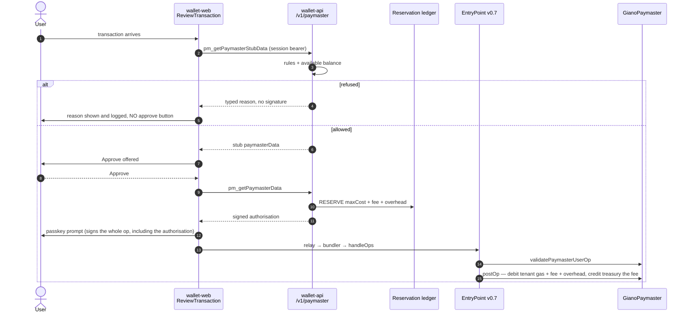

# Transaction submission flow — "Transfer 69 USDC" on a multi-tenant backend

This diagram traces a single ERC-20 transfer through the Giano two-origin, ERC-4337
stack: from the button click in the sample dApp (`services/custom-example`) to the
moment the signed UserOperation is accepted by the bundler, and on to the receipt.

The backend is **multi-tenant** (see `docs/ARCHITECTURE.md`): one `giano-wallet-api`,
one Postgres, one bundler and one chain serve many tenants, where
**tenant ≡ wallet origin ≡ WebAuthn RP ID**, one to one. The trace below follows
tenant `stock` (wallet origin `wallet.a.example`, stock `wallet-web` UI). A
bring-your-own-UI tenant (`byo`, reference `e2e/wallet-byo/`) walks the identical
path — only the SPA's authorship and the edge implementation differ.

Key properties visible in the flow:

- **Origin isolation.** The dApp bundle ships no WebAuthn, credential, bundler or
  paymaster code. Everything trust-related runs on the **wallet origin** popup and is
  reached only over zod-validated JSON-RPC-over-`postMessage`.
- **Tenant isolation, enforced four times on this path.** ① the transport pins one
  allow-listed dApp origin per popup; ② the passkey ceremony can only satisfy the
  tenant's RP ID; ③ browser storage (session token, SDK session cache) is
  origin-partitioned and, in the SDK, additionally namespaced per wallet origin; ④ the
  relay cross-checks the request `Origin`'s tenant against the session's tenant and
  rejects a mismatch as a plain 401 while incrementing an alertable metric.
- **Tx → UserOp.** `eth_sendTransaction` is repackaged into an EntryPoint v0.7
  UserOperation inside the wallet (`wallet-core` provider), gas-estimated and prepared
  against the tenant's bundler proxy, signed by the passkey, then relayed.
- **Policied relay, per tenant.** The signed op is not sent straight to the bundler by
  the browser; it goes through **wallet-api**, which recomputes the hash against its
  *own* EntryPoint and chain id, applies the **tenant's** merged policy and per-tenant
  relay rate limit, writes a tenant-scoped audit row, and only then forwards to the
  shared bundler.
- **Sponsorship.** Chosen by the tenant's `config.json` `sponsorship` mode:
  - `service` (production) — the wallet asks the **sponsorship service** whether this transaction
    will be sponsored *before* it offers an approve button, and then again, authoritatively, just
    before the passkey signature. The service checks the tenant's rules and available balance and
    signs an authorisation the paymaster verifies on chain. See §"Sponsorship" below.
  - `test-paymaster` (development) — the permissive paymaster, attached by address alone during gas
    estimation. Approves everything; refused in a production build.
  - `off` — no paymaster; the wallet behaves exactly as the unsponsored path.

  In every mode the relay independently checks the attached paymaster against the tenant's
  `allowedPaymasters`, and additionally cross-checks that a Giano-sponsored operation names the
  session's own tenant.

Code anchors: `Erc20Panel.tsx` · `create-giano-wallet-provider.ts` (thin SDK) ·
`wallet-transport` client/host · `wallet-web/src/host.ts` + `wallet.ts` + `config.ts` ·
`wallet-core/src/provider.ts` · `account/toGianoSmartAccount.ts` ·
`create-wallet-api-injection.ts` · `wallet-api/src/plugins/tenant.ts` + `plugins/auth.ts` ·
`wallet-api/src/routes/userops.ts` + `services/userop-policy.ts` + `services/tenants.ts` +
`services/bundler.ts`.

```mermaid
sequenceDiagram
    autonumber
    actor User

    box rgba(120,160,255,0.12) dApp origin (app.a.example) — tenant A's dApp
        participant UI as dApp UI<br/>(Erc20Panel)
        participant Thin as Thin provider<br/>(giano-connector)
        participant Read as publicClient<br/>(read RPC)
    end

    participant TP as postMessage<br/>transport

    box rgba(120,255,160,0.12) Wallet origin popup (wallet.a.example) = TENANT A
        participant Host as Wallet host<br/>+ Review view
        participant GP as Giano provider<br/>(wallet-core)
        participant Acct as Smart account<br/>(toGianoSmartAccount)
        participant BC as Bundler client<br/>(viem + tenant paymaster cfg)
    end

    actor PK as Passkey authenticator<br/>(RP ID = wallet.a.example)
    participant API as wallet-api<br/>(shared, tenant-resolved)
    participant Bundler as ERC-4337 bundler<br/>(Alto — shared)
    participant PM as Paymaster<br/>(contract)
    participant Node as Blockchain node<br/>(RPC + EntryPoint — shared)

    %% ---------- 1. Click & encode (dApp side) ----------
    User->>UI: Click "Transfer 69 USDC"
    activate UI
    Note over UI: encodeFunctionData(erc20.transfer,<br/>[to, 69_000000])  // 6 decimals
    UI->>Thin: request eth_sendTransaction<br/>[{ to: USDC, data }]
    activate Thin

    %% ---------- 2. Cross-origin transport, tenant-pinned ----------
    Note over Thin: eth_sendTransaction ∈ WALLET_METHODS → popup.<br/>SDK cache key giano:sdk:session:{walletOrigin}:{chainId}<br/>— namespaced so one dApp may address two tenants
    Thin->>TP: open popup at tenant A walletUrl<br/>+ handshake (if not connected)
    TP->>Host: rpc "eth_sendTransaction"<br/>(zod-validated envelope)
    activate Host
    Note over Host: TransportHost pinned the FIRST handshake origin<br/>against tenant A's allowedDappOrigins<br/>(config.json — empty ⇒ fail closed)

    %% ---------- 3. Consent (wallet origin) ----------
    opt in-memory account lost (popup reopened)
        Host->>GP: giano_restoreAccount
        GP->>API: GET /api/v1/me/credentials/:id/public-key<br/>(Bearer session — localStorage of THIS origin)
        Note over API: no Origin-resolvable tenant on this GET ⇒<br/>the session IS the tenant authority (auth.ts)
        API-->>GP: { x, y }  (scoped to session.userId)
        Note over GP,Acct: rebuild smart account from stored<br/>pubkey — NO passkey prompt here
    end
    Host->>User: Show ReviewTransaction<br/>(to, token, amount, pinned dApp origin)
    User-->>Host: Approve
    Host->>GP: request eth_sendTransaction

    %% ---------- 4. Build the UserOperation ----------
    activate GP
    Note over GP: calls = [{ to: USDC, value: 0, data }]<br/>submitUserOperation({ calls, account })
    GP->>BC: estimateUserOperationGas(userOp)
    activate BC
    BC->>BC: getPaymasterStubData()<br/>→ { paymaster: tenant config.paymasterAddress }
    BC->>Node: eth_estimateUserOperationGas<br/>(via tenant edge /bundler → shared Alto)
    Node-->>BC: gas limits (verificationGasLimit ≥ 800k for WebAuthn)
    BC-->>GP: gas estimate
    GP->>BC: prepareUserOperation({...op, ...estimate})
    BC->>Node: get nonce (EntryPoint.getNonce), account code
    Note over BC,Acct: encodeCalls → execute(to,0,data)<br/>getFactoryArgs → factory/factoryData<br/>(only if account not yet deployed)
    BC->>BC: getPaymasterData() → { paymaster }
    BC-->>GP: prepared UserOperation
    deactivate BC
    GP->>Read: estimateFeesPerGas()
    Read->>Node: eth_feeHistory / gasPrice (tenant edge /rpc)
    Node-->>Read: maxFeePerGas / maxPriorityFeePerGas
    Read-->>GP: fees
    Note over GP: resolveUserOpFees:<br/>requested → prepared → chain estimate
    Note over GP,BC: estimate + prepare are NOT policied —<br/>they hit the shared bundler through the tenant's<br/>own proxy. Only the SIGNED op is policied (step 6).

    %% ---------- 5. Sign with the passkey ----------
    GP->>Acct: signUserOperation(preparedWithGas)
    activate Acct
    Note over Acct: hash = getUserOperationHash(chainId,<br/>EntryPoint v0.7, userOp)<br/>wrapped in replay-safe EIP-712
    Acct->>PK: navigator.credentials.get(challenge = hash)
    Note over PK: assertion is only produced for RP ID<br/>wallet.a.example ⇒ tenant B's passkeys are<br/>structurally unusable here
    PK->>User: Biometric / PIN prompt
    User-->>PK: Authenticate
    PK-->>Acct: WebAuthn assertion (r, s, authenticatorData, clientDataJSON)
    Note over Acct: toWebAuthnSignature + wrapSignature<br/>→ SignatureWrapper(ownerBytes, sig)
    Acct-->>GP: signature
    deactivate Acct

    %% ---------- 6. Policied, tenant-scoped relay ----------
    Note over GP: signedUserOp = prepared + sender + signature
    GP->>API: POST {walletOrigin}/api/v1/userops<br/>{ userOperation } · Bearer session<br/>Origin: https://wallet.a.example
    activate API
    Note over API: onRequest: tenant ← getByOrigin(Origin)<br/>(wallet_origin or expected_origins)
    alt session's tenant ≠ Origin's tenant
        Note over API: giano_cross_tenant_rejections_total{kind="session"}++<br/>(ALERTABLE) — no oracle in the response body
        API-->>GP: 401 unauthorized ("invalid or expired session")
    else same tenant
        Note over API: relayLimit: fixed window keyed by session.tenantId<br/>max = tenant policy.relayRateLimitPerMinute<br/>?? USEROP_RATE_LIMIT_PER_MINUTE
        opt tenant over its own relay quota
            API-->>GP: 429 rate-limited<br/>(giano_userop_relayed_total{status="rate-limited"})
        end
        Note over API: hash = getUserOperationHash(config.CHAIN_ID,<br/>bundler.entryPoint) — SERVER values only.<br/>schema .strip() drops any client-sent entryPoint
        Note over API: policy = mergePolicy(env USEROP_* defaults,<br/>tenants.policy jsonb) — per-field override<br/>rules: sender-binding · call-gas-cap ·<br/>verification-gas-cap · max-fee-cap ·<br/>priority-fee-cap · target-allowlist ·<br/>paymaster-allowlist
        alt policy rejects
            Note over API: userop_log row (tenant_id, user_id, session_id,<br/>status: rejected, full policyResults)<br/>giano_userop_policy_rejections_total{rule,tenant}++
            API-->>GP: 403 policy-rejected (+ rule results)
            GP-->>Host: error
            Host-->>UI: rejected
        else policy allows
            Note over API: userop_log row (status: accepted)<br/>ON CONFLICT (userop_hash) DO NOTHING
            opt hash already logged
                Note over API: duplicate:true only when the row's tenant_id<br/>AND user_id match the caller — otherwise 409 generic
            end
            API->>Bundler: eth_sendUserOperation(rpcOp,<br/>SERVER-configured entryPoint)
            activate Bundler
            Bundler->>Node: simulateValidation (EntryPoint)
            Node->>PM: validatePaymasterUserOp (sponsor check)
            PM-->>Node: sponsorship OK / prefund
            Node-->>Bundler: validation OK
            Bundler-->>API: userOpHash
            deactivate Bundler
            Note over API: userop_log → status: submitted<br/>giano_userop_relayed_total{status="submitted",tenant}++<br/>giano_userop_relay_seconds{tenant} observed
            API-->>GP: { userOperationHash }
        end
    end
    deactivate API
    GP-->>Host: userOpHash
    deactivate GP
    Host-->>TP: rpc:response userOpHash
    deactivate Host
    TP-->>Thin: userOpHash
    Thin-->>UI: userOpHash  ← signed UserOp submitted to bundler ✅
    deactivate Thin
    Note over UI: notifyInfo("Transfer submitted — waiting for receipt…")

    %% ---------- 7. Await inclusion (receipt) ----------
    UI->>Thin: request waitForUserOperationReceipt [hash]
    activate Thin
    loop poll every 2s, up to 120s
        Thin->>API: GET {walletOrigin}/api/v1/userops/:hash/receipt<br/>(public, tenant-free · CORS ← tenant corsOrigins)
        API->>Bundler: eth_getUserOperationReceipt(hash)
        Bundler-->>API: receipt or null
        API-->>Thin: { receipt }
    end
    Note over Bundler,Node: meanwhile the bundler batches the op into<br/>EntryPoint.handleOps → mined on-chain
    Thin-->>UI: receipt { success }
    deactivate Thin
    UI->>User: notifySuccess("Transfer confirmed") / error if reverted
    deactivate UI
```

## Where the tenant is resolved on this path

`wallet-api` never has a "current tenant" at boot — resolution is strictly per request
(`src/plugins/tenant.ts`, `src/plugins/auth.ts`). Three of the four mechanisms appear in
this flow:

| Request on this path | Tenant resolved from | Failure mode |
| --- | --- | --- |
| `POST /v1/userops` | `Origin` (browsers send it on POST even same-origin) → `getByOrigin`, then **cross-checked** against `session.tenantId` | mismatch → `401` + `giano_cross_tenant_rejections_total{kind="session"}` |
| `GET /v1/me/credentials/:id/public-key` (silent restore) | no resolvable `Origin` on this same-origin GET ⇒ the **session** is the tenant authority (`request.tenant` backfilled from `session.tenantId`) | no session → `401`; unknown credential for that user → `404` |
| `GET /v1/userops/:hash/receipt` | **nothing** — deliberately tenant-free and unauthenticated (public chain state, so thin-SDK dApps need no bundler URL) | n/a |
| `GET /v1/userops/:hash` (relay status, not on the happy path) | session; row must match **both** `tenantId` and `userId` | otherwise `404 not-found` (never "forbidden") |

`/.well-known/webauthn` resolves by **`Host`** (`requireTenantByHost`) and admin routes by
**admin-key hash** — neither is used to submit a transaction.

Load-bearing consequence for a bring-your-own-UI tenant: its edge must forward `Origin`
**untouched** on `/api`, or the relay's Origin↔session cross-check has nothing to resolve.
(`e2e/wallet-byo/serve.mjs` documents this, and preserves the browser `Host` for the ROR
document.)

## What is per-tenant vs shared in this one transfer

**Per tenant:** the wallet origin and its edge/proxy, the RP ID and therefore the passkey
that signs, `allowedDappOrigins` (the transport allow-list), `corsOrigins` (which gates the
dApp's receipt polling if it is cross-origin), the `config.json` values used to build the op
(`chainId`, `rpcUrl`, `bundlerUrl`, `factoryAddress`, `paymasterAddress`, `branding`), the
localStorage keys `giano:session-token` / `giano:external-user-id` (origin-partitioned by the
browser), the merged UserOp policy and the relay rate-limit window, the `userop_log` rows,
and every metric label.

**Shared:** the `wallet-api` process, Postgres, the bundler and its funded executor EOA, the
chain, EntryPoint v0.7, `GianoSmartWalletFactory`, the implementation and the paymaster
contract — so all tenants' accounts are plain `GianoSmartWallet` clones from the one factory,
and `userop_hash` is globally unique (it binds chain id + EntryPoint + op, so two tenants
cannot legitimately collide).

## Notes on the two submission paths

`wallet-core`'s `submitUserOperation` has **two** branches (`provider.ts`):

- **With the wallet-api injection hook (shown above, the default for `wallet-web` and for
  the BYO reference SPA)** — the provider estimates + prepares + signs locally, then hands
  the *signed* op to `injection.submitUserOperation`, which `POST`s to `wallet-api`. The
  bundler is only ever reached *for submission* by the backend, after tenant resolution and
  policy. The dApp never holds a bundler URL.
- **Without the hook** — the provider calls `bundler.sendUserOperation(userOpRequest)`
  directly (viem's account-abstraction client builds, signs and submits in one call). This is
  the embedded/no-backend path: no tenant, no policy, no audit row, no per-tenant rate limit.

The paymaster is attached by the bundler client's `getPaymasterStubData` / `getPaymasterData` hooks
(chosen in `wallet.ts` from the tenant's `config.sponsorship`). The relay re-checks the paymaster
against the tenant's `allowedPaymasters` and cross-checks the tenant the operation bills, and the
on-chain sponsorship decision (`validatePaymasterUserOp`) happens at bundler validation / EntryPoint
execution time, not in the browser.

## Sponsorship (the `service` mode)

The decision is taken **before** the user is asked to approve, and enforced **on chain** — so a
client that skips Giano's backend entirely cannot obtain sponsorship, and a user is never asked for
a fingerprint for a transaction that cannot be paid for.

Two calls, and the difference between them is the design:

| | `pm_getPaymasterStubData` | `pm_getPaymasterData` |
| --- | --- | --- |
| When | During gas estimation, possibly repeatedly; and by the review screen as a pre-flight | Once, immediately before the passkey signature |
| Rules evaluated | Yes — this is what makes a pre-approval refusal possible | Yes, authoritatively (config or balance may have moved) |
| Reserves balance | **No** — estimation noise must not fill the ledger | **Yes**, atomically |
| Signs | No — a correctly-sized dummy, so estimation stays accurate | Yes |

Two signatures are involved, each covering what the other cannot. Giano signs what determines the
operation's cost and intent — sender, calldata, gas limits, **which tenant pays and what fee
applies**. The passkey then signs the whole operation *including* that authorisation. Neither can be
altered afterwards without invalidating the other, and binding the tenant into Giano's signature is
what stops an end user redirecting the charge to somebody else's balance.

The reservation is what makes per-tenant segregation hold under concurrency. On-chain validation sees
one operation at a time, against a balance nothing has yet debited — so three individually affordable
operations could settle together for more than the tenant holds, and the contract could not undo
that. So the third authorisation is refused before it exists.

Keep a **real `estimateFeesPerGas`** in every tenant's wallet SPA: `wallet-core`'s fallback
is a hardcoded 200 gwei `maxFeePerGas`, which on a low-fee chain inflates the required
paymaster prefund and trips `AA31 paymaster deposit too low`.

## Coverage

`e2e/tests/wallet-flow.spec.ts` walks this flow for tenant `stock`;
`byo-wallet.spec.ts` walks it for tenant `byo` against the same backend;
`tenant-isolation.spec.ts` exercises the cross-tenant rejection branch of step 6;
`sponsorship.spec.ts` walks the sponsored path and every pre-approval refusal for **both** wallet
interfaces, asserting the accounting from chain events rather than from the service's own books —
because a sponsored transaction that lands is not evidence that the ledger is right.
