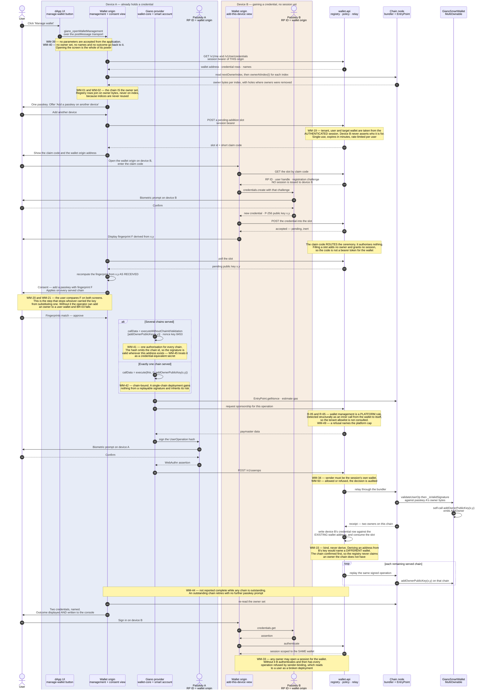

# Giano wallet management — requirements

A Giano wallet is created with **one** passkey, and there is no way to add a second, to remove one,
or to see from the wallet itself what can act on it. The account contract has been able to do all
three since it was written; nothing above it has ever called those functions.

This document specifies the interface through which a user sees and controls the set of credentials
that can act on their wallet — and the ceremony, backend and SDK changes that interface needs in
order to exist at all. It is a requirements document, not an implementation plan.

It serves [`BUSINESS-REQUIREMENTS.md`](./BUSINESS-REQUIREMENTS.md) **BR-32** (a user sees and
controls their credentials) and the on-chain half of **BR-15** (a wallet admits credentials of more
than one kind). It is also the **precondition for BR-33**, recovery: whatever mechanism answers
BR-33's open question, every option in it ends in a credential being added to a wallet, and today no
credential can be added to a wallet by any means.

Status: **draft, in review.**

> **Numbering.** Requirements are `WM-nn`, globally unique within this document. They are unrelated
> to the `BR-nn`, `MC-nn` and `R-nn` series, which are cited here rather than restated. The
> cross-chain behaviour of an owner change is specified in
> [`MULTICHAIN_REQUIREMENTS.md`](./MULTICHAIN_REQUIREMENTS.md) §4.3 (MC-32…MC-38, MC-142…MC-144);
> who pays for it is specified in [`PAYMASTER-REQUIREMENTS.md`](./PAYMASTER-REQUIREMENTS.md) (R-05,
> R-65). This document requires that those paths be used and states what the *user* must see.

---

## Contents

1. [The problem](#1-the-problem)
2. [Goal and scope](#2-goal-and-scope)
3. [Key decisions](#3-key-decisions)
4. [Requirements](#4-requirements)
5. [Security posture](#5-security-posture)
6. [Accepted limitations and roadmap](#6-accepted-limitations-and-roadmap)
7. [Open questions](#7-open-questions)
8. [Glossary](#8-glossary)

---

## 1. The problem

### 1.1 The contract can already do this. Nothing above it can.

`MultiOwnable` holds the owner set as raw bytes and admits exactly two encodings — a 32-byte
ABI-encoded Ethereum address, or a 64-byte P-256 public key, which is what a passkey becomes. It
exposes `addOwnerAddress`, `addOwnerPublicKey`, `removeOwnerAtIndex` and `removeLastOwner`, all
`onlyOwner`. `GianoSmartWallet._isValidSignature` checks owner membership before dispatching by
owner kind, so a set change is effective for signing the moment it lands. The account's address is
a CREATE2 salt over the **initial** owner set, so owners added later never move it — which is
precisely the property BR-33 needs. And `canSkipChainIdValidation` already restricts the
chain-independent authorisation path to exactly these four functions plus `upgradeToAndCall`.

None of it is reachable. There is no caller of `addOwnerAddress`, `addOwnerPublicKey`,
`removeOwnerAtIndex`, `removeLastOwner` or `executeWithoutChainIdValidation` anywhere in the SDK,
the wallet origin or the backend. The capability has been shipped and never wired up.

### 1.2 Three structural obstacles, not a missing screen

The reason this has not been built as an afternoon's UI work is that three decisions below the
interface currently make a second credential mean a second *wallet*:

**Address derivation is single-owner.** The backend derives a wallet address by asking the factory
for the address of a **one-element** owner set at nonce 0, and the client-side account
implementation signs with `owners[0]` only. A newly created passkey therefore derives a *different*
address. A second credential can never *find* the existing wallet by derivation; it has to be
bound to it by lookup.

**The credential row owns the address.** `credentials.wallet_address` is written from that
derivation at registration, and `POST /v1/webauthn/registration/verify` has no parameter with which
to say "this credential belongs to a wallet that already exists".

**Sessions bind to the credential's address, not to the user's wallet.** The session's wallet
address is joined off the credential row, and the sponsorship rules refuse any operation whose
sender is not the session's own wallet. So even if a second owner were added on-chain out of band,
a session held by that second credential could not relay a single operation for the wallet it owns.

### 1.3 What the user can see today is the wrong set

The wallet origin's standalone view does list the user's passkeys. That is worth stating plainly,
because BR-32's current text says the user cannot see the set at all, and that half of it is now
out of date. What it lists, though, is not the set BR-32 is about:

- it lists the **off-chain credential registry**, not the on-chain owner set, and nothing reconciles
  the two — an owner added by any other route does not appear, and a registry row for a credential
  that is not an owner is shown as though it were one;
- credentials are distinguishable only by a creation date and a 12-character credential-id prefix;
- the registration endpoint accepts a `credentialName` and **silently discards it** — there is no
  column for it — and the wallet origin sends the tenant's brand name for every credential anyway,
  so it would distinguish nothing even if stored.

### 1.4 The one part that is already solved is the money

Wallet-management transactions are already sponsored, by **platform** policy rather than by a
tenant's allowlist, detected structurally as any inner call from the wallet to itself, default-on,
under a platform cap a tenant may lower but never raise (R-05, R-65). The reasoning recorded there
is exactly this document's: a user holding a new device holds no native token and has no way to
obtain one, so a tenant that forgot to allowlist something must not be able to break the path.

So this work does not have to solve funding. It has to solve identity, consent and enumeration.

---

## 2. Goal and scope

### 2.1 Goal

From the wallet origin, a user can see every credential that can act on their wallet, tell them
apart, add another — on this device or a second one — and remove one they no longer trust. Every
change is a consented, sponsored, audited operation, applied to every chain the deployment serves,
and authorised **only** by a credential the wallet already recognises.

### 2.2 In scope for v1

- The owner set **read from the chain**, reconciled against the credential registry, with
  divergence shown rather than hidden.
- User-supplied names for credentials, and enough detail to tell two of them apart.
- Adding a passkey created in the current session — which is what makes a hardware security key
  usable as a backup credential.
- Adding a passkey created on a **second device**, through a verified handoff.
- Adding an **externally-owned account** as an owner, per BR-15.
- Removing a credential, with the last-owner guard and correct handling of removing the one you are
  currently using.
- The backend changes without which none of the above is possible: binding a new credential to an
  existing wallet, and binding sessions to the wallet rather than to the credential.
- Reaching the interface from inside an integrating application, and directly on the wallet origin.
- Consent copy that states an owner change applies to every served chain, and per-chain progress
  until it does.
- Durable audit records for every attempted change.
- A management button in **both** demo applications, and the same flow implemented in the
  bring-your-own-UI reference so the API is proven sufficient without the stock interface.
- End-to-end coverage of each flow and each refusal.

### 2.3 Out of scope for v1

Deferred, with reasoning in [§6](#6-accepted-limitations-and-roadmap):

- **Recovery from total loss of every credential (BR-33).** The mechanism is an open product
  question (BUSINESS-REQUIREMENTS §6, Q1). This work is its precondition and must not foreclose any
  of the options on the table.
- **Threshold approval across several people (BR-36).** The account is 1-of-N by construction —
  `_isValidSignature` decodes a single signature wrapper — so this is a contract change, not an
  interface one.
- **A user-initiated account upgrade.** `upgradeToAndCall` is the fifth selector on the same
  chain-independent path, and the design here must not preclude it, but no upgrade UI is built.
- **Balances and transaction history (BR-34).**
- **Operator-side reconciliation tooling.** MC-37 requires detecting an owner set that differs
  between chains and a means of reconciling it; v1 owes the alert, not an operator console
  (BR-35 covers that surface).

### 2.4 What this must not change

Every requirement below is expressed as an operation **signed by a credential the wallet already
recognises**. No requirement in this document adds a server-side authority over any wallet, and any
implementation that does is wrong regardless of how convenient it is: BR-03 forbids Giano and the
tenant from acquiring the ability to add an owner, remove one, or change the code a wallet runs,
because an authority to add an owner is an authority to sign by another name.

---

## 3. Key decisions

Eleven decisions shape the rest. Each records what was chosen, what was rejected, and the
consequence to be lived with.

### D1 — The chain is the owner set. The registry is a cache.

What may act on the wallet is what `MultiOwnable` says may act on it. The interface enumerates
owners from the account contract and treats the credential registry as decoration — names,
creation dates, transports — joined on the public key.

Two consequences follow from how the contract stores owners. Indices are **never reused**:
`ownerCount()` is `nextOwnerIndex - removedOwnersCount`, so removal leaves a hole and enumeration
must walk to `nextOwnerIndex` and skip empties. And `removeOwnerAtIndex` takes both the index *and*
the exact owner bytes, reverting with `WrongOwnerAtIndex` if they disagree — so an index read
earlier and used later is a failed transaction.

*Rejected:* trusting the registry, which is what the current view does. It cannot see an owner added
by any other route, and it shows a credential that is not an owner as though it were one — the
failure mode being a user who believes they have a backup credential and does not.

*Consequence:* the interface cannot render without a chain read, so it must have an explicit state
for "the chain could not be reached", distinct from "you have one credential".

### D2 — A new credential is **bound** to the existing wallet, never derived from

Registration gains a path that attaches a newly created credential to a wallet address the user
already controls, instead of deriving an address from the new key. Derivation stays exactly as it
is for a *first* credential, so no existing wallet's address changes and the canonical-address
property (BR-25, MC-18) is untouched.

*Rejected:* deriving the address from the *pair* of owners, so that a two-passkey wallet has its own
address. It would have to be decided at creation, before the user has a second device, and it moves
the address of every wallet created that way — solving the problem for wallets that do not exist yet
and not at all for the ones that do.

*Consequence:* a wallet's address remains a function of its first credential forever. A recovering
user cannot compute their address from a new key; they must be *told* it by a deployment that
remembers. That is a real dependency on the registry, and BR-24 already requires the registry to
live in infrastructure the client controls.

### D3 — Sessions bind to the wallet, not to the credential

A session records which wallet it may act for, and any credential that is an owner of that wallet
may open a session for it. Without this, the second credential authenticates successfully and then
has every operation refused by the sender-binding rule, which is the current behaviour and is
indistinguishable from a broken deployment.

*Rejected:* keeping the credential→address column as the source of session scope and special-casing
the relay. The check that refuses a foreign sender is load-bearing for tenant isolation; it should
not learn exceptions.

*Consequence:* a session is now scoped by something that can change during its lifetime. Removing an
owner has to invalidate that owner's sessions ([D9](#d9--removal-refuses-to-strand-the-wallet)).

### D4 — Adding an owner is an ordinary consented UserOperation

There is no management API that changes a wallet. A change is a self-call in a UserOperation signed
by an existing credential, reviewed on the wallet origin's consent screen like any other
transaction, relayed and audited like any other transaction. The backend's role is what it is
everywhere else: policy and relay.

*Rejected:* a backend endpoint that adds an owner "on the user's behalf" with a session token as
authorisation. It is the same shape as every embedded-wallet product Giano exists to be an
alternative to, and it would put an authority to sign on the server — BR-02 and BR-03 both.

*Consequence:* a user with no working credential cannot add one. That is not a gap in this design;
it is the whole of BR-33, and it cannot be closed by making this design weaker.

### D5 — Management lives on the wallet origin. The application gets a function, not a screen.

The interface is served from the wallet origin, and the integrating application can do exactly one
thing with it: **open it**. The SDK exposes a function that opens the management view in the wallet
popup, following the existing `giano_`-namespaced transport convention, so no standard EIP-1193
method changes shape and an application's existing wallet-facing code is untouched (BR-06, BR-10).

The application passes **no parameters** — not a credential, not an address, not a mode. It cannot
pre-fill the form, cannot preselect a credential for removal, and cannot know what happened beyond
that the popup closed. A malicious application's entire power over wallet management is the power to
show the user their own wallet's management screen.

*Rejected:* an embedded or iframed management surface in the application's page, which BR-04
forbids; and returning the resulting owner set to the caller, which hands the application a
credential inventory it has no need for.

*Consequence:* the application cannot build its own settings page around this, and cannot report
"you have two passkeys" in its own UI. That is the trade BR-04 makes everywhere else too.

### D6 — Chain-independent authorisation only where more than one chain is served

An owner change can be authorised two ways. `execute(address(this), …)` is chain-bound and ordinary.
`executeWithoutChainIdValidation` validates against a hash with **no chain id**, which is what lets
one signature apply the change to every served chain (MC-33) — and which makes that signature valid
on every chain where the address exists, with no expiry, forever.

A deployment serving one chain gains nothing from the replayable path and inherits its whole risk,
so it MUST use the chain-bound path. A deployment serving several MUST use the replayable one, and
MUST treat the resulting signature as a credential-equivalent secret for as long as it retains it.

*Rejected:* using the replayable path unconditionally, for uniformity. Uniform code is not worth a
forever-valid signature in a single-chain deployment's database.

*Consequence:* two code paths, and a deployment that adopts a second chain changes which one it
uses. MC-38 already requires a chain added later to reconcile on first use with a **fresh**
authorisation, so nothing signed under the single-chain path needs to remain valid.

### D7 — Names are local labels, never authority

A name is a per-credential string in the registry, set and changed by the user, shown to help them
tell "the phone I still have" from "the laptop I sold". It is not on-chain, does not travel between
deployments, and is never an input to any decision. The interface must therefore never let a name be
the only thing distinguishing two credentials at the moment of a destructive action.

*Rejected:* a tenant-supplied name, which is what the discarded `credentialName` field currently
carries and which is identical for every credential a tenant registers; and putting names on-chain,
which costs gas to write and leaks a device inventory to anyone reading the chain.

### D8 — Cross-device addition is a verified handoff, not an invitation

The new passkey is created on the new device; the signature that adds it comes from the old one. The
new public key therefore travels **through the backend**, and that is the dangerous part: if the
user consents to "add the key my other device just made" without seeing *which* key, the party
carrying the key can substitute one. That party is the operator. Unverified handoff hands Giano an
owner on a user's wallet and BR-03 falls — not by a missing check, but by design.

So: the **authorising** device opens a short-lived, single-use **pending addition**, whose binding to
the user and the wallet comes from its own authenticated session. A short claim code routes the new
device to that slot, where it deposits a credential that stays inert. Both devices then display a
fingerprint derived from the public key itself, the old device's consent screen shows the fingerprint
it is about to sign for, and the user confirms it matches. The fingerprint is not usability polish;
it is the mechanism by which the user, rather than the backend, chooses what gets added. The whole
sequence is drawn in [§4.4](#44-adding-a-credential-from-a-second-device).

*Rejected:* a link or code the user carries away and redeems later — a bearer path to owning a
wallet, and a phishing target with a much better payoff than a transaction. Also rejected: trusting
the transport, which means trusting the operator, which is the thing being avoided.

*Consequence:* both devices must be present and awake at the same time, and the user has to compare
six characters. That is the cost of the change being the user's.

### D9 — Removal refuses to strand the wallet

`removeOwnerAtIndex` already reverts on the last owner; `removeLastOwner` exists specifically to
remove it anyway, and the interface **does not expose it**. Deliberate abandonment of an account
that may hold assets is not a settings-screen action ([Q6](#7-open-questions)).

Removing the credential the current session is using is allowed — it is how a user decommissions the
device in their hand — but it ends the session, and the registry must stop issuing sessions for a
credential that is no longer an owner. Otherwise a removed device still authenticates, still gets a
session, and fails only at signature verification on-chain, which is the least legible place for it
to fail.

*Consequence:* a removed credential still exists on the user's device and in their password manager.
The wallet cannot delete it; it can only refuse it, and say why.

### D10 — Nothing is reported as done until the chain says so

An owner change is complete when it is confirmed on **every** served chain (MC-36). Until then the
interface shows it as outstanding, per chain, and a retry of an outstanding chain must not require
another passkey prompt while the authorisation is still valid. Outcomes — success and failure alike
— are both displayed and written to the browser console, so an integrator debugging a deployment is
not dependent on a transient banner.

### D11 — The demonstrations carry the button, and the BYO interface carries the flow

The management interface is unreachable unless something opens it. Both demo applications get a
button that opens it, and the bring-your-own-UI reference implements the whole flow itself against
the same API. A tenant serving its own wallet interface has to build this; if the reference cannot,
the API is not sufficient and we would find out from a customer.

---

## 4. Requirements

### 4.1 Seeing the set

**WM-01** — The interface MUST show the set of owners **read from the account contract** on a served
chain, not from the credential registry.

**WM-02** — Enumeration MUST tolerate the contract's storage shape: it MUST walk to
`nextOwnerIndex`, skip removed indices, and match registry rows to owners by **owner bytes**, never
by index.

**WM-03** — Each owner MUST be shown with its kind — a passkey or an externally-owned account — and
with a stable, human-comparable identifier derived from the owner bytes themselves.

**WM-04** — An owner with no matching registry row MUST still be listed, labelled as added outside
this deployment. A registry row with no matching on-chain owner MUST be shown as **not** an owner of
this wallet. Neither MUST be silently omitted.

**WM-05** — If the owner set cannot be read, the interface MUST say so explicitly and MUST NOT
render an empty or single-credential set, which a user would read as fact.

**WM-06** — Where more than one chain is served, the interface MUST make clear that the owner set
shown is the set on the chain it was read from, and MUST surface a set that differs between served
chains as a problem needing reconciliation rather than as a list (MC-37).

### 4.2 Telling credentials apart

**WM-07** — A user MUST be able to give each credential a name, and to change it later.

**WM-08** — Names MUST be stored per credential in the registry. The `credentialName` field
currently accepted and discarded at registration MUST either be persisted as the credential's
initial name or removed from the API; accepting a value and dropping it MUST NOT continue.

**WM-09** — A credential MUST be identifiable without a name — by creation date, by transport where
known, and by the identifier of WM-03 — because names are absent, stale or duplicated exactly when
they matter.

**WM-10** — The credential in use by the current session MUST be marked as such wherever the set is
shown.

**WM-11** — A name MUST NOT be an input to any authorisation, policy or matching decision.

### 4.3 Adding a credential

**WM-12** — A user with a working credential MUST be able to add a further passkey to their wallet,
and the wallet's address MUST NOT change when they do.

**WM-13** — Adding MUST be authorised by a signature from a credential the wallet already
recognises, carried in a UserOperation, and MUST NOT be performable by any server-side authority
(BR-02, BR-03).

**WM-14** — Adding a credential created in the **current** session MUST be supported as a flow of
its own, with no handoff, so that a hardware security key present on the device can be registered as
a backup credential in one sitting.

**WM-15** — The new credential MUST be registered against the user's **existing** wallet address.
The registration path MUST bind rather than derive, and the derived-address path MUST remain in
force for a user's first credential.

**WM-16** — Binding MUST be refused unless the requesting session is authenticated, belongs to the
tenant, and is scoped to the wallet being bound to. A credential MUST NOT be bindable to a wallet
the requester does not already control.

**WM-17** — The consent screen MUST show what is being added, using the identifier of WM-03, before
any passkey prompt for the authorising signature is raised.

### 4.4 Adding a credential from a second device

This is the flow the rest of the document is shaped around, so it is drawn in full. The
same-session flow of WM-14 is the same diagram with phases 3 and 4 collapsed into a single
`credentials.create` on device A.

Three things in the diagram are load-bearing and easy to get wrong in implementation. The **slot is
opened by device A**, so the binding to tenant, user and wallet comes from an authenticated session
and device B never asserts any of it. The **claim code and the fingerprint are different values with
different jobs** — the code routes the ceremony to the right slot and authorises nothing, while the
fingerprint is what lets the user, rather than the backend, decide what gets added. And **the chain
is written before the registry**, so a failure between the two leaves an owner with no registry row,
which WM-04 renders honestly, rather than a registry row claiming an owner the chain does not have.

**WM-18** — A user MUST be able to add a passkey created on a **second device**, with both devices
present.

**WM-19** — The pending addition MUST be opened by the **authorising** device, so that its binding to
the tenant, the user and the target wallet comes from an authenticated session (WM-16). The new
device MUST be routed to it by a short **claim code**, which MUST be single-use, MUST expire in
minutes, MUST be rate-limited per user, and MUST NOT by itself add an owner, grant a session or
confer any other authority. Submitting a credential into a slot MUST leave it inert until authorised.

**WM-20** — Both devices MUST display a fingerprint derived from the new credential's public key,
and the authorising device's consent screen MUST show the fingerprint of the key it is about to sign
for.

**WM-21** — The user MUST confirm that the two fingerprints match before the authorising signature
is requested. A pending addition MUST NOT be signed for on the strength of the backend's assertion
that it is the right one.

**WM-22** — A pending addition MUST be consumed by the authorisation, MUST expire without effect
otherwise, and MUST NOT be resumable after expiry without the new device creating a fresh
credential.

**WM-23** — An expired, unknown or already-consumed pending addition MUST be refused with a reason
the user can act on, distinguishable from a network failure.

### 4.5 Adding an externally-owned account

**WM-24** — A user MUST be able to add an Ethereum address — a software or hardware wallet they
already hold — as an owner of their wallet (BR-15).

**WM-25** — The address MUST be validated for EIP-55 checksum correctness, MUST be displayed in
full and unabbreviated on the consent screen, and MUST require an explicit confirmation step
separate from the passkey prompt.

**WM-26** — The interface MUST state what is being granted: full and equal control of the wallet,
with no threshold and no limit, exercisable without the EntryPoint and therefore without the relay
policy and audit trail that cover every other route (see [§5.3](#53-two-footguns-worth-naming)).

### 4.6 Removing a credential

**WM-27** — A user MUST be able to remove any owner of their wallet, authorised by a credential the
wallet recognises.

**WM-28** — The interface MUST NOT offer removal of the last remaining owner, and MUST NOT expose
`removeLastOwner`. Where only one owner remains, the interface MUST explain why removal is
unavailable and offer adding a credential instead.

**WM-29** — Removal MUST read the owner's index from the chain immediately before constructing the
operation, because a stale index reverts.

**WM-30** — Removing the credential the current session is bound to MUST be permitted, MUST warn
that it ends this session, and MUST revoke the session and return the user to a signed-out state on
success.

**WM-31** — Once an owner is removed, the registry MUST stop issuing sessions for that credential,
and authentication with it MUST be refused with a reason that says it is no longer an owner of the
wallet — not a generic failure and not a session for a wallet it cannot sign for.

**WM-32** — Removal MUST require a confirmation that identifies the credential by more than its
name (WM-09, WM-11).

### 4.7 Identity, sessions and the registry

**WM-33** — A session MUST record the wallet it is scoped to. Any credential that is an owner of a
wallet MUST be able to open a session for that wallet.

**WM-34** — The relay's sender-binding rule MUST continue to refuse any operation whose sender is
not the session's wallet. It MUST NOT gain an exception for wallet management; WM-33 removes the
need for one.

**WM-35** — The registry MUST be able to hold several credentials against one wallet, and one user's
credentials MUST NOT be assumed to share a wallet address.

**WM-36** — Registry state MUST NOT be treated as authority over a wallet. Where registry and chain
disagree, the chain governs (D1), and the disagreement MUST be observable (WM-04).

### 4.8 Consent and the user's authority

**WM-37** — Every change MUST be presented on the wallet origin, showing what changes, which
credential authorises it, and on which chains it takes effect, before any signature is requested
(BR-16).

**WM-38** — Refusal MUST be a first-class outcome at every step, distinguishable by the caller from
a failure, and MUST leave the owner set untouched.

**WM-39** — The management interface MUST NOT accept parameters from the calling application. An
application MUST be able to open it and nothing else (D5).

**WM-40** — The management interface MUST NOT return the owner set, credential names, or the outcome
of any change to the calling application.

### 4.9 Across chains

**WM-41** — Where more than one chain is served, an owner change MUST be applied to every served
chain from a single user authorisation, using the account's chain-independent path (MC-32, MC-33).

**WM-42** — Where exactly one chain is served, the chain-bound path MUST be used instead (D6).

**WM-43** — The consent screen MUST state that the change applies to every served chain, naming them
(MC-35).

**WM-44** — A change MUST NOT be reported as complete while it is outstanding on any served chain.
Per-chain progress MUST be visible, and an outstanding chain MUST be retryable without a further
passkey prompt while the authorisation remains valid (MC-36).

**WM-45** — A retained chain-independent authorisation MUST be treated as a credential-equivalent
secret: protected at rest, and deleted once every served chain has applied it or the change is
abandoned. Resuming an abandoned change MUST require a fresh authorisation.

**WM-46** — An owner change MUST NOT be attempted on a chain where the account is not yet deployed
without the interface stating what will happen there ([Q2](#7-open-questions)).

### 4.10 Sponsorship

**WM-47** — Every operation in this document MUST be sponsorable under the existing platform
wallet-management rule (R-05, R-65), with no tenant allowlist entry required.

**WM-48** — Where a tenant has explicitly switched wallet-management sponsorship off, the interface
MUST say that the application's operator has disabled it, MUST NOT present it as a wallet fault, and
MUST NOT ask the user to fund anything.

**WM-49** — Where an operation exceeds the platform wallet-management cap, the refusal MUST name the
cap. A user who cannot add a backup credential must be told which limit stopped them.

### 4.11 Audit and observability

**WM-50** — Every attempted change — allowed or refused, and on what grounds — MUST be recorded
durably enough to answer an audit (BR-12), including which credential authorised it and which chains
it was applied to.

**WM-51** — A pending addition MUST be recorded on creation, on consumption and on expiry, so that a
key offered and never signed for is visible after the fact.

**WM-52** — Refused fingerprint confirmations MUST be counted and alertable. A key offered to a user
who declined to confirm it is either a bug or an attempt at exactly the substitution D8 exists to
prevent.

**WM-53** — An owner set differing between served chains MUST raise an operational alert (MC-37).

### 4.12 Reaching the interface

**WM-54** — The SDK MUST expose a function that opens the management interface in the wallet popup,
usable from an integrating application without the application implementing any wallet
functionality (BR-06, BR-19).

**WM-55** — The transport method MUST follow the existing `giano_`-namespaced convention and MUST
NOT change the behaviour of any standard EIP-1193 method.

**WM-56** — The interface MUST also be reachable by navigating to the wallet origin directly, and
the two entry points MUST present the same capabilities.

**WM-57** — Opening the management interface MUST require an authenticated session, and MUST offer
sign-in where there is none rather than failing.

**WM-58** — The interface MUST be presented without navigating the user away from the application
they are using (BR-11), and MUST carry the tenant's branding (BR-18).

**WM-59** — Where the popup is blocked, the failure MUST be reported the way the existing
popup-blocked path reports it, not as a wallet error.

### 4.13 Bring-your-own-UI parity

**WM-60** — Every capability in this document MUST be achievable by a tenant serving its own wallet
interface against the same API, with no Giano-specific privilege and no access to the stock
interface.

**WM-61** — The bring-your-own-UI reference (`e2e/wallet-byo`) MUST implement viewing, adding and
removing credentials, and MUST be covered by the same end-to-end scenarios as the stock interface.
An API that only the stock interface can drive is not a supported API.

**WM-62** — The API surface, including the binding path and the pending-addition lifecycle, MUST be
documented in the tenant-facing integration guide.

### 4.14 Demonstration applications

**WM-63** — The end-to-end fixture application (`e2e/dapp`) MUST carry a button that opens the
management interface, wired through the SDK function of WM-54, with its outcome written to the
existing output element so tests can assert on it.

**WM-64** — The example application (`services/custom-example`) MUST carry a management button in
its wallet panel, alongside its existing panels, using the same SDK function and no privileged path
of its own.

**WM-65** — Neither demonstration MUST implement any part of wallet management itself — no
credential handling, no ceremony, no owner-set construction. If either needs to, WM-54 is
insufficient and the SDK is what changes (BR-19).

**WM-66** — Both buttons MUST work against the standard local stack with no additional setup, no
manual funding and no configuration step.

### 4.15 End-to-end coverage

**WM-67** — The suite MUST cover the following, each as an observed outcome rather than a mocked
one, and MUST assert the **on-chain owner set** after each rather than only that a transaction
succeeded:

| Scenario | MUST assert |
|---|---|
| View the set with one credential | The on-chain owner is listed; the current session's credential is marked |
| Add a credential in the current session | Two owners on-chain; the address unchanged; both usable to sign |
| Add from a second device | Fingerprints match on both; consent shows the key signed for; two owners on-chain |
| Fingerprint declined | Nothing added; the refusal counted (WM-52) |
| Pending addition expired | Refused with an actionable reason, distinguishable from a network failure |
| Bind attempted from a session scoped to another wallet | Refused; nothing added (WM-16) |
| Sign in with the second credential | A session for the **same** wallet; a sponsored transaction relayed under it (WM-33, WM-34) |
| Add an externally-owned account | Owner present on-chain; full address shown before consent; it can then sign |
| Remove a credential | Owner gone on-chain; its sessions refused thereafter (WM-31) |
| Remove the credential in use | Permitted; session revoked; signed-out state reached (WM-30) |
| Last owner | Removal not offered; `removeLastOwner` not reachable from the interface (WM-28) |
| Stale index | Removal re-reads and succeeds, or refuses legibly — never a bare revert (WM-29) |
| Rename a credential | Name persists across sessions and devices; no authorisation depends on it |
| Multi-chain owner change | One passkey prompt; applied to every served chain; not reported complete until all confirm (WM-41, WM-44) |
| Single-chain deployment | The chain-bound path is used; no chain-independent signature is retained (WM-42, WM-45) |
| Wallet-management sponsorship switched off for the tenant | Stated as the operator's choice; no funding asked of the user (WM-48) |
| Opened from the application | The popup opens with no parameters accepted and returns no owner data (WM-39, WM-40) |
| Bring-your-own UI | View, add and remove all reachable through a tenant's own interface (WM-61) |
| Both demonstration buttons | Open the interface and reach a completed change (WM-63, WM-64) |

**WM-68** — Refusals MUST be asserted where the user meets them: the reason displayed **and** written
to the browser console, and no passkey prompt raised where the operation was refused before consent.

---

## 5. Security posture

### 5.1 Why this adds no authority

Every change is a self-call in a UserOperation whose signature comes from an owner. The backend
constructs nothing it can authorise: it relays, it records, and it stores a pending addition that is
inert until a user confirms a fingerprint derived from the key itself. Removing every server-side
component from the picture leaves the capability intact for anyone holding a credential, which is
the test BR-03 actually sets.

The one place authority could leak in is the handoff, and it leaks in through the *user interface*
rather than through a missing check: a consent screen that says "add the passkey from your other
device" without saying **which** key delegates the choice to whoever carried it. WM-20 and WM-21
exist for that reason alone.

### 5.2 What an attacker gets

| Attacker capability | Consequence | Bounded by |
|---|---|---|
| A malicious integrating application | Can open the user's management interface. Nothing else — no parameters, no returned data, no signature | WM-39, WM-40, BR-04 |
| A stolen session token | Can initiate a change and can bind a credential only to the wallet that session already controls. Cannot authorise anything: every change needs a fresh passkey signature over the operation | WM-13, WM-16, session lifetime |
| The operator, or a compromised backend | Can offer its own key as a pending addition. Cannot get it added: the user confirms a fingerprint of the key, computed from the key | WM-20, WM-21, WM-52. **Without those, BR-03 falls** |
| The operator, on the registry | Can misreport which wallet a credential belongs to, and can lose the binding a recovering user depends on (D2) | Chain-governs (WM-36); the misreport cannot forge a signature. Availability, not custody |
| A compromised owner credential | Can add owners and remove every other one. Total, permanent | **Nothing in this design.** It is what a legitimate user does; see below |
| A leaked chain-independent authorisation | Applies that one change on every chain where the address exists, present and future, with no expiry | The reserved nonce sequence, WM-45's retention rule, and WM-42 not creating one at all where one chain is served |
| An added externally-owned account | Full control, exercisable without the EntryPoint and so outside the relay policy and audit trail | WM-26 stating it; removal while another owner remains |

**A compromised owner is unbounded, and no interface can bound it.** Adding a credential and
removing the others is indistinguishable from a user replacing a lost phone, because it is the same
operation. This is the sharpest argument for the delayed-recovery-with-challenge-window option in
BUSINESS-REQUIREMENTS Q1: a challenge window is the only one of the four options that gives a user
any defence here, and it would apply to ordinary owner changes as much as to recovery. It is
recorded as [Q4](#7-open-questions) rather than built, because a delay on adding a backup credential
is a product decision, not an implementation detail.

### 5.3 Two footguns worth naming

**`removeLastOwner` is live and reachable by any owner.** It permanently orphans an account that may
hold assets, and the contract permits it by design. It is unreachable today only because no
interface exists. WM-28 keeps it that way.

**An address owner bypasses the policy and audit layer.** `execute` admits an address owner directly,
without the EntryPoint, so an externally-owned co-owner has a gas-paying route that no relay policy
sees and no `userop_log` row records. BR-12's audit guarantee therefore acquires a carve-out the
moment WM-24 ships, and WM-26 requires telling the user. This is worth stating in
BUSINESS-REQUIREMENTS as an explicit qualification of BR-12.

---

## 6. Accepted limitations and roadmap

### 6.1 Accepted in v1

**A compromised credential is a lost wallet.** See [§5.2](#52-what-an-attacker-gets). No mitigation
in v1.

**A wallet's address is a function of its first credential, forever.** Adding owners never moves it,
which is what BR-33 needs — but it also means the address cannot be recomputed from a later
credential, so a recovering user depends on a deployment that remembers the binding. That is a real
availability dependency on client-controlled infrastructure (BR-24), and it must be part of a
client's backup story rather than an implicit assumption.

**Convergence across chains is eventual.** Chains confirm at different speeds and any of them can
fail, so a wallet can genuinely have two owners on one chain and one on another for a while. WM-44
makes it visible; WM-53 alerts on it persisting.

**Recovery is still not solved.** Everything here requires a working credential. A user who has lost
every credential is exactly as stuck as before — with the difference that the mechanism whichever
BR-33 option is chosen will need now exists.

**No thresholds, no multi-person approval.** 1-of-N, by construction.

**Names do not travel.** A name is registry state in one deployment. The same passkey on the same
wallet in another deployment is unnamed.

**A removed credential still exists on the device.** It can be refused, not deleted, and a user who
tries it gets a refusal rather than nothing.

**Both devices must be present for a handoff.** The rejected alternatives were all bearer tokens for
wallet ownership.

### 6.2 Roadmap

1. **Recovery (BR-33)**, once Q1 in BUSINESS-REQUIREMENTS is settled. Every option needs what this
   document builds; none of them needs it changed.
2. **A challenge window on owner changes**, which is the only available defence against a
   compromised credential and is shared with the delayed-recovery option ([Q4](#7-open-questions)).
3. **Account upgrade** through the same consent and chain-independent path — the fifth selector the
   contract already allows.
4. **Threshold approval (BR-36)**, which is a contract change first.
5. **Operator reconciliation tooling** for divergent owner sets, alongside the administrative
   interface BR-35 requires.
6. **Per-user limits on wallet management**, which the paymaster roadmap already carries and which
   bounds the one spend path a tenant cannot remove from its allowlist.

---

## 7. Open questions

**Q1 — Should a second credential be prompted at wallet creation?** BUSINESS-REQUIREMENTS Q1 lists
"a second passkey registered at wallet creation" as a recovery option, and this document makes it
buildable at any time rather than only at creation. Whether the *interface* should press a new user
to add one immediately — and whether a tenant may require it before a wallet transacts — is a
product decision with a real conversion cost. **Needs a product decision.**

**Q2 — Can a wallet be managed before it is deployed?** An owner change is a self-call, so it
requires a deployed account; the first operation would deploy it. On one chain that is a small extra
cost folded into the change. Across several it means deploying the account on **every** served chain
in order to add a backup credential, which is real gas for chains the user may never touch. The
alternatives are refusing management until the account is deployed, or applying the change only to
deployed chains and reconciling the rest on first use as MC-38 already does for a newly adopted
chain. The last is probably right and needs confirming against MC-38's mechanism.

**Q3 — Do passkeys bound to a second wallet origin belong in v1?** BR-15 requires that a wallet's
passkeys can be bound to **different wallet origins**, so that one hostname disappearing does not
take the wallet with it. A second origin is a second relying party and therefore a genuinely
separate credential, which this design admits — but the flow for creating one, and the deployment
topology behind it, are not specified here. Related-origin support already exists for sharing one
relying party across application origins, which is a different problem.

**Q4 — Should owner changes have a challenge window?** A delay during which an existing credential
can cancel a pending owner change is the only defence against a compromised credential
([§5.2](#52-what-an-attacker-gets)), and it is one of the four BR-33 recovery options. Applying it to
ordinary owner changes would mean a user cannot add a backup credential and immediately rely on it.
**Needs a product decision**, and it should be taken together with BR-33 rather than separately.

**Q5 — Who may set a credential's initial name?** WM-08 requires the discarded `credentialName`
field to be persisted or removed. Persisting it makes the tenant's brand name the default for every
credential, which distinguishes nothing (D7); removing it means a credential is unnamed until the
user names it. A third option is a generated default from the transport and creation date.

**Q6 — Is deliberate account abandonment ever offered?** `removeLastOwner` exists, and WM-28 hides
it. A user who wants to permanently retire a wallet has no route, which is almost certainly correct
for a settings screen and possibly wrong for a data-deletion request. **Needs a product and legal
view**, alongside what BR-24 implies about erasure.

---

## 8. Glossary

| Term | Meaning |
|---|---|
| **Owner set** | What the account contract says may act on the wallet. The authoritative answer to "what controls this wallet" |
| **Owner bytes** | An owner's on-chain encoding: 32 bytes for an ABI-encoded Ethereum address, 64 bytes for a P-256 public key. What owners are matched by |
| **Credential** | A user's device-held passkey. One of the two kinds of owner |
| **Externally-owned account** | An ordinary Ethereum account — a software or hardware wallet — usable as the other kind of owner (BR-15) |
| **Registry** | The deployment's off-chain record of credentials, wallets and sessions. A cache and a name store, never authority (D1) |
| **Binding** | Registering a new credential against a wallet address that already exists, instead of deriving an address from the new key (D2) |
| **Pending addition** | A slot opened by the authorising device, carrying the tenant, user and target wallet from its session, into which a second device deposits a newly created public key. Inert until an existing credential signs for it. Single-use and short-lived |
| **Claim code** | The short value that routes a second device to a pending addition. It authorises nothing — filling a slot adds no owner and grants no session — so it is not a bearer token for the wallet |
| **Fingerprint** | A short value derived from a credential's public key, displayed on both devices so the user rather than the backend chooses what is added (D8) |
| **Last-owner guard** | The contract's refusal to remove the final owner via `removeOwnerAtIndex`, and this document's refusal to expose the function that can |
| **Chain-independent authorisation** | A signature over a hash with no chain id, valid on every chain where the address exists. Restricted by the contract to owner management and upgrade, and used only where more than one chain is served (D6) |
| **Replayable nonce key** | The reserved nonce lane the contract requires for chain-independent operations, which sequences them per chain |
| **Wallet management** | Any transaction a wallet sends to itself — adding or removing an owner, upgrading. Sponsored under platform policy, detected structurally (R-05, R-65) |
| **Bring-your-own UI** | A tenant serving its own wallet interface against the same backend (BR-18). Must be able to do everything the stock interface can (WM-60) |

---

## Related documents

- [`specs/BUSINESS-REQUIREMENTS.md`](./BUSINESS-REQUIREMENTS.md) — BR-32 and BR-15, which this
  serves, and BR-33, which it unblocks. Three amendments are owed there: BR-32's claim that the user
  cannot see the credential set is now half out of date ([§1.3](#13-what-the-user-can-see-today-is-the-wrong-set));
  BR-12's audit guarantee needs the address-owner carve-out
  ([§5.3](#53-two-footguns-worth-naming)); and Q1's option list should record that the
  challenge-window option is also the only defence against a compromised credential
  ([§5.2](#52-what-an-attacker-gets))
- [`specs/MULTICHAIN_REQUIREMENTS.md`](./MULTICHAIN_REQUIREMENTS.md) — §4.3 specifies the
  cross-chain behaviour of an owner change (MC-32…MC-38, MC-142…MC-144). This document requires that
  path and states what the user sees
- [`specs/PAYMASTER-REQUIREMENTS.md`](./PAYMASTER-REQUIREMENTS.md) — R-05 and R-65 make
  wallet management sponsored by platform policy, which is why this work needs no funding design
- [`specs/INTEGRATION.md`](./INTEGRATION.md) — must gain the SDK function of WM-54 and the API
  surface of WM-62
- [`specs/ARCHITECTURE.md`](./ARCHITECTURE.md) — the wallet origin and transport boundary this
  interface sits inside
